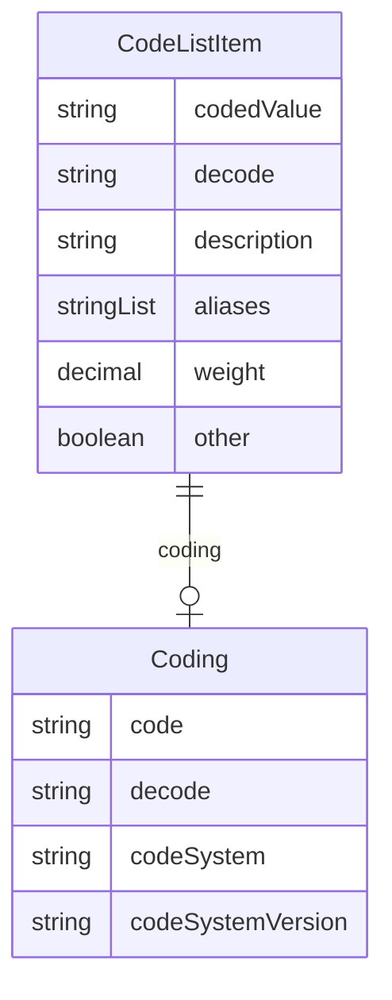

# Class: CodeListItem 


_A structured member of a CodeList that extends the Coding class with additional context-specific properties_


URI: [odm:CodeListItem](https://cdisc.org/odm2/CodeListItem)





<!-- no inheritance hierarchy -->


## Slots

| Name | Cardinality and Range | Description | Inheritance |
| ---  | --- | --- | --- |
| [codedValue](codedValue.md) | 1 <br/> [String](String.md) | The value of the CodeListItem before decoding | direct |
| [decode](decode.md) | 0..1 <br/> [String](String.md) | The decoded value of the CodeListItem | direct |
| [description](description.md) | 0..1 <br/> [String](String.md)&nbsp;or&nbsp;<br />[String](String.md)&nbsp;or&nbsp;<br />[TranslatedText](TranslatedText.md) | A detailed description of the code (e | direct |
| [coding](coding.md) | 0..1 <br/> [Coding](Coding.md) | The dictionary definition of the CodeListItem | direct |
| [aliases](aliases.md) | * <br/> [String](String.md)&nbsp;or&nbsp;<br />[String](String.md)&nbsp;or&nbsp;<br />[TranslatedText](TranslatedText.md) | Alternative labels for the code (ODM Alias, skos:altLabel) | direct |
| [weight](weight.md) | 0..1 <br/> [Decimal](Decimal.md) | Numeric significance of the code (e | direct |
| [other](other.md) | 0..1 <br/> [Boolean](Boolean.md) | Flag to indicate that the term represents "other" content | direct |


## Usages

| used by | used in | type | used |
| ---  | --- | --- | --- |
| [CodeList](CodeList.md) | [codeListItems](codeListItems.md) | any_of[range] | [CodeListItem](CodeListItem.md) |


## Identifier and Mapping Information


### Schema Source


* from schema: https://cdisc.org/define-json


## Mappings

| Mapping Type | Mapped Value |
| ---  | ---  |
| self | odm:CodeListItem |
| native | odm:CodeListItem |
| exact | odm:CodeListItem |
| narrow | sdmx:Code, sdmx:ValueItem |
| close | usdm:AliasCode, usdm:ResponseCode, fhir:CodeableConcept, omop:Concept |


## LinkML Source

<!-- TODO: investigate https://stackoverflow.com/questions/37606292/how-to-create-tabbed-code-blocks-in-mkdocs-or-sphinx -->

### Direct

<details>
```yaml
name: CodeListItem
description: A structured member of a CodeList that extends the Coding class with
  additional context-specific properties
from_schema: https://cdisc.org/define-json
exact_mappings:
- odm:CodeListItem
close_mappings:
- usdm:AliasCode
- usdm:ResponseCode
- fhir:CodeableConcept
- omop:Concept
narrow_mappings:
- sdmx:Code
- sdmx:ValueItem
attributes:
  codedValue:
    name: codedValue
    description: The value of the CodeListItem before decoding
    from_schema: https://cdisc.org/define-json
    rank: 1000
    domain_of:
    - CodeListItem
    range: string
    required: true
  decode:
    name: decode
    description: The decoded value of the CodeListItem
    from_schema: https://cdisc.org/define-json
    rank: 1000
    domain_of:
    - CodeListItem
    - Coding
    range: string
  description:
    name: description
    description: A detailed description of the code (e.g., for documentation purposes)
    from_schema: https://cdisc.org/define-json
    domain_of:
    - Labelled
    - CodeListItem
    any_of:
    - range: string
    - range: TranslatedText
  coding:
    name: coding
    description: The dictionary definition of the CodeListItem
    from_schema: https://cdisc.org/define-json
    domain_of:
    - Labelled
    - CodeListItem
    - SourceItem
    range: Coding
    inlined: true
  aliases:
    name: aliases
    description: Alternative labels for the code (ODM Alias, skos:altLabel)
    from_schema: https://cdisc.org/define-json
    domain_of:
    - Labelled
    - CodeListItem
    multivalued: true
    any_of:
    - range: string
    - range: TranslatedText
  weight:
    name: weight
    description: Numeric significance of the code (e.g., for scoring)
    from_schema: https://cdisc.org/define-json
    rank: 1000
    domain_of:
    - CodeListItem
    range: decimal
  other:
    name: other
    description: Flag to indicate that the term represents "other" content
    from_schema: https://cdisc.org/define-json
    rank: 1000
    domain_of:
    - CodeListItem
    range: boolean

```
</details>

### Induced

<details>
```yaml
name: CodeListItem
description: A structured member of a CodeList that extends the Coding class with
  additional context-specific properties
from_schema: https://cdisc.org/define-json
exact_mappings:
- odm:CodeListItem
close_mappings:
- usdm:AliasCode
- usdm:ResponseCode
- fhir:CodeableConcept
- omop:Concept
narrow_mappings:
- sdmx:Code
- sdmx:ValueItem
attributes:
  codedValue:
    name: codedValue
    description: The value of the CodeListItem before decoding
    from_schema: https://cdisc.org/define-json
    rank: 1000
    alias: codedValue
    owner: CodeListItem
    domain_of:
    - CodeListItem
    range: string
    required: true
  decode:
    name: decode
    description: The decoded value of the CodeListItem
    from_schema: https://cdisc.org/define-json
    rank: 1000
    alias: decode
    owner: CodeListItem
    domain_of:
    - CodeListItem
    - Coding
    range: string
  description:
    name: description
    description: A detailed description of the code (e.g., for documentation purposes)
    from_schema: https://cdisc.org/define-json
    alias: description
    owner: CodeListItem
    domain_of:
    - Labelled
    - CodeListItem
    any_of:
    - range: string
    - range: TranslatedText
  coding:
    name: coding
    description: The dictionary definition of the CodeListItem
    from_schema: https://cdisc.org/define-json
    alias: coding
    owner: CodeListItem
    domain_of:
    - Labelled
    - CodeListItem
    - SourceItem
    range: Coding
    inlined: true
  aliases:
    name: aliases
    description: Alternative labels for the code (ODM Alias, skos:altLabel)
    from_schema: https://cdisc.org/define-json
    alias: aliases
    owner: CodeListItem
    domain_of:
    - Labelled
    - CodeListItem
    multivalued: true
    any_of:
    - range: string
    - range: TranslatedText
  weight:
    name: weight
    description: Numeric significance of the code (e.g., for scoring)
    from_schema: https://cdisc.org/define-json
    rank: 1000
    alias: weight
    owner: CodeListItem
    domain_of:
    - CodeListItem
    range: decimal
  other:
    name: other
    description: Flag to indicate that the term represents "other" content
    from_schema: https://cdisc.org/define-json
    rank: 1000
    alias: other
    owner: CodeListItem
    domain_of:
    - CodeListItem
    range: boolean

```
</details>