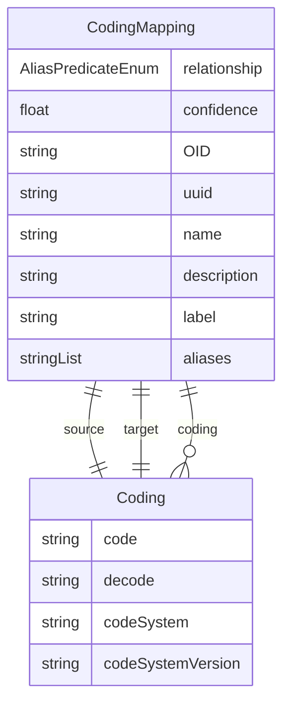

# Class: CodingMapping 


_A mapping relationship that establishes connections between different coding systems_


URI: [odm:CodingMapping](https://cdisc.org/odm2/CodingMapping)





## Inheritance
* [IdentifiableElement](IdentifiableElement.md) [ [Identifiable](Identifiable.md) [Labelled](Labelled.md)]
    * **CodingMapping**


## Slots

| Name | Cardinality and Range | Description | Inheritance |
| ---  | --- | --- | --- |
| [source](source.md) | 1 <br/> [Coding](Coding.md) | Source coding | direct |
| [target](target.md) | 1 <br/> [Coding](Coding.md) | Target coding | direct |
| [relationship](relationship.md) | 1 <br/> [AliasPredicateEnum](AliasPredicateEnum.md) | Type of mapping relationship | direct |
| [confidence](confidence.md) | 0..1 <br/> [Float](Float.md) | Confidence in the mapping (0 | direct |
| [OID](OID.md) | 1 <br/> [String](String.md) | Local identifier within this study/context | [Identifiable](Identifiable.md) |
| [uuid](uuid.md) | 0..1 <br/> [String](String.md) | Universal unique identifier | [Identifiable](Identifiable.md) |
| [name](name.md) | 0..1 <br/> [String](String.md) | Short name or identifier, used for field names | [Labelled](Labelled.md) |
| [description](description.md) | 0..1 <br/> [String](String.md)&nbsp;or&nbsp;<br />[String](String.md)&nbsp;or&nbsp;<br />[TranslatedText](TranslatedText.md) | Detailed description, shown in tooltips | [Labelled](Labelled.md) |
| [coding](coding.md) | * <br/> [Coding](Coding.md) | Semantic tags for this element | [Labelled](Labelled.md) |
| [label](label.md) | 0..1 <br/> [String](String.md)&nbsp;or&nbsp;<br />[String](String.md)&nbsp;or&nbsp;<br />[TranslatedText](TranslatedText.md) | Human-readable label, shown in UIs | [Labelled](Labelled.md) |
| [aliases](aliases.md) | * <br/> [String](String.md)&nbsp;or&nbsp;<br />[String](String.md)&nbsp;or&nbsp;<br />[TranslatedText](TranslatedText.md) | Alternative name or identifier | [Labelled](Labelled.md) |


## Usages

| used by | used in | type | used |
| ---  | --- | --- | --- |
| [MetaDataVersion](MetaDataVersion.md) | [mappings](mappings.md) | range | [CodingMapping](CodingMapping.md) |


## Identifier and Mapping Information


### Schema Source


* from schema: https://cdisc.org/define-json


## Mappings

| Mapping Type | Mapped Value |
| ---  | ---  |
| self | odm:CodingMapping |
| native | odm:CodingMapping |
| related | sdmx:ItemSchemeMap |


## LinkML Source

<!-- TODO: investigate https://stackoverflow.com/questions/37606292/how-to-create-tabbed-code-blocks-in-mkdocs-or-sphinx -->

### Direct

<details>
```yaml
name: CodingMapping
description: A mapping relationship that establishes connections between different
  coding systems
from_schema: https://cdisc.org/define-json
related_mappings:
- sdmx:ItemSchemeMap
is_a: IdentifiableElement
attributes:
  source:
    name: source
    description: Source coding
    from_schema: https://cdisc.org/define-json
    rank: 1000
    domain_of:
    - CodingMapping
    - Origin
    - SiteOrSponsorComment
    - DataProvider
    - ProvisionAgreement
    range: Coding
    required: true
  target:
    name: target
    description: Target coding
    from_schema: https://cdisc.org/define-json
    rank: 1000
    domain_of:
    - CodingMapping
    range: Coding
    required: true
  relationship:
    name: relationship
    description: Type of mapping relationship
    from_schema: https://cdisc.org/define-json
    rank: 1000
    domain_of:
    - CodingMapping
    - DocumentReference
    range: AliasPredicateEnum
    required: true
  confidence:
    name: confidence
    description: Confidence in the mapping (0.0-1.0)
    from_schema: https://cdisc.org/define-json
    rank: 1000
    domain_of:
    - CodingMapping
    range: float

```
</details>

### Induced

<details>
```yaml
name: CodingMapping
description: A mapping relationship that establishes connections between different
  coding systems
from_schema: https://cdisc.org/define-json
related_mappings:
- sdmx:ItemSchemeMap
is_a: IdentifiableElement
attributes:
  source:
    name: source
    description: Source coding
    from_schema: https://cdisc.org/define-json
    rank: 1000
    alias: source
    owner: CodingMapping
    domain_of:
    - CodingMapping
    - Origin
    - SiteOrSponsorComment
    - DataProvider
    - ProvisionAgreement
    range: Coding
    required: true
  target:
    name: target
    description: Target coding
    from_schema: https://cdisc.org/define-json
    rank: 1000
    alias: target
    owner: CodingMapping
    domain_of:
    - CodingMapping
    range: Coding
    required: true
  relationship:
    name: relationship
    description: Type of mapping relationship
    from_schema: https://cdisc.org/define-json
    rank: 1000
    alias: relationship
    owner: CodingMapping
    domain_of:
    - CodingMapping
    - DocumentReference
    range: AliasPredicateEnum
    required: true
  confidence:
    name: confidence
    description: Confidence in the mapping (0.0-1.0)
    from_schema: https://cdisc.org/define-json
    rank: 1000
    alias: confidence
    owner: CodingMapping
    domain_of:
    - CodingMapping
    range: float
  OID:
    name: OID
    description: Local identifier within this study/context. Use CDISC OID format
      for regulatory submissions, or simple strings for internal use.
    from_schema: https://cdisc.org/define-json
    rank: 1000
    identifier: true
    alias: OID
    owner: CodingMapping
    domain_of:
    - Identifiable
    range: string
    required: true
    pattern: ^[A-Za-z][A-Za-z0-9._-]*$
  uuid:
    name: uuid
    description: Universal unique identifier
    from_schema: https://cdisc.org/define-json
    rank: 1000
    alias: uuid
    owner: CodingMapping
    domain_of:
    - Identifiable
    range: string
  name:
    name: name
    description: Short name or identifier, used for field names
    from_schema: https://cdisc.org/define-json
    rank: 1000
    alias: name
    owner: CodingMapping
    domain_of:
    - Labelled
    range: string
  description:
    name: description
    description: Detailed description, shown in tooltips
    from_schema: https://cdisc.org/define-json
    rank: 1000
    alias: description
    owner: CodingMapping
    domain_of:
    - Labelled
    - CodeListItem
    range: string
    any_of:
    - range: string
    - range: TranslatedText
  coding:
    name: coding
    description: Semantic tags for this element
    from_schema: https://cdisc.org/define-json
    rank: 1000
    alias: coding
    owner: CodingMapping
    domain_of:
    - Labelled
    - CodeListItem
    - SourceItem
    range: Coding
    multivalued: true
    inlined: true
    inlined_as_list: true
  label:
    name: label
    description: Human-readable label, shown in UIs
    from_schema: https://cdisc.org/define-json
    exact_mappings:
    - skos:prefLabel
    rank: 1000
    alias: label
    owner: CodingMapping
    domain_of:
    - Labelled
    range: string
    any_of:
    - range: string
    - range: TranslatedText
  aliases:
    name: aliases
    description: Alternative name or identifier
    from_schema: https://cdisc.org/define-json
    exact_mappings:
    - skos:altLabel
    rank: 1000
    alias: aliases
    owner: CodingMapping
    domain_of:
    - Labelled
    - CodeListItem
    range: string
    multivalued: true
    inlined: true
    inlined_as_list: true
    any_of:
    - range: string
    - range: TranslatedText

```
</details>