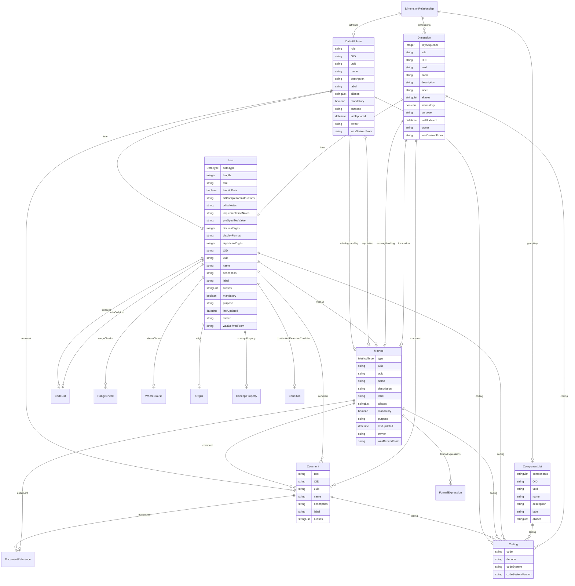

# Class: DimensionRelationship 


_A relationship element that associates a DataAttribute with a specific Dimension at a specific level_


URI: [odm:DimensionRelationship](https://cdisc.org/odm2/DimensionRelationship)





<!-- no inheritance hierarchy -->


## Slots

| Name | Cardinality and Range | Description | Inheritance |
| ---  | --- | --- | --- |
| [dimensions](dimensions.md) | * <br/> [Dimension](Dimension.md) |  | direct |
| [groupKey](groupKey.md) | 0..1 <br/> [ComponentList](ComponentList.md) | Set of dimensions that this definition depends on | direct |
| [attribute](attribute.md) | 0..1 <br/> [DataAttribute](DataAttribute.md) |  | direct |


## Identifier and Mapping Information


### Schema Source


* from schema: https://cdisc.org/define-json


## Mappings

| Mapping Type | Mapped Value |
| ---  | ---  |
| self | odm:DimensionRelationship |
| native | odm:DimensionRelationship |
| exact | sdmx:DimensionRelationship |


## LinkML Source

<!-- TODO: investigate https://stackoverflow.com/questions/37606292/how-to-create-tabbed-code-blocks-in-mkdocs-or-sphinx -->

### Direct

<details>
```yaml
name: DimensionRelationship
description: A relationship element that associates a DataAttribute with a specific
  Dimension at a specific level
from_schema: https://cdisc.org/define-json
exact_mappings:
- sdmx:DimensionRelationship
attributes:
  dimensions:
    name: dimensions
    from_schema: https://cdisc.org/define-json
    exact_mappings:
    - sdmx:DimensionDescriptor
    domain_of:
    - DataStructureDefinition
    - DimensionRelationship
    range: Dimension
    multivalued: true
  groupKey:
    name: groupKey
    description: Set of dimensions that this definition depends on
    from_schema: https://cdisc.org/define-json
    exact_mappings:
    - sdmx:GroupDimensionDescriptor
    domain_of:
    - GroupRelationship
    - DimensionRelationship
    range: ComponentList
  attribute:
    name: attribute
    from_schema: https://cdisc.org/define-json
    domain_of:
    - Resource
    - MeasureRelationship
    - DataflowRelationship
    - GroupRelationship
    - DimensionRelationship
    - ObservationRelationship
    range: DataAttribute

```
</details>

### Induced

<details>
```yaml
name: DimensionRelationship
description: A relationship element that associates a DataAttribute with a specific
  Dimension at a specific level
from_schema: https://cdisc.org/define-json
exact_mappings:
- sdmx:DimensionRelationship
attributes:
  dimensions:
    name: dimensions
    from_schema: https://cdisc.org/define-json
    exact_mappings:
    - sdmx:DimensionDescriptor
    alias: dimensions
    owner: DimensionRelationship
    domain_of:
    - DataStructureDefinition
    - DimensionRelationship
    range: Dimension
    multivalued: true
  groupKey:
    name: groupKey
    description: Set of dimensions that this definition depends on
    from_schema: https://cdisc.org/define-json
    exact_mappings:
    - sdmx:GroupDimensionDescriptor
    alias: groupKey
    owner: DimensionRelationship
    domain_of:
    - GroupRelationship
    - DimensionRelationship
    range: ComponentList
  attribute:
    name: attribute
    from_schema: https://cdisc.org/define-json
    alias: attribute
    owner: DimensionRelationship
    domain_of:
    - Resource
    - MeasureRelationship
    - DataflowRelationship
    - GroupRelationship
    - DimensionRelationship
    - ObservationRelationship
    range: DataAttribute

```
</details>