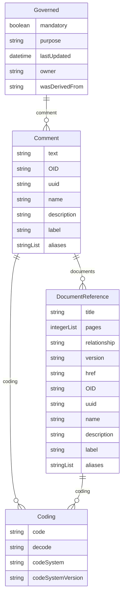

# Class: Governed 


_A mixin that provides slots for audit trail and standards governance, including mandatory status, comments, and attribution_


URI: [odm:Governed](https://cdisc.org/odm2/Governed)





<!-- no inheritance hierarchy -->


## Slots

| Name | Cardinality and Range | Description | Inheritance |
| ---  | --- | --- | --- |
| [mandatory](mandatory.md) | 0..1 <br/> [Boolean](Boolean.md) | Is this element required? | direct |
| [comment](comment.md) | * <br/> [Comment](Comment.md) | Comment on the element, such as a rationale for its inclusion or exclusion | direct |
| [purpose](purpose.md) | 0..1 <br/> [String](String.md)&nbsp;or&nbsp;<br />[String](String.md)&nbsp;or&nbsp;<br />[TranslatedText](TranslatedText.md) | Purpose or rationale for this data element | direct |
| [lastUpdated](lastUpdated.md) | 0..1 <br/> [Datetime](Datetime.md) | When the resource was last updated | direct |
| [owner](owner.md) | 0..1 <br/> [String](String.md)&nbsp;or&nbsp;<br />[User](User.md)&nbsp;or&nbsp;<br />[Organization](Organization.md)&nbsp;or&nbsp;<br />[String](String.md) | Party responsible for this element | direct |
| [wasDerivedFrom](wasDerivedFrom.md) | 0..1 <br/> [String](String.md)&nbsp;or&nbsp;<br />[Item](Item.md)&nbsp;or&nbsp;<br />[ItemGroup](ItemGroup.md)&nbsp;or&nbsp;<br />[MetaDataVersion](MetaDataVersion.md)&nbsp;or&nbsp;<br />[CodeList](CodeList.md)&nbsp;or&nbsp;<br />[ReifiedConcept](ReifiedConcept.md)&nbsp;or&nbsp;<br />[ConceptProperty](ConceptProperty.md)&nbsp;or&nbsp;<br />[Condition](Condition.md)&nbsp;or&nbsp;<br />[Method](Method.md)&nbsp;or&nbsp;<br />[NominalOccurrence](NominalOccurrence.md)&nbsp;or&nbsp;<br />[Dataflow](Dataflow.md)&nbsp;or&nbsp;<br />[CubeComponent](CubeComponent.md)&nbsp;or&nbsp;<br />[DataProduct](DataProduct.md)&nbsp;or&nbsp;<br />[ProvisionAgreement](ProvisionAgreement.md) | Reference to another item that this item implements or extends, e | direct |


## Mixin Usage

| mixed into | description |
| --- | --- |
| [GovernedElement](GovernedElement.md) |  |


## Identifier and Mapping Information


### Schema Source


* from schema: https://cdisc.org/define-json


## Mappings

| Mapping Type | Mapped Value |
| ---  | ---  |
| self | odm:Governed |
| native | odm:Governed |


## LinkML Source

<!-- TODO: investigate https://stackoverflow.com/questions/37606292/how-to-create-tabbed-code-blocks-in-mkdocs-or-sphinx -->

### Direct

<details>
```yaml
name: Governed
description: A mixin that provides slots for audit trail and standards governance,
  including mandatory status, comments, and attribution
from_schema: https://cdisc.org/define-json
mixin: true
attributes:
  mandatory:
    name: mandatory
    description: Is this element required?
    from_schema: https://cdisc.org/define-json
    rank: 1000
    domain_of:
    - Governed
    range: boolean
  comment:
    name: comment
    description: Comment on the element, such as a rationale for its inclusion or
      exclusion
    from_schema: https://cdisc.org/define-json
    rank: 1000
    domain_of:
    - Governed
    range: Comment
    multivalued: true
  purpose:
    name: purpose
    description: Purpose or rationale for this data element
    from_schema: https://cdisc.org/define-json
    rank: 1000
    domain_of:
    - Governed
    any_of:
    - range: string
    - range: TranslatedText
  lastUpdated:
    name: lastUpdated
    description: When the resource was last updated
    from_schema: https://cdisc.org/define-json
    rank: 1000
    domain_of:
    - Governed
    range: datetime
  owner:
    name: owner
    description: Party responsible for this element
    from_schema: https://cdisc.org/define-json
    narrow_mappings:
    - prov:wasAttributedTo
    - prov:wasAssociatedBy
    rank: 1000
    domain_of:
    - Governed
    any_of:
    - range: User
    - range: Organization
    - range: string
  wasDerivedFrom:
    name: wasDerivedFrom
    description: Reference to another item that this item implements or extends, e.g.
      a template Item definition.
    from_schema: https://cdisc.org/define-json
    exact_mappings:
    - prov:wasDerivedFrom
    rank: 1000
    domain_of:
    - Governed
    any_of:
    - range: Item
    - range: ItemGroup
    - range: MetaDataVersion
    - range: CodeList
    - range: ReifiedConcept
    - range: ConceptProperty
    - range: Condition
    - range: Method
    - range: NominalOccurrence
    - range: Dataflow
    - range: CubeComponent
    - range: DataProduct
    - range: ProvisionAgreement

```
</details>

### Induced

<details>
```yaml
name: Governed
description: A mixin that provides slots for audit trail and standards governance,
  including mandatory status, comments, and attribution
from_schema: https://cdisc.org/define-json
mixin: true
attributes:
  mandatory:
    name: mandatory
    description: Is this element required?
    from_schema: https://cdisc.org/define-json
    rank: 1000
    alias: mandatory
    owner: Governed
    domain_of:
    - Governed
    range: boolean
  comment:
    name: comment
    description: Comment on the element, such as a rationale for its inclusion or
      exclusion
    from_schema: https://cdisc.org/define-json
    rank: 1000
    alias: comment
    owner: Governed
    domain_of:
    - Governed
    range: Comment
    multivalued: true
  purpose:
    name: purpose
    description: Purpose or rationale for this data element
    from_schema: https://cdisc.org/define-json
    rank: 1000
    alias: purpose
    owner: Governed
    domain_of:
    - Governed
    any_of:
    - range: string
    - range: TranslatedText
  lastUpdated:
    name: lastUpdated
    description: When the resource was last updated
    from_schema: https://cdisc.org/define-json
    rank: 1000
    alias: lastUpdated
    owner: Governed
    domain_of:
    - Governed
    range: datetime
  owner:
    name: owner
    description: Party responsible for this element
    from_schema: https://cdisc.org/define-json
    narrow_mappings:
    - prov:wasAttributedTo
    - prov:wasAssociatedBy
    rank: 1000
    alias: owner
    owner: Governed
    domain_of:
    - Governed
    any_of:
    - range: User
    - range: Organization
    - range: string
  wasDerivedFrom:
    name: wasDerivedFrom
    description: Reference to another item that this item implements or extends, e.g.
      a template Item definition.
    from_schema: https://cdisc.org/define-json
    exact_mappings:
    - prov:wasDerivedFrom
    rank: 1000
    alias: wasDerivedFrom
    owner: Governed
    domain_of:
    - Governed
    any_of:
    - range: Item
    - range: ItemGroup
    - range: MetaDataVersion
    - range: CodeList
    - range: ReifiedConcept
    - range: ConceptProperty
    - range: Condition
    - range: Method
    - range: NominalOccurrence
    - range: Dataflow
    - range: CubeComponent
    - range: DataProduct
    - range: ProvisionAgreement

```
</details>