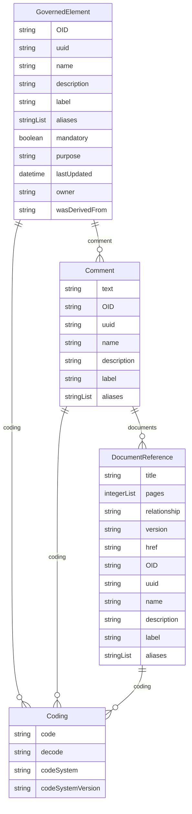

# Class: GovernedElement 


* __NOTE__: this is an abstract class and should not be instantiated directly


URI: [odm:GovernedElement](https://cdisc.org/odm2/GovernedElement)





## Inheritance
* **GovernedElement** [ [Identifiable](Identifiable.md) [Labelled](Labelled.md) [Governed](Governed.md)]
    * [MetaDataVersion](MetaDataVersion.md)
    * [Item](Item.md) [ [IsODMItem](IsODMItem.md) [Formatted](Formatted.md)]
    * [ItemGroup](ItemGroup.md) [ [IsProfile](IsProfile.md)]
    * [CodeList](CodeList.md) [ [Versioned](Versioned.md)]
    * [ReifiedConcept](ReifiedConcept.md) [ [Versioned](Versioned.md)]
    * [ConceptProperty](ConceptProperty.md)
    * [Condition](Condition.md)
    * [Method](Method.md)
    * [NominalOccurrence](NominalOccurrence.md)
    * [Dataflow](Dataflow.md) [ [Versioned](Versioned.md)]
    * [CubeComponent](CubeComponent.md)
    * [DataProduct](DataProduct.md) [ [Versioned](Versioned.md)]
    * [ProvisionAgreement](ProvisionAgreement.md) [ [Versioned](Versioned.md)]


## Slots

| Name | Cardinality and Range | Description | Inheritance |
| ---  | --- | --- | --- |
| [OID](OID.md) | 1 <br/> [String](String.md) | Local identifier within this study/context | [Identifiable](Identifiable.md) |
| [uuid](uuid.md) | 0..1 <br/> [String](String.md) | Universal unique identifier | [Identifiable](Identifiable.md) |
| [name](name.md) | 0..1 <br/> [String](String.md) | Short name or identifier, used for field names | [Labelled](Labelled.md) |
| [description](description.md) | 0..1 <br/> [String](String.md)&nbsp;or&nbsp;<br />[String](String.md)&nbsp;or&nbsp;<br />[TranslatedText](TranslatedText.md) | Detailed description, shown in tooltips | [Labelled](Labelled.md) |
| [coding](coding.md) | * <br/> [Coding](Coding.md) | Semantic tags for this element | [Labelled](Labelled.md) |
| [label](label.md) | 0..1 <br/> [String](String.md)&nbsp;or&nbsp;<br />[String](String.md)&nbsp;or&nbsp;<br />[TranslatedText](TranslatedText.md) | Human-readable label, shown in UIs | [Labelled](Labelled.md) |
| [aliases](aliases.md) | * <br/> [String](String.md)&nbsp;or&nbsp;<br />[String](String.md)&nbsp;or&nbsp;<br />[TranslatedText](TranslatedText.md) | Alternative name or identifier | [Labelled](Labelled.md) |
| [mandatory](mandatory.md) | 0..1 <br/> [Boolean](Boolean.md) | Is this element required? | [Governed](Governed.md) |
| [comment](comment.md) | * <br/> [Comment](Comment.md) | Comment on the element, such as a rationale for its inclusion or exclusion | [Governed](Governed.md) |
| [purpose](purpose.md) | 0..1 <br/> [String](String.md)&nbsp;or&nbsp;<br />[String](String.md)&nbsp;or&nbsp;<br />[TranslatedText](TranslatedText.md) | Purpose or rationale for this data element | [Governed](Governed.md) |
| [lastUpdated](lastUpdated.md) | 0..1 <br/> [Datetime](Datetime.md) | When the resource was last updated | [Governed](Governed.md) |
| [owner](owner.md) | 0..1 <br/> [String](String.md)&nbsp;or&nbsp;<br />[User](User.md)&nbsp;or&nbsp;<br />[Organization](Organization.md)&nbsp;or&nbsp;<br />[String](String.md) | Party responsible for this element | [Governed](Governed.md) |
| [wasDerivedFrom](wasDerivedFrom.md) | 0..1 <br/> [String](String.md)&nbsp;or&nbsp;<br />[Item](Item.md)&nbsp;or&nbsp;<br />[ItemGroup](ItemGroup.md)&nbsp;or&nbsp;<br />[MetaDataVersion](MetaDataVersion.md)&nbsp;or&nbsp;<br />[CodeList](CodeList.md)&nbsp;or&nbsp;<br />[ReifiedConcept](ReifiedConcept.md)&nbsp;or&nbsp;<br />[ConceptProperty](ConceptProperty.md)&nbsp;or&nbsp;<br />[Condition](Condition.md)&nbsp;or&nbsp;<br />[Method](Method.md)&nbsp;or&nbsp;<br />[NominalOccurrence](NominalOccurrence.md)&nbsp;or&nbsp;<br />[Dataflow](Dataflow.md)&nbsp;or&nbsp;<br />[CubeComponent](CubeComponent.md)&nbsp;or&nbsp;<br />[DataProduct](DataProduct.md)&nbsp;or&nbsp;<br />[ProvisionAgreement](ProvisionAgreement.md) | Reference to another item that this item implements or extends, e | [Governed](Governed.md) |


## Identifier and Mapping Information


### Schema Source


* from schema: https://cdisc.org/define-json


## Mappings

| Mapping Type | Mapped Value |
| ---  | ---  |
| self | odm:GovernedElement |
| native | odm:GovernedElement |


## LinkML Source

<!-- TODO: investigate https://stackoverflow.com/questions/37606292/how-to-create-tabbed-code-blocks-in-mkdocs-or-sphinx -->

### Direct

<details>
```yaml
name: GovernedElement
from_schema: https://cdisc.org/define-json
abstract: true
mixins:
- Identifiable
- Labelled
- Governed

```
</details>

### Induced

<details>
```yaml
name: GovernedElement
from_schema: https://cdisc.org/define-json
abstract: true
mixins:
- Identifiable
- Labelled
- Governed
attributes:
  OID:
    name: OID
    description: Local identifier within this study/context. Use CDISC OID format
      for regulatory submissions, or simple strings for internal use.
    from_schema: https://cdisc.org/define-json
    rank: 1000
    identifier: true
    alias: OID
    owner: GovernedElement
    domain_of:
    - Identifiable
    range: string
    required: true
    pattern: ^[A-Za-z][A-Za-z0-9._-]*$
  uuid:
    name: uuid
    description: Universal unique identifier
    from_schema: https://cdisc.org/define-json
    rank: 1000
    alias: uuid
    owner: GovernedElement
    domain_of:
    - Identifiable
    range: string
  name:
    name: name
    description: Short name or identifier, used for field names
    from_schema: https://cdisc.org/define-json
    rank: 1000
    alias: name
    owner: GovernedElement
    domain_of:
    - Labelled
    range: string
  description:
    name: description
    description: Detailed description, shown in tooltips
    from_schema: https://cdisc.org/define-json
    rank: 1000
    alias: description
    owner: GovernedElement
    domain_of:
    - Labelled
    - CodeListItem
    range: string
    any_of:
    - range: string
    - range: TranslatedText
  coding:
    name: coding
    description: Semantic tags for this element
    from_schema: https://cdisc.org/define-json
    rank: 1000
    alias: coding
    owner: GovernedElement
    domain_of:
    - Labelled
    - CodeListItem
    - SourceItem
    range: Coding
    multivalued: true
    inlined: true
    inlined_as_list: true
  label:
    name: label
    description: Human-readable label, shown in UIs
    from_schema: https://cdisc.org/define-json
    exact_mappings:
    - skos:prefLabel
    rank: 1000
    alias: label
    owner: GovernedElement
    domain_of:
    - Labelled
    range: string
    any_of:
    - range: string
    - range: TranslatedText
  aliases:
    name: aliases
    description: Alternative name or identifier
    from_schema: https://cdisc.org/define-json
    exact_mappings:
    - skos:altLabel
    rank: 1000
    alias: aliases
    owner: GovernedElement
    domain_of:
    - Labelled
    - CodeListItem
    range: string
    multivalued: true
    inlined: true
    inlined_as_list: true
    any_of:
    - range: string
    - range: TranslatedText
  mandatory:
    name: mandatory
    description: Is this element required?
    from_schema: https://cdisc.org/define-json
    rank: 1000
    alias: mandatory
    owner: GovernedElement
    domain_of:
    - Governed
    range: boolean
  comment:
    name: comment
    description: Comment on the element, such as a rationale for its inclusion or
      exclusion
    from_schema: https://cdisc.org/define-json
    rank: 1000
    alias: comment
    owner: GovernedElement
    domain_of:
    - Governed
    range: Comment
    multivalued: true
  purpose:
    name: purpose
    description: Purpose or rationale for this data element
    from_schema: https://cdisc.org/define-json
    rank: 1000
    alias: purpose
    owner: GovernedElement
    domain_of:
    - Governed
    range: string
    any_of:
    - range: string
    - range: TranslatedText
  lastUpdated:
    name: lastUpdated
    description: When the resource was last updated
    from_schema: https://cdisc.org/define-json
    rank: 1000
    alias: lastUpdated
    owner: GovernedElement
    domain_of:
    - Governed
    range: datetime
  owner:
    name: owner
    description: Party responsible for this element
    from_schema: https://cdisc.org/define-json
    narrow_mappings:
    - prov:wasAttributedTo
    - prov:wasAssociatedBy
    rank: 1000
    alias: owner
    owner: GovernedElement
    domain_of:
    - Governed
    range: string
    any_of:
    - range: User
    - range: Organization
    - range: string
  wasDerivedFrom:
    name: wasDerivedFrom
    description: Reference to another item that this item implements or extends, e.g.
      a template Item definition.
    from_schema: https://cdisc.org/define-json
    exact_mappings:
    - prov:wasDerivedFrom
    rank: 1000
    alias: wasDerivedFrom
    owner: GovernedElement
    domain_of:
    - Governed
    range: string
    any_of:
    - range: Item
    - range: ItemGroup
    - range: MetaDataVersion
    - range: CodeList
    - range: ReifiedConcept
    - range: ConceptProperty
    - range: Condition
    - range: Method
    - range: NominalOccurrence
    - range: Dataflow
    - range: CubeComponent
    - range: DataProduct
    - range: ProvisionAgreement

```
</details>