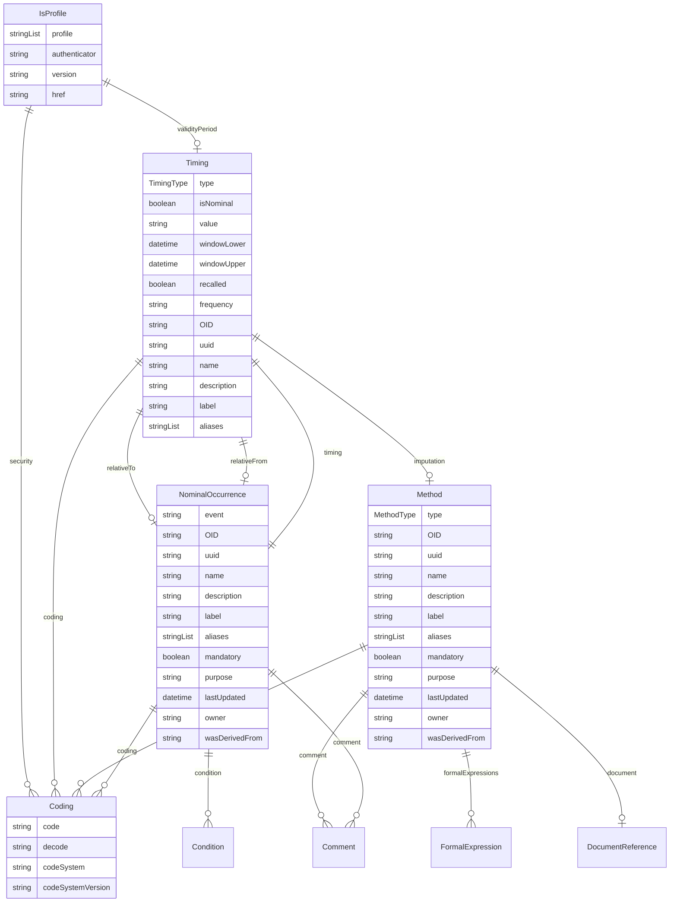

# Class: IsProfile 


_A mixin that provides additional metadata for FHIR resources and Data Products, including profiles, security tags, and validity periods_


URI: [odm:IsProfile](https://cdisc.org/odm2/IsProfile)





## Inheritance
* **IsProfile** [ [Versioned](Versioned.md)]


## Slots

| Name | Cardinality and Range | Description | Inheritance |
| ---  | --- | --- | --- |
| [profile](profile.md) | * <br/> [String](String.md) | Profiles this resource claims to conform to | direct |
| [security](security.md) | * <br/> [Coding](Coding.md) | Security tags applied to this resource | direct |
| [authenticator](authenticator.md) | 0..1 <br/> [String](String.md)&nbsp;or&nbsp;<br />[User](User.md)&nbsp;or&nbsp;<br />[Organization](Organization.md)&nbsp;or&nbsp;<br />[String](String.md) | Who/what authenticated the resource | direct |
| [validityPeriod](validityPeriod.md) | 0..1 <br/> [Timing](Timing.md) | Time period during which the resouce is valid | direct |
| [version](version.md) | 0..1 <br/> [String](String.md) | The version of the external resources | [Versioned](Versioned.md) |
| [href](href.md) | 0..1 <br/> [String](String.md) | Machine-readable instructions to obtain the resource e | [Versioned](Versioned.md) |


## Mixin Usage

| mixed into | description |
| --- | --- |
| [ItemGroup](ItemGroup.md) | A collection element that groups related items or subgroups within a specific... |
| [Dataset](Dataset.md) | A collection element that groups observations sharing the same dimensionality... |


## Identifier and Mapping Information


### Schema Source


* from schema: https://cdisc.org/define-json


## Mappings

| Mapping Type | Mapped Value |
| ---  | ---  |
| self | odm:IsProfile |
| native | odm:IsProfile |


## LinkML Source

<!-- TODO: investigate https://stackoverflow.com/questions/37606292/how-to-create-tabbed-code-blocks-in-mkdocs-or-sphinx -->

### Direct

<details>
```yaml
name: IsProfile
description: A mixin that provides additional metadata for FHIR resources and Data
  Products, including profiles, security tags, and validity periods
from_schema: https://cdisc.org/define-json
mixin: true
mixins:
- Versioned
attributes:
  profile:
    name: profile
    description: Profiles this resource claims to conform to
    from_schema: https://cdisc.org/define-json
    rank: 1000
    domain_of:
    - IsProfile
    range: string
    multivalued: true
  security:
    name: security
    description: Security tags applied to this resource
    from_schema: https://cdisc.org/define-json
    rank: 1000
    domain_of:
    - IsProfile
    range: Coding
    multivalued: true
    inlined: true
    inlined_as_list: true
  authenticator:
    name: authenticator
    description: Who/what authenticated the resource
    from_schema: https://cdisc.org/define-json
    rank: 1000
    domain_of:
    - IsProfile
    required: false
    any_of:
    - range: User
    - range: Organization
    - range: string
  validityPeriod:
    name: validityPeriod
    description: Time period during which the resouce is valid
    from_schema: https://cdisc.org/define-json
    rank: 1000
    domain_of:
    - IsProfile
    range: Timing
    required: false

```
</details>

### Induced

<details>
```yaml
name: IsProfile
description: A mixin that provides additional metadata for FHIR resources and Data
  Products, including profiles, security tags, and validity periods
from_schema: https://cdisc.org/define-json
mixin: true
mixins:
- Versioned
attributes:
  profile:
    name: profile
    description: Profiles this resource claims to conform to
    from_schema: https://cdisc.org/define-json
    rank: 1000
    alias: profile
    owner: IsProfile
    domain_of:
    - IsProfile
    range: string
    multivalued: true
  security:
    name: security
    description: Security tags applied to this resource
    from_schema: https://cdisc.org/define-json
    rank: 1000
    alias: security
    owner: IsProfile
    domain_of:
    - IsProfile
    range: Coding
    multivalued: true
    inlined: true
    inlined_as_list: true
  authenticator:
    name: authenticator
    description: Who/what authenticated the resource
    from_schema: https://cdisc.org/define-json
    rank: 1000
    alias: authenticator
    owner: IsProfile
    domain_of:
    - IsProfile
    required: false
    any_of:
    - range: User
    - range: Organization
    - range: string
  validityPeriod:
    name: validityPeriod
    description: Time period during which the resouce is valid
    from_schema: https://cdisc.org/define-json
    rank: 1000
    alias: validityPeriod
    owner: IsProfile
    domain_of:
    - IsProfile
    range: Timing
    required: false
  version:
    name: version
    description: The version of the external resources
    from_schema: https://cdisc.org/define-json
    rank: 1000
    alias: version
    owner: IsProfile
    domain_of:
    - Versioned
    range: string
  href:
    name: href
    description: Machine-readable instructions to obtain the resource e.g. FHIR path,
      URL
    from_schema: https://cdisc.org/define-json
    rank: 1000
    alias: href
    owner: IsProfile
    domain_of:
    - Versioned
    range: string
    required: false

```
</details>