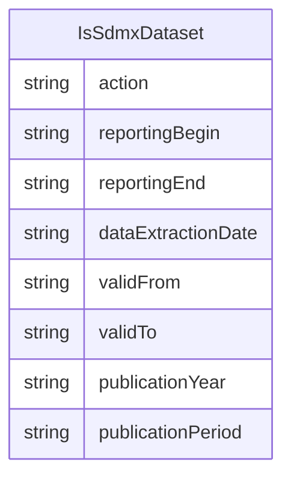

# Class: IsSdmxDataset 


_A mixin that provides additional metadata specific to SDMX Datasets_


URI: [odm:IsSdmxDataset](https://cdisc.org/odm2/IsSdmxDataset)





<!-- no inheritance hierarchy -->


## Slots

| Name | Cardinality and Range | Description | Inheritance |
| ---  | --- | --- | --- |
| [action](action.md) | 0..1 <br/> [String](String.md) | Defines the action to be taken by the recipient system (information, append, ... | direct |
| [reportingBegin](reportingBegin.md) | 0..1 <br/> [String](String.md) | A specific time period in a known system of time periods that identifies the ... | direct |
| [reportingEnd](reportingEnd.md) | 0..1 <br/> [String](String.md) | A specific time period in a known system of time periods that identifies the ... | direct |
| [dataExtractionDate](dataExtractionDate.md) | 0..1 <br/> [String](String.md) | A specific time period that identifies the date and time that the data are ex... | direct |
| [validFrom](validFrom.md) | 0..1 <br/> [String](String.md) | Indicates the inclusive start time indicating the validity of the information... | direct |
| [validTo](validTo.md) | 0..1 <br/> [String](String.md) | Indicates the inclusive end time indicating the validity of the information i... | direct |
| [publicationYear](publicationYear.md) | 0..1 <br/> [String](String.md) | Specifies the year of publication of the data or metadata in terms of whateve... | direct |
| [publicationPeriod](publicationPeriod.md) | 0..1 <br/> [String](String.md) | Specifies the period of publication of the data or metadata in terms of whate... | direct |


## Mixin Usage

| mixed into | description |
| --- | --- |
| [Dataset](Dataset.md) | A collection element that groups observations sharing the same dimensionality... |


## Identifier and Mapping Information


### Schema Source


* from schema: https://cdisc.org/define-json


## Mappings

| Mapping Type | Mapped Value |
| ---  | ---  |
| self | odm:IsSdmxDataset |
| native | odm:IsSdmxDataset |


## LinkML Source

<!-- TODO: investigate https://stackoverflow.com/questions/37606292/how-to-create-tabbed-code-blocks-in-mkdocs-or-sphinx -->

### Direct

<details>
```yaml
name: IsSdmxDataset
description: A mixin that provides additional metadata specific to SDMX Datasets
from_schema: https://cdisc.org/define-json
mixin: true
attributes:
  action:
    name: action
    description: Defines the action to be taken by the recipient system (information,
      append, replace, delete)
    from_schema: https://cdisc.org/define-json
    rank: 1000
    domain_of:
    - IsSdmxDataset
  reportingBegin:
    name: reportingBegin
    description: A specific time period in a known system of time periods that identifies
      the start period of a report.
    from_schema: https://cdisc.org/define-json
    rank: 1000
    domain_of:
    - IsSdmxDataset
  reportingEnd:
    name: reportingEnd
    description: A specific time period in a known system of time periods that identifies
      the end period of a report.
    from_schema: https://cdisc.org/define-json
    rank: 1000
    domain_of:
    - IsSdmxDataset
  dataExtractionDate:
    name: dataExtractionDate
    description: A specific time period that identifies the date and time that the
      data are extracted from a data source.
    from_schema: https://cdisc.org/define-json
    rank: 1000
    domain_of:
    - IsSdmxDataset
  validFrom:
    name: validFrom
    description: Indicates the inclusive start time indicating the validity of the
      information in the data set.
    from_schema: https://cdisc.org/define-json
    rank: 1000
    domain_of:
    - IsSdmxDataset
  validTo:
    name: validTo
    description: Indicates the inclusive end time indicating the validity of the information
      in the data set.
    from_schema: https://cdisc.org/define-json
    rank: 1000
    domain_of:
    - IsSdmxDataset
  publicationYear:
    name: publicationYear
    description: Specifies the year of publication of the data or metadata in terms
      of whatever provisioning agreements might be in force.
    from_schema: https://cdisc.org/define-json
    rank: 1000
    domain_of:
    - IsSdmxDataset
  publicationPeriod:
    name: publicationPeriod
    description: Specifies the period of publication of the data or metadata in terms
      of whatever provisioning agreements might be in force.
    from_schema: https://cdisc.org/define-json
    rank: 1000
    domain_of:
    - IsSdmxDataset

```
</details>

### Induced

<details>
```yaml
name: IsSdmxDataset
description: A mixin that provides additional metadata specific to SDMX Datasets
from_schema: https://cdisc.org/define-json
mixin: true
attributes:
  action:
    name: action
    description: Defines the action to be taken by the recipient system (information,
      append, replace, delete)
    from_schema: https://cdisc.org/define-json
    rank: 1000
    alias: action
    owner: IsSdmxDataset
    domain_of:
    - IsSdmxDataset
  reportingBegin:
    name: reportingBegin
    description: A specific time period in a known system of time periods that identifies
      the start period of a report.
    from_schema: https://cdisc.org/define-json
    rank: 1000
    alias: reportingBegin
    owner: IsSdmxDataset
    domain_of:
    - IsSdmxDataset
  reportingEnd:
    name: reportingEnd
    description: A specific time period in a known system of time periods that identifies
      the end period of a report.
    from_schema: https://cdisc.org/define-json
    rank: 1000
    alias: reportingEnd
    owner: IsSdmxDataset
    domain_of:
    - IsSdmxDataset
  dataExtractionDate:
    name: dataExtractionDate
    description: A specific time period that identifies the date and time that the
      data are extracted from a data source.
    from_schema: https://cdisc.org/define-json
    rank: 1000
    alias: dataExtractionDate
    owner: IsSdmxDataset
    domain_of:
    - IsSdmxDataset
  validFrom:
    name: validFrom
    description: Indicates the inclusive start time indicating the validity of the
      information in the data set.
    from_schema: https://cdisc.org/define-json
    rank: 1000
    alias: validFrom
    owner: IsSdmxDataset
    domain_of:
    - IsSdmxDataset
  validTo:
    name: validTo
    description: Indicates the inclusive end time indicating the validity of the information
      in the data set.
    from_schema: https://cdisc.org/define-json
    rank: 1000
    alias: validTo
    owner: IsSdmxDataset
    domain_of:
    - IsSdmxDataset
  publicationYear:
    name: publicationYear
    description: Specifies the year of publication of the data or metadata in terms
      of whatever provisioning agreements might be in force.
    from_schema: https://cdisc.org/define-json
    rank: 1000
    alias: publicationYear
    owner: IsSdmxDataset
    domain_of:
    - IsSdmxDataset
  publicationPeriod:
    name: publicationPeriod
    description: Specifies the period of publication of the data or metadata in terms
      of whatever provisioning agreements might be in force.
    from_schema: https://cdisc.org/define-json
    rank: 1000
    alias: publicationPeriod
    owner: IsSdmxDataset
    domain_of:
    - IsSdmxDataset

```
</details>