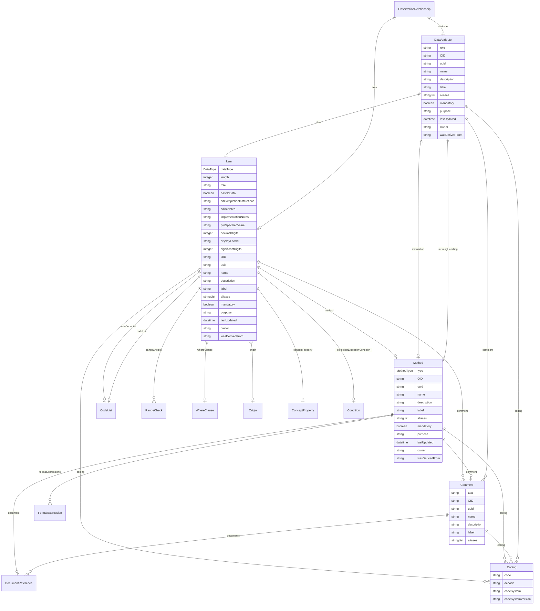

# Class: ObservationRelationship 


_A relationship element that associates a DataAttribute with an Observation, allowing value-level Items to be reused across multiple different Views_


URI: [odm:ObservationRelationship](https://cdisc.org/odm2/ObservationRelationship)





<!-- no inheritance hierarchy -->


## Slots

| Name | Cardinality and Range | Description | Inheritance |
| ---  | --- | --- | --- |
| [item](item.md) | 0..1 <br/> [Item](Item.md) | Reference to the Item in an observation context that this definition applies ... | direct |
| [attribute](attribute.md) | 0..1 <br/> [DataAttribute](DataAttribute.md) |  | direct |


## Identifier and Mapping Information


### Schema Source


* from schema: https://cdisc.org/define-json


## Mappings

| Mapping Type | Mapped Value |
| ---  | ---  |
| self | odm:ObservationRelationship |
| native | odm:ObservationRelationship |
| exact | sdmx:ObservationRelationship |


## LinkML Source

<!-- TODO: investigate https://stackoverflow.com/questions/37606292/how-to-create-tabbed-code-blocks-in-mkdocs-or-sphinx -->

### Direct

<details>
```yaml
name: ObservationRelationship
description: A relationship element that associates a DataAttribute with an Observation,
  allowing value-level Items to be reused across multiple different Views
from_schema: https://cdisc.org/define-json
exact_mappings:
- sdmx:ObservationRelationship
attributes:
  item:
    name: item
    description: Reference to the Item in an observation context that this definition
      applies to. e.g. the SDTM Variable Specialisation for a given Biomedical Concept
      Property.
    from_schema: https://cdisc.org/define-json
    exact_mappings:
    - sdmx:ObservationDescriptor
    domain_of:
    - RangeCheck
    - SourceItem
    - CubeComponent
    - ObservationRelationship
    range: Item
  attribute:
    name: attribute
    from_schema: https://cdisc.org/define-json
    domain_of:
    - Resource
    - MeasureRelationship
    - DataflowRelationship
    - GroupRelationship
    - DimensionRelationship
    - ObservationRelationship
    range: DataAttribute

```
</details>

### Induced

<details>
```yaml
name: ObservationRelationship
description: A relationship element that associates a DataAttribute with an Observation,
  allowing value-level Items to be reused across multiple different Views
from_schema: https://cdisc.org/define-json
exact_mappings:
- sdmx:ObservationRelationship
attributes:
  item:
    name: item
    description: Reference to the Item in an observation context that this definition
      applies to. e.g. the SDTM Variable Specialisation for a given Biomedical Concept
      Property.
    from_schema: https://cdisc.org/define-json
    exact_mappings:
    - sdmx:ObservationDescriptor
    alias: item
    owner: ObservationRelationship
    domain_of:
    - RangeCheck
    - SourceItem
    - CubeComponent
    - ObservationRelationship
    range: Item
  attribute:
    name: attribute
    from_schema: https://cdisc.org/define-json
    alias: attribute
    owner: ObservationRelationship
    domain_of:
    - Resource
    - MeasureRelationship
    - DataflowRelationship
    - GroupRelationship
    - DimensionRelationship
    - ObservationRelationship
    range: DataAttribute

```
</details>