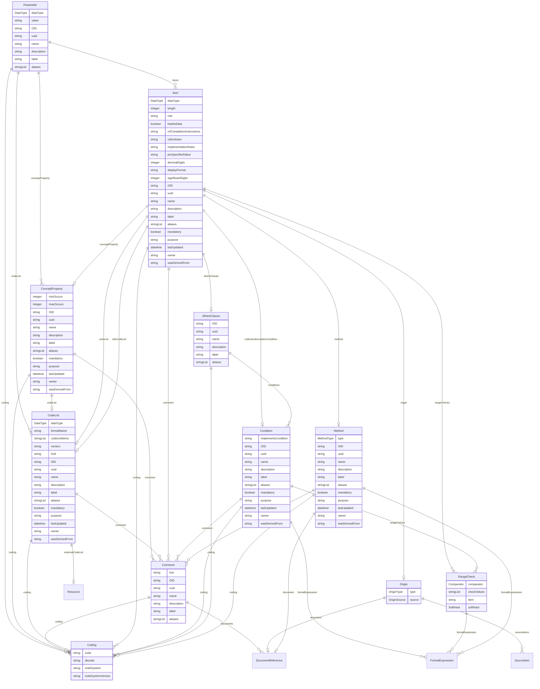

# Class: Parameter 


_A variable element that describes an input used in a formal expression_


URI: [odm:Parameter](https://cdisc.org/odm2/Parameter)





## Inheritance
* [IdentifiableElement](IdentifiableElement.md) [ [Identifiable](Identifiable.md) [Labelled](Labelled.md)]
    * **Parameter**


## Slots

| Name | Cardinality and Range | Description | Inheritance |
| ---  | --- | --- | --- |
| [dataType](dataType.md) | 0..1 <br/> [DataType](DataType.md) | The data type of the parameter | direct |
| [codeList](codeList.md) | * <br/> [CodeList](CodeList.md) | A list of allowed values for the parameter | direct |
| [value](value.md) | 0..1 <br/> [String](String.md) | A specific value for the parameter | direct |
| [items](items.md) | * <br/> [Item](Item.md) | A list of item dependencies for the parameter | direct |
| [conceptProperty](conceptProperty.md) | * <br/> [ConceptProperty](ConceptProperty.md) | Reference to a specific concept property that this parameter represents or mo... | direct |
| [OID](OID.md) | 1 <br/> [String](String.md) | Local identifier within this study/context | [Identifiable](Identifiable.md) |
| [uuid](uuid.md) | 0..1 <br/> [String](String.md) | Universal unique identifier | [Identifiable](Identifiable.md) |
| [name](name.md) | 0..1 <br/> [String](String.md) | Short name or identifier, used for field names | [Labelled](Labelled.md) |
| [description](description.md) | 0..1 <br/> [String](String.md)&nbsp;or&nbsp;<br />[String](String.md)&nbsp;or&nbsp;<br />[TranslatedText](TranslatedText.md) | Detailed description, shown in tooltips | [Labelled](Labelled.md) |
| [coding](coding.md) | * <br/> [Coding](Coding.md) | Semantic tags for this element | [Labelled](Labelled.md) |
| [label](label.md) | 0..1 <br/> [String](String.md)&nbsp;or&nbsp;<br />[String](String.md)&nbsp;or&nbsp;<br />[TranslatedText](TranslatedText.md) | Human-readable label, shown in UIs | [Labelled](Labelled.md) |
| [aliases](aliases.md) | * <br/> [String](String.md)&nbsp;or&nbsp;<br />[String](String.md)&nbsp;or&nbsp;<br />[TranslatedText](TranslatedText.md) | Alternative name or identifier | [Labelled](Labelled.md) |


## Usages

| used by | used in | type | used |
| ---  | --- | --- | --- |
| [FormalExpression](FormalExpression.md) | [parameters](parameters.md) | range | [Parameter](Parameter.md) |


## Identifier and Mapping Information


### Schema Source


* from schema: https://cdisc.org/define-json


## Mappings

| Mapping Type | Mapped Value |
| ---  | ---  |
| self | odm:Parameter |
| native | odm:Parameter |


## LinkML Source

<!-- TODO: investigate https://stackoverflow.com/questions/37606292/how-to-create-tabbed-code-blocks-in-mkdocs-or-sphinx -->

### Direct

<details>
```yaml
name: Parameter
description: A variable element that describes an input used in a formal expression
from_schema: https://cdisc.org/define-json
is_a: IdentifiableElement
attributes:
  dataType:
    name: dataType
    description: The data type of the parameter.
    from_schema: https://cdisc.org/define-json
    domain_of:
    - Item
    - CodeList
    - Parameter
    - ReturnValue
    range: DataType
  codeList:
    name: codeList
    description: A list of allowed values for the parameter.
    from_schema: https://cdisc.org/define-json
    domain_of:
    - Item
    - ConceptProperty
    - Parameter
    range: CodeList
    multivalued: true
  value:
    name: value
    description: A specific value for the parameter.
    from_schema: https://cdisc.org/define-json
    domain_of:
    - Translation
    - Parameter
    - Timing
    range: string
  items:
    name: items
    description: A list of item dependencies for the parameter.
    from_schema: https://cdisc.org/define-json
    domain_of:
    - MetaDataVersion
    - ItemGroup
    - Parameter
    range: Item
    multivalued: true
    inlined: false
  conceptProperty:
    name: conceptProperty
    description: Reference to a specific concept property that this parameter represents
      or modifies.
    from_schema: https://cdisc.org/define-json
    domain_of:
    - Item
    - Parameter
    range: ConceptProperty
    multivalued: true
    inlined: false

```
</details>

### Induced

<details>
```yaml
name: Parameter
description: A variable element that describes an input used in a formal expression
from_schema: https://cdisc.org/define-json
is_a: IdentifiableElement
attributes:
  dataType:
    name: dataType
    description: The data type of the parameter.
    from_schema: https://cdisc.org/define-json
    alias: dataType
    owner: Parameter
    domain_of:
    - Item
    - CodeList
    - Parameter
    - ReturnValue
    range: DataType
  codeList:
    name: codeList
    description: A list of allowed values for the parameter.
    from_schema: https://cdisc.org/define-json
    alias: codeList
    owner: Parameter
    domain_of:
    - Item
    - ConceptProperty
    - Parameter
    range: CodeList
    multivalued: true
  value:
    name: value
    description: A specific value for the parameter.
    from_schema: https://cdisc.org/define-json
    alias: value
    owner: Parameter
    domain_of:
    - Translation
    - Parameter
    - Timing
    range: string
  items:
    name: items
    description: A list of item dependencies for the parameter.
    from_schema: https://cdisc.org/define-json
    alias: items
    owner: Parameter
    domain_of:
    - MetaDataVersion
    - ItemGroup
    - Parameter
    range: Item
    multivalued: true
    inlined: false
  conceptProperty:
    name: conceptProperty
    description: Reference to a specific concept property that this parameter represents
      or modifies.
    from_schema: https://cdisc.org/define-json
    alias: conceptProperty
    owner: Parameter
    domain_of:
    - Item
    - Parameter
    range: ConceptProperty
    multivalued: true
    inlined: false
  OID:
    name: OID
    description: Local identifier within this study/context. Use CDISC OID format
      for regulatory submissions, or simple strings for internal use.
    from_schema: https://cdisc.org/define-json
    rank: 1000
    identifier: true
    alias: OID
    owner: Parameter
    domain_of:
    - Identifiable
    range: string
    required: true
    pattern: ^[A-Za-z][A-Za-z0-9._-]*$
  uuid:
    name: uuid
    description: Universal unique identifier
    from_schema: https://cdisc.org/define-json
    rank: 1000
    alias: uuid
    owner: Parameter
    domain_of:
    - Identifiable
    range: string
  name:
    name: name
    description: Short name or identifier, used for field names
    from_schema: https://cdisc.org/define-json
    rank: 1000
    alias: name
    owner: Parameter
    domain_of:
    - Labelled
    range: string
  description:
    name: description
    description: Detailed description, shown in tooltips
    from_schema: https://cdisc.org/define-json
    rank: 1000
    alias: description
    owner: Parameter
    domain_of:
    - Labelled
    - CodeListItem
    range: string
    any_of:
    - range: string
    - range: TranslatedText
  coding:
    name: coding
    description: Semantic tags for this element
    from_schema: https://cdisc.org/define-json
    rank: 1000
    alias: coding
    owner: Parameter
    domain_of:
    - Labelled
    - CodeListItem
    - SourceItem
    range: Coding
    multivalued: true
    inlined: true
    inlined_as_list: true
  label:
    name: label
    description: Human-readable label, shown in UIs
    from_schema: https://cdisc.org/define-json
    exact_mappings:
    - skos:prefLabel
    rank: 1000
    alias: label
    owner: Parameter
    domain_of:
    - Labelled
    range: string
    any_of:
    - range: string
    - range: TranslatedText
  aliases:
    name: aliases
    description: Alternative name or identifier
    from_schema: https://cdisc.org/define-json
    exact_mappings:
    - skos:altLabel
    rank: 1000
    alias: aliases
    owner: Parameter
    domain_of:
    - Labelled
    - CodeListItem
    range: string
    multivalued: true
    inlined: true
    inlined_as_list: true
    any_of:
    - range: string
    - range: TranslatedText

```
</details>