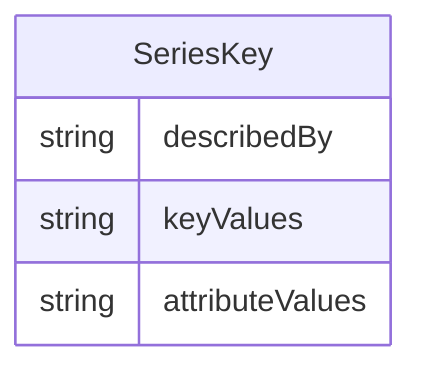

# Class: SeriesKey 


_A unique identifier that comprises the cross-product of dimension values including Time to identify observations, representing dimensions shared by all observations in a conceptual series_


URI: [odm:SeriesKey](https://cdisc.org/odm2/SeriesKey)





## Inheritance
* [DatasetKey](DatasetKey.md)
    * **SeriesKey**


## Slots

| Name | Cardinality and Range | Description | Inheritance |
| ---  | --- | --- | --- |
| [describedBy](describedBy.md) | 0..1 <br/> [String](String.md)&nbsp;or&nbsp;<br />[Dimension](Dimension.md)&nbsp;or&nbsp;<br />[ComponentList](ComponentList.md) | Associates the Dimension Descriptor defined in the Data Structure Definition | [DatasetKey](DatasetKey.md) |
| [keyValues](keyValues.md) | 0..1 <br/> [String](String.md) | List of Key Values that comprise each key, separated by a dot e | [DatasetKey](DatasetKey.md) |
| [attributeValues](attributeValues.md) | 0..1 <br/> [String](String.md) | Association to the Attribute Values relating to Key | [DatasetKey](DatasetKey.md) |


## Usages

| used by | used in | type | used |
| ---  | --- | --- | --- |
| [Dataset](Dataset.md) | [keys](keys.md) | any_of[range] | [SeriesKey](SeriesKey.md) |


## Identifier and Mapping Information


### Schema Source


* from schema: https://cdisc.org/define-json


## Mappings

| Mapping Type | Mapped Value |
| ---  | ---  |
| self | odm:SeriesKey |
| native | odm:SeriesKey |
| exact | sdmx:SeriesKey |


## LinkML Source

<!-- TODO: investigate https://stackoverflow.com/questions/37606292/how-to-create-tabbed-code-blocks-in-mkdocs-or-sphinx -->

### Direct

<details>
```yaml
name: SeriesKey
description: A unique identifier that comprises the cross-product of dimension values
  including Time to identify observations, representing dimensions shared by all observations
  in a conceptual series
from_schema: https://cdisc.org/define-json
exact_mappings:
- sdmx:SeriesKey
is_a: DatasetKey

```
</details>

### Induced

<details>
```yaml
name: SeriesKey
description: A unique identifier that comprises the cross-product of dimension values
  including Time to identify observations, representing dimensions shared by all observations
  in a conceptual series
from_schema: https://cdisc.org/define-json
exact_mappings:
- sdmx:SeriesKey
is_a: DatasetKey
attributes:
  describedBy:
    name: describedBy
    description: Associates the Dimension Descriptor defined in the Data Structure
      Definition
    from_schema: https://cdisc.org/define-json
    alias: describedBy
    owner: SeriesKey
    domain_of:
    - Dataset
    - DatasetKey
    range: string
    any_of:
    - range: Dimension
    - range: ComponentList
  keyValues:
    name: keyValues
    description: List of Key Values that comprise each key, separated by a dot e.g.
      SUBJ001.VISIT2.BMI
    from_schema: https://cdisc.org/define-json
    rank: 1000
    alias: keyValues
    owner: SeriesKey
    domain_of:
    - DatasetKey
    range: string
  attributeValues:
    name: attributeValues
    description: Association to the Attribute Values relating to Key
    from_schema: https://cdisc.org/define-json
    rank: 1000
    alias: attributeValues
    owner: SeriesKey
    domain_of:
    - DatasetKey
    range: string

```
</details>