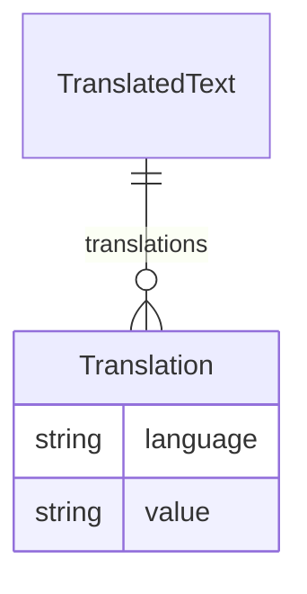

# Class: TranslatedText 


URI: [odm:TranslatedText](https://cdisc.org/odm2/TranslatedText)





<!-- no inheritance hierarchy -->


## Slots

| Name | Cardinality and Range | Description | Inheritance |
| ---  | --- | --- | --- |
| [translations](translations.md) | * <br/> [Translation](Translation.md) |  | direct |


## Usages

| used by | used in | type | used |
| ---  | --- | --- | --- |
| [IdentifiableElement](IdentifiableElement.md) | [description](description.md) | any_of[range] | [TranslatedText](TranslatedText.md) |
| [IdentifiableElement](IdentifiableElement.md) | [label](label.md) | any_of[range] | [TranslatedText](TranslatedText.md) |
| [IdentifiableElement](IdentifiableElement.md) | [aliases](aliases.md) | any_of[range] | [TranslatedText](TranslatedText.md) |
| [GovernedElement](GovernedElement.md) | [description](description.md) | any_of[range] | [TranslatedText](TranslatedText.md) |
| [GovernedElement](GovernedElement.md) | [label](label.md) | any_of[range] | [TranslatedText](TranslatedText.md) |
| [GovernedElement](GovernedElement.md) | [aliases](aliases.md) | any_of[range] | [TranslatedText](TranslatedText.md) |
| [GovernedElement](GovernedElement.md) | [purpose](purpose.md) | any_of[range] | [TranslatedText](TranslatedText.md) |
| [Governed](Governed.md) | [purpose](purpose.md) | any_of[range] | [TranslatedText](TranslatedText.md) |
| [Labelled](Labelled.md) | [description](description.md) | any_of[range] | [TranslatedText](TranslatedText.md) |
| [Labelled](Labelled.md) | [label](label.md) | any_of[range] | [TranslatedText](TranslatedText.md) |
| [Labelled](Labelled.md) | [aliases](aliases.md) | any_of[range] | [TranslatedText](TranslatedText.md) |
| [IsODMItem](IsODMItem.md) | [role](role.md) | any_of[range] | [TranslatedText](TranslatedText.md) |
| [IsODMItem](IsODMItem.md) | [crfCompletionInstructions](crfCompletionInstructions.md) | any_of[range] | [TranslatedText](TranslatedText.md) |
| [IsODMItem](IsODMItem.md) | [cdiscNotes](cdiscNotes.md) | any_of[range] | [TranslatedText](TranslatedText.md) |
| [IsODMItem](IsODMItem.md) | [implementationNotes](implementationNotes.md) | any_of[range] | [TranslatedText](TranslatedText.md) |
| [IsODMItem](IsODMItem.md) | [preSpecifiedValue](preSpecifiedValue.md) | any_of[range] | [TranslatedText](TranslatedText.md) |
| [MetaDataVersion](MetaDataVersion.md) | [description](description.md) | any_of[range] | [TranslatedText](TranslatedText.md) |
| [MetaDataVersion](MetaDataVersion.md) | [label](label.md) | any_of[range] | [TranslatedText](TranslatedText.md) |
| [MetaDataVersion](MetaDataVersion.md) | [aliases](aliases.md) | any_of[range] | [TranslatedText](TranslatedText.md) |
| [MetaDataVersion](MetaDataVersion.md) | [purpose](purpose.md) | any_of[range] | [TranslatedText](TranslatedText.md) |
| [Item](Item.md) | [role](role.md) | any_of[range] | [TranslatedText](TranslatedText.md) |
| [Item](Item.md) | [crfCompletionInstructions](crfCompletionInstructions.md) | any_of[range] | [TranslatedText](TranslatedText.md) |
| [Item](Item.md) | [cdiscNotes](cdiscNotes.md) | any_of[range] | [TranslatedText](TranslatedText.md) |
| [Item](Item.md) | [implementationNotes](implementationNotes.md) | any_of[range] | [TranslatedText](TranslatedText.md) |
| [Item](Item.md) | [preSpecifiedValue](preSpecifiedValue.md) | any_of[range] | [TranslatedText](TranslatedText.md) |
| [Item](Item.md) | [description](description.md) | any_of[range] | [TranslatedText](TranslatedText.md) |
| [Item](Item.md) | [label](label.md) | any_of[range] | [TranslatedText](TranslatedText.md) |
| [Item](Item.md) | [aliases](aliases.md) | any_of[range] | [TranslatedText](TranslatedText.md) |
| [Item](Item.md) | [purpose](purpose.md) | any_of[range] | [TranslatedText](TranslatedText.md) |
| [ItemGroup](ItemGroup.md) | [structure](structure.md) | any_of[range] | [TranslatedText](TranslatedText.md) |
| [ItemGroup](ItemGroup.md) | [description](description.md) | any_of[range] | [TranslatedText](TranslatedText.md) |
| [ItemGroup](ItemGroup.md) | [label](label.md) | any_of[range] | [TranslatedText](TranslatedText.md) |
| [ItemGroup](ItemGroup.md) | [aliases](aliases.md) | any_of[range] | [TranslatedText](TranslatedText.md) |
| [ItemGroup](ItemGroup.md) | [purpose](purpose.md) | any_of[range] | [TranslatedText](TranslatedText.md) |
| [Relationship](Relationship.md) | [description](description.md) | any_of[range] | [TranslatedText](TranslatedText.md) |
| [Relationship](Relationship.md) | [label](label.md) | any_of[range] | [TranslatedText](TranslatedText.md) |
| [Relationship](Relationship.md) | [aliases](aliases.md) | any_of[range] | [TranslatedText](TranslatedText.md) |
| [CodeList](CodeList.md) | [description](description.md) | any_of[range] | [TranslatedText](TranslatedText.md) |
| [CodeList](CodeList.md) | [label](label.md) | any_of[range] | [TranslatedText](TranslatedText.md) |
| [CodeList](CodeList.md) | [aliases](aliases.md) | any_of[range] | [TranslatedText](TranslatedText.md) |
| [CodeList](CodeList.md) | [purpose](purpose.md) | any_of[range] | [TranslatedText](TranslatedText.md) |
| [CodeListItem](CodeListItem.md) | [description](description.md) | any_of[range] | [TranslatedText](TranslatedText.md) |
| [CodeListItem](CodeListItem.md) | [aliases](aliases.md) | any_of[range] | [TranslatedText](TranslatedText.md) |
| [Comment](Comment.md) | [text](text.md) | any_of[range] | [TranslatedText](TranslatedText.md) |
| [Comment](Comment.md) | [description](description.md) | any_of[range] | [TranslatedText](TranslatedText.md) |
| [Comment](Comment.md) | [label](label.md) | any_of[range] | [TranslatedText](TranslatedText.md) |
| [Comment](Comment.md) | [aliases](aliases.md) | any_of[range] | [TranslatedText](TranslatedText.md) |
| [Coding](Coding.md) | [decode](decode.md) | any_of[range] | [TranslatedText](TranslatedText.md) |
| [CodingMapping](CodingMapping.md) | [description](description.md) | any_of[range] | [TranslatedText](TranslatedText.md) |
| [CodingMapping](CodingMapping.md) | [label](label.md) | any_of[range] | [TranslatedText](TranslatedText.md) |
| [CodingMapping](CodingMapping.md) | [aliases](aliases.md) | any_of[range] | [TranslatedText](TranslatedText.md) |
| [ReifiedConcept](ReifiedConcept.md) | [description](description.md) | any_of[range] | [TranslatedText](TranslatedText.md) |
| [ReifiedConcept](ReifiedConcept.md) | [label](label.md) | any_of[range] | [TranslatedText](TranslatedText.md) |
| [ReifiedConcept](ReifiedConcept.md) | [aliases](aliases.md) | any_of[range] | [TranslatedText](TranslatedText.md) |
| [ReifiedConcept](ReifiedConcept.md) | [purpose](purpose.md) | any_of[range] | [TranslatedText](TranslatedText.md) |
| [ConceptProperty](ConceptProperty.md) | [description](description.md) | any_of[range] | [TranslatedText](TranslatedText.md) |
| [ConceptProperty](ConceptProperty.md) | [label](label.md) | any_of[range] | [TranslatedText](TranslatedText.md) |
| [ConceptProperty](ConceptProperty.md) | [aliases](aliases.md) | any_of[range] | [TranslatedText](TranslatedText.md) |
| [ConceptProperty](ConceptProperty.md) | [purpose](purpose.md) | any_of[range] | [TranslatedText](TranslatedText.md) |
| [WhereClause](WhereClause.md) | [description](description.md) | any_of[range] | [TranslatedText](TranslatedText.md) |
| [WhereClause](WhereClause.md) | [label](label.md) | any_of[range] | [TranslatedText](TranslatedText.md) |
| [WhereClause](WhereClause.md) | [aliases](aliases.md) | any_of[range] | [TranslatedText](TranslatedText.md) |
| [Condition](Condition.md) | [description](description.md) | any_of[range] | [TranslatedText](TranslatedText.md) |
| [Condition](Condition.md) | [label](label.md) | any_of[range] | [TranslatedText](TranslatedText.md) |
| [Condition](Condition.md) | [aliases](aliases.md) | any_of[range] | [TranslatedText](TranslatedText.md) |
| [Condition](Condition.md) | [purpose](purpose.md) | any_of[range] | [TranslatedText](TranslatedText.md) |
| [FormalExpression](FormalExpression.md) | [description](description.md) | any_of[range] | [TranslatedText](TranslatedText.md) |
| [FormalExpression](FormalExpression.md) | [label](label.md) | any_of[range] | [TranslatedText](TranslatedText.md) |
| [FormalExpression](FormalExpression.md) | [aliases](aliases.md) | any_of[range] | [TranslatedText](TranslatedText.md) |
| [Method](Method.md) | [description](description.md) | any_of[range] | [TranslatedText](TranslatedText.md) |
| [Method](Method.md) | [label](label.md) | any_of[range] | [TranslatedText](TranslatedText.md) |
| [Method](Method.md) | [aliases](aliases.md) | any_of[range] | [TranslatedText](TranslatedText.md) |
| [Method](Method.md) | [purpose](purpose.md) | any_of[range] | [TranslatedText](TranslatedText.md) |
| [Parameter](Parameter.md) | [description](description.md) | any_of[range] | [TranslatedText](TranslatedText.md) |
| [Parameter](Parameter.md) | [label](label.md) | any_of[range] | [TranslatedText](TranslatedText.md) |
| [Parameter](Parameter.md) | [aliases](aliases.md) | any_of[range] | [TranslatedText](TranslatedText.md) |
| [ReturnValue](ReturnValue.md) | [description](description.md) | any_of[range] | [TranslatedText](TranslatedText.md) |
| [ReturnValue](ReturnValue.md) | [label](label.md) | any_of[range] | [TranslatedText](TranslatedText.md) |
| [ReturnValue](ReturnValue.md) | [aliases](aliases.md) | any_of[range] | [TranslatedText](TranslatedText.md) |
| [SiteOrSponsorComment](SiteOrSponsorComment.md) | [text](text.md) | any_of[range] | [TranslatedText](TranslatedText.md) |
| [SiteOrSponsorComment](SiteOrSponsorComment.md) | [description](description.md) | any_of[range] | [TranslatedText](TranslatedText.md) |
| [SiteOrSponsorComment](SiteOrSponsorComment.md) | [label](label.md) | any_of[range] | [TranslatedText](TranslatedText.md) |
| [SiteOrSponsorComment](SiteOrSponsorComment.md) | [aliases](aliases.md) | any_of[range] | [TranslatedText](TranslatedText.md) |
| [User](User.md) | [description](description.md) | any_of[range] | [TranslatedText](TranslatedText.md) |
| [User](User.md) | [label](label.md) | any_of[range] | [TranslatedText](TranslatedText.md) |
| [User](User.md) | [aliases](aliases.md) | any_of[range] | [TranslatedText](TranslatedText.md) |
| [Organization](Organization.md) | [description](description.md) | any_of[range] | [TranslatedText](TranslatedText.md) |
| [Organization](Organization.md) | [label](label.md) | any_of[range] | [TranslatedText](TranslatedText.md) |
| [Organization](Organization.md) | [aliases](aliases.md) | any_of[range] | [TranslatedText](TranslatedText.md) |
| [Resource](Resource.md) | [description](description.md) | any_of[range] | [TranslatedText](TranslatedText.md) |
| [Resource](Resource.md) | [label](label.md) | any_of[range] | [TranslatedText](TranslatedText.md) |
| [Resource](Resource.md) | [aliases](aliases.md) | any_of[range] | [TranslatedText](TranslatedText.md) |
| [DocumentReference](DocumentReference.md) | [description](description.md) | any_of[range] | [TranslatedText](TranslatedText.md) |
| [DocumentReference](DocumentReference.md) | [label](label.md) | any_of[range] | [TranslatedText](TranslatedText.md) |
| [DocumentReference](DocumentReference.md) | [aliases](aliases.md) | any_of[range] | [TranslatedText](TranslatedText.md) |
| [Timing](Timing.md) | [description](description.md) | any_of[range] | [TranslatedText](TranslatedText.md) |
| [Timing](Timing.md) | [label](label.md) | any_of[range] | [TranslatedText](TranslatedText.md) |
| [Timing](Timing.md) | [aliases](aliases.md) | any_of[range] | [TranslatedText](TranslatedText.md) |
| [NominalOccurrence](NominalOccurrence.md) | [description](description.md) | any_of[range] | [TranslatedText](TranslatedText.md) |
| [NominalOccurrence](NominalOccurrence.md) | [label](label.md) | any_of[range] | [TranslatedText](TranslatedText.md) |
| [NominalOccurrence](NominalOccurrence.md) | [aliases](aliases.md) | any_of[range] | [TranslatedText](TranslatedText.md) |
| [NominalOccurrence](NominalOccurrence.md) | [purpose](purpose.md) | any_of[range] | [TranslatedText](TranslatedText.md) |
| [DataStructureDefinition](DataStructureDefinition.md) | [structure](structure.md) | any_of[range] | [TranslatedText](TranslatedText.md) |
| [DataStructureDefinition](DataStructureDefinition.md) | [description](description.md) | any_of[range] | [TranslatedText](TranslatedText.md) |
| [DataStructureDefinition](DataStructureDefinition.md) | [label](label.md) | any_of[range] | [TranslatedText](TranslatedText.md) |
| [DataStructureDefinition](DataStructureDefinition.md) | [aliases](aliases.md) | any_of[range] | [TranslatedText](TranslatedText.md) |
| [DataStructureDefinition](DataStructureDefinition.md) | [purpose](purpose.md) | any_of[range] | [TranslatedText](TranslatedText.md) |
| [Dataflow](Dataflow.md) | [description](description.md) | any_of[range] | [TranslatedText](TranslatedText.md) |
| [Dataflow](Dataflow.md) | [label](label.md) | any_of[range] | [TranslatedText](TranslatedText.md) |
| [Dataflow](Dataflow.md) | [aliases](aliases.md) | any_of[range] | [TranslatedText](TranslatedText.md) |
| [Dataflow](Dataflow.md) | [purpose](purpose.md) | any_of[range] | [TranslatedText](TranslatedText.md) |
| [Dataset](Dataset.md) | [description](description.md) | any_of[range] | [TranslatedText](TranslatedText.md) |
| [Dataset](Dataset.md) | [label](label.md) | any_of[range] | [TranslatedText](TranslatedText.md) |
| [Dataset](Dataset.md) | [aliases](aliases.md) | any_of[range] | [TranslatedText](TranslatedText.md) |
| [CubeComponent](CubeComponent.md) | [description](description.md) | any_of[range] | [TranslatedText](TranslatedText.md) |
| [CubeComponent](CubeComponent.md) | [label](label.md) | any_of[range] | [TranslatedText](TranslatedText.md) |
| [CubeComponent](CubeComponent.md) | [aliases](aliases.md) | any_of[range] | [TranslatedText](TranslatedText.md) |
| [CubeComponent](CubeComponent.md) | [purpose](purpose.md) | any_of[range] | [TranslatedText](TranslatedText.md) |
| [Measure](Measure.md) | [description](description.md) | any_of[range] | [TranslatedText](TranslatedText.md) |
| [Measure](Measure.md) | [label](label.md) | any_of[range] | [TranslatedText](TranslatedText.md) |
| [Measure](Measure.md) | [aliases](aliases.md) | any_of[range] | [TranslatedText](TranslatedText.md) |
| [Measure](Measure.md) | [purpose](purpose.md) | any_of[range] | [TranslatedText](TranslatedText.md) |
| [Dimension](Dimension.md) | [description](description.md) | any_of[range] | [TranslatedText](TranslatedText.md) |
| [Dimension](Dimension.md) | [label](label.md) | any_of[range] | [TranslatedText](TranslatedText.md) |
| [Dimension](Dimension.md) | [aliases](aliases.md) | any_of[range] | [TranslatedText](TranslatedText.md) |
| [Dimension](Dimension.md) | [purpose](purpose.md) | any_of[range] | [TranslatedText](TranslatedText.md) |
| [DataAttribute](DataAttribute.md) | [description](description.md) | any_of[range] | [TranslatedText](TranslatedText.md) |
| [DataAttribute](DataAttribute.md) | [label](label.md) | any_of[range] | [TranslatedText](TranslatedText.md) |
| [DataAttribute](DataAttribute.md) | [aliases](aliases.md) | any_of[range] | [TranslatedText](TranslatedText.md) |
| [DataAttribute](DataAttribute.md) | [purpose](purpose.md) | any_of[range] | [TranslatedText](TranslatedText.md) |
| [ComponentList](ComponentList.md) | [description](description.md) | any_of[range] | [TranslatedText](TranslatedText.md) |
| [ComponentList](ComponentList.md) | [label](label.md) | any_of[range] | [TranslatedText](TranslatedText.md) |
| [ComponentList](ComponentList.md) | [aliases](aliases.md) | any_of[range] | [TranslatedText](TranslatedText.md) |
| [DataProduct](DataProduct.md) | [description](description.md) | any_of[range] | [TranslatedText](TranslatedText.md) |
| [DataProduct](DataProduct.md) | [label](label.md) | any_of[range] | [TranslatedText](TranslatedText.md) |
| [DataProduct](DataProduct.md) | [aliases](aliases.md) | any_of[range] | [TranslatedText](TranslatedText.md) |
| [DataProduct](DataProduct.md) | [purpose](purpose.md) | any_of[range] | [TranslatedText](TranslatedText.md) |
| [DataService](DataService.md) | [description](description.md) | any_of[range] | [TranslatedText](TranslatedText.md) |
| [DataService](DataService.md) | [label](label.md) | any_of[range] | [TranslatedText](TranslatedText.md) |
| [DataService](DataService.md) | [aliases](aliases.md) | any_of[range] | [TranslatedText](TranslatedText.md) |
| [DataProvider](DataProvider.md) | [description](description.md) | any_of[range] | [TranslatedText](TranslatedText.md) |
| [DataProvider](DataProvider.md) | [label](label.md) | any_of[range] | [TranslatedText](TranslatedText.md) |
| [DataProvider](DataProvider.md) | [aliases](aliases.md) | any_of[range] | [TranslatedText](TranslatedText.md) |
| [ProvisionAgreement](ProvisionAgreement.md) | [description](description.md) | any_of[range] | [TranslatedText](TranslatedText.md) |
| [ProvisionAgreement](ProvisionAgreement.md) | [label](label.md) | any_of[range] | [TranslatedText](TranslatedText.md) |
| [ProvisionAgreement](ProvisionAgreement.md) | [aliases](aliases.md) | any_of[range] | [TranslatedText](TranslatedText.md) |
| [ProvisionAgreement](ProvisionAgreement.md) | [purpose](purpose.md) | any_of[range] | [TranslatedText](TranslatedText.md) |


## Identifier and Mapping Information


### Schema Source


* from schema: https://cdisc.org/define-json


## Mappings

| Mapping Type | Mapped Value |
| ---  | ---  |
| self | odm:TranslatedText |
| native | odm:TranslatedText |


## LinkML Source

<!-- TODO: investigate https://stackoverflow.com/questions/37606292/how-to-create-tabbed-code-blocks-in-mkdocs-or-sphinx -->

### Direct

<details>
```yaml
name: TranslatedText
from_schema: https://cdisc.org/define-json
attributes:
  translations:
    name: translations
    from_schema: https://cdisc.org/define-json
    rank: 1000
    domain_of:
    - TranslatedText
    range: Translation
    multivalued: true
    inlined: true
    inlined_as_list: true

```
</details>

### Induced

<details>
```yaml
name: TranslatedText
from_schema: https://cdisc.org/define-json
attributes:
  translations:
    name: translations
    from_schema: https://cdisc.org/define-json
    rank: 1000
    alias: translations
    owner: TranslatedText
    domain_of:
    - TranslatedText
    range: Translation
    multivalued: true
    inlined: true
    inlined_as_list: true

```
</details>