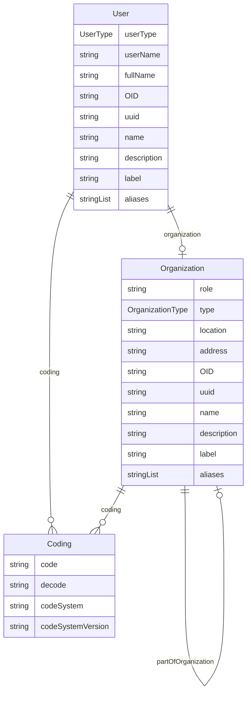

# Class: User 


_An entity that represents information about a specific user of a clinical data collection or data management system_


URI: [odm:User](https://cdisc.org/odm2/User)





## Inheritance
* [IdentifiableElement](IdentifiableElement.md) [ [Identifiable](Identifiable.md) [Labelled](Labelled.md)]
    * **User**


## Slots

| Name | Cardinality and Range | Description | Inheritance |
| ---  | --- | --- | --- |
| [userType](userType.md) | 0..1 <br/> [UserType](UserType.md) | User's role in the study | direct |
| [userName](userName.md) | 0..1 <br/> [String](String.md) | The username of the user | direct |
| [fullName](fullName.md) | 0..1 <br/> [String](String.md) | The full name of the user | direct |
| [organization](organization.md) | 0..1 <br/> [Organization](Organization.md) | The organization the user belongs to | direct |
| [OID](OID.md) | 1 <br/> [String](String.md) | Local identifier within this study/context | [Identifiable](Identifiable.md) |
| [uuid](uuid.md) | 0..1 <br/> [String](String.md) | Universal unique identifier | [Identifiable](Identifiable.md) |
| [name](name.md) | 0..1 <br/> [String](String.md) | Short name or identifier, used for field names | [Labelled](Labelled.md) |
| [description](description.md) | 0..1 <br/> [String](String.md)&nbsp;or&nbsp;<br />[String](String.md)&nbsp;or&nbsp;<br />[TranslatedText](TranslatedText.md) | Detailed description, shown in tooltips | [Labelled](Labelled.md) |
| [coding](coding.md) | * <br/> [Coding](Coding.md) | Semantic tags for this element | [Labelled](Labelled.md) |
| [label](label.md) | 0..1 <br/> [String](String.md)&nbsp;or&nbsp;<br />[String](String.md)&nbsp;or&nbsp;<br />[TranslatedText](TranslatedText.md) | Human-readable label, shown in UIs | [Labelled](Labelled.md) |
| [aliases](aliases.md) | * <br/> [String](String.md)&nbsp;or&nbsp;<br />[String](String.md)&nbsp;or&nbsp;<br />[TranslatedText](TranslatedText.md) | Alternative name or identifier | [Labelled](Labelled.md) |


## Usages

| used by | used in | type | used |
| ---  | --- | --- | --- |
| [GovernedElement](GovernedElement.md) | [owner](owner.md) | any_of[range] | [User](User.md) |
| [Governed](Governed.md) | [owner](owner.md) | any_of[range] | [User](User.md) |
| [IsProfile](IsProfile.md) | [authenticator](authenticator.md) | any_of[range] | [User](User.md) |
| [MetaDataVersion](MetaDataVersion.md) | [owner](owner.md) | any_of[range] | [User](User.md) |
| [Item](Item.md) | [owner](owner.md) | any_of[range] | [User](User.md) |
| [ItemGroup](ItemGroup.md) | [authenticator](authenticator.md) | any_of[range] | [User](User.md) |
| [ItemGroup](ItemGroup.md) | [owner](owner.md) | any_of[range] | [User](User.md) |
| [CodeList](CodeList.md) | [owner](owner.md) | any_of[range] | [User](User.md) |
| [ReifiedConcept](ReifiedConcept.md) | [owner](owner.md) | any_of[range] | [User](User.md) |
| [ConceptProperty](ConceptProperty.md) | [owner](owner.md) | any_of[range] | [User](User.md) |
| [Condition](Condition.md) | [owner](owner.md) | any_of[range] | [User](User.md) |
| [Method](Method.md) | [owner](owner.md) | any_of[range] | [User](User.md) |
| [SiteOrSponsorComment](SiteOrSponsorComment.md) | [source](source.md) | any_of[range] | [User](User.md) |
| [NominalOccurrence](NominalOccurrence.md) | [owner](owner.md) | any_of[range] | [User](User.md) |
| [DataStructureDefinition](DataStructureDefinition.md) | [authenticator](authenticator.md) | any_of[range] | [User](User.md) |
| [DataStructureDefinition](DataStructureDefinition.md) | [owner](owner.md) | any_of[range] | [User](User.md) |
| [Dataflow](Dataflow.md) | [owner](owner.md) | any_of[range] | [User](User.md) |
| [Dataset](Dataset.md) | [authenticator](authenticator.md) | any_of[range] | [User](User.md) |
| [CubeComponent](CubeComponent.md) | [owner](owner.md) | any_of[range] | [User](User.md) |
| [Measure](Measure.md) | [owner](owner.md) | any_of[range] | [User](User.md) |
| [Dimension](Dimension.md) | [owner](owner.md) | any_of[range] | [User](User.md) |
| [DataAttribute](DataAttribute.md) | [owner](owner.md) | any_of[range] | [User](User.md) |
| [DataProduct](DataProduct.md) | [dataProductOwner](dataProductOwner.md) | any_of[range] | [User](User.md) |
| [DataProduct](DataProduct.md) | [owner](owner.md) | any_of[range] | [User](User.md) |
| [ProvisionAgreement](ProvisionAgreement.md) | [owner](owner.md) | any_of[range] | [User](User.md) |


## Identifier and Mapping Information


### Schema Source


* from schema: https://cdisc.org/define-json


## Mappings

| Mapping Type | Mapped Value |
| ---  | ---  |
| self | odm:User |
| native | odm:User |
| exact | odm:User |
| broad | prov:Agent |


## LinkML Source

<!-- TODO: investigate https://stackoverflow.com/questions/37606292/how-to-create-tabbed-code-blocks-in-mkdocs-or-sphinx -->

### Direct

<details>
```yaml
name: User
description: An entity that represents information about a specific user of a clinical
  data collection or data management system
from_schema: https://cdisc.org/define-json
exact_mappings:
- odm:User
broad_mappings:
- prov:Agent
is_a: IdentifiableElement
attributes:
  userType:
    name: userType
    description: User's role in the study.
    from_schema: https://cdisc.org/define-json
    rank: 1000
    domain_of:
    - User
    range: UserType
  userName:
    name: userName
    description: The username of the user.
    from_schema: https://cdisc.org/define-json
    rank: 1000
    domain_of:
    - User
    range: string
  fullName:
    name: fullName
    description: The full name of the user.
    from_schema: https://cdisc.org/define-json
    rank: 1000
    domain_of:
    - User
    range: string
  organization:
    name: organization
    description: The organization the user belongs to.
    from_schema: https://cdisc.org/define-json
    close_mappings:
    - prov:actedOnBehalfOf
    rank: 1000
    domain_of:
    - User
    range: Organization

```
</details>

### Induced

<details>
```yaml
name: User
description: An entity that represents information about a specific user of a clinical
  data collection or data management system
from_schema: https://cdisc.org/define-json
exact_mappings:
- odm:User
broad_mappings:
- prov:Agent
is_a: IdentifiableElement
attributes:
  userType:
    name: userType
    description: User's role in the study.
    from_schema: https://cdisc.org/define-json
    rank: 1000
    alias: userType
    owner: User
    domain_of:
    - User
    range: UserType
  userName:
    name: userName
    description: The username of the user.
    from_schema: https://cdisc.org/define-json
    rank: 1000
    alias: userName
    owner: User
    domain_of:
    - User
    range: string
  fullName:
    name: fullName
    description: The full name of the user.
    from_schema: https://cdisc.org/define-json
    rank: 1000
    alias: fullName
    owner: User
    domain_of:
    - User
    range: string
  organization:
    name: organization
    description: The organization the user belongs to.
    from_schema: https://cdisc.org/define-json
    close_mappings:
    - prov:actedOnBehalfOf
    rank: 1000
    alias: organization
    owner: User
    domain_of:
    - User
    range: Organization
  OID:
    name: OID
    description: Local identifier within this study/context. Use CDISC OID format
      for regulatory submissions, or simple strings for internal use.
    from_schema: https://cdisc.org/define-json
    rank: 1000
    identifier: true
    alias: OID
    owner: User
    domain_of:
    - Identifiable
    range: string
    required: true
    pattern: ^[A-Za-z][A-Za-z0-9._-]*$
  uuid:
    name: uuid
    description: Universal unique identifier
    from_schema: https://cdisc.org/define-json
    rank: 1000
    alias: uuid
    owner: User
    domain_of:
    - Identifiable
    range: string
  name:
    name: name
    description: Short name or identifier, used for field names
    from_schema: https://cdisc.org/define-json
    rank: 1000
    alias: name
    owner: User
    domain_of:
    - Labelled
    range: string
  description:
    name: description
    description: Detailed description, shown in tooltips
    from_schema: https://cdisc.org/define-json
    rank: 1000
    alias: description
    owner: User
    domain_of:
    - Labelled
    - CodeListItem
    range: string
    any_of:
    - range: string
    - range: TranslatedText
  coding:
    name: coding
    description: Semantic tags for this element
    from_schema: https://cdisc.org/define-json
    rank: 1000
    alias: coding
    owner: User
    domain_of:
    - Labelled
    - CodeListItem
    - SourceItem
    range: Coding
    multivalued: true
    inlined: true
    inlined_as_list: true
  label:
    name: label
    description: Human-readable label, shown in UIs
    from_schema: https://cdisc.org/define-json
    exact_mappings:
    - skos:prefLabel
    rank: 1000
    alias: label
    owner: User
    domain_of:
    - Labelled
    range: string
    any_of:
    - range: string
    - range: TranslatedText
  aliases:
    name: aliases
    description: Alternative name or identifier
    from_schema: https://cdisc.org/define-json
    exact_mappings:
    - skos:altLabel
    rank: 1000
    alias: aliases
    owner: User
    domain_of:
    - Labelled
    - CodeListItem
    range: string
    multivalued: true
    inlined: true
    inlined_as_list: true
    any_of:
    - range: string
    - range: TranslatedText

```
</details>