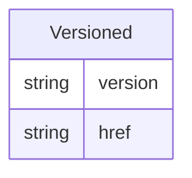

# Class: Versioned 


_A mixin that provides version and connectivity information, including version numbers and resource references_


URI: [odm:Versioned](https://cdisc.org/odm2/Versioned)





<!-- no inheritance hierarchy -->


## Slots

| Name | Cardinality and Range | Description | Inheritance |
| ---  | --- | --- | --- |
| [version](version.md) | 0..1 <br/> [String](String.md) | The version of the external resources | direct |
| [href](href.md) | 0..1 <br/> [String](String.md) | Machine-readable instructions to obtain the resource e | direct |


## Mixin Usage

| mixed into | description |
| --- | --- |
| [IsProfile](IsProfile.md) | A mixin that provides additional metadata for FHIR resources and Data Product... |
| [CodeList](CodeList.md) | A value set that defines a discrete collection of permissible values for an i... |
| [ReifiedConcept](ReifiedConcept.md) | A canonical information layer that makes abstract concepts explicit and refer... |
| [Resource](Resource.md) | An external reference that serves as the source for a Dataset, ItemGroup, or ... |
| [DocumentReference](DocumentReference.md) | A comprehensive reference element that points to an external document, combin... |
| [Dataflow](Dataflow.md) | An abstract representation that defines data provision for different referenc... |
| [Dataset](Dataset.md) | A collection element that groups observations sharing the same dimensionality... |
| [DataProduct](DataProduct.md) | A governed collection that represents a purpose-driven assembly of datasets a... |
| [ProvisionAgreement](ProvisionAgreement.md) | An agreement element that describes the contractual relationship between a Da... |


## Identifier and Mapping Information


### Schema Source


* from schema: https://cdisc.org/define-json


## Mappings

| Mapping Type | Mapped Value |
| ---  | ---  |
| self | odm:Versioned |
| native | odm:Versioned |


## LinkML Source

<!-- TODO: investigate https://stackoverflow.com/questions/37606292/how-to-create-tabbed-code-blocks-in-mkdocs-or-sphinx -->

### Direct

<details>
```yaml
name: Versioned
description: A mixin that provides version and connectivity information, including
  version numbers and resource references
from_schema: https://cdisc.org/define-json
mixin: true
attributes:
  version:
    name: version
    description: The version of the external resources
    from_schema: https://cdisc.org/define-json
    rank: 1000
    domain_of:
    - Versioned
    range: string
  href:
    name: href
    description: Machine-readable instructions to obtain the resource e.g. FHIR path,
      URL
    from_schema: https://cdisc.org/define-json
    rank: 1000
    domain_of:
    - Versioned
    range: string
    required: false

```
</details>

### Induced

<details>
```yaml
name: Versioned
description: A mixin that provides version and connectivity information, including
  version numbers and resource references
from_schema: https://cdisc.org/define-json
mixin: true
attributes:
  version:
    name: version
    description: The version of the external resources
    from_schema: https://cdisc.org/define-json
    rank: 1000
    alias: version
    owner: Versioned
    domain_of:
    - Versioned
    range: string
  href:
    name: href
    description: Machine-readable instructions to obtain the resource e.g. FHIR path,
      URL
    from_schema: https://cdisc.org/define-json
    rank: 1000
    alias: href
    owner: Versioned
    domain_of:
    - Versioned
    range: string
    required: false

```
</details>