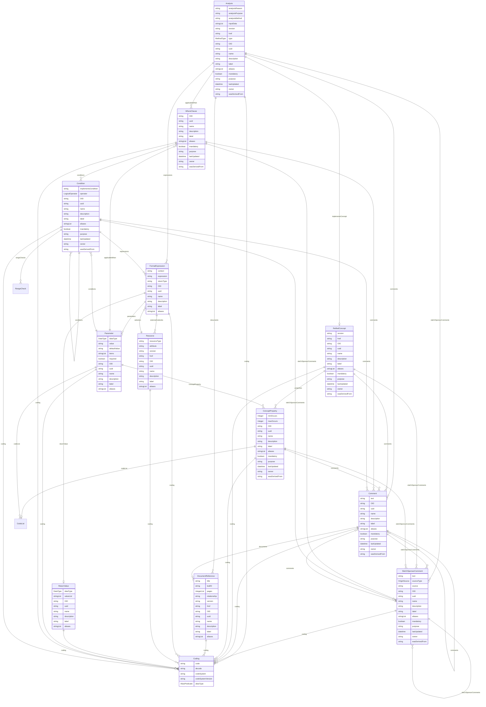

# Class: Analysis 


_Analysis extends Method to capture analysis-specific metadata including the reason for analysis, its purpose, and data traceability for the results used._

_Expressions and parameters from Method can be generic or implementation-specific._


URI: [odm:class/Analysis](https://cdisc.org/odm2/class/Analysis)





## Inheritance
* [GovernedElement](../classes/GovernedElement.md) [ [Identifiable](../classes/Identifiable.md) [Labelled](../classes/Labelled.md) [Governed](../classes/Governed.md)]
    * [Method](../classes/Method.md)
        * **Analysis** [ [Versioned](../classes/Versioned.md)]


## Slots

| Name | Cardinality and Range | Description | Inheritance |
| ---  | --- | --- | --- |
| [analysisReason](../slots/analysisReason.md) | 0..1 <br/> [String](../types/String.md) | The reason this analysis was performed. | direct |
| [analysisPurpose](../slots/analysisPurpose.md) | 0..1 <br/> [String](../types/String.md) | The purpose or role of this analysis in the study. | direct |
| [analysisMethod](../slots/analysisMethod.md) | 0..1 <br/> [String](../types/String.md) | Generic method used to perform this analysis. any_of:<br>  - range: Method<br>  - range: AnalysisMethod | direct |
| [applicableWhen](../slots/applicableWhen.md) | * <br/> [WhereClause](../classes/WhereClause.md) | The conditions (e.g. population, time period etc.) that must be met for this analysis to be applicable. | direct |
| [inputData](../slots/inputData.md) | * <br/> [String](../types/String.md)&nbsp;or&nbsp;<br />[ItemGroup](../classes/ItemGroup.md)&nbsp;or&nbsp;<br />[Dataset](../classes/Dataset.md) | Datasets or slices/subsets of datasets asked for by this analysis. If a Item is referenced by a Parameter e.g. Analysis Variable, make sure to include its parent ItemGroup here. | direct |
| [version](../slots/version.md) | 0..1 <br/> [String](../types/String.md) | The version of the external resources | [Versioned](../classes/Versioned.md) |
| [href](../slots/href.md) | 0..1 <br/> [String](../types/String.md) | Machine-readable instructions to obtain the resource e.g. FHIR path, URL | [Versioned](../classes/Versioned.md) |
| [type](../slots/type.md) | 0..1 <br/> [MethodType](../enums/MethodType.md) | The type of method e.g. Computation, Imputation, Transformation. | [Method](../classes/Method.md) |
| [expressions](../slots/expressions.md) | * <br/> [FormalExpression](../classes/FormalExpression.md) | Formal expressions used by this method | [Method](../classes/Method.md) |
| [documents](../slots/documents.md) | * <br/> [DocumentReference](../classes/DocumentReference.md) | Reference to a document that describes this method in detail. | [Method](../classes/Method.md) |
| [implementsConcept](../slots/implementsConcept.md) | 0..1 <br/> [ReifiedConcept](../classes/ReifiedConcept.md) | Reference to a specific concept that this Method implements. | [Method](../classes/Method.md) |
| [OID](../slots/OID.md) | 1 <br/> [String](../types/String.md) | Local identifier within this study/context. Use CDISC OID format for regulatory submissions, or simple strings for internal use. | [Identifiable](../classes/Identifiable.md) |
| [uuid](../slots/uuid.md) | 0..1 <br/> [String](../types/String.md) | Universal unique identifier | [Identifiable](../classes/Identifiable.md) |
| [name](../slots/name.md) | 0..1 <br/> [String](../types/String.md) | Short name or identifier, used for field names | [Labelled](../classes/Labelled.md) |
| [description](../slots/description.md) | 0..1 <br/> [String](../types/String.md)&nbsp;or&nbsp;<br />[String](../types/String.md)&nbsp;or&nbsp;<br />[TranslatedText](../classes/TranslatedText.md) | Detailed description, shown in tooltips | [Labelled](../classes/Labelled.md) |
| [coding](../slots/coding.md) | * <br/> [Coding](../classes/Coding.md) | Semantic tags for this element | [Labelled](../classes/Labelled.md) |
| [label](../slots/label.md) | 0..1 <br/> [String](../types/String.md)&nbsp;or&nbsp;<br />[String](../types/String.md)&nbsp;or&nbsp;<br />[TranslatedText](../classes/TranslatedText.md) | Human-readable label, shown in UIs | [Labelled](../classes/Labelled.md) |
| [aliases](../slots/aliases.md) | * <br/> [String](../types/String.md)&nbsp;or&nbsp;<br />[String](../types/String.md)&nbsp;or&nbsp;<br />[TranslatedText](../classes/TranslatedText.md) | Alternative name or identifier | [Labelled](../classes/Labelled.md) |
| [mandatory](../slots/mandatory.md) | 0..1 <br/> [Boolean](../types/Boolean.md) | Is this element required? | [Governed](../classes/Governed.md) |
| [comments](../slots/comments.md) | * <br/> [Comment](../classes/Comment.md) | Comment on the element, such as a rationale for its inclusion or exclusion | [Governed](../classes/Governed.md) |
| [siteOrSponsorComments](../slots/siteOrSponsorComments.md) | * <br/> [SiteOrSponsorComment](../classes/SiteOrSponsorComment.md) | Comment on the element, such as a rationale for its inclusion or exclusion | [Governed](../classes/Governed.md) |
| [purpose](../slots/purpose.md) | 0..1 <br/> [String](../types/String.md)&nbsp;or&nbsp;<br />[String](../types/String.md)&nbsp;or&nbsp;<br />[TranslatedText](../classes/TranslatedText.md) | Purpose or rationale for this data element | [Governed](../classes/Governed.md) |
| [lastUpdated](../slots/lastUpdated.md) | 0..1 <br/> [Datetime](../types/Datetime.md) | When the resource was last updated | [Governed](../classes/Governed.md) |
| [owner](../slots/owner.md) | 0..1 <br/> [String](../types/String.md)&nbsp;or&nbsp;<br />[User](../classes/User.md)&nbsp;or&nbsp;<br />[Organization](../classes/Organization.md)&nbsp;or&nbsp;<br />[String](../types/String.md) | Party responsible for this element | [Governed](../classes/Governed.md) |
| [wasDerivedFrom](../slots/wasDerivedFrom.md) | 0..1 <br/> [String](../types/String.md)&nbsp;or&nbsp;<br />[Item](../classes/Item.md)&nbsp;or&nbsp;<br />[ItemGroup](../classes/ItemGroup.md)&nbsp;or&nbsp;<br />[MetaDataVersion](../classes/MetaDataVersion.md)&nbsp;or&nbsp;<br />[CodeList](../classes/CodeList.md)&nbsp;or&nbsp;<br />[ReifiedConcept](../classes/ReifiedConcept.md)&nbsp;or&nbsp;<br />[ConceptProperty](../classes/ConceptProperty.md)&nbsp;or&nbsp;<br />[Condition](../classes/Condition.md)&nbsp;or&nbsp;<br />[Method](../classes/Method.md)&nbsp;or&nbsp;<br />[NominalOccurrence](../classes/NominalOccurrence.md)&nbsp;or&nbsp;<br />[Dataflow](../classes/Dataflow.md)&nbsp;or&nbsp;<br />[CubeComponent](../classes/CubeComponent.md)&nbsp;or&nbsp;<br />[DataProduct](../classes/DataProduct.md)&nbsp;or&nbsp;<br />[ProvisionAgreement](../classes/ProvisionAgreement.md) | Reference to another item that this item implements or extends, e.g. a template Item definition. | [Governed](../classes/Governed.md) |


## Usages

| used by | used in | type | used |
| ---  | --- | --- | --- |
| [MetaDataVersion](../classes/MetaDataVersion.md) | [analyses](../slots/analyses.md) | range | [Analysis](../classes/Analysis.md) |
| [Dataflow](../classes/Dataflow.md) | [analysisMethod](../slots/analysisMethod.md) | range | [Analysis](../classes/Analysis.md) |
| [Display](../classes/Display.md) | [analysis](../slots/analysis.md) | range | [Analysis](../classes/Analysis.md) |


## Identifier and Mapping Information


### Schema Source


* from schema: https://cdisc.org/define-json


## Mappings

| Mapping Type | Mapped Value |
| ---  | ---  |
| self | odm:Analysis |
| native | odm:Analysis |


## LinkML Source

<!-- TODO: investigate https://stackoverflow.com/questions/37606292/how-to-create-tabbed-code-blocks-in-mkdocs-or-sphinx -->

### Direct

<details>
```yaml
name: Analysis
description: 'Analysis extends Method to capture analysis-specific metadata including
  the reason for analysis, its purpose, and data traceability for the results used.

  Expressions and parameters from Method can be generic or implementation-specific.'
from_schema: https://cdisc.org/define-json
is_a: Method
mixins:
- Versioned
attributes:
  analysisReason:
    name: analysisReason
    description: 'The reason this analysis was performed.  '
    from_schema: https://cdisc.org/define-json
    rank: 1000
    domain_of:
    - Analysis
  analysisPurpose:
    name: analysisPurpose
    description: The purpose or role of this analysis in the study.
    from_schema: https://cdisc.org/define-json
    rank: 1000
    domain_of:
    - Analysis
  analysisMethod:
    name: analysisMethod
    description: "Generic method used to perform this analysis. any_of:\n  - range:\
      \ Method\n  - range: AnalysisMethod"
    from_schema: https://cdisc.org/define-json
    domain_of:
    - Dataflow
    - Analysis
  applicableWhen:
    name: applicableWhen
    description: The conditions (e.g. population, time period etc.) that must be met
      for this analysis to be applicable.
    from_schema: https://cdisc.org/define-json
    domain_of:
    - Item
    - ItemGroup
    - Parameter
    - Analysis
    range: WhereClause
    multivalued: true
    inlined: false
  inputData:
    name: inputData
    description: Datasets or slices/subsets of datasets asked for by this analysis.
      If a Item is referenced by a Parameter e.g. Analysis Variable, make sure to
      include its parent ItemGroup here.
    from_schema: https://cdisc.org/define-json
    rank: 1000
    domain_of:
    - Analysis
    multivalued: true
    inlined: false
    any_of:
    - range: ItemGroup
    - range: Dataset

```
</details>

### Induced

<details>
```yaml
name: Analysis
description: 'Analysis extends Method to capture analysis-specific metadata including
  the reason for analysis, its purpose, and data traceability for the results used.

  Expressions and parameters from Method can be generic or implementation-specific.'
from_schema: https://cdisc.org/define-json
is_a: Method
mixins:
- Versioned
attributes:
  analysisReason:
    name: analysisReason
    description: 'The reason this analysis was performed.  '
    from_schema: https://cdisc.org/define-json
    rank: 1000
    alias: analysisReason
    owner: Analysis
    domain_of:
    - Analysis
  analysisPurpose:
    name: analysisPurpose
    description: The purpose or role of this analysis in the study.
    from_schema: https://cdisc.org/define-json
    rank: 1000
    alias: analysisPurpose
    owner: Analysis
    domain_of:
    - Analysis
  analysisMethod:
    name: analysisMethod
    description: "Generic method used to perform this analysis. any_of:\n  - range:\
      \ Method\n  - range: AnalysisMethod"
    from_schema: https://cdisc.org/define-json
    alias: analysisMethod
    owner: Analysis
    domain_of:
    - Dataflow
    - Analysis
  applicableWhen:
    name: applicableWhen
    description: The conditions (e.g. population, time period etc.) that must be met
      for this analysis to be applicable.
    from_schema: https://cdisc.org/define-json
    alias: applicableWhen
    owner: Analysis
    domain_of:
    - Item
    - ItemGroup
    - Parameter
    - Analysis
    range: WhereClause
    multivalued: true
    inlined: false
  inputData:
    name: inputData
    description: Datasets or slices/subsets of datasets asked for by this analysis.
      If a Item is referenced by a Parameter e.g. Analysis Variable, make sure to
      include its parent ItemGroup here.
    from_schema: https://cdisc.org/define-json
    rank: 1000
    alias: inputData
    owner: Analysis
    domain_of:
    - Analysis
    multivalued: true
    inlined: false
    any_of:
    - range: ItemGroup
    - range: Dataset
  version:
    name: version
    description: The version of the external resources
    from_schema: https://cdisc.org/define-json
    rank: 1000
    alias: version
    owner: Analysis
    domain_of:
    - Versioned
    - Standard
    range: string
  href:
    name: href
    description: Machine-readable instructions to obtain the resource e.g. FHIR path,
      URL
    from_schema: https://cdisc.org/define-json
    rank: 1000
    alias: href
    owner: Analysis
    domain_of:
    - Versioned
    range: string
    required: false
  type:
    name: type
    description: The type of method e.g. Computation, Imputation, Transformation.
    from_schema: https://cdisc.org/define-json
    alias: type
    owner: Analysis
    domain_of:
    - ItemGroup
    - Method
    - Origin
    - Organization
    - Standard
    - Timing
    range: MethodType
  expressions:
    name: expressions
    description: Formal expressions used by this method
    from_schema: https://cdisc.org/define-json
    alias: expressions
    owner: Analysis
    domain_of:
    - Condition
    - RangeCheck
    - Method
    range: FormalExpression
    multivalued: true
    inlined: true
    inlined_as_list: true
  documents:
    name: documents
    description: Reference to a document that describes this method in detail.
    from_schema: https://cdisc.org/define-json
    alias: documents
    owner: Analysis
    domain_of:
    - Comment
    - Method
    - Origin
    range: DocumentReference
    multivalued: true
    inlined: true
    inlined_as_list: true
  implementsConcept:
    name: implementsConcept
    description: Reference to a specific concept that this Method implements.
    from_schema: https://cdisc.org/define-json
    alias: implementsConcept
    owner: Analysis
    domain_of:
    - ItemGroup
    - Method
    range: ReifiedConcept
    inlined: false
  OID:
    name: OID
    description: Local identifier within this study/context. Use CDISC OID format
      for regulatory submissions, or simple strings for internal use.
    from_schema: https://cdisc.org/define-json
    rank: 1000
    identifier: true
    alias: OID
    owner: Analysis
    domain_of:
    - Identifiable
    range: string
    required: true
    pattern: ^[A-Za-z][A-Za-z0-9._-]*$
  uuid:
    name: uuid
    description: Universal unique identifier
    from_schema: https://cdisc.org/define-json
    rank: 1000
    alias: uuid
    owner: Analysis
    domain_of:
    - Identifiable
    range: string
  name:
    name: name
    description: Short name or identifier, used for field names
    from_schema: https://cdisc.org/define-json
    rank: 1000
    alias: name
    owner: Analysis
    domain_of:
    - Labelled
    - Standard
    range: string
  description:
    name: description
    description: Detailed description, shown in tooltips
    from_schema: https://cdisc.org/define-json
    rank: 1000
    alias: description
    owner: Analysis
    domain_of:
    - Labelled
    - CodeListItem
    range: string
    any_of:
    - range: string
    - range: TranslatedText
  coding:
    name: coding
    description: Semantic tags for this element
    from_schema: https://cdisc.org/define-json
    rank: 1000
    alias: coding
    owner: Analysis
    domain_of:
    - Labelled
    - CodeListItem
    - SourceItem
    range: Coding
    multivalued: true
    inlined: true
    inlined_as_list: true
  label:
    name: label
    description: Human-readable label, shown in UIs
    from_schema: https://cdisc.org/define-json
    exact_mappings:
    - skos:prefLabel
    rank: 1000
    alias: label
    owner: Analysis
    domain_of:
    - Labelled
    range: string
    any_of:
    - range: string
    - range: TranslatedText
  aliases:
    name: aliases
    description: Alternative name or identifier
    from_schema: https://cdisc.org/define-json
    exact_mappings:
    - skos:altLabel
    rank: 1000
    alias: aliases
    owner: Analysis
    domain_of:
    - Labelled
    - CodeListItem
    range: string
    multivalued: true
    inlined: true
    inlined_as_list: true
    any_of:
    - range: string
    - range: TranslatedText
  mandatory:
    name: mandatory
    description: Is this element required?
    from_schema: https://cdisc.org/define-json
    rank: 1000
    alias: mandatory
    owner: Analysis
    domain_of:
    - Governed
    range: boolean
  comments:
    name: comments
    description: Comment on the element, such as a rationale for its inclusion or
      exclusion
    from_schema: https://cdisc.org/define-json
    rank: 1000
    alias: comments
    owner: Analysis
    domain_of:
    - Governed
    range: Comment
    multivalued: true
    inlined: false
  siteOrSponsorComments:
    name: siteOrSponsorComments
    description: Comment on the element, such as a rationale for its inclusion or
      exclusion
    from_schema: https://cdisc.org/define-json
    rank: 1000
    alias: siteOrSponsorComments
    owner: Analysis
    domain_of:
    - Governed
    range: SiteOrSponsorComment
    multivalued: true
    inlined: false
  purpose:
    name: purpose
    description: Purpose or rationale for this data element
    from_schema: https://cdisc.org/define-json
    rank: 1000
    alias: purpose
    owner: Analysis
    domain_of:
    - Governed
    range: string
    any_of:
    - range: string
    - range: TranslatedText
  lastUpdated:
    name: lastUpdated
    description: When the resource was last updated
    from_schema: https://cdisc.org/define-json
    rank: 1000
    alias: lastUpdated
    owner: Analysis
    domain_of:
    - Governed
    range: datetime
  owner:
    name: owner
    description: Party responsible for this element
    from_schema: https://cdisc.org/define-json
    narrow_mappings:
    - prov:wasAttributedTo
    - prov:wasAssociatedBy
    rank: 1000
    alias: owner
    owner: Analysis
    domain_of:
    - Governed
    range: string
    any_of:
    - range: User
    - range: Organization
    - range: string
  wasDerivedFrom:
    name: wasDerivedFrom
    description: Reference to another item that this item implements or extends, e.g.
      a template Item definition.
    from_schema: https://cdisc.org/define-json
    exact_mappings:
    - prov:wasDerivedFrom
    rank: 1000
    alias: wasDerivedFrom
    owner: Analysis
    domain_of:
    - Governed
    range: string
    any_of:
    - range: Item
    - range: ItemGroup
    - range: MetaDataVersion
    - range: CodeList
    - range: ReifiedConcept
    - range: ConceptProperty
    - range: Condition
    - range: Method
    - range: NominalOccurrence
    - range: Dataflow
    - range: CubeComponent
    - range: DataProduct
    - range: ProvisionAgreement

```
</details>