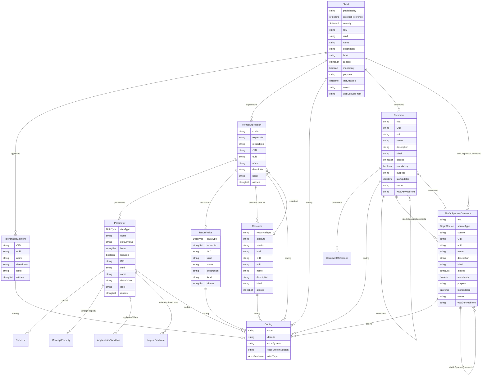

# Class: Check 


_A reusable validation check included in the metadata package, such as a published CORE rule. Linked many-to-many by reference to the metadata and/or data elements it applies to, and optionally citing an external published rule so checks stay reusable and loosely coupled. Distinct from RangeCheck, which is an inline executable comparison; a RangeCheck may implement a Check._


URI: [dds:class/Check](https://w3id.org/dds/class/Check)





## Inheritance
* [GovernedElement](../classes/GovernedElement.md) [ [Identifiable](../classes/Identifiable.md) [Labelled](../classes/Labelled.md) [Governed](../classes/Governed.md)]
    * **Check**


## Slots

| Name | Cardinality and Range | Description | Inheritance |
| ---  | --- | --- | --- |
| [appliesTo](../slots/appliesTo.md) | * <br/> [IdentifiableElement](../classes/IdentifiableElement.md) | The metadata and/or data element(s) this check applies to, referenced by OID. Multivalued and non-inlined for many-to-many, loosely coupled linkage. | direct |
| [publishedBy](../slots/publishedBy.md) | 0..1 <br/> [String](../types/String.md)&nbsp;or&nbsp;<br />[Standard](../classes/Standard.md)&nbsp;or&nbsp;<br />[Organization](../classes/Organization.md)&nbsp;or&nbsp;<br />[String](../types/String.md) | The standard or authority that published this check (e.g. CDISC CORE). | direct |
| [externalReference](../slots/externalReference.md) | 0..1 <br/> [Uriorcurie](../types/Uriorcurie.md) | URI or CURIE of the published rule this check is sourced from (e.g. a CORE rule identifier), enabling reuse across metadata packages. | direct |
| [severity](../slots/severity.md) | 0..1 <br/> [SoftHard](../enums/SoftHard.md) | Whether a failure is an error ("Hard") or a warning ("Soft"). | direct |
| [expressions](../slots/expressions.md) | * <br/> [FormalExpression](../classes/FormalExpression.md) | Optional formal/executable expression(s) implementing the check. | direct |
| [OID](../slots/OID.md) | 1 <br/> [String](../types/String.md) | Local identifier within this study/context. Use CDISC OID format for regulatory submissions, or simple strings for internal use. | [Identifiable](../classes/Identifiable.md) |
| [uuid](../slots/uuid.md) | 0..1 <br/> [String](../types/String.md) | Universal unique identifier | [Identifiable](../classes/Identifiable.md) |
| [name](../slots/name.md) | 0..1 <br/> [String](../types/String.md) | Short name or identifier, used for field names | [Labelled](../classes/Labelled.md) |
| [description](../slots/description.md) | 0..1 <br/> [String](../types/String.md)&nbsp;or&nbsp;<br />[String](../types/String.md)&nbsp;or&nbsp;<br />[TranslatedText](../classes/TranslatedText.md) | Detailed description, shown in tooltips | [Labelled](../classes/Labelled.md) |
| [coding](../slots/coding.md) | * <br/> [Coding](../classes/Coding.md) | Semantic tags for this element | [Labelled](../classes/Labelled.md) |
| [label](../slots/label.md) | 0..1 <br/> [String](../types/String.md)&nbsp;or&nbsp;<br />[String](../types/String.md)&nbsp;or&nbsp;<br />[TranslatedText](../classes/TranslatedText.md) | Human-readable label, shown in UIs | [Labelled](../classes/Labelled.md) |
| [aliases](../slots/aliases.md) | * <br/> [String](../types/String.md)&nbsp;or&nbsp;<br />[String](../types/String.md)&nbsp;or&nbsp;<br />[TranslatedText](../classes/TranslatedText.md) | Alternative name or identifier | [Labelled](../classes/Labelled.md) |
| [mandatory](../slots/mandatory.md) | 0..1 <br/> [Boolean](../types/Boolean.md) | Is this element required? | [Governed](../classes/Governed.md) |
| [comments](../slots/comments.md) | * <br/> [Comment](../classes/Comment.md) | Comment on the element, such as a rationale for its inclusion or exclusion | [Governed](../classes/Governed.md) |
| [siteOrSponsorComments](../slots/siteOrSponsorComments.md) | * <br/> [SiteOrSponsorComment](../classes/SiteOrSponsorComment.md) | Comment on the element, such as a rationale for its inclusion or exclusion | [Governed](../classes/Governed.md) |
| [purpose](../slots/purpose.md) | 0..1 <br/> [String](../types/String.md)&nbsp;or&nbsp;<br />[String](../types/String.md)&nbsp;or&nbsp;<br />[TranslatedText](../classes/TranslatedText.md) | Purpose or rationale for this data element | [Governed](../classes/Governed.md) |
| [lastUpdated](../slots/lastUpdated.md) | 0..1 <br/> [Datetime](../types/Datetime.md) | When the resource was last updated | [Governed](../classes/Governed.md) |
| [owner](../slots/owner.md) | 0..1 <br/> [String](../types/String.md)&nbsp;or&nbsp;<br />[User](../classes/User.md)&nbsp;or&nbsp;<br />[Organization](../classes/Organization.md)&nbsp;or&nbsp;<br />[String](../types/String.md) | Party responsible for this element | [Governed](../classes/Governed.md) |
| [wasDerivedFrom](../slots/wasDerivedFrom.md) | 0..1 <br/> [String](../types/String.md)&nbsp;or&nbsp;<br />[Item](../classes/Item.md)&nbsp;or&nbsp;<br />[ItemGroup](../classes/ItemGroup.md)&nbsp;or&nbsp;<br />[Specification](../classes/Specification.md)&nbsp;or&nbsp;<br />[CodeList](../classes/CodeList.md)&nbsp;or&nbsp;<br />[Concept](../classes/Concept.md)&nbsp;or&nbsp;<br />[ConceptProperty](../classes/ConceptProperty.md)&nbsp;or&nbsp;<br />[LogicalPredicate](../classes/LogicalPredicate.md)&nbsp;or&nbsp;<br />[Method](../classes/Method.md)&nbsp;or&nbsp;<br />[Dataflow](../classes/Dataflow.md)&nbsp;or&nbsp;<br />[CubeComponent](../classes/CubeComponent.md)&nbsp;or&nbsp;<br />[DataProduct](../classes/DataProduct.md)&nbsp;or&nbsp;<br />[ProvisionAgreement](../classes/ProvisionAgreement.md) | Reference to another item that this item implements or extends, e.g. a template Item definition. | [Governed](../classes/Governed.md) |


## Usages

| used by | used in | type | used |
| ---  | --- | --- | --- |
| [Specification](../classes/Specification.md) | [checks](../slots/checks.md) | range | [Check](../classes/Check.md) |
| [RangeCheck](../classes/RangeCheck.md) | [implementsCheck](../slots/implementsCheck.md) | range | [Check](../classes/Check.md) |


## Identifier and Mapping Information


### Schema Source


* from schema: https://w3id.org/dds


## Mappings

| Mapping Type | Mapped Value |
| ---  | ---  |
| self | dds:Check |
| native | dds:Check |
| close | odm:RangeCheck |


## LinkML Source

<!-- TODO: investigate https://stackoverflow.com/questions/37606292/how-to-create-tabbed-code-blocks-in-mkdocs-or-sphinx -->

### Direct

<details>
```yaml
name: Check
description: A reusable validation check included in the metadata package, such as
  a published CORE rule. Linked many-to-many by reference to the metadata and/or data
  elements it applies to, and optionally citing an external published rule so checks
  stay reusable and loosely coupled. Distinct from RangeCheck, which is an inline
  executable comparison; a RangeCheck may implement a Check.
from_schema: https://w3id.org/dds
close_mappings:
- odm:RangeCheck
is_a: GovernedElement
attributes:
  appliesTo:
    name: appliesTo
    description: The metadata and/or data element(s) this check applies to, referenced
      by OID. Multivalued and non-inlined for many-to-many, loosely coupled linkage.
    from_schema: https://w3id.org/dds
    rank: 1000
    domain_of:
    - Check
    range: IdentifiableElement
    multivalued: true
    inlined: false
  publishedBy:
    name: publishedBy
    description: The standard or authority that published this check (e.g. CDISC CORE).
    from_schema: https://w3id.org/dds
    domain_of:
    - Dictionary
    - Check
    - Dataset
    any_of:
    - range: Standard
    - range: Organization
    - range: string
  externalReference:
    name: externalReference
    description: URI or CURIE of the published rule this check is sourced from (e.g.
      a CORE rule identifier), enabling reuse across metadata packages.
    from_schema: https://w3id.org/dds
    rank: 1000
    domain_of:
    - Check
    range: uriorcurie
  severity:
    name: severity
    description: Whether a failure is an error ("Hard") or a warning ("Soft").
    from_schema: https://w3id.org/dds
    rank: 1000
    domain_of:
    - Check
    range: SoftHard
  expressions:
    name: expressions
    description: Optional formal/executable expression(s) implementing the check.
    from_schema: https://w3id.org/dds
    domain_of:
    - LogicalPredicate
    - RangeCheck
    - Check
    - Method
    range: FormalExpression
    multivalued: true
    inlined: true
    inlined_as_list: true

```
</details>

### Induced

<details>
```yaml
name: Check
description: A reusable validation check included in the metadata package, such as
  a published CORE rule. Linked many-to-many by reference to the metadata and/or data
  elements it applies to, and optionally citing an external published rule so checks
  stay reusable and loosely coupled. Distinct from RangeCheck, which is an inline
  executable comparison; a RangeCheck may implement a Check.
from_schema: https://w3id.org/dds
close_mappings:
- odm:RangeCheck
is_a: GovernedElement
attributes:
  appliesTo:
    name: appliesTo
    description: The metadata and/or data element(s) this check applies to, referenced
      by OID. Multivalued and non-inlined for many-to-many, loosely coupled linkage.
    from_schema: https://w3id.org/dds
    rank: 1000
    alias: appliesTo
    owner: Check
    domain_of:
    - Check
    range: IdentifiableElement
    multivalued: true
    inlined: false
  publishedBy:
    name: publishedBy
    description: The standard or authority that published this check (e.g. CDISC CORE).
    from_schema: https://w3id.org/dds
    alias: publishedBy
    owner: Check
    domain_of:
    - Dictionary
    - Check
    - Dataset
    range: string
    any_of:
    - range: Standard
    - range: Organization
    - range: string
  externalReference:
    name: externalReference
    description: URI or CURIE of the published rule this check is sourced from (e.g.
      a CORE rule identifier), enabling reuse across metadata packages.
    from_schema: https://w3id.org/dds
    rank: 1000
    alias: externalReference
    owner: Check
    domain_of:
    - Check
    range: uriorcurie
  severity:
    name: severity
    description: Whether a failure is an error ("Hard") or a warning ("Soft").
    from_schema: https://w3id.org/dds
    rank: 1000
    alias: severity
    owner: Check
    domain_of:
    - Check
    range: SoftHard
  expressions:
    name: expressions
    description: Optional formal/executable expression(s) implementing the check.
    from_schema: https://w3id.org/dds
    alias: expressions
    owner: Check
    domain_of:
    - LogicalPredicate
    - RangeCheck
    - Check
    - Method
    range: FormalExpression
    multivalued: true
    inlined: true
    inlined_as_list: true
  OID:
    name: OID
    description: Local identifier within this study/context. Use CDISC OID format
      for regulatory submissions, or simple strings for internal use.
    from_schema: https://w3id.org/dds
    rank: 1000
    identifier: true
    alias: OID
    owner: Check
    domain_of:
    - Identifiable
    range: string
    required: true
  uuid:
    name: uuid
    description: Universal unique identifier
    from_schema: https://w3id.org/dds
    rank: 1000
    alias: uuid
    owner: Check
    domain_of:
    - Identifiable
    range: string
  name:
    name: name
    description: Short name or identifier, used for field names
    from_schema: https://w3id.org/dds
    rank: 1000
    alias: name
    owner: Check
    domain_of:
    - Labelled
    - DefClass
    - SubClass
    - Standard
    range: string
  description:
    name: description
    description: Detailed description, shown in tooltips
    from_schema: https://w3id.org/dds
    rank: 1000
    alias: description
    owner: Check
    domain_of:
    - Labelled
    - CodeListItem
    range: string
    any_of:
    - range: string
    - range: TranslatedText
  coding:
    name: coding
    description: Semantic tags for this element
    from_schema: https://w3id.org/dds
    rank: 1000
    alias: coding
    owner: Check
    domain_of:
    - Labelled
    - CodeListItem
    - SourceItem
    range: Coding
    multivalued: true
    inlined: true
    inlined_as_list: true
  label:
    name: label
    description: Human-readable label, shown in UIs
    from_schema: https://w3id.org/dds
    exact_mappings:
    - skos:prefLabel
    rank: 1000
    alias: label
    owner: Check
    domain_of:
    - Labelled
    range: string
    any_of:
    - range: string
    - range: TranslatedText
  aliases:
    name: aliases
    description: Alternative name or identifier
    from_schema: https://w3id.org/dds
    exact_mappings:
    - skos:altLabel
    rank: 1000
    alias: aliases
    owner: Check
    domain_of:
    - Labelled
    - CodeListItem
    range: string
    multivalued: true
    inlined: true
    inlined_as_list: true
    any_of:
    - range: string
    - range: TranslatedText
  mandatory:
    name: mandatory
    description: Is this element required?
    from_schema: https://w3id.org/dds
    rank: 1000
    alias: mandatory
    owner: Check
    domain_of:
    - Governed
    range: boolean
  comments:
    name: comments
    description: Comment on the element, such as a rationale for its inclusion or
      exclusion
    from_schema: https://w3id.org/dds
    rank: 1000
    alias: comments
    owner: Check
    domain_of:
    - Governed
    range: Comment
    multivalued: true
    inlined: false
  siteOrSponsorComments:
    name: siteOrSponsorComments
    description: Comment on the element, such as a rationale for its inclusion or
      exclusion
    from_schema: https://w3id.org/dds
    rank: 1000
    alias: siteOrSponsorComments
    owner: Check
    domain_of:
    - Governed
    range: SiteOrSponsorComment
    multivalued: true
    inlined: false
  purpose:
    name: purpose
    description: Purpose or rationale for this data element
    from_schema: https://w3id.org/dds
    rank: 1000
    alias: purpose
    owner: Check
    domain_of:
    - Governed
    range: string
    any_of:
    - range: string
    - range: TranslatedText
  lastUpdated:
    name: lastUpdated
    description: When the resource was last updated
    from_schema: https://w3id.org/dds
    rank: 1000
    alias: lastUpdated
    owner: Check
    domain_of:
    - Governed
    range: datetime
  owner:
    name: owner
    description: Party responsible for this element
    from_schema: https://w3id.org/dds
    narrow_mappings:
    - prov:wasAttributedTo
    - prov:wasAssociatedBy
    rank: 1000
    alias: owner
    owner: Check
    domain_of:
    - Governed
    range: string
    any_of:
    - range: User
    - range: Organization
    - range: string
  wasDerivedFrom:
    name: wasDerivedFrom
    description: Reference to another item that this item implements or extends, e.g.
      a template Item definition.
    from_schema: https://w3id.org/dds
    exact_mappings:
    - prov:wasDerivedFrom
    rank: 1000
    alias: wasDerivedFrom
    owner: Check
    domain_of:
    - Governed
    range: string
    any_of:
    - range: Item
    - range: ItemGroup
    - range: Specification
    - range: CodeList
    - range: Concept
    - range: ConceptProperty
    - range: LogicalPredicate
    - range: Method
    - range: Dataflow
    - range: CubeComponent
    - range: DataProduct
    - range: ProvisionAgreement

```
</details>