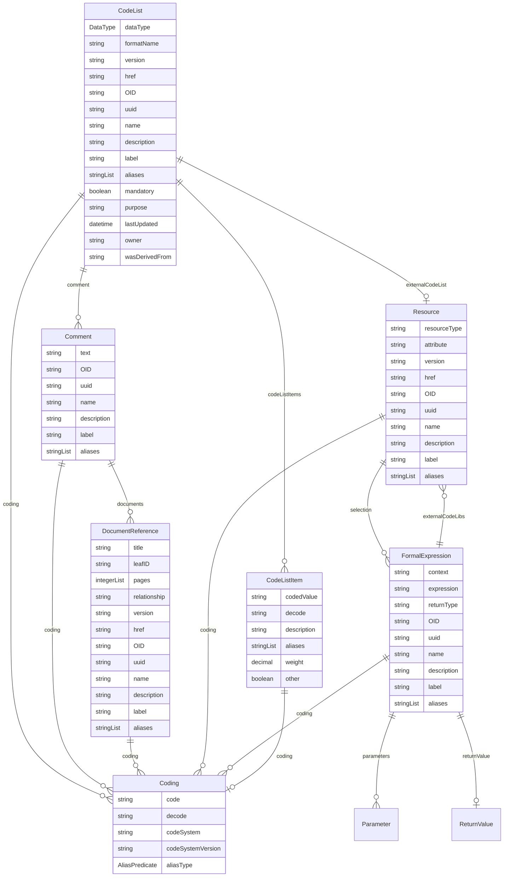

# Class: CodeList 


_A value set that defines a discrete collection of permissible values for an item, corresponding to the ODM CodeList construct_


URI: [odm:class/CodeList](https://cdisc.org/odm2/class/CodeList)





## Inheritance
* [GovernedElement](../classes/GovernedElement.md) [ [Identifiable](../classes/Identifiable.md) [Labelled](../classes/Labelled.md) [Governed](../classes/Governed.md)]
    * **CodeList** [ [Versioned](../classes/Versioned.md)]


## Slots

| Name | Cardinality and Range | Description | Inheritance |
| ---  | --- | --- | --- |
| [dataType](../slots/dataType.md) | 0..1 <br/> [DataType](../enums/DataType.md) | The data type for the values in the code list | direct |
| [formatName](../slots/formatName.md) | 0..1 <br/> [String](../types/String.md) | Name of a standard format definition | direct |
| [codeListItems](../slots/codeListItems.md) | * <br/> [CodeListItem](../classes/CodeListItem.md) | The individual values that make up this CodeList | direct |
| [externalCodeList](../slots/externalCodeList.md) | 0..1 <br/> [Resource](../classes/Resource.md) | Reference to a code list that is defined externally to this study | direct |
| [version](../slots/version.md) | 0..1 <br/> [String](../types/String.md) | The version of the external resources | [Versioned](../classes/Versioned.md) |
| [href](../slots/href.md) | 0..1 <br/> [String](../types/String.md) | Machine-readable instructions to obtain the resource e | [Versioned](../classes/Versioned.md) |
| [OID](../slots/OID.md) | 1 <br/> [String](../types/String.md) | Local identifier within this study/context | [Identifiable](../classes/Identifiable.md) |
| [uuid](../slots/uuid.md) | 0..1 <br/> [String](../types/String.md) | Universal unique identifier | [Identifiable](../classes/Identifiable.md) |
| [name](../slots/name.md) | 0..1 <br/> [String](../types/String.md) | Short name or identifier, used for field names | [Labelled](../classes/Labelled.md) |
| [description](../slots/description.md) | 0..1 <br/> [String](../types/String.md)&nbsp;or&nbsp;<br />[String](../types/String.md)&nbsp;or&nbsp;<br />[TranslatedText](../classes/TranslatedText.md) | Detailed description, shown in tooltips | [Labelled](../classes/Labelled.md) |
| [coding](../slots/coding.md) | * <br/> [Coding](../classes/Coding.md) | Semantic tags for this element | [Labelled](../classes/Labelled.md) |
| [label](../slots/label.md) | 0..1 <br/> [String](../types/String.md)&nbsp;or&nbsp;<br />[String](../types/String.md)&nbsp;or&nbsp;<br />[TranslatedText](../classes/TranslatedText.md) | Human-readable label, shown in UIs | [Labelled](../classes/Labelled.md) |
| [aliases](../slots/aliases.md) | * <br/> [String](../types/String.md)&nbsp;or&nbsp;<br />[String](../types/String.md)&nbsp;or&nbsp;<br />[TranslatedText](../classes/TranslatedText.md) | Alternative name or identifier | [Labelled](../classes/Labelled.md) |
| [mandatory](../slots/mandatory.md) | 0..1 <br/> [Boolean](../types/Boolean.md) | Is this element required? | [Governed](../classes/Governed.md) |
| [comment](../slots/comment.md) | * <br/> [Comment](../classes/Comment.md) | Comment on the element, such as a rationale for its inclusion or exclusion | [Governed](../classes/Governed.md) |
| [purpose](../slots/purpose.md) | 0..1 <br/> [String](../types/String.md)&nbsp;or&nbsp;<br />[String](../types/String.md)&nbsp;or&nbsp;<br />[TranslatedText](../classes/TranslatedText.md) | Purpose or rationale for this data element | [Governed](../classes/Governed.md) |
| [lastUpdated](../slots/lastUpdated.md) | 0..1 <br/> [Datetime](../types/Datetime.md) | When the resource was last updated | [Governed](../classes/Governed.md) |
| [owner](../slots/owner.md) | 0..1 <br/> [String](../types/String.md)&nbsp;or&nbsp;<br />[User](../classes/User.md)&nbsp;or&nbsp;<br />[Organization](../classes/Organization.md)&nbsp;or&nbsp;<br />[String](../types/String.md) | Party responsible for this element | [Governed](../classes/Governed.md) |
| [wasDerivedFrom](../slots/wasDerivedFrom.md) | 0..1 <br/> [String](../types/String.md)&nbsp;or&nbsp;<br />[Item](../classes/Item.md)&nbsp;or&nbsp;<br />[ItemGroup](../classes/ItemGroup.md)&nbsp;or&nbsp;<br />[MetaDataVersion](../classes/MetaDataVersion.md)&nbsp;or&nbsp;<br />[CodeList](../classes/CodeList.md)&nbsp;or&nbsp;<br />[ReifiedConcept](../classes/ReifiedConcept.md)&nbsp;or&nbsp;<br />[ConceptProperty](../classes/ConceptProperty.md)&nbsp;or&nbsp;<br />[Condition](../classes/Condition.md)&nbsp;or&nbsp;<br />[Method](../classes/Method.md)&nbsp;or&nbsp;<br />[NominalOccurrence](../classes/NominalOccurrence.md)&nbsp;or&nbsp;<br />[Dataflow](../classes/Dataflow.md)&nbsp;or&nbsp;<br />[CubeComponent](../classes/CubeComponent.md)&nbsp;or&nbsp;<br />[DataProduct](../classes/DataProduct.md)&nbsp;or&nbsp;<br />[ProvisionAgreement](../classes/ProvisionAgreement.md) | Reference to another item that this item implements or extends, e | [Governed](../classes/Governed.md) |


## Usages

| used by | used in | type | used |
| ---  | --- | --- | --- |
| [GovernedElement](../classes/GovernedElement.md) | [wasDerivedFrom](../slots/wasDerivedFrom.md) | any_of[range] | [CodeList](../classes/CodeList.md) |
| [Governed](../classes/Governed.md) | [wasDerivedFrom](../slots/wasDerivedFrom.md) | any_of[range] | [CodeList](../classes/CodeList.md) |
| [IsODMItem](../classes/IsODMItem.md) | [roleCodeList](../slots/roleCodeList.md) | range | [CodeList](../classes/CodeList.md) |
| [MetaDataVersion](../classes/MetaDataVersion.md) | [codeLists](../slots/codeLists.md) | range | [CodeList](../classes/CodeList.md) |
| [MetaDataVersion](../classes/MetaDataVersion.md) | [wasDerivedFrom](../slots/wasDerivedFrom.md) | any_of[range] | [CodeList](../classes/CodeList.md) |
| [Item](../classes/Item.md) | [codeList](../slots/codeList.md) | range | [CodeList](../classes/CodeList.md) |
| [Item](../classes/Item.md) | [roleCodeList](../slots/roleCodeList.md) | range | [CodeList](../classes/CodeList.md) |
| [Item](../classes/Item.md) | [wasDerivedFrom](../slots/wasDerivedFrom.md) | any_of[range] | [CodeList](../classes/CodeList.md) |
| [ItemGroup](../classes/ItemGroup.md) | [wasDerivedFrom](../slots/wasDerivedFrom.md) | any_of[range] | [CodeList](../classes/CodeList.md) |
| [CodeList](../classes/CodeList.md) | [wasDerivedFrom](../slots/wasDerivedFrom.md) | any_of[range] | [CodeList](../classes/CodeList.md) |
| [ReifiedConcept](../classes/ReifiedConcept.md) | [wasDerivedFrom](../slots/wasDerivedFrom.md) | any_of[range] | [CodeList](../classes/CodeList.md) |
| [ConceptProperty](../classes/ConceptProperty.md) | [codeList](../slots/codeList.md) | range | [CodeList](../classes/CodeList.md) |
| [ConceptProperty](../classes/ConceptProperty.md) | [wasDerivedFrom](../slots/wasDerivedFrom.md) | any_of[range] | [CodeList](../classes/CodeList.md) |
| [Condition](../classes/Condition.md) | [wasDerivedFrom](../slots/wasDerivedFrom.md) | any_of[range] | [CodeList](../classes/CodeList.md) |
| [Method](../classes/Method.md) | [wasDerivedFrom](../slots/wasDerivedFrom.md) | any_of[range] | [CodeList](../classes/CodeList.md) |
| [Parameter](../classes/Parameter.md) | [codeList](../slots/codeList.md) | range | [CodeList](../classes/CodeList.md) |
| [NominalOccurrence](../classes/NominalOccurrence.md) | [wasDerivedFrom](../slots/wasDerivedFrom.md) | any_of[range] | [CodeList](../classes/CodeList.md) |
| [DataStructureDefinition](../classes/DataStructureDefinition.md) | [wasDerivedFrom](../slots/wasDerivedFrom.md) | any_of[range] | [CodeList](../classes/CodeList.md) |
| [Dataflow](../classes/Dataflow.md) | [wasDerivedFrom](../slots/wasDerivedFrom.md) | any_of[range] | [CodeList](../classes/CodeList.md) |
| [CubeComponent](../classes/CubeComponent.md) | [wasDerivedFrom](../slots/wasDerivedFrom.md) | any_of[range] | [CodeList](../classes/CodeList.md) |
| [Measure](../classes/Measure.md) | [wasDerivedFrom](../slots/wasDerivedFrom.md) | any_of[range] | [CodeList](../classes/CodeList.md) |
| [Dimension](../classes/Dimension.md) | [wasDerivedFrom](../slots/wasDerivedFrom.md) | any_of[range] | [CodeList](../classes/CodeList.md) |
| [DataAttribute](../classes/DataAttribute.md) | [wasDerivedFrom](../slots/wasDerivedFrom.md) | any_of[range] | [CodeList](../classes/CodeList.md) |
| [DataProduct](../classes/DataProduct.md) | [wasDerivedFrom](../slots/wasDerivedFrom.md) | any_of[range] | [CodeList](../classes/CodeList.md) |
| [ProvisionAgreement](../classes/ProvisionAgreement.md) | [wasDerivedFrom](../slots/wasDerivedFrom.md) | any_of[range] | [CodeList](../classes/CodeList.md) |


## Identifier and Mapping Information


### Schema Source


* from schema: https://cdisc.org/define-json


## Mappings

| Mapping Type | Mapped Value |
| ---  | ---  |
| self | odm:CodeList |
| native | odm:CodeList |
| exact | odm:CodeList, omop:Vocabulary, fhir:ValueSet |
| narrow | sdmx:Codelist, sdmx:ValueList, sdmx:ConceptScheme |
| related | usdm:BiomedicalConceptProperty/responseCodes |
| close | skos:Collection, sdmx:ItemScheme, qb:codeList |


## LinkML Source

<!-- TODO: investigate https://stackoverflow.com/questions/37606292/how-to-create-tabbed-code-blocks-in-mkdocs-or-sphinx -->

### Direct

<details>
```yaml
name: CodeList
description: A value set that defines a discrete collection of permissible values
  for an item, corresponding to the ODM CodeList construct
from_schema: https://cdisc.org/define-json
exact_mappings:
- odm:CodeList
- omop:Vocabulary
- fhir:ValueSet
close_mappings:
- skos:Collection
- sdmx:ItemScheme
- qb:codeList
related_mappings:
- usdm:BiomedicalConceptProperty/responseCodes
narrow_mappings:
- sdmx:Codelist
- sdmx:ValueList
- sdmx:ConceptScheme
is_a: GovernedElement
mixins:
- Versioned
attributes:
  dataType:
    name: dataType
    description: The data type for the values in the code list
    from_schema: https://cdisc.org/define-json
    domain_of:
    - Item
    - CodeList
    - Parameter
    - ReturnValue
    range: DataType
  formatName:
    name: formatName
    description: Name of a standard format definition
    from_schema: https://cdisc.org/define-json
    rank: 1000
    domain_of:
    - CodeList
    range: string
  codeListItems:
    name: codeListItems
    description: The individual values that make up this CodeList. The type of CodeListItem
      included determines its behaviour
    from_schema: https://cdisc.org/define-json
    rank: 1000
    domain_of:
    - CodeList
    range: CodeListItem
    multivalued: true
    inlined: true
    inlined_as_list: true
  externalCodeList:
    name: externalCodeList
    description: Reference to a code list that is defined externally to this study
    from_schema: https://cdisc.org/define-json
    rank: 1000
    domain_of:
    - CodeList
    range: Resource

```
</details>

### Induced

<details>
```yaml
name: CodeList
description: A value set that defines a discrete collection of permissible values
  for an item, corresponding to the ODM CodeList construct
from_schema: https://cdisc.org/define-json
exact_mappings:
- odm:CodeList
- omop:Vocabulary
- fhir:ValueSet
close_mappings:
- skos:Collection
- sdmx:ItemScheme
- qb:codeList
related_mappings:
- usdm:BiomedicalConceptProperty/responseCodes
narrow_mappings:
- sdmx:Codelist
- sdmx:ValueList
- sdmx:ConceptScheme
is_a: GovernedElement
mixins:
- Versioned
attributes:
  dataType:
    name: dataType
    description: The data type for the values in the code list
    from_schema: https://cdisc.org/define-json
    alias: dataType
    owner: CodeList
    domain_of:
    - Item
    - CodeList
    - Parameter
    - ReturnValue
    range: DataType
  formatName:
    name: formatName
    description: Name of a standard format definition
    from_schema: https://cdisc.org/define-json
    rank: 1000
    alias: formatName
    owner: CodeList
    domain_of:
    - CodeList
    range: string
  codeListItems:
    name: codeListItems
    description: The individual values that make up this CodeList. The type of CodeListItem
      included determines its behaviour
    from_schema: https://cdisc.org/define-json
    rank: 1000
    alias: codeListItems
    owner: CodeList
    domain_of:
    - CodeList
    range: CodeListItem
    multivalued: true
    inlined: true
    inlined_as_list: true
  externalCodeList:
    name: externalCodeList
    description: Reference to a code list that is defined externally to this study
    from_schema: https://cdisc.org/define-json
    rank: 1000
    alias: externalCodeList
    owner: CodeList
    domain_of:
    - CodeList
    range: Resource
  version:
    name: version
    description: The version of the external resources
    from_schema: https://cdisc.org/define-json
    rank: 1000
    alias: version
    owner: CodeList
    domain_of:
    - Versioned
    - Standard
    range: string
  href:
    name: href
    description: Machine-readable instructions to obtain the resource e.g. FHIR path,
      URL
    from_schema: https://cdisc.org/define-json
    rank: 1000
    alias: href
    owner: CodeList
    domain_of:
    - Versioned
    range: string
    required: false
  OID:
    name: OID
    description: Local identifier within this study/context. Use CDISC OID format
      for regulatory submissions, or simple strings for internal use.
    from_schema: https://cdisc.org/define-json
    rank: 1000
    identifier: true
    alias: OID
    owner: CodeList
    domain_of:
    - Identifiable
    range: string
    required: true
    pattern: ^[A-Za-z][A-Za-z0-9._-]*$
  uuid:
    name: uuid
    description: Universal unique identifier
    from_schema: https://cdisc.org/define-json
    rank: 1000
    alias: uuid
    owner: CodeList
    domain_of:
    - Identifiable
    range: string
  name:
    name: name
    description: Short name or identifier, used for field names
    from_schema: https://cdisc.org/define-json
    rank: 1000
    alias: name
    owner: CodeList
    domain_of:
    - Labelled
    - Standard
    range: string
  description:
    name: description
    description: Detailed description, shown in tooltips
    from_schema: https://cdisc.org/define-json
    rank: 1000
    alias: description
    owner: CodeList
    domain_of:
    - Labelled
    - CodeListItem
    range: string
    any_of:
    - range: string
    - range: TranslatedText
  coding:
    name: coding
    description: Semantic tags for this element
    from_schema: https://cdisc.org/define-json
    rank: 1000
    alias: coding
    owner: CodeList
    domain_of:
    - Labelled
    - CodeListItem
    - SourceItem
    range: Coding
    multivalued: true
    inlined: true
    inlined_as_list: true
  label:
    name: label
    description: Human-readable label, shown in UIs
    from_schema: https://cdisc.org/define-json
    exact_mappings:
    - skos:prefLabel
    rank: 1000
    alias: label
    owner: CodeList
    domain_of:
    - Labelled
    range: string
    any_of:
    - range: string
    - range: TranslatedText
  aliases:
    name: aliases
    description: Alternative name or identifier
    from_schema: https://cdisc.org/define-json
    exact_mappings:
    - skos:altLabel
    rank: 1000
    alias: aliases
    owner: CodeList
    domain_of:
    - Labelled
    - CodeListItem
    range: string
    multivalued: true
    inlined: true
    inlined_as_list: true
    any_of:
    - range: string
    - range: TranslatedText
  mandatory:
    name: mandatory
    description: Is this element required?
    from_schema: https://cdisc.org/define-json
    rank: 1000
    alias: mandatory
    owner: CodeList
    domain_of:
    - Governed
    range: boolean
  comment:
    name: comment
    description: Comment on the element, such as a rationale for its inclusion or
      exclusion
    from_schema: https://cdisc.org/define-json
    rank: 1000
    alias: comment
    owner: CodeList
    domain_of:
    - Governed
    - Standard
    range: Comment
    multivalued: true
  purpose:
    name: purpose
    description: Purpose or rationale for this data element
    from_schema: https://cdisc.org/define-json
    rank: 1000
    alias: purpose
    owner: CodeList
    domain_of:
    - Governed
    range: string
    any_of:
    - range: string
    - range: TranslatedText
  lastUpdated:
    name: lastUpdated
    description: When the resource was last updated
    from_schema: https://cdisc.org/define-json
    rank: 1000
    alias: lastUpdated
    owner: CodeList
    domain_of:
    - Governed
    range: datetime
  owner:
    name: owner
    description: Party responsible for this element
    from_schema: https://cdisc.org/define-json
    narrow_mappings:
    - prov:wasAttributedTo
    - prov:wasAssociatedBy
    rank: 1000
    alias: owner
    owner: CodeList
    domain_of:
    - Governed
    range: string
    any_of:
    - range: User
    - range: Organization
    - range: string
  wasDerivedFrom:
    name: wasDerivedFrom
    description: Reference to another item that this item implements or extends, e.g.
      a template Item definition.
    from_schema: https://cdisc.org/define-json
    exact_mappings:
    - prov:wasDerivedFrom
    rank: 1000
    alias: wasDerivedFrom
    owner: CodeList
    domain_of:
    - Governed
    range: string
    any_of:
    - range: Item
    - range: ItemGroup
    - range: MetaDataVersion
    - range: CodeList
    - range: ReifiedConcept
    - range: ConceptProperty
    - range: Condition
    - range: Method
    - range: NominalOccurrence
    - range: Dataflow
    - range: CubeComponent
    - range: DataProduct
    - range: ProvisionAgreement

```
</details>