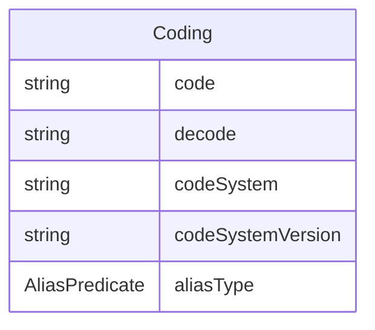

# Class: Coding 


_A semantic reference that provides standardized codes and their meanings from controlled vocabularies_


URI: [odm:class/Coding](https://cdisc.org/odm2/class/Coding)





<!-- no inheritance hierarchy -->


## Slots

| Name | Cardinality and Range | Description | Inheritance |
| ---  | --- | --- | --- |
| [code](../slots/code.md) | 1 <br/> [String](../types/String.md) | The code value | direct |
| [decode](../slots/decode.md) | 0..1 <br/> [String](../types/String.md)&nbsp;or&nbsp;<br />[String](../types/String.md)&nbsp;or&nbsp;<br />[TranslatedText](../classes/TranslatedText.md) | Human-readable meaning | direct |
| [codeSystem](../slots/codeSystem.md) | 1 <br/> [String](../types/String.md) | The code system identifier | direct |
| [codeSystemVersion](../slots/codeSystemVersion.md) | 0..1 <br/> [String](../types/String.md) | The code system version | direct |
| [aliasType](../slots/aliasType.md) | 0..1 <br/> [AliasPredicate](../enums/AliasPredicate.md) | How this coding is related in the context of its parent element | direct |


## Usages

| used by | used in | type | used |
| ---  | --- | --- | --- |
| [IdentifiableElement](../classes/IdentifiableElement.md) | [coding](../slots/coding.md) | range | [Coding](../classes/Coding.md) |
| [GovernedElement](../classes/GovernedElement.md) | [coding](../slots/coding.md) | range | [Coding](../classes/Coding.md) |
| [Labelled](../classes/Labelled.md) | [coding](../slots/coding.md) | range | [Coding](../classes/Coding.md) |
| [IsProfile](../classes/IsProfile.md) | [security](../slots/security.md) | range | [Coding](../classes/Coding.md) |
| [MetaDataVersion](../classes/MetaDataVersion.md) | [codings](../slots/codings.md) | range | [Coding](../classes/Coding.md) |
| [MetaDataVersion](../classes/MetaDataVersion.md) | [coding](../slots/coding.md) | range | [Coding](../classes/Coding.md) |
| [Item](../classes/Item.md) | [coding](../slots/coding.md) | range | [Coding](../classes/Coding.md) |
| [ItemGroup](../classes/ItemGroup.md) | [security](../slots/security.md) | range | [Coding](../classes/Coding.md) |
| [ItemGroup](../classes/ItemGroup.md) | [coding](../slots/coding.md) | range | [Coding](../classes/Coding.md) |
| [Relationship](../classes/Relationship.md) | [coding](../slots/coding.md) | range | [Coding](../classes/Coding.md) |
| [CodeList](../classes/CodeList.md) | [coding](../slots/coding.md) | range | [Coding](../classes/Coding.md) |
| [CodeListItem](../classes/CodeListItem.md) | [coding](../slots/coding.md) | range | [Coding](../classes/Coding.md) |
| [Comment](../classes/Comment.md) | [coding](../slots/coding.md) | range | [Coding](../classes/Coding.md) |
| [Dictionary](../classes/Dictionary.md) | [terms](../slots/terms.md) | range | [Coding](../classes/Coding.md) |
| [Dictionary](../classes/Dictionary.md) | [coding](../slots/coding.md) | range | [Coding](../classes/Coding.md) |
| [ReifiedConcept](../classes/ReifiedConcept.md) | [coding](../slots/coding.md) | range | [Coding](../classes/Coding.md) |
| [ConceptProperty](../classes/ConceptProperty.md) | [coding](../slots/coding.md) | range | [Coding](../classes/Coding.md) |
| [WhereClause](../classes/WhereClause.md) | [coding](../slots/coding.md) | range | [Coding](../classes/Coding.md) |
| [Condition](../classes/Condition.md) | [coding](../slots/coding.md) | range | [Coding](../classes/Coding.md) |
| [FormalExpression](../classes/FormalExpression.md) | [coding](../slots/coding.md) | range | [Coding](../classes/Coding.md) |
| [Method](../classes/Method.md) | [coding](../slots/coding.md) | range | [Coding](../classes/Coding.md) |
| [SourceItem](../classes/SourceItem.md) | [coding](../slots/coding.md) | range | [Coding](../classes/Coding.md) |
| [Parameter](../classes/Parameter.md) | [coding](../slots/coding.md) | range | [Coding](../classes/Coding.md) |
| [ReturnValue](../classes/ReturnValue.md) | [coding](../slots/coding.md) | range | [Coding](../classes/Coding.md) |
| [SiteOrSponsorComment](../classes/SiteOrSponsorComment.md) | [coding](../slots/coding.md) | range | [Coding](../classes/Coding.md) |
| [User](../classes/User.md) | [coding](../slots/coding.md) | range | [Coding](../classes/Coding.md) |
| [Organization](../classes/Organization.md) | [coding](../slots/coding.md) | range | [Coding](../classes/Coding.md) |
| [Standard](../classes/Standard.md) | [coding](../slots/coding.md) | range | [Coding](../classes/Coding.md) |
| [Resource](../classes/Resource.md) | [coding](../slots/coding.md) | range | [Coding](../classes/Coding.md) |
| [DocumentReference](../classes/DocumentReference.md) | [coding](../slots/coding.md) | range | [Coding](../classes/Coding.md) |
| [Timing](../classes/Timing.md) | [coding](../slots/coding.md) | range | [Coding](../classes/Coding.md) |
| [NominalOccurrence](../classes/NominalOccurrence.md) | [coding](../slots/coding.md) | range | [Coding](../classes/Coding.md) |
| [DataStructureDefinition](../classes/DataStructureDefinition.md) | [security](../slots/security.md) | range | [Coding](../classes/Coding.md) |
| [DataStructureDefinition](../classes/DataStructureDefinition.md) | [coding](../slots/coding.md) | range | [Coding](../classes/Coding.md) |
| [Dataflow](../classes/Dataflow.md) | [coding](../slots/coding.md) | range | [Coding](../classes/Coding.md) |
| [Dataset](../classes/Dataset.md) | [security](../slots/security.md) | range | [Coding](../classes/Coding.md) |
| [Dataset](../classes/Dataset.md) | [coding](../slots/coding.md) | range | [Coding](../classes/Coding.md) |
| [CubeComponent](../classes/CubeComponent.md) | [coding](../slots/coding.md) | range | [Coding](../classes/Coding.md) |
| [Measure](../classes/Measure.md) | [coding](../slots/coding.md) | range | [Coding](../classes/Coding.md) |
| [Dimension](../classes/Dimension.md) | [coding](../slots/coding.md) | range | [Coding](../classes/Coding.md) |
| [DataAttribute](../classes/DataAttribute.md) | [coding](../slots/coding.md) | range | [Coding](../classes/Coding.md) |
| [ComponentList](../classes/ComponentList.md) | [coding](../slots/coding.md) | range | [Coding](../classes/Coding.md) |
| [DataProduct](../classes/DataProduct.md) | [coding](../slots/coding.md) | range | [Coding](../classes/Coding.md) |
| [DataService](../classes/DataService.md) | [coding](../slots/coding.md) | range | [Coding](../classes/Coding.md) |
| [DataProvider](../classes/DataProvider.md) | [coding](../slots/coding.md) | range | [Coding](../classes/Coding.md) |
| [ProvisionAgreement](../classes/ProvisionAgreement.md) | [coding](../slots/coding.md) | range | [Coding](../classes/Coding.md) |
| [Analysis](../classes/Analysis.md) | [coding](../slots/coding.md) | range | [Coding](../classes/Coding.md) |
| [Display](../classes/Display.md) | [coding](../slots/coding.md) | range | [Coding](../classes/Coding.md) |


## Identifier and Mapping Information


### Schema Source


* from schema: https://cdisc.org/define-json


## Mappings

| Mapping Type | Mapped Value |
| ---  | ---  |
| self | odm:Coding |
| native | odm:Coding |
| exact | odm:Coding, usdm:Code, fhir:Coding |
| close | omop:Concept, skos:Concept, skos:Label, sdmx:Code, sdmx:Concept, sdmx:ISOConceptReference |


## LinkML Source

<!-- TODO: investigate https://stackoverflow.com/questions/37606292/how-to-create-tabbed-code-blocks-in-mkdocs-or-sphinx -->

### Direct

<details>
```yaml
name: Coding
description: A semantic reference that provides standardized codes and their meanings
  from controlled vocabularies
from_schema: https://cdisc.org/define-json
exact_mappings:
- odm:Coding
- usdm:Code
- fhir:Coding
close_mappings:
- omop:Concept
- skos:Concept
- skos:Label
- sdmx:Code
- sdmx:Concept
- sdmx:ISOConceptReference
attributes:
  code:
    name: code
    description: The code value
    from_schema: https://cdisc.org/define-json
    rank: 1000
    domain_of:
    - Coding
    range: string
    required: true
  decode:
    name: decode
    description: Human-readable meaning
    from_schema: https://cdisc.org/define-json
    exact_mappings:
    - skos:prefLabel
    domain_of:
    - CodeListItem
    - Coding
    any_of:
    - range: string
    - range: TranslatedText
  codeSystem:
    name: codeSystem
    description: The code system identifier
    from_schema: https://cdisc.org/define-json
    rank: 1000
    domain_of:
    - Coding
    range: string
    required: true
  codeSystemVersion:
    name: codeSystemVersion
    description: The code system version
    from_schema: https://cdisc.org/define-json
    rank: 1000
    domain_of:
    - Coding
    range: string
  aliasType:
    name: aliasType
    description: How this coding is related in the context of its parent element
    from_schema: https://cdisc.org/define-json
    rank: 1000
    domain_of:
    - Coding
    range: AliasPredicate

```
</details>

### Induced

<details>
```yaml
name: Coding
description: A semantic reference that provides standardized codes and their meanings
  from controlled vocabularies
from_schema: https://cdisc.org/define-json
exact_mappings:
- odm:Coding
- usdm:Code
- fhir:Coding
close_mappings:
- omop:Concept
- skos:Concept
- skos:Label
- sdmx:Code
- sdmx:Concept
- sdmx:ISOConceptReference
attributes:
  code:
    name: code
    description: The code value
    from_schema: https://cdisc.org/define-json
    rank: 1000
    alias: code
    owner: Coding
    domain_of:
    - Coding
    range: string
    required: true
  decode:
    name: decode
    description: Human-readable meaning
    from_schema: https://cdisc.org/define-json
    exact_mappings:
    - skos:prefLabel
    alias: decode
    owner: Coding
    domain_of:
    - CodeListItem
    - Coding
    any_of:
    - range: string
    - range: TranslatedText
  codeSystem:
    name: codeSystem
    description: The code system identifier
    from_schema: https://cdisc.org/define-json
    rank: 1000
    alias: codeSystem
    owner: Coding
    domain_of:
    - Coding
    range: string
    required: true
  codeSystemVersion:
    name: codeSystemVersion
    description: The code system version
    from_schema: https://cdisc.org/define-json
    rank: 1000
    alias: codeSystemVersion
    owner: Coding
    domain_of:
    - Coding
    range: string
  aliasType:
    name: aliasType
    description: How this coding is related in the context of its parent element
    from_schema: https://cdisc.org/define-json
    rank: 1000
    alias: aliasType
    owner: Coding
    domain_of:
    - Coding
    range: AliasPredicate

```
</details>