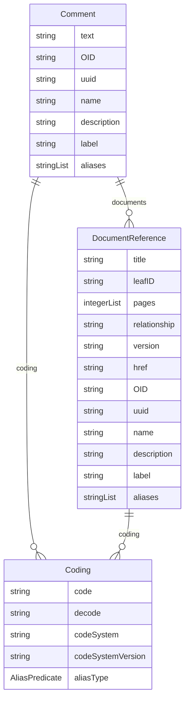

# Class: Comment 


_A descriptive element that contains explanatory text provided by a data or metadata handler_


URI: [odm:class/Comment](https://cdisc.org/odm2/class/Comment)





## Inheritance
* [IdentifiableElement](../classes/IdentifiableElement.md) [ [Identifiable](../classes/Identifiable.md) [Labelled](../classes/Labelled.md)]
    * **Comment**


## Slots

| Name | Cardinality and Range | Description | Inheritance |
| ---  | --- | --- | --- |
| [text](../slots/text.md) | 1 <br/> [String](../types/String.md)&nbsp;or&nbsp;<br />[String](../types/String.md)&nbsp;or&nbsp;<br />[TranslatedText](../classes/TranslatedText.md) | The comment text | direct |
| [documents](../slots/documents.md) | * <br/> [DocumentReference](../classes/DocumentReference.md) | References to documents that contain or are referenced by this comment | direct |
| [OID](../slots/OID.md) | 1 <br/> [String](../types/String.md) | Local identifier within this study/context | [Identifiable](../classes/Identifiable.md) |
| [uuid](../slots/uuid.md) | 0..1 <br/> [String](../types/String.md) | Universal unique identifier | [Identifiable](../classes/Identifiable.md) |
| [name](../slots/name.md) | 0..1 <br/> [String](../types/String.md) | Short name or identifier, used for field names | [Labelled](../classes/Labelled.md) |
| [description](../slots/description.md) | 0..1 <br/> [String](../types/String.md)&nbsp;or&nbsp;<br />[String](../types/String.md)&nbsp;or&nbsp;<br />[TranslatedText](../classes/TranslatedText.md) | Detailed description, shown in tooltips | [Labelled](../classes/Labelled.md) |
| [coding](../slots/coding.md) | * <br/> [Coding](../classes/Coding.md) | Semantic tags for this element | [Labelled](../classes/Labelled.md) |
| [label](../slots/label.md) | 0..1 <br/> [String](../types/String.md)&nbsp;or&nbsp;<br />[String](../types/String.md)&nbsp;or&nbsp;<br />[TranslatedText](../classes/TranslatedText.md) | Human-readable label, shown in UIs | [Labelled](../classes/Labelled.md) |
| [aliases](../slots/aliases.md) | * <br/> [String](../types/String.md)&nbsp;or&nbsp;<br />[String](../types/String.md)&nbsp;or&nbsp;<br />[TranslatedText](../classes/TranslatedText.md) | Alternative name or identifier | [Labelled](../classes/Labelled.md) |


## Usages

| used by | used in | type | used |
| ---  | --- | --- | --- |
| [GovernedElement](../classes/GovernedElement.md) | [comment](../slots/comment.md) | range | [Comment](../classes/Comment.md) |
| [Governed](../classes/Governed.md) | [comment](../slots/comment.md) | range | [Comment](../classes/Comment.md) |
| [MetaDataVersion](../classes/MetaDataVersion.md) | [comment](../slots/comment.md) | range | [Comment](../classes/Comment.md) |
| [Item](../classes/Item.md) | [comment](../slots/comment.md) | range | [Comment](../classes/Comment.md) |
| [ItemGroup](../classes/ItemGroup.md) | [comment](../slots/comment.md) | range | [Comment](../classes/Comment.md) |
| [CodeList](../classes/CodeList.md) | [comment](../slots/comment.md) | range | [Comment](../classes/Comment.md) |
| [ReifiedConcept](../classes/ReifiedConcept.md) | [comment](../slots/comment.md) | range | [Comment](../classes/Comment.md) |
| [ConceptProperty](../classes/ConceptProperty.md) | [comment](../slots/comment.md) | range | [Comment](../classes/Comment.md) |
| [Condition](../classes/Condition.md) | [comment](../slots/comment.md) | range | [Comment](../classes/Comment.md) |
| [Method](../classes/Method.md) | [comment](../slots/comment.md) | range | [Comment](../classes/Comment.md) |
| [Standard](../classes/Standard.md) | [comment](../slots/comment.md) | range | [Comment](../classes/Comment.md) |
| [NominalOccurrence](../classes/NominalOccurrence.md) | [comment](../slots/comment.md) | range | [Comment](../classes/Comment.md) |
| [DataStructureDefinition](../classes/DataStructureDefinition.md) | [comment](../slots/comment.md) | range | [Comment](../classes/Comment.md) |
| [Dataflow](../classes/Dataflow.md) | [comment](../slots/comment.md) | range | [Comment](../classes/Comment.md) |
| [CubeComponent](../classes/CubeComponent.md) | [comment](../slots/comment.md) | range | [Comment](../classes/Comment.md) |
| [Measure](../classes/Measure.md) | [comment](../slots/comment.md) | range | [Comment](../classes/Comment.md) |
| [Dimension](../classes/Dimension.md) | [comment](../slots/comment.md) | range | [Comment](../classes/Comment.md) |
| [DataAttribute](../classes/DataAttribute.md) | [comment](../slots/comment.md) | range | [Comment](../classes/Comment.md) |
| [DataProduct](../classes/DataProduct.md) | [comment](../slots/comment.md) | range | [Comment](../classes/Comment.md) |
| [ProvisionAgreement](../classes/ProvisionAgreement.md) | [comment](../slots/comment.md) | range | [Comment](../classes/Comment.md) |


## Identifier and Mapping Information


### Schema Source


* from schema: https://cdisc.org/define-json


## Mappings

| Mapping Type | Mapped Value |
| ---  | ---  |
| self | odm:Comment |
| native | odm:Comment |
| exact | odm:CommentDef, usdm:CommentAnnotation, fhir:Annotation, sdmx:Annotation |


## LinkML Source

<!-- TODO: investigate https://stackoverflow.com/questions/37606292/how-to-create-tabbed-code-blocks-in-mkdocs-or-sphinx -->

### Direct

<details>
```yaml
name: Comment
description: A descriptive element that contains explanatory text provided by a data
  or metadata handler
from_schema: https://cdisc.org/define-json
exact_mappings:
- odm:CommentDef
- usdm:CommentAnnotation
- fhir:Annotation
- sdmx:Annotation
is_a: IdentifiableElement
attributes:
  text:
    name: text
    description: The comment text.
    from_schema: https://cdisc.org/define-json
    rank: 1000
    domain_of:
    - Comment
    - SiteOrSponsorComment
    required: true
    any_of:
    - range: string
    - range: TranslatedText
  documents:
    name: documents
    description: References to documents that contain or are referenced by this comment
    from_schema: https://cdisc.org/define-json
    rank: 1000
    domain_of:
    - Comment
    range: DocumentReference
    multivalued: true

```
</details>

### Induced

<details>
```yaml
name: Comment
description: A descriptive element that contains explanatory text provided by a data
  or metadata handler
from_schema: https://cdisc.org/define-json
exact_mappings:
- odm:CommentDef
- usdm:CommentAnnotation
- fhir:Annotation
- sdmx:Annotation
is_a: IdentifiableElement
attributes:
  text:
    name: text
    description: The comment text.
    from_schema: https://cdisc.org/define-json
    rank: 1000
    alias: text
    owner: Comment
    domain_of:
    - Comment
    - SiteOrSponsorComment
    required: true
    any_of:
    - range: string
    - range: TranslatedText
  documents:
    name: documents
    description: References to documents that contain or are referenced by this comment
    from_schema: https://cdisc.org/define-json
    rank: 1000
    alias: documents
    owner: Comment
    domain_of:
    - Comment
    range: DocumentReference
    multivalued: true
  OID:
    name: OID
    description: Local identifier within this study/context. Use CDISC OID format
      for regulatory submissions, or simple strings for internal use.
    from_schema: https://cdisc.org/define-json
    rank: 1000
    identifier: true
    alias: OID
    owner: Comment
    domain_of:
    - Identifiable
    range: string
    required: true
    pattern: ^[A-Za-z][A-Za-z0-9._-]*$
  uuid:
    name: uuid
    description: Universal unique identifier
    from_schema: https://cdisc.org/define-json
    rank: 1000
    alias: uuid
    owner: Comment
    domain_of:
    - Identifiable
    range: string
  name:
    name: name
    description: Short name or identifier, used for field names
    from_schema: https://cdisc.org/define-json
    rank: 1000
    alias: name
    owner: Comment
    domain_of:
    - Labelled
    - Standard
    range: string
  description:
    name: description
    description: Detailed description, shown in tooltips
    from_schema: https://cdisc.org/define-json
    rank: 1000
    alias: description
    owner: Comment
    domain_of:
    - Labelled
    - CodeListItem
    range: string
    any_of:
    - range: string
    - range: TranslatedText
  coding:
    name: coding
    description: Semantic tags for this element
    from_schema: https://cdisc.org/define-json
    rank: 1000
    alias: coding
    owner: Comment
    domain_of:
    - Labelled
    - CodeListItem
    - SourceItem
    range: Coding
    multivalued: true
    inlined: true
    inlined_as_list: true
  label:
    name: label
    description: Human-readable label, shown in UIs
    from_schema: https://cdisc.org/define-json
    exact_mappings:
    - skos:prefLabel
    rank: 1000
    alias: label
    owner: Comment
    domain_of:
    - Labelled
    range: string
    any_of:
    - range: string
    - range: TranslatedText
  aliases:
    name: aliases
    description: Alternative name or identifier
    from_schema: https://cdisc.org/define-json
    exact_mappings:
    - skos:altLabel
    rank: 1000
    alias: aliases
    owner: Comment
    domain_of:
    - Labelled
    - CodeListItem
    range: string
    multivalued: true
    inlined: true
    inlined_as_list: true
    any_of:
    - range: string
    - range: TranslatedText

```
</details>