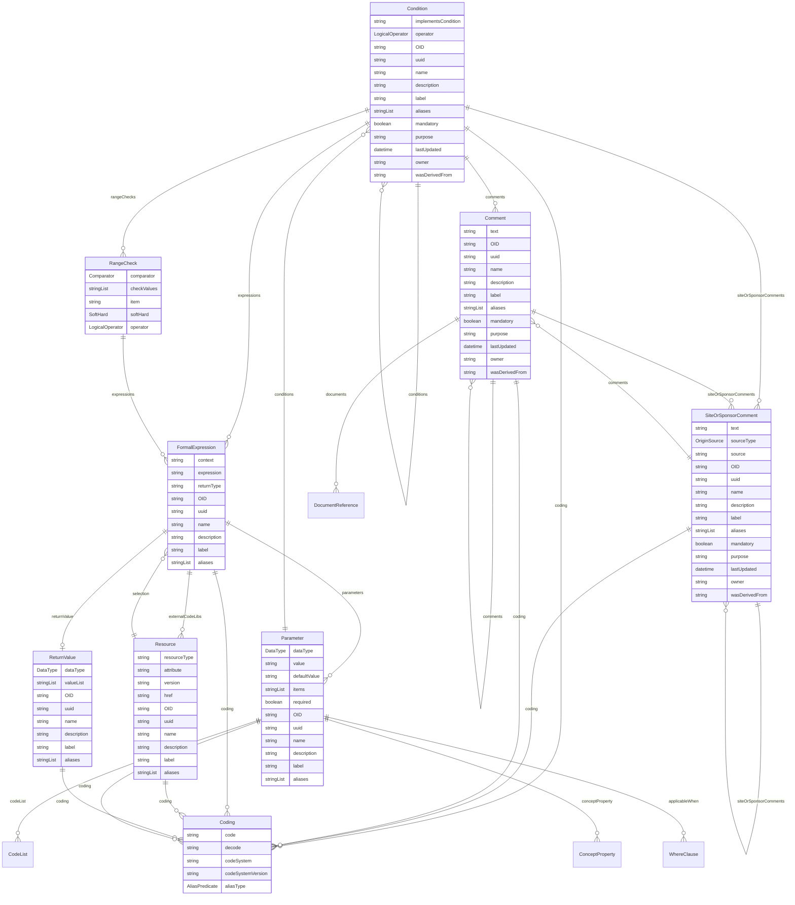

# Class: Condition 


_A reusable, composable, and nestable logical construct allowing for complex expressions. Conditions are most useful when given a meaningful name and linked to Study Definitions._


URI: [odm:class/Condition](https://cdisc.org/odm2/class/Condition)





## Inheritance
* [GovernedElement](../classes/GovernedElement.md) [ [Identifiable](../classes/Identifiable.md) [Labelled](../classes/Labelled.md) [Governed](../classes/Governed.md)]
    * **Condition**


## Slots

| Name | Cardinality and Range | Description | Inheritance |
| ---  | --- | --- | --- |
| [rangeChecks](../slots/rangeChecks.md) | * <br/> [RangeCheck](../classes/RangeCheck.md) | Range checks that compose this condition | direct |
| [implementsCondition](../slots/implementsCondition.md) | 0..1 <br/> [String](../types/String.md) | Reference to a external (e.g. USDM) condition definition that this implements | direct |
| [expressions](../slots/expressions.md) | * <br/> [FormalExpression](../classes/FormalExpression.md) | Logical expression, resolving to a boolean, that implements this condition in a specific context | direct |
| [operator](../slots/operator.md) | 0..1 <br/> [LogicalOperator](../enums/LogicalOperator.md) | Logical operator for combining child conditions or range checks. Defaults to ALL if not specified. | direct |
| [conditions](../slots/conditions.md) | * <br/> [Condition](../classes/Condition.md) | Child conditions to combine using the operator. Multiple conditions are composed according to the operator (AND/OR/NOT). Rearrange and nest to compose XOR, or combinations of AND and OR. Unless the operator is EXPRESSION, in which case the formalExpression is used instead. Use OID references to reuse conditions defined elsewhere. | direct |
| [OID](../slots/OID.md) | 1 <br/> [String](../types/String.md) | Local identifier within this study/context. Use CDISC OID format for regulatory submissions, or simple strings for internal use. | [Identifiable](../classes/Identifiable.md) |
| [uuid](../slots/uuid.md) | 0..1 <br/> [String](../types/String.md) | Universal unique identifier | [Identifiable](../classes/Identifiable.md) |
| [name](../slots/name.md) | 0..1 <br/> [String](../types/String.md) | Short name or identifier, used for field names | [Labelled](../classes/Labelled.md) |
| [description](../slots/description.md) | 0..1 <br/> [String](../types/String.md)&nbsp;or&nbsp;<br />[String](../types/String.md)&nbsp;or&nbsp;<br />[TranslatedText](../classes/TranslatedText.md) | Detailed description, shown in tooltips | [Labelled](../classes/Labelled.md) |
| [coding](../slots/coding.md) | * <br/> [Coding](../classes/Coding.md) | Semantic tags for this element | [Labelled](../classes/Labelled.md) |
| [label](../slots/label.md) | 0..1 <br/> [String](../types/String.md)&nbsp;or&nbsp;<br />[String](../types/String.md)&nbsp;or&nbsp;<br />[TranslatedText](../classes/TranslatedText.md) | Human-readable label, shown in UIs | [Labelled](../classes/Labelled.md) |
| [aliases](../slots/aliases.md) | * <br/> [String](../types/String.md)&nbsp;or&nbsp;<br />[String](../types/String.md)&nbsp;or&nbsp;<br />[TranslatedText](../classes/TranslatedText.md) | Alternative name or identifier | [Labelled](../classes/Labelled.md) |
| [mandatory](../slots/mandatory.md) | 0..1 <br/> [Boolean](../types/Boolean.md) | Is this element required? | [Governed](../classes/Governed.md) |
| [comments](../slots/comments.md) | * <br/> [Comment](../classes/Comment.md) | Comment on the element, such as a rationale for its inclusion or exclusion | [Governed](../classes/Governed.md) |
| [siteOrSponsorComments](../slots/siteOrSponsorComments.md) | * <br/> [SiteOrSponsorComment](../classes/SiteOrSponsorComment.md) | Comment on the element, such as a rationale for its inclusion or exclusion | [Governed](../classes/Governed.md) |
| [purpose](../slots/purpose.md) | 0..1 <br/> [String](../types/String.md)&nbsp;or&nbsp;<br />[String](../types/String.md)&nbsp;or&nbsp;<br />[TranslatedText](../classes/TranslatedText.md) | Purpose or rationale for this data element | [Governed](../classes/Governed.md) |
| [lastUpdated](../slots/lastUpdated.md) | 1 <br/> [Datetime](../types/Datetime.md) | When the resource was last updated | [Governed](../classes/Governed.md) |
| [owner](../slots/owner.md) | 0..1 <br/> [String](../types/String.md)&nbsp;or&nbsp;<br />[User](../classes/User.md)&nbsp;or&nbsp;<br />[Organization](../classes/Organization.md)&nbsp;or&nbsp;<br />[String](../types/String.md) | Party responsible for this element | [Governed](../classes/Governed.md) |
| [wasDerivedFrom](../slots/wasDerivedFrom.md) | 0..1 <br/> [String](../types/String.md)&nbsp;or&nbsp;<br />[Item](../classes/Item.md)&nbsp;or&nbsp;<br />[ItemGroup](../classes/ItemGroup.md)&nbsp;or&nbsp;<br />[MetaDataVersion](../classes/MetaDataVersion.md)&nbsp;or&nbsp;<br />[CodeList](../classes/CodeList.md)&nbsp;or&nbsp;<br />[ReifiedConcept](../classes/ReifiedConcept.md)&nbsp;or&nbsp;<br />[ConceptProperty](../classes/ConceptProperty.md)&nbsp;or&nbsp;<br />[Condition](../classes/Condition.md)&nbsp;or&nbsp;<br />[Method](../classes/Method.md)&nbsp;or&nbsp;<br />[NominalOccurrence](../classes/NominalOccurrence.md)&nbsp;or&nbsp;<br />[Dataflow](../classes/Dataflow.md)&nbsp;or&nbsp;<br />[CubeComponent](../classes/CubeComponent.md)&nbsp;or&nbsp;<br />[DataProduct](../classes/DataProduct.md)&nbsp;or&nbsp;<br />[ProvisionAgreement](../classes/ProvisionAgreement.md) | Reference to another item that this item implements or extends, e.g. a template Item definition. | [Governed](../classes/Governed.md) |


## Usages

| used by | used in | type | used |
| ---  | --- | --- | --- |
| [GovernedElement](../classes/GovernedElement.md) | [wasDerivedFrom](../slots/wasDerivedFrom.md) | any_of[range] | [Condition](../classes/Condition.md) |
| [Governed](../classes/Governed.md) | [wasDerivedFrom](../slots/wasDerivedFrom.md) | any_of[range] | [Condition](../classes/Condition.md) |
| [IsODMItem](../classes/IsODMItem.md) | [collectionExceptionCondition](../slots/collectionExceptionCondition.md) | range | [Condition](../classes/Condition.md) |
| [MetaDataVersion](../classes/MetaDataVersion.md) | [conditions](../slots/conditions.md) | range | [Condition](../classes/Condition.md) |
| [MetaDataVersion](../classes/MetaDataVersion.md) | [wasDerivedFrom](../slots/wasDerivedFrom.md) | any_of[range] | [Condition](../classes/Condition.md) |
| [Item](../classes/Item.md) | [collectionExceptionCondition](../slots/collectionExceptionCondition.md) | range | [Condition](../classes/Condition.md) |
| [Item](../classes/Item.md) | [wasDerivedFrom](../slots/wasDerivedFrom.md) | any_of[range] | [Condition](../classes/Condition.md) |
| [ItemGroup](../classes/ItemGroup.md) | [wasDerivedFrom](../slots/wasDerivedFrom.md) | any_of[range] | [Condition](../classes/Condition.md) |
| [CodeList](../classes/CodeList.md) | [wasDerivedFrom](../slots/wasDerivedFrom.md) | any_of[range] | [Condition](../classes/Condition.md) |
| [Comment](../classes/Comment.md) | [wasDerivedFrom](../slots/wasDerivedFrom.md) | any_of[range] | [Condition](../classes/Condition.md) |
| [ReifiedConcept](../classes/ReifiedConcept.md) | [wasDerivedFrom](../slots/wasDerivedFrom.md) | any_of[range] | [Condition](../classes/Condition.md) |
| [ConceptProperty](../classes/ConceptProperty.md) | [wasDerivedFrom](../slots/wasDerivedFrom.md) | any_of[range] | [Condition](../classes/Condition.md) |
| [WhereClause](../classes/WhereClause.md) | [conditions](../slots/conditions.md) | range | [Condition](../classes/Condition.md) |
| [WhereClause](../classes/WhereClause.md) | [wasDerivedFrom](../slots/wasDerivedFrom.md) | any_of[range] | [Condition](../classes/Condition.md) |
| [Condition](../classes/Condition.md) | [conditions](../slots/conditions.md) | range | [Condition](../classes/Condition.md) |
| [Condition](../classes/Condition.md) | [wasDerivedFrom](../slots/wasDerivedFrom.md) | any_of[range] | [Condition](../classes/Condition.md) |
| [Method](../classes/Method.md) | [wasDerivedFrom](../slots/wasDerivedFrom.md) | any_of[range] | [Condition](../classes/Condition.md) |
| [Parameter](../classes/Parameter.md) | [conditions](../slots/conditions.md) | range | [Condition](../classes/Condition.md) |
| [SiteOrSponsorComment](../classes/SiteOrSponsorComment.md) | [wasDerivedFrom](../slots/wasDerivedFrom.md) | any_of[range] | [Condition](../classes/Condition.md) |
| [NominalOccurrence](../classes/NominalOccurrence.md) | [condition](../slots/condition.md) | range | [Condition](../classes/Condition.md) |
| [NominalOccurrence](../classes/NominalOccurrence.md) | [wasDerivedFrom](../slots/wasDerivedFrom.md) | any_of[range] | [Condition](../classes/Condition.md) |
| [DataStructureDefinition](../classes/DataStructureDefinition.md) | [wasDerivedFrom](../slots/wasDerivedFrom.md) | any_of[range] | [Condition](../classes/Condition.md) |
| [Dataflow](../classes/Dataflow.md) | [wasDerivedFrom](../slots/wasDerivedFrom.md) | any_of[range] | [Condition](../classes/Condition.md) |
| [CubeComponent](../classes/CubeComponent.md) | [wasDerivedFrom](../slots/wasDerivedFrom.md) | any_of[range] | [Condition](../classes/Condition.md) |
| [Measure](../classes/Measure.md) | [wasDerivedFrom](../slots/wasDerivedFrom.md) | any_of[range] | [Condition](../classes/Condition.md) |
| [Dimension](../classes/Dimension.md) | [wasDerivedFrom](../slots/wasDerivedFrom.md) | any_of[range] | [Condition](../classes/Condition.md) |
| [DataAttribute](../classes/DataAttribute.md) | [wasDerivedFrom](../slots/wasDerivedFrom.md) | any_of[range] | [Condition](../classes/Condition.md) |
| [DataProduct](../classes/DataProduct.md) | [wasDerivedFrom](../slots/wasDerivedFrom.md) | any_of[range] | [Condition](../classes/Condition.md) |
| [ProvisionAgreement](../classes/ProvisionAgreement.md) | [wasDerivedFrom](../slots/wasDerivedFrom.md) | any_of[range] | [Condition](../classes/Condition.md) |


## Identifier and Mapping Information


### Schema Source


* from schema: https://cdisc.org/define-json


## Mappings

| Mapping Type | Mapped Value |
| ---  | ---  |
| self | odm:Condition |
| native | odm:Condition |
| related | fhir:Expression, qb:SliceKey, sdmx:DataConstraint, sdmx:MetaDataConstraint, sdmx:DataKeySet |
| close | odm:ConditionDef, usdm:Condition |


## LinkML Source

<!-- TODO: investigate https://stackoverflow.com/questions/37606292/how-to-create-tabbed-code-blocks-in-mkdocs-or-sphinx -->

### Direct

<details>
```yaml
name: Condition
description: A reusable, composable, and nestable logical construct allowing for complex
  expressions. Conditions are most useful when given a meaningful name and linked
  to Study Definitions.
from_schema: https://cdisc.org/define-json
close_mappings:
- odm:ConditionDef
- usdm:Condition
related_mappings:
- fhir:Expression
- qb:SliceKey
- sdmx:DataConstraint
- sdmx:MetaDataConstraint
- sdmx:DataKeySet
is_a: GovernedElement
attributes:
  rangeChecks:
    name: rangeChecks
    description: Range checks that compose this condition
    from_schema: https://cdisc.org/define-json
    domain_of:
    - Item
    - Condition
    range: RangeCheck
    multivalued: true
    inlined: true
    inlined_as_list: true
  implementsCondition:
    name: implementsCondition
    description: Reference to a external (e.g. USDM) condition definition that this
      implements
    from_schema: https://cdisc.org/define-json
    rank: 1000
    domain_of:
    - Condition
  expressions:
    name: expressions
    description: Logical expression, resolving to a boolean, that implements this
      condition in a specific context
    from_schema: https://cdisc.org/define-json
    rank: 1000
    domain_of:
    - Condition
    - RangeCheck
    - Method
    range: FormalExpression
    multivalued: true
    inlined: true
    inlined_as_list: true
  operator:
    name: operator
    description: Logical operator for combining child conditions or range checks.
      Defaults to ALL if not specified.
    from_schema: https://cdisc.org/define-json
    rank: 1000
    domain_of:
    - Condition
    - RangeCheck
    range: LogicalOperator
    required: false
  conditions:
    name: conditions
    description: Child conditions to combine using the operator. Multiple conditions
      are composed according to the operator (AND/OR/NOT). Rearrange and nest to compose
      XOR, or combinations of AND and OR. Unless the operator is EXPRESSION, in which
      case the formalExpression is used instead. Use OID references to reuse conditions
      defined elsewhere.
    from_schema: https://cdisc.org/define-json
    domain_of:
    - MetaDataVersion
    - WhereClause
    - Condition
    - Parameter
    range: Condition
    multivalued: true
    inlined: false

```
</details>

### Induced

<details>
```yaml
name: Condition
description: A reusable, composable, and nestable logical construct allowing for complex
  expressions. Conditions are most useful when given a meaningful name and linked
  to Study Definitions.
from_schema: https://cdisc.org/define-json
close_mappings:
- odm:ConditionDef
- usdm:Condition
related_mappings:
- fhir:Expression
- qb:SliceKey
- sdmx:DataConstraint
- sdmx:MetaDataConstraint
- sdmx:DataKeySet
is_a: GovernedElement
attributes:
  rangeChecks:
    name: rangeChecks
    description: Range checks that compose this condition
    from_schema: https://cdisc.org/define-json
    alias: rangeChecks
    owner: Condition
    domain_of:
    - Item
    - Condition
    range: RangeCheck
    multivalued: true
    inlined: true
    inlined_as_list: true
  implementsCondition:
    name: implementsCondition
    description: Reference to a external (e.g. USDM) condition definition that this
      implements
    from_schema: https://cdisc.org/define-json
    rank: 1000
    alias: implementsCondition
    owner: Condition
    domain_of:
    - Condition
  expressions:
    name: expressions
    description: Logical expression, resolving to a boolean, that implements this
      condition in a specific context
    from_schema: https://cdisc.org/define-json
    rank: 1000
    alias: expressions
    owner: Condition
    domain_of:
    - Condition
    - RangeCheck
    - Method
    range: FormalExpression
    multivalued: true
    inlined: true
    inlined_as_list: true
  operator:
    name: operator
    description: Logical operator for combining child conditions or range checks.
      Defaults to ALL if not specified.
    from_schema: https://cdisc.org/define-json
    rank: 1000
    alias: operator
    owner: Condition
    domain_of:
    - Condition
    - RangeCheck
    range: LogicalOperator
    required: false
  conditions:
    name: conditions
    description: Child conditions to combine using the operator. Multiple conditions
      are composed according to the operator (AND/OR/NOT). Rearrange and nest to compose
      XOR, or combinations of AND and OR. Unless the operator is EXPRESSION, in which
      case the formalExpression is used instead. Use OID references to reuse conditions
      defined elsewhere.
    from_schema: https://cdisc.org/define-json
    alias: conditions
    owner: Condition
    domain_of:
    - MetaDataVersion
    - WhereClause
    - Condition
    - Parameter
    range: Condition
    multivalued: true
    inlined: false
  OID:
    name: OID
    description: Local identifier within this study/context. Use CDISC OID format
      for regulatory submissions, or simple strings for internal use.
    from_schema: https://cdisc.org/define-json
    rank: 1000
    identifier: true
    alias: OID
    owner: Condition
    domain_of:
    - Identifiable
    range: string
    required: true
    pattern: ^[A-Za-z][A-Za-z0-9._-]*$
  uuid:
    name: uuid
    description: Universal unique identifier
    from_schema: https://cdisc.org/define-json
    rank: 1000
    alias: uuid
    owner: Condition
    domain_of:
    - Identifiable
    range: string
  name:
    name: name
    description: Short name or identifier, used for field names
    from_schema: https://cdisc.org/define-json
    rank: 1000
    alias: name
    owner: Condition
    domain_of:
    - Labelled
    - Standard
    range: string
  description:
    name: description
    description: Detailed description, shown in tooltips
    from_schema: https://cdisc.org/define-json
    rank: 1000
    alias: description
    owner: Condition
    domain_of:
    - Labelled
    - CodeListItem
    range: string
    any_of:
    - range: string
    - range: TranslatedText
  coding:
    name: coding
    description: Semantic tags for this element
    from_schema: https://cdisc.org/define-json
    rank: 1000
    alias: coding
    owner: Condition
    domain_of:
    - Labelled
    - CodeListItem
    - SourceItem
    range: Coding
    multivalued: true
    inlined: true
    inlined_as_list: true
  label:
    name: label
    description: Human-readable label, shown in UIs
    from_schema: https://cdisc.org/define-json
    exact_mappings:
    - skos:prefLabel
    rank: 1000
    alias: label
    owner: Condition
    domain_of:
    - Labelled
    range: string
    any_of:
    - range: string
    - range: TranslatedText
  aliases:
    name: aliases
    description: Alternative name or identifier
    from_schema: https://cdisc.org/define-json
    exact_mappings:
    - skos:altLabel
    rank: 1000
    alias: aliases
    owner: Condition
    domain_of:
    - Labelled
    - CodeListItem
    range: string
    multivalued: true
    inlined: true
    inlined_as_list: true
    any_of:
    - range: string
    - range: TranslatedText
  mandatory:
    name: mandatory
    description: Is this element required?
    from_schema: https://cdisc.org/define-json
    rank: 1000
    alias: mandatory
    owner: Condition
    domain_of:
    - Governed
    range: boolean
  comments:
    name: comments
    description: Comment on the element, such as a rationale for its inclusion or
      exclusion
    from_schema: https://cdisc.org/define-json
    rank: 1000
    alias: comments
    owner: Condition
    domain_of:
    - Governed
    range: Comment
    multivalued: true
    inlined: false
  siteOrSponsorComments:
    name: siteOrSponsorComments
    description: Comment on the element, such as a rationale for its inclusion or
      exclusion
    from_schema: https://cdisc.org/define-json
    rank: 1000
    alias: siteOrSponsorComments
    owner: Condition
    domain_of:
    - Governed
    range: SiteOrSponsorComment
    multivalued: true
    inlined: false
  purpose:
    name: purpose
    description: Purpose or rationale for this data element
    from_schema: https://cdisc.org/define-json
    rank: 1000
    alias: purpose
    owner: Condition
    domain_of:
    - Governed
    range: string
    any_of:
    - range: string
    - range: TranslatedText
  lastUpdated:
    name: lastUpdated
    description: When the resource was last updated
    from_schema: https://cdisc.org/define-json
    rank: 1000
    alias: lastUpdated
    owner: Condition
    domain_of:
    - Governed
    range: datetime
    required: true
  owner:
    name: owner
    description: Party responsible for this element
    from_schema: https://cdisc.org/define-json
    narrow_mappings:
    - prov:wasAttributedTo
    - prov:wasAssociatedBy
    rank: 1000
    alias: owner
    owner: Condition
    domain_of:
    - Governed
    range: string
    any_of:
    - range: User
    - range: Organization
    - range: string
  wasDerivedFrom:
    name: wasDerivedFrom
    description: Reference to another item that this item implements or extends, e.g.
      a template Item definition.
    from_schema: https://cdisc.org/define-json
    exact_mappings:
    - prov:wasDerivedFrom
    rank: 1000
    alias: wasDerivedFrom
    owner: Condition
    domain_of:
    - Governed
    range: string
    any_of:
    - range: Item
    - range: ItemGroup
    - range: MetaDataVersion
    - range: CodeList
    - range: ReifiedConcept
    - range: ConceptProperty
    - range: Condition
    - range: Method
    - range: NominalOccurrence
    - range: Dataflow
    - range: CubeComponent
    - range: DataProduct
    - range: ProvisionAgreement

```
</details>