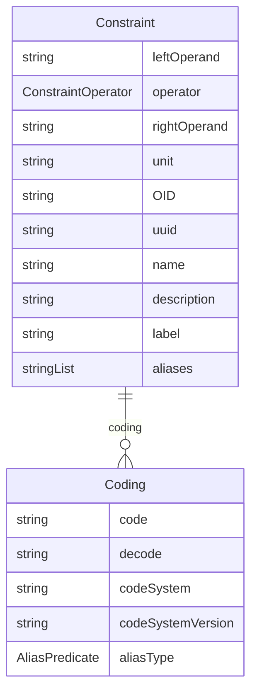

# Class: Constraint 


_An ODRL constraint expressed as leftOperand operator rightOperand, e.g. purpose eq "safety-reporting", or dateTime lt "2026-01-01"._


URI: [dds:class/Constraint](https://w3id.org/dds/class/Constraint)





## Inheritance
* [IdentifiableElement](../classes/IdentifiableElement.md) [ [Identifiable](../classes/Identifiable.md) [Labelled](../classes/Labelled.md)]
    * **Constraint**


## Slots

| Name | Cardinality and Range | Description | Inheritance |
| ---  | --- | --- | --- |
| [leftOperand](../slots/leftOperand.md) | 1 <br/> [String](../types/String.md) | The subject of the constraint (odrl:leftOperand), e.g. "purpose", "recipient", "dateTime" | direct |
| [operator](../slots/operator.md) | 1 <br/> [ConstraintOperator](../enums/ConstraintOperator.md) | The comparison operator (odrl:operator) | direct |
| [rightOperand](../slots/rightOperand.md) | 1 <br/> [String](../types/String.md) | The value compared against (odrl:rightOperand) | direct |
| [unit](../slots/unit.md) | 0..1 <br/> [String](../types/String.md) | Unit of the rightOperand, where applicable | direct |
| [OID](../slots/OID.md) | 1 <br/> [String](../types/String.md) | Local identifier within this study/context. Use CDISC OID format for regulatory submissions, or simple strings for internal use. | [Identifiable](../classes/Identifiable.md) |
| [uuid](../slots/uuid.md) | 0..1 <br/> [String](../types/String.md) | Universal unique identifier | [Identifiable](../classes/Identifiable.md) |
| [name](../slots/name.md) | 0..1 <br/> [String](../types/String.md) | Short name or identifier, used for field names | [Labelled](../classes/Labelled.md) |
| [description](../slots/description.md) | 0..1 <br/> [String](../types/String.md)&nbsp;or&nbsp;<br />[String](../types/String.md)&nbsp;or&nbsp;<br />[TranslatedText](../classes/TranslatedText.md) | Detailed description, shown in tooltips | [Labelled](../classes/Labelled.md) |
| [coding](../slots/coding.md) | * <br/> [Coding](../classes/Coding.md) | Semantic tags for this element | [Labelled](../classes/Labelled.md) |
| [label](../slots/label.md) | 0..1 <br/> [String](../types/String.md)&nbsp;or&nbsp;<br />[String](../types/String.md)&nbsp;or&nbsp;<br />[TranslatedText](../classes/TranslatedText.md) | Human-readable label, shown in UIs | [Labelled](../classes/Labelled.md) |
| [aliases](../slots/aliases.md) | * <br/> [String](../types/String.md)&nbsp;or&nbsp;<br />[String](../types/String.md)&nbsp;or&nbsp;<br />[TranslatedText](../classes/TranslatedText.md) | Alternative name or identifier | [Labelled](../classes/Labelled.md) |


## Usages

| used by | used in | type | used |
| ---  | --- | --- | --- |
| [Rule](../classes/Rule.md) | [constraint](../slots/constraint.md) | range | [Constraint](../classes/Constraint.md) |


## Identifier and Mapping Information


### Schema Source


* from schema: https://w3id.org/dds


## Mappings

| Mapping Type | Mapped Value |
| ---  | ---  |
| self | dds:Constraint |
| native | dds:Constraint |
| exact | odrl:Constraint |


## LinkML Source

<!-- TODO: investigate https://stackoverflow.com/questions/37606292/how-to-create-tabbed-code-blocks-in-mkdocs-or-sphinx -->

### Direct

<details>
```yaml
name: Constraint
description: An ODRL constraint expressed as leftOperand operator rightOperand, e.g.
  purpose eq "safety-reporting", or dateTime lt "2026-01-01".
from_schema: https://w3id.org/dds
exact_mappings:
- odrl:Constraint
is_a: IdentifiableElement
attributes:
  leftOperand:
    name: leftOperand
    description: The subject of the constraint (odrl:leftOperand), e.g. "purpose",
      "recipient", "dateTime"
    from_schema: https://w3id.org/dds
    exact_mappings:
    - odrl:leftOperand
    rank: 1000
    domain_of:
    - Constraint
    required: true
  operator:
    name: operator
    description: The comparison operator (odrl:operator)
    from_schema: https://w3id.org/dds
    exact_mappings:
    - odrl:operator
    domain_of:
    - LogicalPredicate
    - RangeCheck
    - Constraint
    range: ConstraintOperator
    required: true
  rightOperand:
    name: rightOperand
    description: The value compared against (odrl:rightOperand)
    from_schema: https://w3id.org/dds
    exact_mappings:
    - odrl:rightOperand
    rank: 1000
    domain_of:
    - Constraint
    required: true
  unit:
    name: unit
    description: Unit of the rightOperand, where applicable
    from_schema: https://w3id.org/dds
    rank: 1000
    domain_of:
    - Constraint

```
</details>

### Induced

<details>
```yaml
name: Constraint
description: An ODRL constraint expressed as leftOperand operator rightOperand, e.g.
  purpose eq "safety-reporting", or dateTime lt "2026-01-01".
from_schema: https://w3id.org/dds
exact_mappings:
- odrl:Constraint
is_a: IdentifiableElement
attributes:
  leftOperand:
    name: leftOperand
    description: The subject of the constraint (odrl:leftOperand), e.g. "purpose",
      "recipient", "dateTime"
    from_schema: https://w3id.org/dds
    exact_mappings:
    - odrl:leftOperand
    rank: 1000
    alias: leftOperand
    owner: Constraint
    domain_of:
    - Constraint
    range: string
    required: true
  operator:
    name: operator
    description: The comparison operator (odrl:operator)
    from_schema: https://w3id.org/dds
    exact_mappings:
    - odrl:operator
    alias: operator
    owner: Constraint
    domain_of:
    - LogicalPredicate
    - RangeCheck
    - Constraint
    range: ConstraintOperator
    required: true
  rightOperand:
    name: rightOperand
    description: The value compared against (odrl:rightOperand)
    from_schema: https://w3id.org/dds
    exact_mappings:
    - odrl:rightOperand
    rank: 1000
    alias: rightOperand
    owner: Constraint
    domain_of:
    - Constraint
    range: string
    required: true
  unit:
    name: unit
    description: Unit of the rightOperand, where applicable
    from_schema: https://w3id.org/dds
    rank: 1000
    alias: unit
    owner: Constraint
    domain_of:
    - Constraint
    range: string
  OID:
    name: OID
    description: Local identifier within this study/context. Use CDISC OID format
      for regulatory submissions, or simple strings for internal use.
    from_schema: https://w3id.org/dds
    rank: 1000
    identifier: true
    alias: OID
    owner: Constraint
    domain_of:
    - Identifiable
    range: string
    required: true
  uuid:
    name: uuid
    description: Universal unique identifier
    from_schema: https://w3id.org/dds
    rank: 1000
    alias: uuid
    owner: Constraint
    domain_of:
    - Identifiable
    range: string
  name:
    name: name
    description: Short name or identifier, used for field names
    from_schema: https://w3id.org/dds
    rank: 1000
    alias: name
    owner: Constraint
    domain_of:
    - Labelled
    - DefClass
    - SubClass
    - Standard
    range: string
  description:
    name: description
    description: Detailed description, shown in tooltips
    from_schema: https://w3id.org/dds
    rank: 1000
    alias: description
    owner: Constraint
    domain_of:
    - Labelled
    - CodeListItem
    range: string
    any_of:
    - range: string
    - range: TranslatedText
  coding:
    name: coding
    description: Semantic tags for this element
    from_schema: https://w3id.org/dds
    rank: 1000
    alias: coding
    owner: Constraint
    domain_of:
    - Labelled
    - CodeListItem
    - SourceItem
    range: Coding
    multivalued: true
    inlined: true
    inlined_as_list: true
  label:
    name: label
    description: Human-readable label, shown in UIs
    from_schema: https://w3id.org/dds
    exact_mappings:
    - skos:prefLabel
    rank: 1000
    alias: label
    owner: Constraint
    domain_of:
    - Labelled
    range: string
    any_of:
    - range: string
    - range: TranslatedText
  aliases:
    name: aliases
    description: Alternative name or identifier
    from_schema: https://w3id.org/dds
    exact_mappings:
    - skos:altLabel
    rank: 1000
    alias: aliases
    owner: Constraint
    domain_of:
    - Labelled
    - CodeListItem
    range: string
    multivalued: true
    inlined: true
    inlined_as_list: true
    any_of:
    - range: string
    - range: TranslatedText

```
</details>