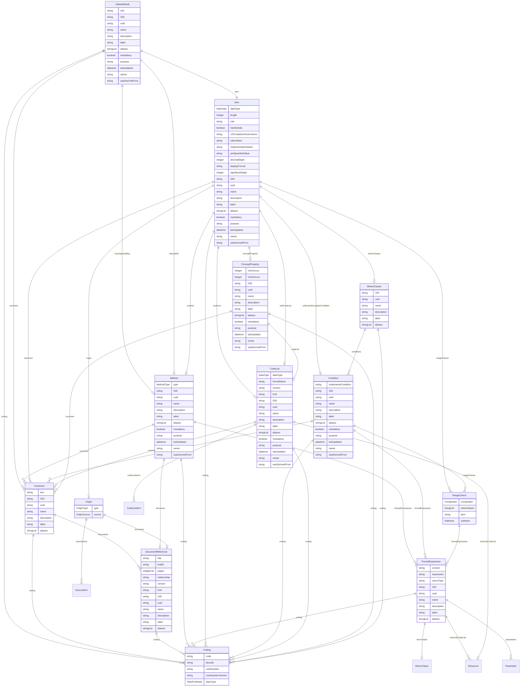

# Class: DataAttribute 


_A data cube property that describes additional characteristics or metadata about observations_


URI: [odm:class/DataAttribute](https://cdisc.org/odm2/class/DataAttribute)





## Inheritance
* [GovernedElement](../classes/GovernedElement.md) [ [Identifiable](../classes/Identifiable.md) [Labelled](../classes/Labelled.md) [Governed](../classes/Governed.md)]
    * [CubeComponent](../classes/CubeComponent.md)
        * **DataAttribute**


## Slots

| Name | Cardinality and Range | Description | Inheritance |
| ---  | --- | --- | --- |
| [item](../slots/item.md) | 1 <br/> [Item](../classes/Item.md) | Reference to the Item that defines this component's data structure and proper... | [CubeComponent](../classes/CubeComponent.md) |
| [role](../slots/role.md) | 0..1 <br/> [String](../types/String.md) | The role this component plays in its Structure Definition | [CubeComponent](../classes/CubeComponent.md) |
| [missingHandling](../slots/missingHandling.md) | 0..1 <br/> [Method](../classes/Method.md) | The method for handling missing values in the measure property | [CubeComponent](../classes/CubeComponent.md) |
| [imputation](../slots/imputation.md) | 0..1 <br/> [Method](../classes/Method.md) | The imputation method used for the measure property | [CubeComponent](../classes/CubeComponent.md) |
| [OID](../slots/OID.md) | 1 <br/> [String](../types/String.md) | Local identifier within this study/context | [Identifiable](../classes/Identifiable.md) |
| [uuid](../slots/uuid.md) | 0..1 <br/> [String](../types/String.md) | Universal unique identifier | [Identifiable](../classes/Identifiable.md) |
| [name](../slots/name.md) | 0..1 <br/> [String](../types/String.md) | Short name or identifier, used for field names | [Labelled](../classes/Labelled.md) |
| [description](../slots/description.md) | 0..1 <br/> [String](../types/String.md)&nbsp;or&nbsp;<br />[String](../types/String.md)&nbsp;or&nbsp;<br />[TranslatedText](../classes/TranslatedText.md) | Detailed description, shown in tooltips | [Labelled](../classes/Labelled.md) |
| [coding](../slots/coding.md) | * <br/> [Coding](../classes/Coding.md) | Semantic tags for this element | [Labelled](../classes/Labelled.md) |
| [label](../slots/label.md) | 0..1 <br/> [String](../types/String.md)&nbsp;or&nbsp;<br />[String](../types/String.md)&nbsp;or&nbsp;<br />[TranslatedText](../classes/TranslatedText.md) | Human-readable label, shown in UIs | [Labelled](../classes/Labelled.md) |
| [aliases](../slots/aliases.md) | * <br/> [String](../types/String.md)&nbsp;or&nbsp;<br />[String](../types/String.md)&nbsp;or&nbsp;<br />[TranslatedText](../classes/TranslatedText.md) | Alternative name or identifier | [Labelled](../classes/Labelled.md) |
| [mandatory](../slots/mandatory.md) | 0..1 <br/> [Boolean](../types/Boolean.md) | Is this element required? | [Governed](../classes/Governed.md) |
| [comment](../slots/comment.md) | * <br/> [Comment](../classes/Comment.md) | Comment on the element, such as a rationale for its inclusion or exclusion | [Governed](../classes/Governed.md) |
| [purpose](../slots/purpose.md) | 0..1 <br/> [String](../types/String.md)&nbsp;or&nbsp;<br />[String](../types/String.md)&nbsp;or&nbsp;<br />[TranslatedText](../classes/TranslatedText.md) | Purpose or rationale for this data element | [Governed](../classes/Governed.md) |
| [lastUpdated](../slots/lastUpdated.md) | 0..1 <br/> [Datetime](../types/Datetime.md) | When the resource was last updated | [Governed](../classes/Governed.md) |
| [owner](../slots/owner.md) | 0..1 <br/> [String](../types/String.md)&nbsp;or&nbsp;<br />[User](../classes/User.md)&nbsp;or&nbsp;<br />[Organization](../classes/Organization.md)&nbsp;or&nbsp;<br />[String](../types/String.md) | Party responsible for this element | [Governed](../classes/Governed.md) |
| [wasDerivedFrom](../slots/wasDerivedFrom.md) | 0..1 <br/> [String](../types/String.md)&nbsp;or&nbsp;<br />[Item](../classes/Item.md)&nbsp;or&nbsp;<br />[ItemGroup](../classes/ItemGroup.md)&nbsp;or&nbsp;<br />[MetaDataVersion](../classes/MetaDataVersion.md)&nbsp;or&nbsp;<br />[CodeList](../classes/CodeList.md)&nbsp;or&nbsp;<br />[ReifiedConcept](../classes/ReifiedConcept.md)&nbsp;or&nbsp;<br />[ConceptProperty](../classes/ConceptProperty.md)&nbsp;or&nbsp;<br />[Condition](../classes/Condition.md)&nbsp;or&nbsp;<br />[Method](../classes/Method.md)&nbsp;or&nbsp;<br />[NominalOccurrence](../classes/NominalOccurrence.md)&nbsp;or&nbsp;<br />[Dataflow](../classes/Dataflow.md)&nbsp;or&nbsp;<br />[CubeComponent](../classes/CubeComponent.md)&nbsp;or&nbsp;<br />[DataProduct](../classes/DataProduct.md)&nbsp;or&nbsp;<br />[ProvisionAgreement](../classes/ProvisionAgreement.md) | Reference to another item that this item implements or extends, e | [Governed](../classes/Governed.md) |


## Usages

| used by | used in | type | used |
| ---  | --- | --- | --- |
| [RangeCheck](../classes/RangeCheck.md) | [item](../slots/item.md) | any_of[range] | [DataAttribute](../classes/DataAttribute.md) |
| [DataStructureDefinition](../classes/DataStructureDefinition.md) | [attributes](../slots/attributes.md) | range | [DataAttribute](../classes/DataAttribute.md) |
| [ComponentList](../classes/ComponentList.md) | [components](../slots/components.md) | any_of[range] | [DataAttribute](../classes/DataAttribute.md) |
| [MeasureRelationship](../classes/MeasureRelationship.md) | [attribute](../slots/attribute.md) | range | [DataAttribute](../classes/DataAttribute.md) |
| [DataflowRelationship](../classes/DataflowRelationship.md) | [attribute](../slots/attribute.md) | range | [DataAttribute](../classes/DataAttribute.md) |
| [GroupRelationship](../classes/GroupRelationship.md) | [attribute](../slots/attribute.md) | range | [DataAttribute](../classes/DataAttribute.md) |
| [DimensionRelationship](../classes/DimensionRelationship.md) | [attribute](../slots/attribute.md) | range | [DataAttribute](../classes/DataAttribute.md) |
| [ObservationRelationship](../classes/ObservationRelationship.md) | [attribute](../slots/attribute.md) | range | [DataAttribute](../classes/DataAttribute.md) |


## Identifier and Mapping Information


### Schema Source


* from schema: https://cdisc.org/define-json


## Mappings

| Mapping Type | Mapped Value |
| ---  | ---  |
| self | odm:DataAttribute |
| native | odm:DataAttribute |
| exact | qb:AttributeProperty, sdmx:DataAttribute |


## LinkML Source

<!-- TODO: investigate https://stackoverflow.com/questions/37606292/how-to-create-tabbed-code-blocks-in-mkdocs-or-sphinx -->

### Direct

<details>
```yaml
name: DataAttribute
description: A data cube property that describes additional characteristics or metadata
  about observations
from_schema: https://cdisc.org/define-json
exact_mappings:
- qb:AttributeProperty
- sdmx:DataAttribute
is_a: CubeComponent

```
</details>

### Induced

<details>
```yaml
name: DataAttribute
description: A data cube property that describes additional characteristics or metadata
  about observations
from_schema: https://cdisc.org/define-json
exact_mappings:
- qb:AttributeProperty
- sdmx:DataAttribute
is_a: CubeComponent
attributes:
  item:
    name: item
    description: Reference to the Item that defines this component's data structure
      and properties
    from_schema: https://cdisc.org/define-json
    alias: item
    owner: DataAttribute
    domain_of:
    - RangeCheck
    - SourceItem
    - CubeComponent
    - ObservationRelationship
    range: Item
    required: true
  role:
    name: role
    description: The role this component plays in its Structure Definition
    from_schema: https://cdisc.org/define-json
    alias: role
    owner: DataAttribute
    domain_of:
    - IsODMItem
    - Organization
    - CubeComponent
    range: string
  missingHandling:
    name: missingHandling
    description: The method for handling missing values in the measure property
    from_schema: https://cdisc.org/define-json
    rank: 1000
    alias: missingHandling
    owner: DataAttribute
    domain_of:
    - CubeComponent
    range: Method
  imputation:
    name: imputation
    description: The imputation method used for the measure property
    from_schema: https://cdisc.org/define-json
    alias: imputation
    owner: DataAttribute
    domain_of:
    - Timing
    - CubeComponent
    range: Method
  OID:
    name: OID
    description: Local identifier within this study/context. Use CDISC OID format
      for regulatory submissions, or simple strings for internal use.
    from_schema: https://cdisc.org/define-json
    rank: 1000
    identifier: true
    alias: OID
    owner: DataAttribute
    domain_of:
    - Identifiable
    range: string
    required: true
    pattern: ^[A-Za-z][A-Za-z0-9._-]*$
  uuid:
    name: uuid
    description: Universal unique identifier
    from_schema: https://cdisc.org/define-json
    rank: 1000
    alias: uuid
    owner: DataAttribute
    domain_of:
    - Identifiable
    range: string
  name:
    name: name
    description: Short name or identifier, used for field names
    from_schema: https://cdisc.org/define-json
    rank: 1000
    alias: name
    owner: DataAttribute
    domain_of:
    - Labelled
    - Standard
    range: string
  description:
    name: description
    description: Detailed description, shown in tooltips
    from_schema: https://cdisc.org/define-json
    rank: 1000
    alias: description
    owner: DataAttribute
    domain_of:
    - Labelled
    - CodeListItem
    range: string
    any_of:
    - range: string
    - range: TranslatedText
  coding:
    name: coding
    description: Semantic tags for this element
    from_schema: https://cdisc.org/define-json
    rank: 1000
    alias: coding
    owner: DataAttribute
    domain_of:
    - Labelled
    - CodeListItem
    - SourceItem
    range: Coding
    multivalued: true
    inlined: true
    inlined_as_list: true
  label:
    name: label
    description: Human-readable label, shown in UIs
    from_schema: https://cdisc.org/define-json
    exact_mappings:
    - skos:prefLabel
    rank: 1000
    alias: label
    owner: DataAttribute
    domain_of:
    - Labelled
    range: string
    any_of:
    - range: string
    - range: TranslatedText
  aliases:
    name: aliases
    description: Alternative name or identifier
    from_schema: https://cdisc.org/define-json
    exact_mappings:
    - skos:altLabel
    rank: 1000
    alias: aliases
    owner: DataAttribute
    domain_of:
    - Labelled
    - CodeListItem
    range: string
    multivalued: true
    inlined: true
    inlined_as_list: true
    any_of:
    - range: string
    - range: TranslatedText
  mandatory:
    name: mandatory
    description: Is this element required?
    from_schema: https://cdisc.org/define-json
    rank: 1000
    alias: mandatory
    owner: DataAttribute
    domain_of:
    - Governed
    range: boolean
  comment:
    name: comment
    description: Comment on the element, such as a rationale for its inclusion or
      exclusion
    from_schema: https://cdisc.org/define-json
    rank: 1000
    alias: comment
    owner: DataAttribute
    domain_of:
    - Governed
    - Standard
    range: Comment
    multivalued: true
  purpose:
    name: purpose
    description: Purpose or rationale for this data element
    from_schema: https://cdisc.org/define-json
    rank: 1000
    alias: purpose
    owner: DataAttribute
    domain_of:
    - Governed
    range: string
    any_of:
    - range: string
    - range: TranslatedText
  lastUpdated:
    name: lastUpdated
    description: When the resource was last updated
    from_schema: https://cdisc.org/define-json
    rank: 1000
    alias: lastUpdated
    owner: DataAttribute
    domain_of:
    - Governed
    range: datetime
  owner:
    name: owner
    description: Party responsible for this element
    from_schema: https://cdisc.org/define-json
    narrow_mappings:
    - prov:wasAttributedTo
    - prov:wasAssociatedBy
    rank: 1000
    alias: owner
    owner: DataAttribute
    domain_of:
    - Governed
    range: string
    any_of:
    - range: User
    - range: Organization
    - range: string
  wasDerivedFrom:
    name: wasDerivedFrom
    description: Reference to another item that this item implements or extends, e.g.
      a template Item definition.
    from_schema: https://cdisc.org/define-json
    exact_mappings:
    - prov:wasDerivedFrom
    rank: 1000
    alias: wasDerivedFrom
    owner: DataAttribute
    domain_of:
    - Governed
    range: string
    any_of:
    - range: Item
    - range: ItemGroup
    - range: MetaDataVersion
    - range: CodeList
    - range: ReifiedConcept
    - range: ConceptProperty
    - range: Condition
    - range: Method
    - range: NominalOccurrence
    - range: Dataflow
    - range: CubeComponent
    - range: DataProduct
    - range: ProvisionAgreement

```
</details>