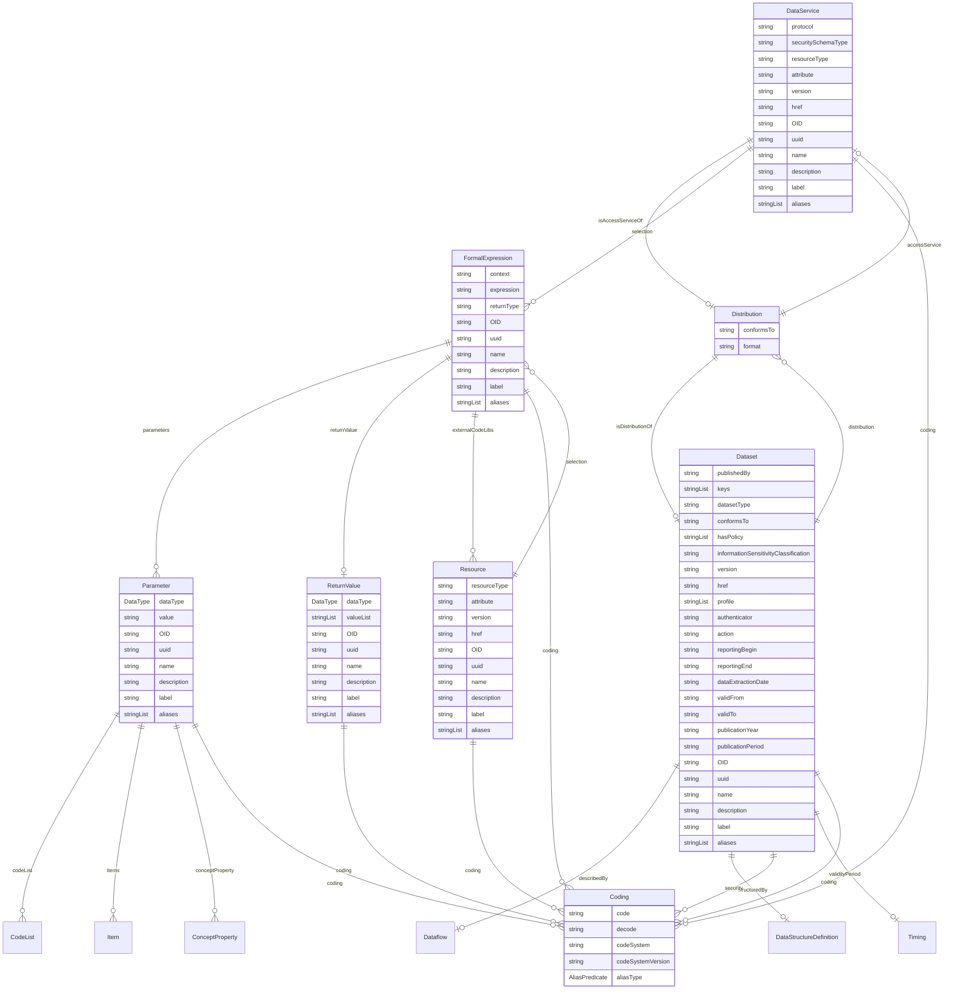

# Class: DataService 


_A service element that provides an API or endpoint for serving or receiving data_


URI: [odm:class/DataService](https://cdisc.org/odm2/class/DataService)





## Inheritance
* [IdentifiableElement](../classes/IdentifiableElement.md) [ [Identifiable](../classes/Identifiable.md) [Labelled](../classes/Labelled.md)]
    * [Resource](../classes/Resource.md) [ [Versioned](../classes/Versioned.md)]
        * **DataService**


## Slots

| Name | Cardinality and Range | Description | Inheritance |
| ---  | --- | --- | --- |
| [isAccessServiceOf](../slots/isAccessServiceOf.md) | 0..1 <br/> [Distribution](../classes/Distribution.md) | Distribution(s) for which this service provides access | direct |
| [protocol](../slots/protocol.md) | 0..1 <br/> [String](../types/String.md) | Protocol used by the service (e | direct |
| [securitySchemaType](../slots/securitySchemaType.md) | 0..1 <br/> [String](../types/String.md) | Security or authentication method used (e | direct |
| [resourceType](../slots/resourceType.md) | 0..1 <br/> [String](../types/String.md) | Type of resource (e | [Resource](../classes/Resource.md) |
| [attribute](../slots/attribute.md) | 0..1 <br/> [String](../types/String.md) | Field provided by the Name attribute where the data or information can be obt... | [Resource](../classes/Resource.md) |
| [selection](../slots/selection.md) | * <br/> [FormalExpression](../classes/FormalExpression.md) | Machine-executable instructions for selecting data from the resource | [Resource](../classes/Resource.md) |
| [version](../slots/version.md) | 0..1 <br/> [String](../types/String.md) | The version of the external resources | [Versioned](../classes/Versioned.md) |
| [href](../slots/href.md) | 0..1 <br/> [String](../types/String.md) | Machine-readable instructions to obtain the resource e | [Versioned](../classes/Versioned.md) |
| [OID](../slots/OID.md) | 1 <br/> [String](../types/String.md) | Local identifier within this study/context | [Identifiable](../classes/Identifiable.md) |
| [uuid](../slots/uuid.md) | 0..1 <br/> [String](../types/String.md) | Universal unique identifier | [Identifiable](../classes/Identifiable.md) |
| [name](../slots/name.md) | 0..1 <br/> [String](../types/String.md) | Short name or identifier, used for field names | [Labelled](../classes/Labelled.md) |
| [description](../slots/description.md) | 0..1 <br/> [String](../types/String.md)&nbsp;or&nbsp;<br />[String](../types/String.md)&nbsp;or&nbsp;<br />[TranslatedText](../classes/TranslatedText.md) | Detailed description, shown in tooltips | [Labelled](../classes/Labelled.md) |
| [coding](../slots/coding.md) | * <br/> [Coding](../classes/Coding.md) | Semantic tags for this element | [Labelled](../classes/Labelled.md) |
| [label](../slots/label.md) | 0..1 <br/> [String](../types/String.md)&nbsp;or&nbsp;<br />[String](../types/String.md)&nbsp;or&nbsp;<br />[TranslatedText](../classes/TranslatedText.md) | Human-readable label, shown in UIs | [Labelled](../classes/Labelled.md) |
| [aliases](../slots/aliases.md) | * <br/> [String](../types/String.md)&nbsp;or&nbsp;<br />[String](../types/String.md)&nbsp;or&nbsp;<br />[TranslatedText](../classes/TranslatedText.md) | Alternative name or identifier | [Labelled](../classes/Labelled.md) |


## Usages

| used by | used in | type | used |
| ---  | --- | --- | --- |
| [DataProduct](../classes/DataProduct.md) | [inputPort](../slots/inputPort.md) | range | [DataService](../classes/DataService.md) |
| [DataProduct](../classes/DataProduct.md) | [outputPort](../slots/outputPort.md) | range | [DataService](../classes/DataService.md) |
| [Distribution](../classes/Distribution.md) | [accessService](../slots/accessService.md) | range | [DataService](../classes/DataService.md) |


## Identifier and Mapping Information


### Schema Source


* from schema: https://cdisc.org/define-json


## Mappings

| Mapping Type | Mapped Value |
| ---  | ---  |
| self | odm:DataService |
| native | odm:DataService |
| exact | dprod:DataService, dcat:DataService |


## LinkML Source

<!-- TODO: investigate https://stackoverflow.com/questions/37606292/how-to-create-tabbed-code-blocks-in-mkdocs-or-sphinx -->

### Direct

<details>
```yaml
name: DataService
description: A service element that provides an API or endpoint for serving or receiving
  data
from_schema: https://cdisc.org/define-json
exact_mappings:
- dprod:DataService
- dcat:DataService
is_a: Resource
attributes:
  isAccessServiceOf:
    name: isAccessServiceOf
    description: Distribution(s) for which this service provides access
    from_schema: https://cdisc.org/define-json
    rank: 1000
    domain_of:
    - DataService
    range: Distribution
  protocol:
    name: protocol
    description: Protocol used by the service (e.g., HTTPS, FTP)
    from_schema: https://cdisc.org/define-json
    rank: 1000
    domain_of:
    - DataService
  securitySchemaType:
    name: securitySchemaType
    description: Security or authentication method used (e.g., OAuth2)
    from_schema: https://cdisc.org/define-json
    rank: 1000
    domain_of:
    - DataService

```
</details>

### Induced

<details>
```yaml
name: DataService
description: A service element that provides an API or endpoint for serving or receiving
  data
from_schema: https://cdisc.org/define-json
exact_mappings:
- dprod:DataService
- dcat:DataService
is_a: Resource
attributes:
  isAccessServiceOf:
    name: isAccessServiceOf
    description: Distribution(s) for which this service provides access
    from_schema: https://cdisc.org/define-json
    rank: 1000
    alias: isAccessServiceOf
    owner: DataService
    domain_of:
    - DataService
    range: Distribution
  protocol:
    name: protocol
    description: Protocol used by the service (e.g., HTTPS, FTP)
    from_schema: https://cdisc.org/define-json
    rank: 1000
    alias: protocol
    owner: DataService
    domain_of:
    - DataService
  securitySchemaType:
    name: securitySchemaType
    description: Security or authentication method used (e.g., OAuth2)
    from_schema: https://cdisc.org/define-json
    rank: 1000
    alias: securitySchemaType
    owner: DataService
    domain_of:
    - DataService
  resourceType:
    name: resourceType
    description: Type of resource (e.g.,  "ODM", "HL7-FHIR", "HL7-CDA", "HL7-v2",
      "OpenEHR-extract")
    from_schema: https://cdisc.org/define-json
    rank: 1000
    alias: resourceType
    owner: DataService
    domain_of:
    - Resource
    range: string
    required: false
  attribute:
    name: attribute
    description: Field provided by the Name attribute where the data or information
      can be obtained. Examples are "valueQuantity.value" or "valueQuantity.unit".
    from_schema: https://cdisc.org/define-json
    rank: 1000
    alias: attribute
    owner: DataService
    domain_of:
    - Resource
    - MeasureRelationship
    - DataflowRelationship
    - GroupRelationship
    - DimensionRelationship
    - ObservationRelationship
    range: string
  selection:
    name: selection
    description: Machine-executable instructions for selecting data from the resource.
    from_schema: https://cdisc.org/define-json
    rank: 1000
    alias: selection
    owner: DataService
    domain_of:
    - Resource
    range: FormalExpression
    multivalued: true
    inlined: true
    inlined_as_list: true
  version:
    name: version
    description: The version of the external resources
    from_schema: https://cdisc.org/define-json
    rank: 1000
    alias: version
    owner: DataService
    domain_of:
    - Versioned
    - Standard
    range: string
  href:
    name: href
    description: Machine-readable instructions to obtain the resource e.g. FHIR path,
      URL
    from_schema: https://cdisc.org/define-json
    rank: 1000
    alias: href
    owner: DataService
    domain_of:
    - Versioned
    range: string
    required: false
  OID:
    name: OID
    description: Local identifier within this study/context. Use CDISC OID format
      for regulatory submissions, or simple strings for internal use.
    from_schema: https://cdisc.org/define-json
    rank: 1000
    identifier: true
    alias: OID
    owner: DataService
    domain_of:
    - Identifiable
    range: string
    required: true
    pattern: ^[A-Za-z][A-Za-z0-9._-]*$
  uuid:
    name: uuid
    description: Universal unique identifier
    from_schema: https://cdisc.org/define-json
    rank: 1000
    alias: uuid
    owner: DataService
    domain_of:
    - Identifiable
    range: string
  name:
    name: name
    description: Short name or identifier, used for field names
    from_schema: https://cdisc.org/define-json
    rank: 1000
    alias: name
    owner: DataService
    domain_of:
    - Labelled
    - Standard
    range: string
  description:
    name: description
    description: Detailed description, shown in tooltips
    from_schema: https://cdisc.org/define-json
    rank: 1000
    alias: description
    owner: DataService
    domain_of:
    - Labelled
    - CodeListItem
    range: string
    any_of:
    - range: string
    - range: TranslatedText
  coding:
    name: coding
    description: Semantic tags for this element
    from_schema: https://cdisc.org/define-json
    rank: 1000
    alias: coding
    owner: DataService
    domain_of:
    - Labelled
    - CodeListItem
    - SourceItem
    range: Coding
    multivalued: true
    inlined: true
    inlined_as_list: true
  label:
    name: label
    description: Human-readable label, shown in UIs
    from_schema: https://cdisc.org/define-json
    exact_mappings:
    - skos:prefLabel
    rank: 1000
    alias: label
    owner: DataService
    domain_of:
    - Labelled
    range: string
    any_of:
    - range: string
    - range: TranslatedText
  aliases:
    name: aliases
    description: Alternative name or identifier
    from_schema: https://cdisc.org/define-json
    exact_mappings:
    - skos:altLabel
    rank: 1000
    alias: aliases
    owner: DataService
    domain_of:
    - Labelled
    - CodeListItem
    range: string
    multivalued: true
    inlined: true
    inlined_as_list: true
    any_of:
    - range: string
    - range: TranslatedText

```
</details>