# Class: DataStructureDefinition 


_A structural element that defines the organization of a data cube for analysis, including dimensions, attributes, and measures_


URI: [odm:class/DataStructureDefinition](https://cdisc.org/odm2/class/DataStructureDefinition)

```mermaid
erDiagram
DataStructureDefinition {
    boolean evolvingStructure  
    string domain  
    string structure  
    boolean isReferenceData  
    ItemGroupType type  
    stringList children  
    stringList profile  
    string authenticator  
    string OID  
    string uuid  
    string name  
    string description  
    string label  
    stringList aliases  
    boolean mandatory  
    string purpose  
    datetime lastUpdated  
    string owner  
    string wasDerivedFrom  
    string version  
    string href  
}
SiteOrSponsorComment {
    string text  
    OriginSource sourceType  
    string source  
    string OID  
    string uuid  
    string name  
    string description  
    string label  
    stringList aliases  
    boolean mandatory  
    string purpose  
    datetime lastUpdated  
    string owner  
    string wasDerivedFrom  
}
Comment {
    string text  
    string OID  
    string uuid  
    string name  
    string description  
    string label  
    stringList aliases  
    boolean mandatory  
    string purpose  
    datetime lastUpdated  
    string owner  
    string wasDerivedFrom  
}
Coding {
    string code  
    string decode  
    string codeSystem  
    string codeSystemVersion  
    AliasPredicate aliasType  
}
Timing {
    TimingType type  
    boolean isNominal  
    string value  
    datetime windowLower  
    datetime windowUpper  
    boolean recalled  
    string frequency  
    string OID  
    string uuid  
    string name  
    string description  
    string label  
    stringList aliases  
}
Method {
    MethodType type  
    string OID  
    string uuid  
    string name  
    string description  
    string label  
    stringList aliases  
    boolean mandatory  
    string purpose  
    datetime lastUpdated  
    string owner  
    string wasDerivedFrom  
}
NominalOccurrence {
    string event  
    string OID  
    string uuid  
    string name  
    string description  
    string label  
    stringList aliases  
    boolean mandatory  
    string purpose  
    datetime lastUpdated  
    string owner  
    string wasDerivedFrom  
}
WhereClause {
    string OID  
    string uuid  
    string name  
    string description  
    string label  
    stringList aliases  
    boolean mandatory  
    string purpose  
    datetime lastUpdated  
    string owner  
    string wasDerivedFrom  
}
Condition {
    string implementsCondition  
    LogicalOperator operator  
    string OID  
    string uuid  
    string name  
    string description  
    string label  
    stringList aliases  
    boolean mandatory  
    string purpose  
    datetime lastUpdated  
    string owner  
    string wasDerivedFrom  
}
ReifiedConcept {
    string version  
    string href  
    string OID  
    string uuid  
    string name  
    string description  
    string label  
    stringList aliases  
    boolean mandatory  
    string purpose  
    datetime lastUpdated  
    string owner  
    string wasDerivedFrom  
}
ConceptProperty {
    integer minOccurs  
    integer maxOccurs  
    string OID  
    string uuid  
    string name  
    string description  
    string label  
    stringList aliases  
    boolean mandatory  
    string purpose  
    datetime lastUpdated  
    string owner  
    string wasDerivedFrom  
}
Item {
    DataType dataType  
    integer length  
    string role  
    boolean hasNoData  
    string crfCompletionInstructions  
    string cdiscNotes  
    string implementationNotes  
    string preSpecifiedValue  
    integer decimalDigits  
    string displayFormat  
    integer significantDigits  
    string OID  
    string uuid  
    string name  
    string description  
    string label  
    stringList aliases  
    boolean mandatory  
    string purpose  
    datetime lastUpdated  
    string owner  
    string wasDerivedFrom  
}
CodeList {
    DataType dataType  
    string formatName  
    string version  
    string href  
    string OID  
    string uuid  
    string name  
    string description  
    string label  
    stringList aliases  
    boolean mandatory  
    string purpose  
    datetime lastUpdated  
    string owner  
    string wasDerivedFrom  
}
Origin {
    OriginType type  
    OriginSource source  
}
RangeCheck {
    Comparator comparator  
    stringList checkValues  
    string item  
    SoftHard softHard  
    LogicalOperator operator  
}
ComponentList {
    stringList components  
    string OID  
    string uuid  
    string name  
    string description  
    string label  
    stringList aliases  
}
DataAttribute {
    string role  
    string OID  
    string uuid  
    string name  
    string description  
    string label  
    stringList aliases  
    boolean mandatory  
    string purpose  
    datetime lastUpdated  
    string owner  
    string wasDerivedFrom  
}
Measure {
    string role  
    string OID  
    string uuid  
    string name  
    string description  
    string label  
    stringList aliases  
    boolean mandatory  
    string purpose  
    datetime lastUpdated  
    string owner  
    string wasDerivedFrom  
}
Dimension {
    integer keySequence  
    string role  
    string OID  
    string uuid  
    string name  
    string description  
    string label  
    stringList aliases  
    boolean mandatory  
    string purpose  
    datetime lastUpdated  
    string owner  
    string wasDerivedFrom  
}

DataStructureDefinition ||--}o Dimension : "dimensions"
DataStructureDefinition ||--}o Measure : "measures"
DataStructureDefinition ||--}o DataAttribute : "attributes"
DataStructureDefinition ||--|o ComponentList : "grouping"
DataStructureDefinition ||--}o Item : "items"
DataStructureDefinition ||--|o ReifiedConcept : "implementsConcept"
DataStructureDefinition ||--}o WhereClause : "applicableWhen"
DataStructureDefinition ||--}o Coding : "security"
DataStructureDefinition ||--|o Timing : "validityPeriod"
DataStructureDefinition ||--}o Coding : "coding"
DataStructureDefinition ||--}o Comment : "comments"
DataStructureDefinition ||--}o SiteOrSponsorComment : "siteOrSponsorComments"
SiteOrSponsorComment ||--}o Coding : "coding"
SiteOrSponsorComment ||--}o Comment : "comments"
SiteOrSponsorComment ||--}o SiteOrSponsorComment : "siteOrSponsorComments"
Comment ||--}o DocumentReference : "documents"
Comment ||--}o Coding : "coding"
Comment ||--}o Comment : "comments"
Comment ||--}o SiteOrSponsorComment : "siteOrSponsorComments"
Timing ||--|o NominalOccurrence : "relativeTo"
Timing ||--|o NominalOccurrence : "relativeFrom"
Timing ||--|o Method : "imputation"
Timing ||--}o Coding : "coding"
Method ||--}o FormalExpression : "expressions"
Method ||--|o DocumentReference : "document"
Method ||--}o Coding : "coding"
Method ||--}o Comment : "comments"
Method ||--}o SiteOrSponsorComment : "siteOrSponsorComments"
NominalOccurrence ||--|| Timing : "timing"
NominalOccurrence ||--}o Condition : "condition"
NominalOccurrence ||--}o Coding : "coding"
NominalOccurrence ||--}o Comment : "comments"
NominalOccurrence ||--}o SiteOrSponsorComment : "siteOrSponsorComments"
WhereClause ||--}o Condition : "conditions"
WhereClause ||--}o Coding : "coding"
WhereClause ||--}o Comment : "comments"
WhereClause ||--}o SiteOrSponsorComment : "siteOrSponsorComments"
Condition ||--}o RangeCheck : "rangeChecks"
Condition ||--}o FormalExpression : "expressions"
Condition ||--}o Condition : "conditions"
Condition ||--}o Coding : "coding"
Condition ||--}o Comment : "comments"
Condition ||--}o SiteOrSponsorComment : "siteOrSponsorComments"
ReifiedConcept ||--}o ConceptProperty : "properties"
ReifiedConcept ||--}o Coding : "coding"
ReifiedConcept ||--}o Comment : "comments"
ReifiedConcept ||--}o SiteOrSponsorComment : "siteOrSponsorComments"
ConceptProperty ||--|o CodeList : "codeList"
ConceptProperty ||--}o Coding : "coding"
ConceptProperty ||--}o Comment : "comments"
ConceptProperty ||--}o SiteOrSponsorComment : "siteOrSponsorComments"
Item ||--|o CodeList : "codeList"
Item ||--|o Method : "method"
Item ||--}o RangeCheck : "rangeChecks"
Item ||--}o WhereClause : "applicableWhen"
Item ||--|o Origin : "origin"
Item ||--|o ConceptProperty : "conceptProperty"
Item ||--|o CodeList : "roleCodeList"
Item ||--|o Condition : "collectionExceptionCondition"
Item ||--}o Coding : "coding"
Item ||--}o Comment : "comments"
Item ||--}o SiteOrSponsorComment : "siteOrSponsorComments"
CodeList ||--}o CodeListItem : "codeListItems"
CodeList ||--|o Resource : "externalCodeList"
CodeList ||--}o Coding : "coding"
CodeList ||--}o Comment : "comments"
CodeList ||--}o SiteOrSponsorComment : "siteOrSponsorComments"
Origin ||--}o SourceItem : "sourceItems"
Origin ||--|o DocumentReference : "document"
RangeCheck ||--}o FormalExpression : "expressions"
ComponentList ||--}o Coding : "coding"
DataAttribute ||--|| Item : "item"
DataAttribute ||--|o Method : "missingHandling"
DataAttribute ||--|o Method : "imputation"
DataAttribute ||--}o Coding : "coding"
DataAttribute ||--}o Comment : "comments"
DataAttribute ||--}o SiteOrSponsorComment : "siteOrSponsorComments"
Measure ||--|| Item : "item"
Measure ||--|o Method : "missingHandling"
Measure ||--|o Method : "imputation"
Measure ||--}o Coding : "coding"
Measure ||--}o Comment : "comments"
Measure ||--}o SiteOrSponsorComment : "siteOrSponsorComments"
Dimension ||--|| Item : "item"
Dimension ||--|o Method : "missingHandling"
Dimension ||--|o Method : "imputation"
Dimension ||--}o Coding : "coding"
Dimension ||--}o Comment : "comments"
Dimension ||--}o SiteOrSponsorComment : "siteOrSponsorComments"

```





## Inheritance
* [GovernedElement](../classes/GovernedElement.md) [ [Identifiable](../classes/Identifiable.md) [Labelled](../classes/Labelled.md) [Governed](../classes/Governed.md)]
    * [ItemGroup](../classes/ItemGroup.md) [ [IsProfile](../classes/IsProfile.md)]
        * **DataStructureDefinition**


## Slots

| Name | Cardinality and Range | Description | Inheritance |
| ---  | --- | --- | --- |
| [dimensions](../slots/dimensions.md) | * <br/> [Dimension](../classes/Dimension.md) |  | direct |
| [measures](../slots/measures.md) | * <br/> [Measure](../classes/Measure.md) |  | direct |
| [attributes](../slots/attributes.md) | * <br/> [DataAttribute](../classes/DataAttribute.md) |  | direct |
| [grouping](../slots/grouping.md) | 0..1 <br/> [ComponentList](../classes/ComponentList.md) | An association to a set of metadata concepts that have an identified structural role in a Data Structure Definition. | direct |
| [evolvingStructure](../slots/evolvingStructure.md) | 0..1 <br/> [Boolean](../types/Boolean.md) |  | direct |
| [domain](../slots/domain.md) | 0..1 <br/> [String](../types/String.md) | Domain abbreviation for the dataset. | [ItemGroup](../classes/ItemGroup.md) |
| [structure](../slots/structure.md) | 0..1 <br/> [String](../types/String.md)&nbsp;or&nbsp;<br />[String](../types/String.md)&nbsp;or&nbsp;<br />[TranslatedText](../classes/TranslatedText.md) | Data structure of the item group, indicating how the records are organized. If this is a FHIR Resource, is it nested or flattened? If this is a structured concept, is it a Biomedical/Derivation/Analysis concept? | [ItemGroup](../classes/ItemGroup.md) |
| [isReferenceData](../slots/isReferenceData.md) | 0..1 <br/> [Boolean](../types/Boolean.md) | Set to Yes if this is a reference item group. | [ItemGroup](../classes/ItemGroup.md) |
| [type](../slots/type.md) | 0..1 <br/> [ItemGroupType](../enums/ItemGroupType.md) | Type of item group | [ItemGroup](../classes/ItemGroup.md) |
| [items](../slots/items.md) | * <br/> [Item](../classes/Item.md) | Items in this group | [ItemGroup](../classes/ItemGroup.md) |
| [children](../slots/children.md) | * <br/> [String](../types/String.md) | References to child ItemGroups (OIDs) within this item group. Use these OID references to look up the actual ItemGroup objects  from the top-level itemGroups collection. | [ItemGroup](../classes/ItemGroup.md) |
| [implementsConcept](../slots/implementsConcept.md) | 0..1 <br/> [ReifiedConcept](../classes/ReifiedConcept.md) | Reference to a abstract concept topic that this item group is a specialization of | [ItemGroup](../classes/ItemGroup.md) |
| [applicableWhen](../slots/applicableWhen.md) | * <br/> [WhereClause](../classes/WhereClause.md) | References to different situations that define when this item applies.<br>Multiple whereClauses are combined with OR logic: the item applies if ANY referenced WhereClause matches.<br>Within each WhereClause, conditions are combined with AND logic: all conditions must be true.<br><br>Example: whereClause: ["WC.SYSBP", "WC.DIABP"] means the item applies when<br>(all conditions in WC.SYSBP are true) OR (all conditions in WC.DIABP are true). | [ItemGroup](../classes/ItemGroup.md) |
| [profile](../slots/profile.md) | * <br/> [String](../types/String.md) | Profiles this resource claims to conform to | [IsProfile](../classes/IsProfile.md) |
| [security](../slots/security.md) | * <br/> [Coding](../classes/Coding.md) | Security tags applied to this resource | [IsProfile](../classes/IsProfile.md) |
| [authenticator](../slots/authenticator.md) | 0..1 <br/> [String](../types/String.md)&nbsp;or&nbsp;<br />[User](../classes/User.md)&nbsp;or&nbsp;<br />[Organization](../classes/Organization.md)&nbsp;or&nbsp;<br />[String](../types/String.md) | Who/what authenticated the resource | [IsProfile](../classes/IsProfile.md) |
| [validityPeriod](../slots/validityPeriod.md) | 0..1 <br/> [Timing](../classes/Timing.md) | Time period during which the resouce is valid | [IsProfile](../classes/IsProfile.md) |
| [OID](../slots/OID.md) | 1 <br/> [String](../types/String.md) | Local identifier within this study/context. Use CDISC OID format for regulatory submissions, or simple strings for internal use. | [Identifiable](../classes/Identifiable.md) |
| [uuid](../slots/uuid.md) | 0..1 <br/> [String](../types/String.md) | Universal unique identifier | [Identifiable](../classes/Identifiable.md) |
| [name](../slots/name.md) | 0..1 <br/> [String](../types/String.md) | Short name or identifier, used for field names | [Labelled](../classes/Labelled.md) |
| [description](../slots/description.md) | 0..1 <br/> [String](../types/String.md)&nbsp;or&nbsp;<br />[String](../types/String.md)&nbsp;or&nbsp;<br />[TranslatedText](../classes/TranslatedText.md) | Detailed description, shown in tooltips | [Labelled](../classes/Labelled.md) |
| [coding](../slots/coding.md) | * <br/> [Coding](../classes/Coding.md) | Semantic tags for this element | [Labelled](../classes/Labelled.md) |
| [label](../slots/label.md) | 0..1 <br/> [String](../types/String.md)&nbsp;or&nbsp;<br />[String](../types/String.md)&nbsp;or&nbsp;<br />[TranslatedText](../classes/TranslatedText.md) | Human-readable label, shown in UIs | [Labelled](../classes/Labelled.md) |
| [aliases](../slots/aliases.md) | * <br/> [String](../types/String.md)&nbsp;or&nbsp;<br />[String](../types/String.md)&nbsp;or&nbsp;<br />[TranslatedText](../classes/TranslatedText.md) | Alternative name or identifier | [Labelled](../classes/Labelled.md) |
| [mandatory](../slots/mandatory.md) | 0..1 <br/> [Boolean](../types/Boolean.md) | Is this element required? | [Governed](../classes/Governed.md) |
| [comments](../slots/comments.md) | * <br/> [Comment](../classes/Comment.md) | Comment on the element, such as a rationale for its inclusion or exclusion | [Governed](../classes/Governed.md) |
| [siteOrSponsorComments](../slots/siteOrSponsorComments.md) | * <br/> [SiteOrSponsorComment](../classes/SiteOrSponsorComment.md) | Comment on the element, such as a rationale for its inclusion or exclusion | [Governed](../classes/Governed.md) |
| [purpose](../slots/purpose.md) | 0..1 <br/> [String](../types/String.md)&nbsp;or&nbsp;<br />[String](../types/String.md)&nbsp;or&nbsp;<br />[TranslatedText](../classes/TranslatedText.md) | Purpose or rationale for this data element | [Governed](../classes/Governed.md) |
| [lastUpdated](../slots/lastUpdated.md) | 0..1 <br/> [Datetime](../types/Datetime.md) | When the resource was last updated | [Governed](../classes/Governed.md) |
| [owner](../slots/owner.md) | 0..1 <br/> [String](../types/String.md)&nbsp;or&nbsp;<br />[User](../classes/User.md)&nbsp;or&nbsp;<br />[Organization](../classes/Organization.md)&nbsp;or&nbsp;<br />[String](../types/String.md) | Party responsible for this element | [Governed](../classes/Governed.md) |
| [wasDerivedFrom](../slots/wasDerivedFrom.md) | 0..1 <br/> [String](../types/String.md)&nbsp;or&nbsp;<br />[Item](../classes/Item.md)&nbsp;or&nbsp;<br />[ItemGroup](../classes/ItemGroup.md)&nbsp;or&nbsp;<br />[MetaDataVersion](../classes/MetaDataVersion.md)&nbsp;or&nbsp;<br />[CodeList](../classes/CodeList.md)&nbsp;or&nbsp;<br />[ReifiedConcept](../classes/ReifiedConcept.md)&nbsp;or&nbsp;<br />[ConceptProperty](../classes/ConceptProperty.md)&nbsp;or&nbsp;<br />[Condition](../classes/Condition.md)&nbsp;or&nbsp;<br />[Method](../classes/Method.md)&nbsp;or&nbsp;<br />[NominalOccurrence](../classes/NominalOccurrence.md)&nbsp;or&nbsp;<br />[Dataflow](../classes/Dataflow.md)&nbsp;or&nbsp;<br />[CubeComponent](../classes/CubeComponent.md)&nbsp;or&nbsp;<br />[DataProduct](../classes/DataProduct.md)&nbsp;or&nbsp;<br />[ProvisionAgreement](../classes/ProvisionAgreement.md) | Reference to another item that this item implements or extends, e.g. a template Item definition. | [Governed](../classes/Governed.md) |
| [version](../slots/version.md) | 0..1 <br/> [String](../types/String.md) | The version of the external resources | [Versioned](../classes/Versioned.md) |
| [href](../slots/href.md) | 0..1 <br/> [String](../types/String.md) | Machine-readable instructions to obtain the resource e.g. FHIR path, URL | [Versioned](../classes/Versioned.md) |


## Usages

| used by | used in | type | used |
| ---  | --- | --- | --- |
| [Dataflow](../classes/Dataflow.md) | [structure](../slots/structure.md) | range | [DataStructureDefinition](../classes/DataStructureDefinition.md) |
| [Dataset](../classes/Dataset.md) | [structuredBy](../slots/structuredBy.md) | range | [DataStructureDefinition](../classes/DataStructureDefinition.md) |
| [Distribution](../classes/Distribution.md) | [conformsTo](../slots/conformsTo.md) | any_of[range] | [DataStructureDefinition](../classes/DataStructureDefinition.md) |


## Identifier and Mapping Information


### Schema Source


* from schema: https://cdisc.org/define-json


## Mappings

| Mapping Type | Mapped Value |
| ---  | ---  |
| self | odm:DataStructureDefinition |
| native | odm:DataStructureDefinition |
| close | sdmx:DataStructureDefinition, qb:DataStructureDefinition |


## LinkML Source

<!-- TODO: investigate https://stackoverflow.com/questions/37606292/how-to-create-tabbed-code-blocks-in-mkdocs-or-sphinx -->

### Direct

<details>
```yaml
name: DataStructureDefinition
description: A structural element that defines the organization of a data cube for
  analysis, including dimensions, attributes, and measures
from_schema: https://cdisc.org/define-json
close_mappings:
- sdmx:DataStructureDefinition
- qb:DataStructureDefinition
is_a: ItemGroup
attributes:
  dimensions:
    name: dimensions
    from_schema: https://cdisc.org/define-json
    rank: 1000
    domain_of:
    - DataStructureDefinition
    - DimensionRelationship
    range: Dimension
    multivalued: true
  measures:
    name: measures
    from_schema: https://cdisc.org/define-json
    rank: 1000
    domain_of:
    - DataStructureDefinition
    range: Measure
    multivalued: true
  attributes:
    name: attributes
    from_schema: https://cdisc.org/define-json
    rank: 1000
    domain_of:
    - DataStructureDefinition
    range: DataAttribute
    multivalued: true
  grouping:
    name: grouping
    description: An association to a set of metadata concepts that have an identified
      structural role in a Data Structure Definition.
    from_schema: https://cdisc.org/define-json
    rank: 1000
    domain_of:
    - DataStructureDefinition
    range: ComponentList
  evolvingStructure:
    name: evolvingStructure
    from_schema: https://cdisc.org/define-json
    rank: 1000
    ifabsent: 'False'
    domain_of:
    - DataStructureDefinition
    range: boolean

```
</details>

### Induced

<details>
```yaml
name: DataStructureDefinition
description: A structural element that defines the organization of a data cube for
  analysis, including dimensions, attributes, and measures
from_schema: https://cdisc.org/define-json
close_mappings:
- sdmx:DataStructureDefinition
- qb:DataStructureDefinition
is_a: ItemGroup
attributes:
  dimensions:
    name: dimensions
    from_schema: https://cdisc.org/define-json
    rank: 1000
    alias: dimensions
    owner: DataStructureDefinition
    domain_of:
    - DataStructureDefinition
    - DimensionRelationship
    range: Dimension
    multivalued: true
  measures:
    name: measures
    from_schema: https://cdisc.org/define-json
    rank: 1000
    alias: measures
    owner: DataStructureDefinition
    domain_of:
    - DataStructureDefinition
    range: Measure
    multivalued: true
  attributes:
    name: attributes
    from_schema: https://cdisc.org/define-json
    rank: 1000
    alias: attributes
    owner: DataStructureDefinition
    domain_of:
    - DataStructureDefinition
    range: DataAttribute
    multivalued: true
  grouping:
    name: grouping
    description: An association to a set of metadata concepts that have an identified
      structural role in a Data Structure Definition.
    from_schema: https://cdisc.org/define-json
    rank: 1000
    alias: grouping
    owner: DataStructureDefinition
    domain_of:
    - DataStructureDefinition
    range: ComponentList
  evolvingStructure:
    name: evolvingStructure
    from_schema: https://cdisc.org/define-json
    rank: 1000
    ifabsent: 'False'
    alias: evolvingStructure
    owner: DataStructureDefinition
    domain_of:
    - DataStructureDefinition
    range: boolean
  domain:
    name: domain
    description: Domain abbreviation for the dataset.
    from_schema: https://cdisc.org/define-json
    rank: 1000
    alias: domain
    owner: DataStructureDefinition
    domain_of:
    - ItemGroup
    - DataProduct
    range: string
  structure:
    name: structure
    description: Data structure of the item group, indicating how the records are
      organized. If this is a FHIR Resource, is it nested or flattened? If this is
      a structured concept, is it a Biomedical/Derivation/Analysis concept?
    from_schema: https://cdisc.org/define-json
    rank: 1000
    alias: structure
    owner: DataStructureDefinition
    domain_of:
    - ItemGroup
    - Dataflow
    range: string
    any_of:
    - range: string
    - range: TranslatedText
  isReferenceData:
    name: isReferenceData
    description: Set to Yes if this is a reference item group.
    from_schema: https://cdisc.org/define-json
    rank: 1000
    alias: isReferenceData
    owner: DataStructureDefinition
    domain_of:
    - ItemGroup
    range: boolean
  type:
    name: type
    description: Type of item group
    from_schema: https://cdisc.org/define-json
    rank: 1000
    alias: type
    owner: DataStructureDefinition
    domain_of:
    - ItemGroup
    - Method
    - Origin
    - Organization
    - Standard
    - Timing
    range: ItemGroupType
  items:
    name: items
    description: Items in this group
    from_schema: https://cdisc.org/define-json
    close_mappings:
    - fhir:StructureDefinition/snapshot
    - fhir:StructureDefinition/differential
    alias: items
    owner: DataStructureDefinition
    domain_of:
    - MetaDataVersion
    - ItemGroup
    - Parameter
    range: Item
    multivalued: true
    inlined: true
    inlined_as_list: true
  children:
    name: children
    description: References to child ItemGroups (OIDs) within this item group. Use
      these OID references to look up the actual ItemGroup objects  from the top-level
      itemGroups collection.
    from_schema: https://cdisc.org/define-json
    rank: 1000
    alias: children
    owner: DataStructureDefinition
    domain_of:
    - ItemGroup
    range: string
    multivalued: true
    inlined: false
  implementsConcept:
    name: implementsConcept
    description: Reference to a abstract concept topic that this item group is a specialization
      of
    from_schema: https://cdisc.org/define-json
    rank: 1000
    alias: implementsConcept
    owner: DataStructureDefinition
    domain_of:
    - ItemGroup
    range: ReifiedConcept
  applicableWhen:
    name: applicableWhen
    description: 'References to different situations that define when this item applies.

      Multiple whereClauses are combined with OR logic: the item applies if ANY referenced
      WhereClause matches.

      Within each WhereClause, conditions are combined with AND logic: all conditions
      must be true.


      Example: whereClause: ["WC.SYSBP", "WC.DIABP"] means the item applies when

      (all conditions in WC.SYSBP are true) OR (all conditions in WC.DIABP are true).

      '
    from_schema: https://cdisc.org/define-json
    close_mappings:
    - fhir:StructureDefinition/context
    alias: applicableWhen
    owner: DataStructureDefinition
    domain_of:
    - Item
    - ItemGroup
    - Parameter
    range: WhereClause
    multivalued: true
    inlined: false
  profile:
    name: profile
    description: Profiles this resource claims to conform to
    from_schema: https://cdisc.org/define-json
    rank: 1000
    alias: profile
    owner: DataStructureDefinition
    domain_of:
    - IsProfile
    range: string
    multivalued: true
  security:
    name: security
    description: Security tags applied to this resource
    from_schema: https://cdisc.org/define-json
    rank: 1000
    alias: security
    owner: DataStructureDefinition
    domain_of:
    - IsProfile
    range: Coding
    multivalued: true
    inlined: true
    inlined_as_list: true
  authenticator:
    name: authenticator
    description: Who/what authenticated the resource
    from_schema: https://cdisc.org/define-json
    rank: 1000
    alias: authenticator
    owner: DataStructureDefinition
    domain_of:
    - IsProfile
    range: string
    required: false
    any_of:
    - range: User
    - range: Organization
    - range: string
  validityPeriod:
    name: validityPeriod
    description: Time period during which the resouce is valid
    from_schema: https://cdisc.org/define-json
    rank: 1000
    alias: validityPeriod
    owner: DataStructureDefinition
    domain_of:
    - IsProfile
    range: Timing
    required: false
  OID:
    name: OID
    description: Local identifier within this study/context. Use CDISC OID format
      for regulatory submissions, or simple strings for internal use.
    from_schema: https://cdisc.org/define-json
    rank: 1000
    identifier: true
    alias: OID
    owner: DataStructureDefinition
    domain_of:
    - Identifiable
    range: string
    required: true
    pattern: ^[A-Za-z][A-Za-z0-9._-]*$
  uuid:
    name: uuid
    description: Universal unique identifier
    from_schema: https://cdisc.org/define-json
    rank: 1000
    alias: uuid
    owner: DataStructureDefinition
    domain_of:
    - Identifiable
    range: string
  name:
    name: name
    description: Short name or identifier, used for field names
    from_schema: https://cdisc.org/define-json
    rank: 1000
    alias: name
    owner: DataStructureDefinition
    domain_of:
    - Labelled
    - Standard
    range: string
  description:
    name: description
    description: Detailed description, shown in tooltips
    from_schema: https://cdisc.org/define-json
    rank: 1000
    alias: description
    owner: DataStructureDefinition
    domain_of:
    - Labelled
    - CodeListItem
    range: string
    any_of:
    - range: string
    - range: TranslatedText
  coding:
    name: coding
    description: Semantic tags for this element
    from_schema: https://cdisc.org/define-json
    rank: 1000
    alias: coding
    owner: DataStructureDefinition
    domain_of:
    - Labelled
    - CodeListItem
    - SourceItem
    range: Coding
    multivalued: true
    inlined: true
    inlined_as_list: true
  label:
    name: label
    description: Human-readable label, shown in UIs
    from_schema: https://cdisc.org/define-json
    exact_mappings:
    - skos:prefLabel
    rank: 1000
    alias: label
    owner: DataStructureDefinition
    domain_of:
    - Labelled
    range: string
    any_of:
    - range: string
    - range: TranslatedText
  aliases:
    name: aliases
    description: Alternative name or identifier
    from_schema: https://cdisc.org/define-json
    exact_mappings:
    - skos:altLabel
    rank: 1000
    alias: aliases
    owner: DataStructureDefinition
    domain_of:
    - Labelled
    - CodeListItem
    range: string
    multivalued: true
    inlined: true
    inlined_as_list: true
    any_of:
    - range: string
    - range: TranslatedText
  mandatory:
    name: mandatory
    description: Is this element required?
    from_schema: https://cdisc.org/define-json
    rank: 1000
    alias: mandatory
    owner: DataStructureDefinition
    domain_of:
    - Governed
    range: boolean
  comments:
    name: comments
    description: Comment on the element, such as a rationale for its inclusion or
      exclusion
    from_schema: https://cdisc.org/define-json
    rank: 1000
    alias: comments
    owner: DataStructureDefinition
    domain_of:
    - Governed
    range: Comment
    multivalued: true
    inlined: false
  siteOrSponsorComments:
    name: siteOrSponsorComments
    description: Comment on the element, such as a rationale for its inclusion or
      exclusion
    from_schema: https://cdisc.org/define-json
    rank: 1000
    alias: siteOrSponsorComments
    owner: DataStructureDefinition
    domain_of:
    - Governed
    range: SiteOrSponsorComment
    multivalued: true
    inlined: false
  purpose:
    name: purpose
    description: Purpose or rationale for this data element
    from_schema: https://cdisc.org/define-json
    rank: 1000
    alias: purpose
    owner: DataStructureDefinition
    domain_of:
    - Governed
    range: string
    any_of:
    - range: string
    - range: TranslatedText
  lastUpdated:
    name: lastUpdated
    description: When the resource was last updated
    from_schema: https://cdisc.org/define-json
    rank: 1000
    alias: lastUpdated
    owner: DataStructureDefinition
    domain_of:
    - Governed
    range: datetime
  owner:
    name: owner
    description: Party responsible for this element
    from_schema: https://cdisc.org/define-json
    narrow_mappings:
    - prov:wasAttributedTo
    - prov:wasAssociatedBy
    rank: 1000
    alias: owner
    owner: DataStructureDefinition
    domain_of:
    - Governed
    range: string
    any_of:
    - range: User
    - range: Organization
    - range: string
  wasDerivedFrom:
    name: wasDerivedFrom
    description: Reference to another item that this item implements or extends, e.g.
      a template Item definition.
    from_schema: https://cdisc.org/define-json
    exact_mappings:
    - prov:wasDerivedFrom
    rank: 1000
    alias: wasDerivedFrom
    owner: DataStructureDefinition
    domain_of:
    - Governed
    range: string
    any_of:
    - range: Item
    - range: ItemGroup
    - range: MetaDataVersion
    - range: CodeList
    - range: ReifiedConcept
    - range: ConceptProperty
    - range: Condition
    - range: Method
    - range: NominalOccurrence
    - range: Dataflow
    - range: CubeComponent
    - range: DataProduct
    - range: ProvisionAgreement
  version:
    name: version
    description: The version of the external resources
    from_schema: https://cdisc.org/define-json
    rank: 1000
    alias: version
    owner: DataStructureDefinition
    domain_of:
    - Versioned
    - Standard
    range: string
  href:
    name: href
    description: Machine-readable instructions to obtain the resource e.g. FHIR path,
      URL
    from_schema: https://cdisc.org/define-json
    rank: 1000
    alias: href
    owner: DataStructureDefinition
    domain_of:
    - Versioned
    range: string
    required: false

```
</details>