# Class: Dataflow 


_An abstract representation that defines data provision for different reference periods, where a Distribution and its Dataset are instances_


URI: [odm:class/Dataflow](https://cdisc.org/odm2/class/Dataflow)

```mermaid
erDiagram
Dataflow {
    string version  
    string href  
    string OID  
    string uuid  
    string name  
    string description  
    string label  
    stringList aliases  
    boolean mandatory  
    string purpose  
    datetime lastUpdated  
    string owner  
    string wasDerivedFrom  
}
SiteOrSponsorComment {
    string text  
    OriginSource sourceType  
    string source  
    string OID  
    string uuid  
    string name  
    string description  
    string label  
    stringList aliases  
    boolean mandatory  
    string purpose  
    datetime lastUpdated  
    string owner  
    string wasDerivedFrom  
}
Comment {
    string text  
    string OID  
    string uuid  
    string name  
    string description  
    string label  
    stringList aliases  
    boolean mandatory  
    string purpose  
    datetime lastUpdated  
    string owner  
    string wasDerivedFrom  
}
Coding {
    string code  
    string decode  
    string codeSystem  
    string codeSystemVersion  
    AliasPredicate aliasType  
}
Analysis {
    string analysisReason  
    string analysisPurpose  
    string analysisMethod  
    stringList inputData  
    string version  
    string href  
    MethodType type  
    string OID  
    string uuid  
    string name  
    string description  
    string label  
    stringList aliases  
    boolean mandatory  
    string purpose  
    datetime lastUpdated  
    string owner  
    string wasDerivedFrom  
}
ReifiedConcept {
    string version  
    string href  
    string OID  
    string uuid  
    string name  
    string description  
    string label  
    stringList aliases  
    boolean mandatory  
    string purpose  
    datetime lastUpdated  
    string owner  
    string wasDerivedFrom  
}
DocumentReference {
    string title  
    string leafID  
    integerList pages  
    string relationship  
    string version  
    string href  
    string OID  
    string uuid  
    string name  
    string description  
    string label  
    stringList aliases  
}
FormalExpression {
    string context  
    string expression  
    string returnType  
    string OID  
    string uuid  
    string name  
    string description  
    string label  
    stringList aliases  
}
WhereClause {
    string OID  
    string uuid  
    string name  
    string description  
    string label  
    stringList aliases  
    boolean mandatory  
    string purpose  
    datetime lastUpdated  
    string owner  
    string wasDerivedFrom  
}
Dimension {
    string role  
    string OID  
    string uuid  
    string name  
    string description  
    string label  
    stringList aliases  
    boolean mandatory  
    string purpose  
    datetime lastUpdated  
    string owner  
    string wasDerivedFrom  
}
Method {
    MethodType type  
    string OID  
    string uuid  
    string name  
    string description  
    string label  
    stringList aliases  
    boolean mandatory  
    string purpose  
    datetime lastUpdated  
    string owner  
    string wasDerivedFrom  
}
Item {
    DataType dataType  
    integer length  
    string role  
    boolean hasNoData  
    string crfCompletionInstructions  
    string cdiscNotes  
    string implementationNotes  
    string preSpecifiedValue  
    integer decimalDigits  
    string displayFormat  
    integer significantDigits  
    string OID  
    string uuid  
    string name  
    string description  
    string label  
    stringList aliases  
    boolean mandatory  
    string purpose  
    datetime lastUpdated  
    string owner  
    string wasDerivedFrom  
}
DataStructureDefinition {
    boolean evolvingStructure  
    string domain  
    string structure  
    boolean isReferenceData  
    ItemGroupType type  
    stringList profile  
    string authenticator  
    string OID  
    string uuid  
    string name  
    string description  
    string label  
    stringList aliases  
    boolean mandatory  
    string purpose  
    datetime lastUpdated  
    string owner  
    string wasDerivedFrom  
    string version  
    string href  
}
Timing {
    TimingType type  
    boolean isNominal  
    string value  
    datetime windowLower  
    datetime windowUpper  
    boolean recalled  
    string frequency  
    string OID  
    string uuid  
    string name  
    string description  
    string label  
    stringList aliases  
}
ItemGroup {
    string domain  
    string structure  
    boolean isReferenceData  
    ItemGroupType type  
    stringList profile  
    string authenticator  
    string OID  
    string uuid  
    string name  
    string description  
    string label  
    stringList aliases  
    boolean mandatory  
    string purpose  
    datetime lastUpdated  
    string owner  
    string wasDerivedFrom  
    string version  
    string href  
}
ComponentList {
    stringList components  
    string OID  
    string uuid  
    string name  
    string description  
    string label  
    stringList aliases  
}
DataAttribute {
    string role  
    string OID  
    string uuid  
    string name  
    string description  
    string label  
    stringList aliases  
    boolean mandatory  
    string purpose  
    datetime lastUpdated  
    string owner  
    string wasDerivedFrom  
}
Measure {
    string role  
    string OID  
    string uuid  
    string name  
    string description  
    string label  
    stringList aliases  
    boolean mandatory  
    string purpose  
    datetime lastUpdated  
    string owner  
    string wasDerivedFrom  
}

Dataflow ||--|| DataStructureDefinition : "structure"
Dataflow ||--}o Dimension : "dimensionConstraint"
Dataflow ||--|o Analysis : "analysisMethod"
Dataflow ||--}o Coding : "coding"
Dataflow ||--}o Comment : "comments"
Dataflow ||--}o SiteOrSponsorComment : "siteOrSponsorComments"
SiteOrSponsorComment ||--}o Coding : "coding"
SiteOrSponsorComment ||--}o Comment : "comments"
SiteOrSponsorComment ||--}o SiteOrSponsorComment : "siteOrSponsorComments"
Comment ||--}o DocumentReference : "documents"
Comment ||--}o Coding : "coding"
Comment ||--}o Comment : "comments"
Comment ||--}o SiteOrSponsorComment : "siteOrSponsorComments"
Analysis ||--}o WhereClause : "applicableWhen"
Analysis ||--}o FormalExpression : "expressions"
Analysis ||--}o DocumentReference : "documents"
Analysis ||--|o ReifiedConcept : "implementsConcept"
Analysis ||--}o Coding : "coding"
Analysis ||--}o Comment : "comments"
Analysis ||--}o SiteOrSponsorComment : "siteOrSponsorComments"
ReifiedConcept ||--}o ConceptProperty : "properties"
ReifiedConcept ||--}o Coding : "coding"
ReifiedConcept ||--}o Comment : "comments"
ReifiedConcept ||--}o SiteOrSponsorComment : "siteOrSponsorComments"
DocumentReference ||--}o Coding : "coding"
FormalExpression ||--}o Parameter : "parameters"
FormalExpression ||--|o ReturnValue : "returnValue"
FormalExpression ||--}o Resource : "externalCodeLibs"
FormalExpression ||--}o Coding : "coding"
WhereClause ||--}o Condition : "conditions"
WhereClause ||--}o Coding : "coding"
WhereClause ||--}o Comment : "comments"
WhereClause ||--}o SiteOrSponsorComment : "siteOrSponsorComments"
Dimension ||--|| Item : "item"
Dimension ||--|o Method : "missingHandling"
Dimension ||--|o Method : "imputation"
Dimension ||--}o Coding : "coding"
Dimension ||--}o Comment : "comments"
Dimension ||--}o SiteOrSponsorComment : "siteOrSponsorComments"
Method ||--}o FormalExpression : "expressions"
Method ||--}o DocumentReference : "documents"
Method ||--|o ReifiedConcept : "implementsConcept"
Method ||--}o Coding : "coding"
Method ||--}o Comment : "comments"
Method ||--}o SiteOrSponsorComment : "siteOrSponsorComments"
Item ||--|o CodeList : "codeList"
Item ||--|o Method : "method"
Item ||--}o RangeCheck : "rangeChecks"
Item ||--}o WhereClause : "applicableWhen"
Item ||--|o Origin : "origin"
Item ||--|o ConceptProperty : "conceptProperty"
Item ||--|o CodeList : "roleCodeList"
Item ||--|o Condition : "collectionExceptionCondition"
Item ||--}o Coding : "coding"
Item ||--}o Comment : "comments"
Item ||--}o SiteOrSponsorComment : "siteOrSponsorComments"
DataStructureDefinition ||--}o Dimension : "dimensions"
DataStructureDefinition ||--}o Measure : "measures"
DataStructureDefinition ||--}o DataAttribute : "attributes"
DataStructureDefinition ||--|o ComponentList : "grouping"
DataStructureDefinition ||--}o Item : "items"
DataStructureDefinition ||--}o Item : "keySequence"
DataStructureDefinition ||--}o ItemGroup : "slices"
DataStructureDefinition ||--|o ReifiedConcept : "implementsConcept"
DataStructureDefinition ||--}o WhereClause : "applicableWhen"
DataStructureDefinition ||--}o Coding : "security"
DataStructureDefinition ||--|o Timing : "validityPeriod"
DataStructureDefinition ||--}o Coding : "coding"
DataStructureDefinition ||--}o Comment : "comments"
DataStructureDefinition ||--}o SiteOrSponsorComment : "siteOrSponsorComments"
Timing ||--|o NominalOccurrence : "relativeTo"
Timing ||--|o NominalOccurrence : "relativeFrom"
Timing ||--|o Method : "imputation"
Timing ||--}o Coding : "coding"
ItemGroup ||--}o Item : "items"
ItemGroup ||--}o Item : "keySequence"
ItemGroup ||--}o ItemGroup : "slices"
ItemGroup ||--|o ReifiedConcept : "implementsConcept"
ItemGroup ||--}o WhereClause : "applicableWhen"
ItemGroup ||--}o Coding : "security"
ItemGroup ||--|o Timing : "validityPeriod"
ItemGroup ||--}o Coding : "coding"
ItemGroup ||--}o Comment : "comments"
ItemGroup ||--}o SiteOrSponsorComment : "siteOrSponsorComments"
ComponentList ||--}o Coding : "coding"
DataAttribute ||--|| Item : "item"
DataAttribute ||--|o Method : "missingHandling"
DataAttribute ||--|o Method : "imputation"
DataAttribute ||--}o Coding : "coding"
DataAttribute ||--}o Comment : "comments"
DataAttribute ||--}o SiteOrSponsorComment : "siteOrSponsorComments"
Measure ||--|| Item : "item"
Measure ||--|o Method : "missingHandling"
Measure ||--|o Method : "imputation"
Measure ||--}o Coding : "coding"
Measure ||--}o Comment : "comments"
Measure ||--}o SiteOrSponsorComment : "siteOrSponsorComments"

```





## Inheritance
* [GovernedElement](../classes/GovernedElement.md) [ [Identifiable](../classes/Identifiable.md) [Labelled](../classes/Labelled.md) [Governed](../classes/Governed.md)]
    * **Dataflow** [ [Versioned](../classes/Versioned.md)]


## Slots

| Name | Cardinality and Range | Description | Inheritance |
| ---  | --- | --- | --- |
| [structure](../slots/structure.md) | 1 <br/> [DataStructureDefinition](../classes/DataStructureDefinition.md) | Structured component specification for this flow | direct |
| [dimensionConstraint](../slots/dimensionConstraint.md) | * <br/> [Dimension](../classes/Dimension.md) | Subset of dimensions that are agreed upon by the dataflow and must be included. | direct |
| [analysisMethod](../slots/analysisMethod.md) | 0..1 <br/> [Analysis](../classes/Analysis.md) | Metadata about the analysis method used to produce the data in this dataflow. | direct |
| [version](../slots/version.md) | 0..1 <br/> [String](../types/String.md) | The version of the external resources | [Versioned](../classes/Versioned.md) |
| [href](../slots/href.md) | 0..1 <br/> [String](../types/String.md) | Machine-readable instructions to obtain the resource e.g. FHIR path, URL | [Versioned](../classes/Versioned.md) |
| [OID](../slots/OID.md) | 1 <br/> [String](../types/String.md) | Local identifier within this study/context. Use CDISC OID format for regulatory submissions, or simple strings for internal use. | [Identifiable](../classes/Identifiable.md) |
| [uuid](../slots/uuid.md) | 0..1 <br/> [String](../types/String.md) | Universal unique identifier | [Identifiable](../classes/Identifiable.md) |
| [name](../slots/name.md) | 0..1 <br/> [String](../types/String.md) | Short name or identifier, used for field names | [Labelled](../classes/Labelled.md) |
| [description](../slots/description.md) | 0..1 <br/> [String](../types/String.md)&nbsp;or&nbsp;<br />[String](../types/String.md)&nbsp;or&nbsp;<br />[TranslatedText](../classes/TranslatedText.md) | Detailed description, shown in tooltips | [Labelled](../classes/Labelled.md) |
| [coding](../slots/coding.md) | * <br/> [Coding](../classes/Coding.md) | Semantic tags for this element | [Labelled](../classes/Labelled.md) |
| [label](../slots/label.md) | 0..1 <br/> [String](../types/String.md)&nbsp;or&nbsp;<br />[String](../types/String.md)&nbsp;or&nbsp;<br />[TranslatedText](../classes/TranslatedText.md) | Human-readable label, shown in UIs | [Labelled](../classes/Labelled.md) |
| [aliases](../slots/aliases.md) | * <br/> [String](../types/String.md)&nbsp;or&nbsp;<br />[String](../types/String.md)&nbsp;or&nbsp;<br />[TranslatedText](../classes/TranslatedText.md) | Alternative name or identifier | [Labelled](../classes/Labelled.md) |
| [mandatory](../slots/mandatory.md) | 0..1 <br/> [Boolean](../types/Boolean.md) | Is this element required? | [Governed](../classes/Governed.md) |
| [comments](../slots/comments.md) | * <br/> [Comment](../classes/Comment.md) | Comment on the element, such as a rationale for its inclusion or exclusion | [Governed](../classes/Governed.md) |
| [siteOrSponsorComments](../slots/siteOrSponsorComments.md) | * <br/> [SiteOrSponsorComment](../classes/SiteOrSponsorComment.md) | Comment on the element, such as a rationale for its inclusion or exclusion | [Governed](../classes/Governed.md) |
| [purpose](../slots/purpose.md) | 0..1 <br/> [String](../types/String.md)&nbsp;or&nbsp;<br />[String](../types/String.md)&nbsp;or&nbsp;<br />[TranslatedText](../classes/TranslatedText.md) | Purpose or rationale for this data element | [Governed](../classes/Governed.md) |
| [lastUpdated](../slots/lastUpdated.md) | 0..1 <br/> [Datetime](../types/Datetime.md) | When the resource was last updated | [Governed](../classes/Governed.md) |
| [owner](../slots/owner.md) | 0..1 <br/> [String](../types/String.md)&nbsp;or&nbsp;<br />[User](../classes/User.md)&nbsp;or&nbsp;<br />[Organization](../classes/Organization.md)&nbsp;or&nbsp;<br />[String](../types/String.md) | Party responsible for this element | [Governed](../classes/Governed.md) |
| [wasDerivedFrom](../slots/wasDerivedFrom.md) | 0..1 <br/> [String](../types/String.md)&nbsp;or&nbsp;<br />[Item](../classes/Item.md)&nbsp;or&nbsp;<br />[ItemGroup](../classes/ItemGroup.md)&nbsp;or&nbsp;<br />[MetaDataVersion](../classes/MetaDataVersion.md)&nbsp;or&nbsp;<br />[CodeList](../classes/CodeList.md)&nbsp;or&nbsp;<br />[ReifiedConcept](../classes/ReifiedConcept.md)&nbsp;or&nbsp;<br />[ConceptProperty](../classes/ConceptProperty.md)&nbsp;or&nbsp;<br />[Condition](../classes/Condition.md)&nbsp;or&nbsp;<br />[Method](../classes/Method.md)&nbsp;or&nbsp;<br />[NominalOccurrence](../classes/NominalOccurrence.md)&nbsp;or&nbsp;<br />[Dataflow](../classes/Dataflow.md)&nbsp;or&nbsp;<br />[CubeComponent](../classes/CubeComponent.md)&nbsp;or&nbsp;<br />[DataProduct](../classes/DataProduct.md)&nbsp;or&nbsp;<br />[ProvisionAgreement](../classes/ProvisionAgreement.md) | Reference to another item that this item implements or extends, e.g. a template Item definition. | [Governed](../classes/Governed.md) |


## Usages

| used by | used in | type | used |
| ---  | --- | --- | --- |
| [GovernedElement](../classes/GovernedElement.md) | [wasDerivedFrom](../slots/wasDerivedFrom.md) | any_of[range] | [Dataflow](../classes/Dataflow.md) |
| [Governed](../classes/Governed.md) | [wasDerivedFrom](../slots/wasDerivedFrom.md) | any_of[range] | [Dataflow](../classes/Dataflow.md) |
| [MetaDataVersion](../classes/MetaDataVersion.md) | [wasDerivedFrom](../slots/wasDerivedFrom.md) | any_of[range] | [Dataflow](../classes/Dataflow.md) |
| [Item](../classes/Item.md) | [wasDerivedFrom](../slots/wasDerivedFrom.md) | any_of[range] | [Dataflow](../classes/Dataflow.md) |
| [ItemGroup](../classes/ItemGroup.md) | [wasDerivedFrom](../slots/wasDerivedFrom.md) | any_of[range] | [Dataflow](../classes/Dataflow.md) |
| [CodeList](../classes/CodeList.md) | [wasDerivedFrom](../slots/wasDerivedFrom.md) | any_of[range] | [Dataflow](../classes/Dataflow.md) |
| [Comment](../classes/Comment.md) | [wasDerivedFrom](../slots/wasDerivedFrom.md) | any_of[range] | [Dataflow](../classes/Dataflow.md) |
| [ReifiedConcept](../classes/ReifiedConcept.md) | [wasDerivedFrom](../slots/wasDerivedFrom.md) | any_of[range] | [Dataflow](../classes/Dataflow.md) |
| [ConceptProperty](../classes/ConceptProperty.md) | [wasDerivedFrom](../slots/wasDerivedFrom.md) | any_of[range] | [Dataflow](../classes/Dataflow.md) |
| [WhereClause](../classes/WhereClause.md) | [wasDerivedFrom](../slots/wasDerivedFrom.md) | any_of[range] | [Dataflow](../classes/Dataflow.md) |
| [Condition](../classes/Condition.md) | [wasDerivedFrom](../slots/wasDerivedFrom.md) | any_of[range] | [Dataflow](../classes/Dataflow.md) |
| [Method](../classes/Method.md) | [wasDerivedFrom](../slots/wasDerivedFrom.md) | any_of[range] | [Dataflow](../classes/Dataflow.md) |
| [SiteOrSponsorComment](../classes/SiteOrSponsorComment.md) | [wasDerivedFrom](../slots/wasDerivedFrom.md) | any_of[range] | [Dataflow](../classes/Dataflow.md) |
| [NominalOccurrence](../classes/NominalOccurrence.md) | [wasDerivedFrom](../slots/wasDerivedFrom.md) | any_of[range] | [Dataflow](../classes/Dataflow.md) |
| [DataStructureDefinition](../classes/DataStructureDefinition.md) | [wasDerivedFrom](../slots/wasDerivedFrom.md) | any_of[range] | [Dataflow](../classes/Dataflow.md) |
| [Dataflow](../classes/Dataflow.md) | [wasDerivedFrom](../slots/wasDerivedFrom.md) | any_of[range] | [Dataflow](../classes/Dataflow.md) |
| [Dataset](../classes/Dataset.md) | [describedBy](../slots/describedBy.md) | range | [Dataflow](../classes/Dataflow.md) |
| [CubeComponent](../classes/CubeComponent.md) | [wasDerivedFrom](../slots/wasDerivedFrom.md) | any_of[range] | [Dataflow](../classes/Dataflow.md) |
| [Measure](../classes/Measure.md) | [wasDerivedFrom](../slots/wasDerivedFrom.md) | any_of[range] | [Dataflow](../classes/Dataflow.md) |
| [Dimension](../classes/Dimension.md) | [wasDerivedFrom](../slots/wasDerivedFrom.md) | any_of[range] | [Dataflow](../classes/Dataflow.md) |
| [DataAttribute](../classes/DataAttribute.md) | [wasDerivedFrom](../slots/wasDerivedFrom.md) | any_of[range] | [Dataflow](../classes/Dataflow.md) |
| [DataflowRelationship](../classes/DataflowRelationship.md) | [dataFlow](../slots/dataFlow.md) | range | [Dataflow](../classes/Dataflow.md) |
| [DataProduct](../classes/DataProduct.md) | [wasDerivedFrom](../slots/wasDerivedFrom.md) | any_of[range] | [Dataflow](../classes/Dataflow.md) |
| [DataProvider](../classes/DataProvider.md) | [providesDataFor](../slots/providesDataFor.md) | range | [Dataflow](../classes/Dataflow.md) |
| [ProvisionAgreement](../classes/ProvisionAgreement.md) | [dataFlow](../slots/dataFlow.md) | range | [Dataflow](../classes/Dataflow.md) |
| [ProvisionAgreement](../classes/ProvisionAgreement.md) | [wasDerivedFrom](../slots/wasDerivedFrom.md) | any_of[range] | [Dataflow](../classes/Dataflow.md) |
| [Analysis](../classes/Analysis.md) | [wasDerivedFrom](../slots/wasDerivedFrom.md) | any_of[range] | [Dataflow](../classes/Dataflow.md) |
| [Display](../classes/Display.md) | [wasDerivedFrom](../slots/wasDerivedFrom.md) | any_of[range] | [Dataflow](../classes/Dataflow.md) |


## Identifier and Mapping Information


### Schema Source


* from schema: https://cdisc.org/define-json


## Mappings

| Mapping Type | Mapped Value |
| ---  | ---  |
| self | odm:Dataflow |
| native | odm:Dataflow |
| related | dprod:Distribution, dcat:Distribution, dprod:DataService, dcat:DataService |
| close | sdmx:Dataflow |


## LinkML Source

<!-- TODO: investigate https://stackoverflow.com/questions/37606292/how-to-create-tabbed-code-blocks-in-mkdocs-or-sphinx -->

### Direct

<details>
```yaml
name: Dataflow
description: An abstract representation that defines data provision for different
  reference periods, where a Distribution and its Dataset are instances
from_schema: https://cdisc.org/define-json
close_mappings:
- sdmx:Dataflow
related_mappings:
- dprod:Distribution
- dcat:Distribution
- dprod:DataService
- dcat:DataService
is_a: GovernedElement
mixins:
- Versioned
attributes:
  structure:
    name: structure
    description: Structured component specification for this flow
    from_schema: https://cdisc.org/define-json
    domain_of:
    - ItemGroup
    - Dataflow
    range: DataStructureDefinition
    required: true
  dimensionConstraint:
    name: dimensionConstraint
    description: Subset of dimensions that are agreed upon by the dataflow and must
      be included.
    from_schema: https://cdisc.org/define-json
    rank: 1000
    domain_of:
    - Dataflow
    range: Dimension
    multivalued: true
  analysisMethod:
    name: analysisMethod
    description: Metadata about the analysis method used to produce the data in this
      dataflow.
    from_schema: https://cdisc.org/define-json
    rank: 1000
    domain_of:
    - Dataflow
    - Analysis
    range: Analysis

```
</details>

### Induced

<details>
```yaml
name: Dataflow
description: An abstract representation that defines data provision for different
  reference periods, where a Distribution and its Dataset are instances
from_schema: https://cdisc.org/define-json
close_mappings:
- sdmx:Dataflow
related_mappings:
- dprod:Distribution
- dcat:Distribution
- dprod:DataService
- dcat:DataService
is_a: GovernedElement
mixins:
- Versioned
attributes:
  structure:
    name: structure
    description: Structured component specification for this flow
    from_schema: https://cdisc.org/define-json
    alias: structure
    owner: Dataflow
    domain_of:
    - ItemGroup
    - Dataflow
    range: DataStructureDefinition
    required: true
  dimensionConstraint:
    name: dimensionConstraint
    description: Subset of dimensions that are agreed upon by the dataflow and must
      be included.
    from_schema: https://cdisc.org/define-json
    rank: 1000
    alias: dimensionConstraint
    owner: Dataflow
    domain_of:
    - Dataflow
    range: Dimension
    multivalued: true
  analysisMethod:
    name: analysisMethod
    description: Metadata about the analysis method used to produce the data in this
      dataflow.
    from_schema: https://cdisc.org/define-json
    rank: 1000
    alias: analysisMethod
    owner: Dataflow
    domain_of:
    - Dataflow
    - Analysis
    range: Analysis
  version:
    name: version
    description: The version of the external resources
    from_schema: https://cdisc.org/define-json
    rank: 1000
    alias: version
    owner: Dataflow
    domain_of:
    - Versioned
    - Standard
    range: string
  href:
    name: href
    description: Machine-readable instructions to obtain the resource e.g. FHIR path,
      URL
    from_schema: https://cdisc.org/define-json
    rank: 1000
    alias: href
    owner: Dataflow
    domain_of:
    - Versioned
    range: string
    required: false
  OID:
    name: OID
    description: Local identifier within this study/context. Use CDISC OID format
      for regulatory submissions, or simple strings for internal use.
    from_schema: https://cdisc.org/define-json
    rank: 1000
    identifier: true
    alias: OID
    owner: Dataflow
    domain_of:
    - Identifiable
    range: string
    required: true
  uuid:
    name: uuid
    description: Universal unique identifier
    from_schema: https://cdisc.org/define-json
    rank: 1000
    alias: uuid
    owner: Dataflow
    domain_of:
    - Identifiable
    range: string
  name:
    name: name
    description: Short name or identifier, used for field names
    from_schema: https://cdisc.org/define-json
    rank: 1000
    alias: name
    owner: Dataflow
    domain_of:
    - Labelled
    - Standard
    range: string
  description:
    name: description
    description: Detailed description, shown in tooltips
    from_schema: https://cdisc.org/define-json
    rank: 1000
    alias: description
    owner: Dataflow
    domain_of:
    - Labelled
    - CodeListItem
    range: string
    any_of:
    - range: string
    - range: TranslatedText
  coding:
    name: coding
    description: Semantic tags for this element
    from_schema: https://cdisc.org/define-json
    rank: 1000
    alias: coding
    owner: Dataflow
    domain_of:
    - Labelled
    - CodeListItem
    - SourceItem
    range: Coding
    multivalued: true
    inlined: true
    inlined_as_list: true
  label:
    name: label
    description: Human-readable label, shown in UIs
    from_schema: https://cdisc.org/define-json
    exact_mappings:
    - skos:prefLabel
    rank: 1000
    alias: label
    owner: Dataflow
    domain_of:
    - Labelled
    range: string
    any_of:
    - range: string
    - range: TranslatedText
  aliases:
    name: aliases
    description: Alternative name or identifier
    from_schema: https://cdisc.org/define-json
    exact_mappings:
    - skos:altLabel
    rank: 1000
    alias: aliases
    owner: Dataflow
    domain_of:
    - Labelled
    - CodeListItem
    range: string
    multivalued: true
    inlined: true
    inlined_as_list: true
    any_of:
    - range: string
    - range: TranslatedText
  mandatory:
    name: mandatory
    description: Is this element required?
    from_schema: https://cdisc.org/define-json
    rank: 1000
    alias: mandatory
    owner: Dataflow
    domain_of:
    - Governed
    range: boolean
  comments:
    name: comments
    description: Comment on the element, such as a rationale for its inclusion or
      exclusion
    from_schema: https://cdisc.org/define-json
    rank: 1000
    alias: comments
    owner: Dataflow
    domain_of:
    - Governed
    range: Comment
    multivalued: true
    inlined: false
  siteOrSponsorComments:
    name: siteOrSponsorComments
    description: Comment on the element, such as a rationale for its inclusion or
      exclusion
    from_schema: https://cdisc.org/define-json
    rank: 1000
    alias: siteOrSponsorComments
    owner: Dataflow
    domain_of:
    - Governed
    range: SiteOrSponsorComment
    multivalued: true
    inlined: false
  purpose:
    name: purpose
    description: Purpose or rationale for this data element
    from_schema: https://cdisc.org/define-json
    rank: 1000
    alias: purpose
    owner: Dataflow
    domain_of:
    - Governed
    range: string
    any_of:
    - range: string
    - range: TranslatedText
  lastUpdated:
    name: lastUpdated
    description: When the resource was last updated
    from_schema: https://cdisc.org/define-json
    rank: 1000
    alias: lastUpdated
    owner: Dataflow
    domain_of:
    - Governed
    range: datetime
  owner:
    name: owner
    description: Party responsible for this element
    from_schema: https://cdisc.org/define-json
    narrow_mappings:
    - prov:wasAttributedTo
    - prov:wasAssociatedBy
    rank: 1000
    alias: owner
    owner: Dataflow
    domain_of:
    - Governed
    range: string
    any_of:
    - range: User
    - range: Organization
    - range: string
  wasDerivedFrom:
    name: wasDerivedFrom
    description: Reference to another item that this item implements or extends, e.g.
      a template Item definition.
    from_schema: https://cdisc.org/define-json
    exact_mappings:
    - prov:wasDerivedFrom
    rank: 1000
    alias: wasDerivedFrom
    owner: Dataflow
    domain_of:
    - Governed
    range: string
    any_of:
    - range: Item
    - range: ItemGroup
    - range: MetaDataVersion
    - range: CodeList
    - range: ReifiedConcept
    - range: ConceptProperty
    - range: Condition
    - range: Method
    - range: NominalOccurrence
    - range: Dataflow
    - range: CubeComponent
    - range: DataProduct
    - range: ProvisionAgreement

```
</details>