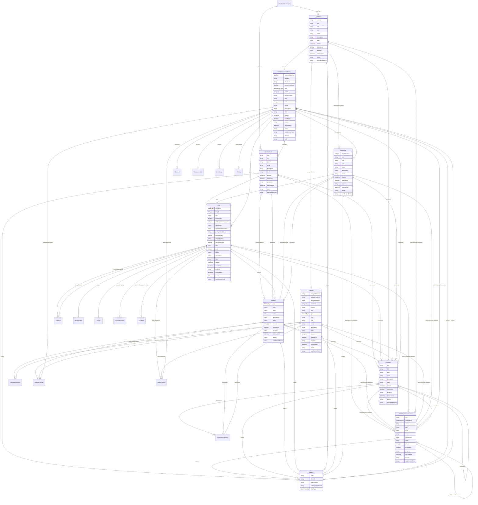

# Class: DataflowRelationship 


_A relationship element that associates a DataAttribute with a Dataflow, reported at the Dataset level_


URI: [odm:class/DataflowRelationship](https://cdisc.org/odm2/class/DataflowRelationship)





<!-- no inheritance hierarchy -->


## Slots

| Name | Cardinality and Range | Description | Inheritance |
| ---  | --- | --- | --- |
| [dataFlow](../slots/dataFlow.md) | 0..1 <br/> [Dataflow](../classes/Dataflow.md) |  | direct |
| [attribute](../slots/attribute.md) | 0..1 <br/> [DataAttribute](../classes/DataAttribute.md) |  | direct |


## Identifier and Mapping Information


### Schema Source


* from schema: https://cdisc.org/define-json


## Mappings

| Mapping Type | Mapped Value |
| ---  | ---  |
| self | odm:DataflowRelationship |
| native | odm:DataflowRelationship |
| exact | sdmx:DataflowRelationship |


## LinkML Source

<!-- TODO: investigate https://stackoverflow.com/questions/37606292/how-to-create-tabbed-code-blocks-in-mkdocs-or-sphinx -->

### Direct

<details>
```yaml
name: DataflowRelationship
description: A relationship element that associates a DataAttribute with a Dataflow,
  reported at the Dataset level
from_schema: https://cdisc.org/define-json
exact_mappings:
- sdmx:DataflowRelationship
attributes:
  dataFlow:
    name: dataFlow
    from_schema: https://cdisc.org/define-json
    rank: 1000
    domain_of:
    - DataflowRelationship
    - ProvisionAgreement
    range: Dataflow
  attribute:
    name: attribute
    from_schema: https://cdisc.org/define-json
    domain_of:
    - Resource
    - MeasureRelationship
    - DataflowRelationship
    - GroupRelationship
    - DimensionRelationship
    - ObservationRelationship
    range: DataAttribute

```
</details>

### Induced

<details>
```yaml
name: DataflowRelationship
description: A relationship element that associates a DataAttribute with a Dataflow,
  reported at the Dataset level
from_schema: https://cdisc.org/define-json
exact_mappings:
- sdmx:DataflowRelationship
attributes:
  dataFlow:
    name: dataFlow
    from_schema: https://cdisc.org/define-json
    rank: 1000
    alias: dataFlow
    owner: DataflowRelationship
    domain_of:
    - DataflowRelationship
    - ProvisionAgreement
    range: Dataflow
  attribute:
    name: attribute
    from_schema: https://cdisc.org/define-json
    alias: attribute
    owner: DataflowRelationship
    domain_of:
    - Resource
    - MeasureRelationship
    - DataflowRelationship
    - GroupRelationship
    - DimensionRelationship
    - ObservationRelationship
    range: DataAttribute

```
</details>