# Class: Dataset 


_A collection element that groups observations sharing the same dimensionality, expressed as a set of unique dimensions within a Data Product context_


URI: [odm:class/Dataset](https://cdisc.org/odm2/class/Dataset)

```mermaid
erDiagram
Dataset {
    string publishedBy  
    stringList keys  
    string datasetType  
    string conformsTo  
    stringList hasPolicy  
    string informationSensitivityClassification  
    string version  
    string href  
    stringList profile  
    string authenticator  
    string action  
    string reportingBegin  
    string reportingEnd  
    string dataExtractionDate  
    string validFrom  
    string validTo  
    string publicationYear  
    string publicationPeriod  
    string OID  
    string uuid  
    string name  
    string description  
    string label  
    stringList aliases  
}
Coding {
    string code  
    string decode  
    string codeSystem  
    string codeSystemVersion  
    AliasPredicate aliasType  
}
Timing {
    TimingType type  
    boolean isNominal  
    string value  
    datetime windowLower  
    datetime windowUpper  
    boolean recalled  
    string frequency  
    string OID  
    string uuid  
    string name  
    string description  
    string label  
    stringList aliases  
}
Method {
    MethodType type  
    string OID  
    string uuid  
    string name  
    string description  
    string label  
    stringList aliases  
    boolean mandatory  
    string purpose  
    datetime lastUpdated  
    string owner  
    string wasDerivedFrom  
}
NominalOccurrence {
    string event  
    string OID  
    string uuid  
    string name  
    string description  
    string label  
    stringList aliases  
    boolean mandatory  
    string purpose  
    datetime lastUpdated  
    string owner  
    string wasDerivedFrom  
}
Distribution {
    string conformsTo  
    string format  
}
DataService {
    string protocol  
    string securitySchemaType  
    string resourceType  
    string attribute  
    string version  
    string href  
    string OID  
    string uuid  
    string name  
    string description  
    string label  
    stringList aliases  
}
DataStructureDefinition {
    boolean evolvingStructure  
    string domain  
    string structure  
    boolean isReferenceData  
    ItemGroupType type  
    stringList children  
    stringList profile  
    string authenticator  
    string OID  
    string uuid  
    string name  
    string description  
    string label  
    stringList aliases  
    boolean mandatory  
    string purpose  
    datetime lastUpdated  
    string owner  
    string wasDerivedFrom  
    string version  
    string href  
}
SiteOrSponsorComment {
    string text  
    OriginSource sourceType  
    string source  
    string OID  
    string uuid  
    string name  
    string description  
    string label  
    stringList aliases  
    boolean mandatory  
    string purpose  
    datetime lastUpdated  
    string owner  
    string wasDerivedFrom  
}
Comment {
    string text  
    string OID  
    string uuid  
    string name  
    string description  
    string label  
    stringList aliases  
    boolean mandatory  
    string purpose  
    datetime lastUpdated  
    string owner  
    string wasDerivedFrom  
}
WhereClause {
    string OID  
    string uuid  
    string name  
    string description  
    string label  
    stringList aliases  
    boolean mandatory  
    string purpose  
    datetime lastUpdated  
    string owner  
    string wasDerivedFrom  
}
ReifiedConcept {
    string version  
    string href  
    string OID  
    string uuid  
    string name  
    string description  
    string label  
    stringList aliases  
    boolean mandatory  
    string purpose  
    datetime lastUpdated  
    string owner  
    string wasDerivedFrom  
}
Item {
    DataType dataType  
    integer length  
    string role  
    boolean hasNoData  
    string crfCompletionInstructions  
    string cdiscNotes  
    string implementationNotes  
    string preSpecifiedValue  
    integer decimalDigits  
    string displayFormat  
    integer significantDigits  
    string OID  
    string uuid  
    string name  
    string description  
    string label  
    stringList aliases  
    boolean mandatory  
    string purpose  
    datetime lastUpdated  
    string owner  
    string wasDerivedFrom  
}
ComponentList {
    stringList components  
    string OID  
    string uuid  
    string name  
    string description  
    string label  
    stringList aliases  
}
DataAttribute {
    string role  
    string OID  
    string uuid  
    string name  
    string description  
    string label  
    stringList aliases  
    boolean mandatory  
    string purpose  
    datetime lastUpdated  
    string owner  
    string wasDerivedFrom  
}
Measure {
    string role  
    string OID  
    string uuid  
    string name  
    string description  
    string label  
    stringList aliases  
    boolean mandatory  
    string purpose  
    datetime lastUpdated  
    string owner  
    string wasDerivedFrom  
}
Dimension {
    integer keySequence  
    string role  
    string OID  
    string uuid  
    string name  
    string description  
    string label  
    stringList aliases  
    boolean mandatory  
    string purpose  
    datetime lastUpdated  
    string owner  
    string wasDerivedFrom  
}
Dataflow {
    string version  
    string href  
    string OID  
    string uuid  
    string name  
    string description  
    string label  
    stringList aliases  
    boolean mandatory  
    string purpose  
    datetime lastUpdated  
    string owner  
    string wasDerivedFrom  
}
Analysis {
    string analysisReason  
    string analysisPurpose  
    string analysisMethod  
    stringList inputData  
    string version  
    string href  
    MethodType type  
    string OID  
    string uuid  
    string name  
    string description  
    string label  
    stringList aliases  
    boolean mandatory  
    string purpose  
    datetime lastUpdated  
    string owner  
    string wasDerivedFrom  
}

Dataset ||--|o Dataflow : "describedBy"
Dataset ||--|o DataStructureDefinition : "structuredBy"
Dataset ||--}o Distribution : "distribution"
Dataset ||--}o Coding : "security"
Dataset ||--|o Timing : "validityPeriod"
Dataset ||--}o Coding : "coding"
Timing ||--|o NominalOccurrence : "relativeTo"
Timing ||--|o NominalOccurrence : "relativeFrom"
Timing ||--|o Method : "imputation"
Timing ||--}o Coding : "coding"
Method ||--}o FormalExpression : "expressions"
Method ||--}o DocumentReference : "documents"
Method ||--|o ReifiedConcept : "implementsConcept"
Method ||--}o Coding : "coding"
Method ||--}o Comment : "comments"
Method ||--}o SiteOrSponsorComment : "siteOrSponsorComments"
NominalOccurrence ||--|| Timing : "timing"
NominalOccurrence ||--}o Condition : "condition"
NominalOccurrence ||--}o Coding : "coding"
NominalOccurrence ||--}o Comment : "comments"
NominalOccurrence ||--}o SiteOrSponsorComment : "siteOrSponsorComments"
Distribution ||--|o DataService : "accessService"
Distribution ||--|o Dataset : "isDistributionOf"
DataService ||--|o Distribution : "isAccessServiceOf"
DataService ||--}o FormalExpression : "selection"
DataService ||--}o Coding : "coding"
DataStructureDefinition ||--}o Dimension : "dimensions"
DataStructureDefinition ||--}o Measure : "measures"
DataStructureDefinition ||--}o DataAttribute : "attributes"
DataStructureDefinition ||--|o ComponentList : "grouping"
DataStructureDefinition ||--}o Item : "items"
DataStructureDefinition ||--|o ReifiedConcept : "implementsConcept"
DataStructureDefinition ||--}o WhereClause : "applicableWhen"
DataStructureDefinition ||--}o Coding : "security"
DataStructureDefinition ||--|o Timing : "validityPeriod"
DataStructureDefinition ||--}o Coding : "coding"
DataStructureDefinition ||--}o Comment : "comments"
DataStructureDefinition ||--}o SiteOrSponsorComment : "siteOrSponsorComments"
SiteOrSponsorComment ||--}o Coding : "coding"
SiteOrSponsorComment ||--}o Comment : "comments"
SiteOrSponsorComment ||--}o SiteOrSponsorComment : "siteOrSponsorComments"
Comment ||--}o DocumentReference : "documents"
Comment ||--}o Coding : "coding"
Comment ||--}o Comment : "comments"
Comment ||--}o SiteOrSponsorComment : "siteOrSponsorComments"
WhereClause ||--}o Condition : "conditions"
WhereClause ||--}o Coding : "coding"
WhereClause ||--}o Comment : "comments"
WhereClause ||--}o SiteOrSponsorComment : "siteOrSponsorComments"
ReifiedConcept ||--}o ConceptProperty : "properties"
ReifiedConcept ||--}o Coding : "coding"
ReifiedConcept ||--}o Comment : "comments"
ReifiedConcept ||--}o SiteOrSponsorComment : "siteOrSponsorComments"
Item ||--|o CodeList : "codeList"
Item ||--|o Method : "method"
Item ||--}o RangeCheck : "rangeChecks"
Item ||--}o WhereClause : "applicableWhen"
Item ||--|o Origin : "origin"
Item ||--|o ConceptProperty : "conceptProperty"
Item ||--|o CodeList : "roleCodeList"
Item ||--|o Condition : "collectionExceptionCondition"
Item ||--}o Coding : "coding"
Item ||--}o Comment : "comments"
Item ||--}o SiteOrSponsorComment : "siteOrSponsorComments"
ComponentList ||--}o Coding : "coding"
DataAttribute ||--|| Item : "item"
DataAttribute ||--|o Method : "missingHandling"
DataAttribute ||--|o Method : "imputation"
DataAttribute ||--}o Coding : "coding"
DataAttribute ||--}o Comment : "comments"
DataAttribute ||--}o SiteOrSponsorComment : "siteOrSponsorComments"
Measure ||--|| Item : "item"
Measure ||--|o Method : "missingHandling"
Measure ||--|o Method : "imputation"
Measure ||--}o Coding : "coding"
Measure ||--}o Comment : "comments"
Measure ||--}o SiteOrSponsorComment : "siteOrSponsorComments"
Dimension ||--|| Item : "item"
Dimension ||--|o Method : "missingHandling"
Dimension ||--|o Method : "imputation"
Dimension ||--}o Coding : "coding"
Dimension ||--}o Comment : "comments"
Dimension ||--}o SiteOrSponsorComment : "siteOrSponsorComments"
Dataflow ||--|| DataStructureDefinition : "structure"
Dataflow ||--}o Dimension : "dimensionConstraint"
Dataflow ||--|o Analysis : "analysisMethod"
Dataflow ||--}o Coding : "coding"
Dataflow ||--}o Comment : "comments"
Dataflow ||--}o SiteOrSponsorComment : "siteOrSponsorComments"
Analysis ||--}o WhereClause : "applicableWhen"
Analysis ||--}o FormalExpression : "expressions"
Analysis ||--}o DocumentReference : "documents"
Analysis ||--|o ReifiedConcept : "implementsConcept"
Analysis ||--}o Coding : "coding"
Analysis ||--}o Comment : "comments"
Analysis ||--}o SiteOrSponsorComment : "siteOrSponsorComments"

```





## Inheritance
* [IdentifiableElement](../classes/IdentifiableElement.md) [ [Identifiable](../classes/Identifiable.md) [Labelled](../classes/Labelled.md)]
    * **Dataset** [ [Versioned](../classes/Versioned.md) [IsProfile](../classes/IsProfile.md) [IsSdmxDataset](../classes/IsSdmxDataset.md)]


## Slots

| Name | Cardinality and Range | Description | Inheritance |
| ---  | --- | --- | --- |
| [describedBy](../slots/describedBy.md) | 0..1 <br/> [Dataflow](../classes/Dataflow.md) | Associates a Dataflow and thereby a Data Structure Definition to the data set. | direct |
| [structuredBy](../slots/structuredBy.md) | 0..1 <br/> [DataStructureDefinition](../classes/DataStructureDefinition.md) | Associates the Data Structure Definition that defines the structure of the Data Set. Note that the Data Structure Definition is the same as that associated (non-mandatory) to the Dataflow. | direct |
| [publishedBy](../slots/publishedBy.md) | 0..1 <br/> [String](../types/String.md)&nbsp;or&nbsp;<br />[Organization](../classes/Organization.md)&nbsp;or&nbsp;<br />[String](../types/String.md) | Associates the Data Provider that reports/publishes the data. | direct |
| [keys](../slots/keys.md) | 1..* <br/> [String](../types/String.md)&nbsp;or&nbsp;<br />[SeriesKey](../classes/SeriesKey.md)&nbsp;or&nbsp;<br />[GroupKey](../classes/GroupKey.md) | Series and Group keys in the data that are associated with dimensions in this structure | direct |
| [datasetType](../slots/datasetType.md) | 0..1 <br/> [String](../types/String.md) | Type or classification of the dataset | direct |
| [distribution](../slots/distribution.md) | * <br/> [Distribution](../classes/Distribution.md) | Representations of this dataset in various formats or access methods | direct |
| [conformsTo](../slots/conformsTo.md) | 0..1 <br/> [String](../types/String.md) | Specification or standard that this dataset conforms to | direct |
| [hasPolicy](../slots/hasPolicy.md) | * <br/> [String](../types/String.md) | Access or usage policy applied to this dataset | direct |
| [informationSensitivityClassification](../slots/informationSensitivityClassification.md) | 0..1 <br/> [String](../types/String.md) | Classification of the dataset's sensitivity or confidentiality | direct |
| [version](../slots/version.md) | 0..1 <br/> [String](../types/String.md) | The version of the external resources | [Versioned](../classes/Versioned.md) |
| [href](../slots/href.md) | 0..1 <br/> [String](../types/String.md) | Machine-readable instructions to obtain the resource e.g. FHIR path, URL | [Versioned](../classes/Versioned.md) |
| [profile](../slots/profile.md) | * <br/> [String](../types/String.md) | Profiles this resource claims to conform to | [IsProfile](../classes/IsProfile.md) |
| [security](../slots/security.md) | * <br/> [Coding](../classes/Coding.md) | Security tags applied to this resource | [IsProfile](../classes/IsProfile.md) |
| [authenticator](../slots/authenticator.md) | 0..1 <br/> [String](../types/String.md)&nbsp;or&nbsp;<br />[User](../classes/User.md)&nbsp;or&nbsp;<br />[Organization](../classes/Organization.md)&nbsp;or&nbsp;<br />[String](../types/String.md) | Who/what authenticated the resource | [IsProfile](../classes/IsProfile.md) |
| [validityPeriod](../slots/validityPeriod.md) | 0..1 <br/> [Timing](../classes/Timing.md) | Time period during which the resouce is valid | [IsProfile](../classes/IsProfile.md) |
| [action](../slots/action.md) | 0..1 <br/> [String](../types/String.md) | Defines the action to be taken by the recipient system (information, append, replace, delete) | [IsSdmxDataset](../classes/IsSdmxDataset.md) |
| [reportingBegin](../slots/reportingBegin.md) | 0..1 <br/> [String](../types/String.md) | A specific time period in a known system of time periods that identifies the start period of a report. | [IsSdmxDataset](../classes/IsSdmxDataset.md) |
| [reportingEnd](../slots/reportingEnd.md) | 0..1 <br/> [String](../types/String.md) | A specific time period in a known system of time periods that identifies the end period of a report. | [IsSdmxDataset](../classes/IsSdmxDataset.md) |
| [dataExtractionDate](../slots/dataExtractionDate.md) | 0..1 <br/> [String](../types/String.md) | A specific time period that identifies the date and time that the data are extracted from a data source. | [IsSdmxDataset](../classes/IsSdmxDataset.md) |
| [validFrom](../slots/validFrom.md) | 0..1 <br/> [String](../types/String.md) | Indicates the inclusive start time indicating the validity of the information in the data set. | [IsSdmxDataset](../classes/IsSdmxDataset.md) |
| [validTo](../slots/validTo.md) | 0..1 <br/> [String](../types/String.md) | Indicates the inclusive end time indicating the validity of the information in the data set. | [IsSdmxDataset](../classes/IsSdmxDataset.md) |
| [publicationYear](../slots/publicationYear.md) | 0..1 <br/> [String](../types/String.md) | Specifies the year of publication of the data or metadata in terms of whatever provisioning agreements might be in force. | [IsSdmxDataset](../classes/IsSdmxDataset.md) |
| [publicationPeriod](../slots/publicationPeriod.md) | 0..1 <br/> [String](../types/String.md) | Specifies the period of publication of the data or metadata in terms of whatever provisioning agreements might be in force. | [IsSdmxDataset](../classes/IsSdmxDataset.md) |
| [OID](../slots/OID.md) | 1 <br/> [String](../types/String.md) | Local identifier within this study/context. Use CDISC OID format for regulatory submissions, or simple strings for internal use. | [Identifiable](../classes/Identifiable.md) |
| [uuid](../slots/uuid.md) | 0..1 <br/> [String](../types/String.md) | Universal unique identifier | [Identifiable](../classes/Identifiable.md) |
| [name](../slots/name.md) | 0..1 <br/> [String](../types/String.md) | Short name or identifier, used for field names | [Labelled](../classes/Labelled.md) |
| [description](../slots/description.md) | 0..1 <br/> [String](../types/String.md)&nbsp;or&nbsp;<br />[String](../types/String.md)&nbsp;or&nbsp;<br />[TranslatedText](../classes/TranslatedText.md) | Detailed description, shown in tooltips | [Labelled](../classes/Labelled.md) |
| [coding](../slots/coding.md) | * <br/> [Coding](../classes/Coding.md) | Semantic tags for this element | [Labelled](../classes/Labelled.md) |
| [label](../slots/label.md) | 0..1 <br/> [String](../types/String.md)&nbsp;or&nbsp;<br />[String](../types/String.md)&nbsp;or&nbsp;<br />[TranslatedText](../classes/TranslatedText.md) | Human-readable label, shown in UIs | [Labelled](../classes/Labelled.md) |
| [aliases](../slots/aliases.md) | * <br/> [String](../types/String.md)&nbsp;or&nbsp;<br />[String](../types/String.md)&nbsp;or&nbsp;<br />[TranslatedText](../classes/TranslatedText.md) | Alternative name or identifier | [Labelled](../classes/Labelled.md) |


## Usages

| used by | used in | type | used |
| ---  | --- | --- | --- |
| [DataProduct](../classes/DataProduct.md) | [inputDataset](../slots/inputDataset.md) | range | [Dataset](../classes/Dataset.md) |
| [DataProduct](../classes/DataProduct.md) | [outputDataset](../slots/outputDataset.md) | range | [Dataset](../classes/Dataset.md) |
| [Distribution](../classes/Distribution.md) | [isDistributionOf](../slots/isDistributionOf.md) | range | [Dataset](../classes/Dataset.md) |
| [Analysis](../classes/Analysis.md) | [inputData](../slots/inputData.md) | any_of[range] | [Dataset](../classes/Dataset.md) |


## Identifier and Mapping Information


### Schema Source


* from schema: https://cdisc.org/define-json


## Mappings

| Mapping Type | Mapped Value |
| ---  | ---  |
| self | odm:Dataset |
| native | odm:Dataset |
| narrow | sdmx:JsonDataset, sdmx:CsvDataset, sdmx:StructureSpecificDataset |
| close | qb:Dataset, sdmx:Dataset, dprod:Dataset, dcat:Dataset |


## LinkML Source

<!-- TODO: investigate https://stackoverflow.com/questions/37606292/how-to-create-tabbed-code-blocks-in-mkdocs-or-sphinx -->

### Direct

<details>
```yaml
name: Dataset
description: A collection element that groups observations sharing the same dimensionality,
  expressed as a set of unique dimensions within a Data Product context
from_schema: https://cdisc.org/define-json
close_mappings:
- qb:Dataset
- sdmx:Dataset
- dprod:Dataset
- dcat:Dataset
narrow_mappings:
- sdmx:JsonDataset
- sdmx:CsvDataset
- sdmx:StructureSpecificDataset
is_a: IdentifiableElement
mixins:
- Versioned
- IsProfile
- IsSdmxDataset
attributes:
  describedBy:
    name: describedBy
    description: Associates a Dataflow and thereby a Data Structure Definition to
      the data set.
    from_schema: https://cdisc.org/define-json
    rank: 1000
    domain_of:
    - Dataset
    - DatasetKey
    range: Dataflow
  structuredBy:
    name: structuredBy
    description: Associates the Data Structure Definition that defines the structure
      of the Data Set. Note that the Data Structure Definition is the same as that
      associated (non-mandatory) to the Dataflow.
    from_schema: https://cdisc.org/define-json
    rank: 1000
    domain_of:
    - Dataset
    range: DataStructureDefinition
  publishedBy:
    name: publishedBy
    description: Associates the Data Provider that reports/publishes the data.
    from_schema: https://cdisc.org/define-json
    domain_of:
    - Dictionary
    - Dataset
    any_of:
    - range: Organization
    - range: string
  keys:
    name: keys
    description: Series and Group keys in the data that are associated with dimensions
      in this structure
    from_schema: https://cdisc.org/define-json
    rank: 1000
    domain_of:
    - Dataset
    required: true
    multivalued: true
    inlined: true
    inlined_as_list: true
    any_of:
    - range: SeriesKey
    - range: GroupKey
  datasetType:
    name: datasetType
    description: Type or classification of the dataset
    from_schema: https://cdisc.org/define-json
    rank: 1000
    domain_of:
    - Dataset
  distribution:
    name: distribution
    description: Representations of this dataset in various formats or access methods
    from_schema: https://cdisc.org/define-json
    exact_mappings:
    - dcat:distribution
    rank: 1000
    domain_of:
    - Dataset
    range: Distribution
    multivalued: true
    inlined: true
    inlined_as_list: true
  conformsTo:
    name: conformsTo
    description: Specification or standard that this dataset conforms to
    from_schema: https://cdisc.org/define-json
    close_mappings:
    - dct:conformsTo
    rank: 1000
    domain_of:
    - Dataset
    - Distribution
  hasPolicy:
    name: hasPolicy
    description: Access or usage policy applied to this dataset
    from_schema: https://cdisc.org/define-json
    rank: 1000
    domain_of:
    - Dataset
    - DataProduct
    multivalued: true
    inlined: true
    inlined_as_list: true
  informationSensitivityClassification:
    name: informationSensitivityClassification
    description: Classification of the dataset's sensitivity or confidentiality
    from_schema: https://cdisc.org/define-json
    rank: 1000
    domain_of:
    - Dataset

```
</details>

### Induced

<details>
```yaml
name: Dataset
description: A collection element that groups observations sharing the same dimensionality,
  expressed as a set of unique dimensions within a Data Product context
from_schema: https://cdisc.org/define-json
close_mappings:
- qb:Dataset
- sdmx:Dataset
- dprod:Dataset
- dcat:Dataset
narrow_mappings:
- sdmx:JsonDataset
- sdmx:CsvDataset
- sdmx:StructureSpecificDataset
is_a: IdentifiableElement
mixins:
- Versioned
- IsProfile
- IsSdmxDataset
attributes:
  describedBy:
    name: describedBy
    description: Associates a Dataflow and thereby a Data Structure Definition to
      the data set.
    from_schema: https://cdisc.org/define-json
    rank: 1000
    alias: describedBy
    owner: Dataset
    domain_of:
    - Dataset
    - DatasetKey
    range: Dataflow
  structuredBy:
    name: structuredBy
    description: Associates the Data Structure Definition that defines the structure
      of the Data Set. Note that the Data Structure Definition is the same as that
      associated (non-mandatory) to the Dataflow.
    from_schema: https://cdisc.org/define-json
    rank: 1000
    alias: structuredBy
    owner: Dataset
    domain_of:
    - Dataset
    range: DataStructureDefinition
  publishedBy:
    name: publishedBy
    description: Associates the Data Provider that reports/publishes the data.
    from_schema: https://cdisc.org/define-json
    alias: publishedBy
    owner: Dataset
    domain_of:
    - Dictionary
    - Dataset
    any_of:
    - range: Organization
    - range: string
  keys:
    name: keys
    description: Series and Group keys in the data that are associated with dimensions
      in this structure
    from_schema: https://cdisc.org/define-json
    rank: 1000
    alias: keys
    owner: Dataset
    domain_of:
    - Dataset
    required: true
    multivalued: true
    inlined: true
    inlined_as_list: true
    any_of:
    - range: SeriesKey
    - range: GroupKey
  datasetType:
    name: datasetType
    description: Type or classification of the dataset
    from_schema: https://cdisc.org/define-json
    rank: 1000
    alias: datasetType
    owner: Dataset
    domain_of:
    - Dataset
  distribution:
    name: distribution
    description: Representations of this dataset in various formats or access methods
    from_schema: https://cdisc.org/define-json
    exact_mappings:
    - dcat:distribution
    rank: 1000
    alias: distribution
    owner: Dataset
    domain_of:
    - Dataset
    range: Distribution
    multivalued: true
    inlined: true
    inlined_as_list: true
  conformsTo:
    name: conformsTo
    description: Specification or standard that this dataset conforms to
    from_schema: https://cdisc.org/define-json
    close_mappings:
    - dct:conformsTo
    rank: 1000
    alias: conformsTo
    owner: Dataset
    domain_of:
    - Dataset
    - Distribution
  hasPolicy:
    name: hasPolicy
    description: Access or usage policy applied to this dataset
    from_schema: https://cdisc.org/define-json
    rank: 1000
    alias: hasPolicy
    owner: Dataset
    domain_of:
    - Dataset
    - DataProduct
    multivalued: true
    inlined: true
    inlined_as_list: true
  informationSensitivityClassification:
    name: informationSensitivityClassification
    description: Classification of the dataset's sensitivity or confidentiality
    from_schema: https://cdisc.org/define-json
    rank: 1000
    alias: informationSensitivityClassification
    owner: Dataset
    domain_of:
    - Dataset
  version:
    name: version
    description: The version of the external resources
    from_schema: https://cdisc.org/define-json
    rank: 1000
    alias: version
    owner: Dataset
    domain_of:
    - Versioned
    - Standard
    range: string
  href:
    name: href
    description: Machine-readable instructions to obtain the resource e.g. FHIR path,
      URL
    from_schema: https://cdisc.org/define-json
    rank: 1000
    alias: href
    owner: Dataset
    domain_of:
    - Versioned
    range: string
    required: false
  profile:
    name: profile
    description: Profiles this resource claims to conform to
    from_schema: https://cdisc.org/define-json
    rank: 1000
    alias: profile
    owner: Dataset
    domain_of:
    - IsProfile
    range: string
    multivalued: true
  security:
    name: security
    description: Security tags applied to this resource
    from_schema: https://cdisc.org/define-json
    rank: 1000
    alias: security
    owner: Dataset
    domain_of:
    - IsProfile
    range: Coding
    multivalued: true
    inlined: true
    inlined_as_list: true
  authenticator:
    name: authenticator
    description: Who/what authenticated the resource
    from_schema: https://cdisc.org/define-json
    rank: 1000
    alias: authenticator
    owner: Dataset
    domain_of:
    - IsProfile
    range: string
    required: false
    any_of:
    - range: User
    - range: Organization
    - range: string
  validityPeriod:
    name: validityPeriod
    description: Time period during which the resouce is valid
    from_schema: https://cdisc.org/define-json
    rank: 1000
    alias: validityPeriod
    owner: Dataset
    domain_of:
    - IsProfile
    range: Timing
    required: false
  action:
    name: action
    description: Defines the action to be taken by the recipient system (information,
      append, replace, delete)
    from_schema: https://cdisc.org/define-json
    rank: 1000
    alias: action
    owner: Dataset
    domain_of:
    - IsSdmxDataset
    range: string
  reportingBegin:
    name: reportingBegin
    description: A specific time period in a known system of time periods that identifies
      the start period of a report.
    from_schema: https://cdisc.org/define-json
    rank: 1000
    alias: reportingBegin
    owner: Dataset
    domain_of:
    - IsSdmxDataset
    range: string
  reportingEnd:
    name: reportingEnd
    description: A specific time period in a known system of time periods that identifies
      the end period of a report.
    from_schema: https://cdisc.org/define-json
    rank: 1000
    alias: reportingEnd
    owner: Dataset
    domain_of:
    - IsSdmxDataset
    range: string
  dataExtractionDate:
    name: dataExtractionDate
    description: A specific time period that identifies the date and time that the
      data are extracted from a data source.
    from_schema: https://cdisc.org/define-json
    rank: 1000
    alias: dataExtractionDate
    owner: Dataset
    domain_of:
    - IsSdmxDataset
    range: string
  validFrom:
    name: validFrom
    description: Indicates the inclusive start time indicating the validity of the
      information in the data set.
    from_schema: https://cdisc.org/define-json
    rank: 1000
    alias: validFrom
    owner: Dataset
    domain_of:
    - IsSdmxDataset
    range: string
  validTo:
    name: validTo
    description: Indicates the inclusive end time indicating the validity of the information
      in the data set.
    from_schema: https://cdisc.org/define-json
    rank: 1000
    alias: validTo
    owner: Dataset
    domain_of:
    - IsSdmxDataset
    range: string
  publicationYear:
    name: publicationYear
    description: Specifies the year of publication of the data or metadata in terms
      of whatever provisioning agreements might be in force.
    from_schema: https://cdisc.org/define-json
    rank: 1000
    alias: publicationYear
    owner: Dataset
    domain_of:
    - IsSdmxDataset
    range: string
  publicationPeriod:
    name: publicationPeriod
    description: Specifies the period of publication of the data or metadata in terms
      of whatever provisioning agreements might be in force.
    from_schema: https://cdisc.org/define-json
    rank: 1000
    alias: publicationPeriod
    owner: Dataset
    domain_of:
    - IsSdmxDataset
    range: string
  OID:
    name: OID
    description: Local identifier within this study/context. Use CDISC OID format
      for regulatory submissions, or simple strings for internal use.
    from_schema: https://cdisc.org/define-json
    rank: 1000
    identifier: true
    alias: OID
    owner: Dataset
    domain_of:
    - Identifiable
    range: string
    required: true
    pattern: ^[A-Za-z][A-Za-z0-9._-]*$
  uuid:
    name: uuid
    description: Universal unique identifier
    from_schema: https://cdisc.org/define-json
    rank: 1000
    alias: uuid
    owner: Dataset
    domain_of:
    - Identifiable
    range: string
  name:
    name: name
    description: Short name or identifier, used for field names
    from_schema: https://cdisc.org/define-json
    rank: 1000
    alias: name
    owner: Dataset
    domain_of:
    - Labelled
    - Standard
    range: string
  description:
    name: description
    description: Detailed description, shown in tooltips
    from_schema: https://cdisc.org/define-json
    rank: 1000
    alias: description
    owner: Dataset
    domain_of:
    - Labelled
    - CodeListItem
    range: string
    any_of:
    - range: string
    - range: TranslatedText
  coding:
    name: coding
    description: Semantic tags for this element
    from_schema: https://cdisc.org/define-json
    rank: 1000
    alias: coding
    owner: Dataset
    domain_of:
    - Labelled
    - CodeListItem
    - SourceItem
    range: Coding
    multivalued: true
    inlined: true
    inlined_as_list: true
  label:
    name: label
    description: Human-readable label, shown in UIs
    from_schema: https://cdisc.org/define-json
    exact_mappings:
    - skos:prefLabel
    rank: 1000
    alias: label
    owner: Dataset
    domain_of:
    - Labelled
    range: string
    any_of:
    - range: string
    - range: TranslatedText
  aliases:
    name: aliases
    description: Alternative name or identifier
    from_schema: https://cdisc.org/define-json
    exact_mappings:
    - skos:altLabel
    rank: 1000
    alias: aliases
    owner: Dataset
    domain_of:
    - Labelled
    - CodeListItem
    range: string
    multivalued: true
    inlined: true
    inlined_as_list: true
    any_of:
    - range: string
    - range: TranslatedText

```
</details>