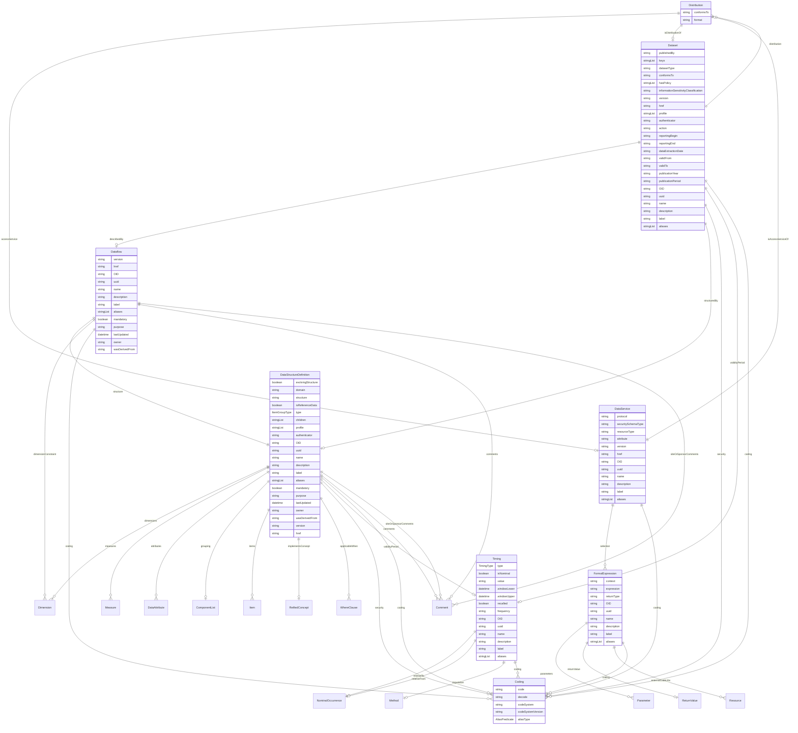

# Class: Distribution 


_A technical representation that provides a specific format or access method for a dataset_


URI: [odm:class/Distribution](https://cdisc.org/odm2/class/Distribution)





<!-- no inheritance hierarchy -->


## Slots

| Name | Cardinality and Range | Description | Inheritance |
| ---  | --- | --- | --- |
| [accessService](../slots/accessService.md) | 0..1 <br/> [DataService](../classes/DataService.md) | Service that provides access to this distribution | direct |
| [conformsTo](../slots/conformsTo.md) | 0..1 <br/> [String](../types/String.md)&nbsp;or&nbsp;<br />[String](../types/String.md)&nbsp;or&nbsp;<br />[DataStructureDefinition](../classes/DataStructureDefinition.md) | The standard or specification the distribution conforms to | direct |
| [isDistributionOf](../slots/isDistributionOf.md) | 0..1 <br/> [Dataset](../classes/Dataset.md) | Dataset this distribution represents | direct |
| [format](../slots/format.md) | 0..1 <br/> [String](../types/String.md) | File format or serialization used in the distribution | direct |


## Usages

| used by | used in | type | used |
| ---  | --- | --- | --- |
| [Dataset](../classes/Dataset.md) | [distribution](../slots/distribution.md) | range | [Distribution](../classes/Distribution.md) |
| [DataService](../classes/DataService.md) | [isAccessServiceOf](../slots/isAccessServiceOf.md) | range | [Distribution](../classes/Distribution.md) |


## Identifier and Mapping Information


### Schema Source


* from schema: https://cdisc.org/define-json


## Mappings

| Mapping Type | Mapped Value |
| ---  | ---  |
| self | odm:Distribution |
| native | odm:Distribution |
| exact | dprod:Distribution, dcat:Distribution |
| narrow | sdmx:JsonDataset, sdmx:CsvDataset, sdmx:StructureSpecificDataset |


## LinkML Source

<!-- TODO: investigate https://stackoverflow.com/questions/37606292/how-to-create-tabbed-code-blocks-in-mkdocs-or-sphinx -->

### Direct

<details>
```yaml
name: Distribution
description: A technical representation that provides a specific format or access
  method for a dataset
from_schema: https://cdisc.org/define-json
exact_mappings:
- dprod:Distribution
- dcat:Distribution
narrow_mappings:
- sdmx:JsonDataset
- sdmx:CsvDataset
- sdmx:StructureSpecificDataset
attributes:
  accessService:
    name: accessService
    description: Service that provides access to this distribution
    from_schema: https://cdisc.org/define-json
    rank: 1000
    domain_of:
    - Distribution
    range: DataService
  conformsTo:
    name: conformsTo
    description: The standard or specification the distribution conforms to
    from_schema: https://cdisc.org/define-json
    domain_of:
    - Dataset
    - Distribution
    any_of:
    - range: string
    - range: DataStructureDefinition
  isDistributionOf:
    name: isDistributionOf
    description: Dataset this distribution represents
    from_schema: https://cdisc.org/define-json
    rank: 1000
    domain_of:
    - Distribution
    range: Dataset
  format:
    name: format
    description: File format or serialization used in the distribution
    from_schema: https://cdisc.org/define-json
    rank: 1000
    domain_of:
    - Distribution

```
</details>

### Induced

<details>
```yaml
name: Distribution
description: A technical representation that provides a specific format or access
  method for a dataset
from_schema: https://cdisc.org/define-json
exact_mappings:
- dprod:Distribution
- dcat:Distribution
narrow_mappings:
- sdmx:JsonDataset
- sdmx:CsvDataset
- sdmx:StructureSpecificDataset
attributes:
  accessService:
    name: accessService
    description: Service that provides access to this distribution
    from_schema: https://cdisc.org/define-json
    rank: 1000
    alias: accessService
    owner: Distribution
    domain_of:
    - Distribution
    range: DataService
  conformsTo:
    name: conformsTo
    description: The standard or specification the distribution conforms to
    from_schema: https://cdisc.org/define-json
    alias: conformsTo
    owner: Distribution
    domain_of:
    - Dataset
    - Distribution
    any_of:
    - range: string
    - range: DataStructureDefinition
  isDistributionOf:
    name: isDistributionOf
    description: Dataset this distribution represents
    from_schema: https://cdisc.org/define-json
    rank: 1000
    alias: isDistributionOf
    owner: Distribution
    domain_of:
    - Distribution
    range: Dataset
  format:
    name: format
    description: File format or serialization used in the distribution
    from_schema: https://cdisc.org/define-json
    rank: 1000
    alias: format
    owner: Distribution
    domain_of:
    - Distribution

```
</details>