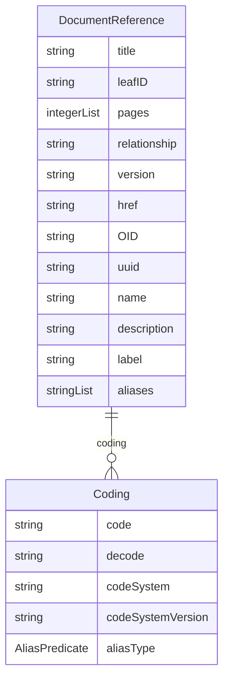

# Class: DocumentReference 


_A comprehensive reference element that points to an external document, combining elements from ODM and FHIR_


URI: [odm:class/DocumentReference](https://cdisc.org/odm2/class/DocumentReference)





## Inheritance
* [IdentifiableElement](../classes/IdentifiableElement.md) [ [Identifiable](../classes/Identifiable.md) [Labelled](../classes/Labelled.md)]
    * **DocumentReference** [ [Versioned](../classes/Versioned.md)]


## Slots

| Name | Cardinality and Range | Description | Inheritance |
| ---  | --- | --- | --- |
| [title](../slots/title.md) | 0..1 <br/> [String](../types/String.md) | Document title | direct |
| [leafID](../slots/leafID.md) | 0..1 <br/> [String](../types/String.md) | Leaf identifier for document reference in Define-XML | direct |
| [pages](../slots/pages.md) | * <br/> [Integer](../types/Integer.md) | Reference to specific pages in a PDF document | direct |
| [relationship](../slots/relationship.md) | 0..1 <br/> [String](../types/String.md) | Relationship to the referencing entity | direct |
| [version](../slots/version.md) | 0..1 <br/> [String](../types/String.md) | The version of the external resources | [Versioned](../classes/Versioned.md) |
| [href](../slots/href.md) | 0..1 <br/> [String](../types/String.md) | Machine-readable instructions to obtain the resource e.g. FHIR path, URL | [Versioned](../classes/Versioned.md) |
| [OID](../slots/OID.md) | 1 <br/> [String](../types/String.md) | Local identifier within this study/context. Use CDISC OID format for regulatory submissions, or simple strings for internal use. | [Identifiable](../classes/Identifiable.md) |
| [uuid](../slots/uuid.md) | 0..1 <br/> [String](../types/String.md) | Universal unique identifier | [Identifiable](../classes/Identifiable.md) |
| [name](../slots/name.md) | 0..1 <br/> [String](../types/String.md) | Short name or identifier, used for field names | [Labelled](../classes/Labelled.md) |
| [description](../slots/description.md) | 0..1 <br/> [String](../types/String.md)&nbsp;or&nbsp;<br />[String](../types/String.md)&nbsp;or&nbsp;<br />[TranslatedText](../classes/TranslatedText.md) | Detailed description, shown in tooltips | [Labelled](../classes/Labelled.md) |
| [coding](../slots/coding.md) | * <br/> [Coding](../classes/Coding.md) | Semantic tags for this element | [Labelled](../classes/Labelled.md) |
| [label](../slots/label.md) | 0..1 <br/> [String](../types/String.md)&nbsp;or&nbsp;<br />[String](../types/String.md)&nbsp;or&nbsp;<br />[TranslatedText](../classes/TranslatedText.md) | Human-readable label, shown in UIs | [Labelled](../classes/Labelled.md) |
| [aliases](../slots/aliases.md) | * <br/> [String](../types/String.md)&nbsp;or&nbsp;<br />[String](../types/String.md)&nbsp;or&nbsp;<br />[TranslatedText](../classes/TranslatedText.md) | Alternative name or identifier | [Labelled](../classes/Labelled.md) |


## Usages

| used by | used in | type | used |
| ---  | --- | --- | --- |
| [MetaDataVersion](../classes/MetaDataVersion.md) | [resources](../slots/resources.md) | any_of[range] | [DocumentReference](../classes/DocumentReference.md) |
| [MetaDataVersion](../classes/MetaDataVersion.md) | [annotatedCRFs](../slots/annotatedCRFs.md) | range | [DocumentReference](../classes/DocumentReference.md) |
| [Comment](../classes/Comment.md) | [documents](../slots/documents.md) | range | [DocumentReference](../classes/DocumentReference.md) |
| [Method](../classes/Method.md) | [document](../slots/document.md) | range | [DocumentReference](../classes/DocumentReference.md) |
| [SourceItem](../classes/SourceItem.md) | [document](../slots/document.md) | range | [DocumentReference](../classes/DocumentReference.md) |
| [Origin](../classes/Origin.md) | [document](../slots/document.md) | range | [DocumentReference](../classes/DocumentReference.md) |


## Identifier and Mapping Information


### Schema Source


* from schema: https://cdisc.org/define-json


## Mappings

| Mapping Type | Mapped Value |
| ---  | ---  |
| self | odm:DocumentReference |
| native | odm:DocumentReference |


## LinkML Source

<!-- TODO: investigate https://stackoverflow.com/questions/37606292/how-to-create-tabbed-code-blocks-in-mkdocs-or-sphinx -->

### Direct

<details>
```yaml
name: DocumentReference
description: A comprehensive reference element that points to an external document,
  combining elements from ODM and FHIR
from_schema: https://cdisc.org/define-json
is_a: IdentifiableElement
mixins:
- Versioned
attributes:
  title:
    name: title
    description: Document title
    from_schema: https://cdisc.org/define-json
    rank: 1000
    domain_of:
    - DocumentReference
    range: string
  leafID:
    name: leafID
    description: Leaf identifier for document reference in Define-XML
    from_schema: https://cdisc.org/define-json
    rank: 1000
    domain_of:
    - DocumentReference
    range: string
  pages:
    name: pages
    description: Reference to specific pages in a PDF document
    from_schema: https://cdisc.org/define-json
    rank: 1000
    domain_of:
    - DocumentReference
    range: integer
    required: false
    multivalued: true
  relationship:
    name: relationship
    description: Relationship to the referencing entity
    from_schema: https://cdisc.org/define-json
    rank: 1000
    domain_of:
    - DocumentReference
    range: string
    required: false

```
</details>

### Induced

<details>
```yaml
name: DocumentReference
description: A comprehensive reference element that points to an external document,
  combining elements from ODM and FHIR
from_schema: https://cdisc.org/define-json
is_a: IdentifiableElement
mixins:
- Versioned
attributes:
  title:
    name: title
    description: Document title
    from_schema: https://cdisc.org/define-json
    rank: 1000
    alias: title
    owner: DocumentReference
    domain_of:
    - DocumentReference
    range: string
  leafID:
    name: leafID
    description: Leaf identifier for document reference in Define-XML
    from_schema: https://cdisc.org/define-json
    rank: 1000
    alias: leafID
    owner: DocumentReference
    domain_of:
    - DocumentReference
    range: string
  pages:
    name: pages
    description: Reference to specific pages in a PDF document
    from_schema: https://cdisc.org/define-json
    rank: 1000
    alias: pages
    owner: DocumentReference
    domain_of:
    - DocumentReference
    range: integer
    required: false
    multivalued: true
  relationship:
    name: relationship
    description: Relationship to the referencing entity
    from_schema: https://cdisc.org/define-json
    rank: 1000
    alias: relationship
    owner: DocumentReference
    domain_of:
    - DocumentReference
    range: string
    required: false
  version:
    name: version
    description: The version of the external resources
    from_schema: https://cdisc.org/define-json
    rank: 1000
    alias: version
    owner: DocumentReference
    domain_of:
    - Versioned
    - Standard
    range: string
  href:
    name: href
    description: Machine-readable instructions to obtain the resource e.g. FHIR path,
      URL
    from_schema: https://cdisc.org/define-json
    rank: 1000
    alias: href
    owner: DocumentReference
    domain_of:
    - Versioned
    range: string
    required: false
  OID:
    name: OID
    description: Local identifier within this study/context. Use CDISC OID format
      for regulatory submissions, or simple strings for internal use.
    from_schema: https://cdisc.org/define-json
    rank: 1000
    identifier: true
    alias: OID
    owner: DocumentReference
    domain_of:
    - Identifiable
    range: string
    required: true
    pattern: ^[A-Za-z][A-Za-z0-9._-]*$
  uuid:
    name: uuid
    description: Universal unique identifier
    from_schema: https://cdisc.org/define-json
    rank: 1000
    alias: uuid
    owner: DocumentReference
    domain_of:
    - Identifiable
    range: string
  name:
    name: name
    description: Short name or identifier, used for field names
    from_schema: https://cdisc.org/define-json
    rank: 1000
    alias: name
    owner: DocumentReference
    domain_of:
    - Labelled
    - Standard
    range: string
  description:
    name: description
    description: Detailed description, shown in tooltips
    from_schema: https://cdisc.org/define-json
    rank: 1000
    alias: description
    owner: DocumentReference
    domain_of:
    - Labelled
    - CodeListItem
    range: string
    any_of:
    - range: string
    - range: TranslatedText
  coding:
    name: coding
    description: Semantic tags for this element
    from_schema: https://cdisc.org/define-json
    rank: 1000
    alias: coding
    owner: DocumentReference
    domain_of:
    - Labelled
    - CodeListItem
    - SourceItem
    range: Coding
    multivalued: true
    inlined: true
    inlined_as_list: true
  label:
    name: label
    description: Human-readable label, shown in UIs
    from_schema: https://cdisc.org/define-json
    exact_mappings:
    - skos:prefLabel
    rank: 1000
    alias: label
    owner: DocumentReference
    domain_of:
    - Labelled
    range: string
    any_of:
    - range: string
    - range: TranslatedText
  aliases:
    name: aliases
    description: Alternative name or identifier
    from_schema: https://cdisc.org/define-json
    exact_mappings:
    - skos:altLabel
    rank: 1000
    alias: aliases
    owner: DocumentReference
    domain_of:
    - Labelled
    - CodeListItem
    range: string
    multivalued: true
    inlined: true
    inlined_as_list: true
    any_of:
    - range: string
    - range: TranslatedText

```
</details>