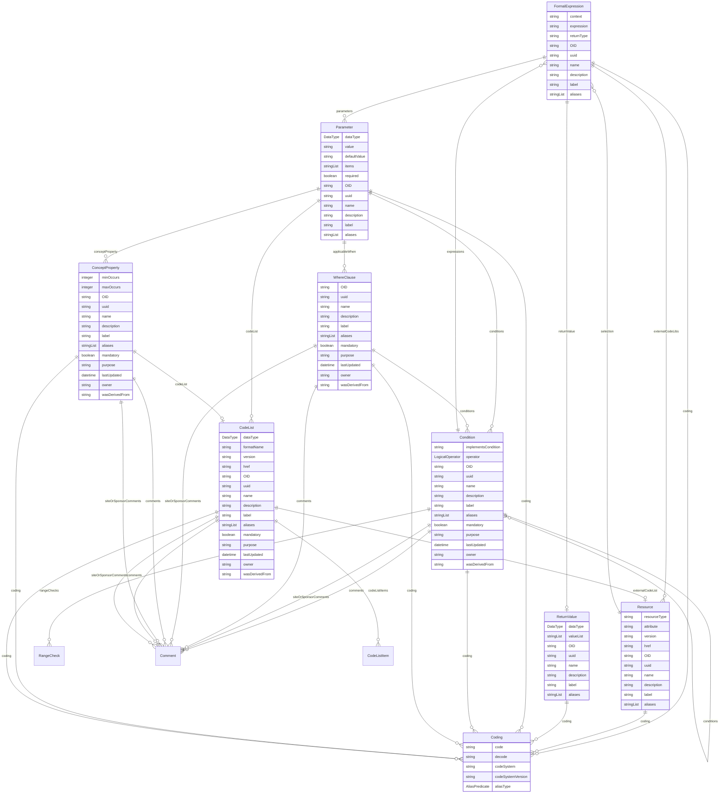

# Class: FormalExpression 


_A computational element that defines the execution of a data derivation within a specific context_


URI: [odm:class/FormalExpression](https://cdisc.org/odm2/class/FormalExpression)





## Inheritance
* [IdentifiableElement](../classes/IdentifiableElement.md) [ [Identifiable](../classes/Identifiable.md) [Labelled](../classes/Labelled.md)]
    * **FormalExpression**


## Slots

| Name | Cardinality and Range | Description | Inheritance |
| ---  | --- | --- | --- |
| [context](../slots/context.md) | 0..1 <br/> [String](../types/String.md) | The specific context within the containing element to which this formal expression applies. | direct |
| [expression](../slots/expression.md) | 1 <br/> [String](../types/String.md) | The actual text of the formal expression (renamed from 'code' for disambiguation). | direct |
| [returnType](../slots/returnType.md) | 0..1 <br/> [String](../types/String.md) | Return type of the expression | direct |
| [parameters](../slots/parameters.md) | * <br/> [Parameter](../classes/Parameter.md) | Parameters used in the expression | direct |
| [returnValue](../slots/returnValue.md) | 0..1 <br/> [ReturnValue](../classes/ReturnValue.md) | Return value details | direct |
| [externalCodeLibs](../slots/externalCodeLibs.md) | * <br/> [Resource](../classes/Resource.md) | External code libraries referenced | direct |
| [OID](../slots/OID.md) | 1 <br/> [String](../types/String.md) | Local identifier within this study/context. Use CDISC OID format for regulatory submissions, or simple strings for internal use. | [Identifiable](../classes/Identifiable.md) |
| [uuid](../slots/uuid.md) | 0..1 <br/> [String](../types/String.md) | Universal unique identifier | [Identifiable](../classes/Identifiable.md) |
| [name](../slots/name.md) | 0..1 <br/> [String](../types/String.md) | Short name or identifier, used for field names | [Labelled](../classes/Labelled.md) |
| [description](../slots/description.md) | 0..1 <br/> [String](../types/String.md)&nbsp;or&nbsp;<br />[String](../types/String.md)&nbsp;or&nbsp;<br />[TranslatedText](../classes/TranslatedText.md) | Detailed description, shown in tooltips | [Labelled](../classes/Labelled.md) |
| [coding](../slots/coding.md) | * <br/> [Coding](../classes/Coding.md) | Semantic tags for this element | [Labelled](../classes/Labelled.md) |
| [label](../slots/label.md) | 0..1 <br/> [String](../types/String.md)&nbsp;or&nbsp;<br />[String](../types/String.md)&nbsp;or&nbsp;<br />[TranslatedText](../classes/TranslatedText.md) | Human-readable label, shown in UIs | [Labelled](../classes/Labelled.md) |
| [aliases](../slots/aliases.md) | * <br/> [String](../types/String.md)&nbsp;or&nbsp;<br />[String](../types/String.md)&nbsp;or&nbsp;<br />[TranslatedText](../classes/TranslatedText.md) | Alternative name or identifier | [Labelled](../classes/Labelled.md) |


## Usages

| used by | used in | type | used |
| ---  | --- | --- | --- |
| [Condition](../classes/Condition.md) | [expressions](../slots/expressions.md) | range | [FormalExpression](../classes/FormalExpression.md) |
| [RangeCheck](../classes/RangeCheck.md) | [expressions](../slots/expressions.md) | range | [FormalExpression](../classes/FormalExpression.md) |
| [Method](../classes/Method.md) | [expressions](../slots/expressions.md) | range | [FormalExpression](../classes/FormalExpression.md) |
| [Resource](../classes/Resource.md) | [selection](../slots/selection.md) | range | [FormalExpression](../classes/FormalExpression.md) |
| [DataService](../classes/DataService.md) | [selection](../slots/selection.md) | range | [FormalExpression](../classes/FormalExpression.md) |


## Identifier and Mapping Information


### Schema Source


* from schema: https://cdisc.org/define-json


## Mappings

| Mapping Type | Mapped Value |
| ---  | ---  |
| self | odm:FormalExpression |
| native | odm:FormalExpression |
| exact | odm:FormalExpression, odm:FormalExpressionRef, fhir:Expression |


## LinkML Source

<!-- TODO: investigate https://stackoverflow.com/questions/37606292/how-to-create-tabbed-code-blocks-in-mkdocs-or-sphinx -->

### Direct

<details>
```yaml
name: FormalExpression
description: A computational element that defines the execution of a data derivation
  within a specific context
from_schema: https://cdisc.org/define-json
exact_mappings:
- odm:FormalExpression
- odm:FormalExpressionRef
- fhir:Expression
is_a: IdentifiableElement
attributes:
  context:
    name: context
    description: The specific context within the containing element to which this
      formal expression applies.
    from_schema: https://cdisc.org/define-json
    exact_mappings:
    - fhir:Expression/language
    domain_of:
    - ODMFileMetadata
    - FormalExpression
    range: string
  expression:
    name: expression
    description: The actual text of the formal expression (renamed from 'code' for
      disambiguation).
    from_schema: https://cdisc.org/define-json
    rank: 1000
    domain_of:
    - FormalExpression
    range: string
    required: true
  returnType:
    name: returnType
    description: Return type of the expression
    from_schema: https://cdisc.org/define-json
    rank: 1000
    domain_of:
    - FormalExpression
    range: string
  parameters:
    name: parameters
    description: Parameters used in the expression
    from_schema: https://cdisc.org/define-json
    rank: 1000
    domain_of:
    - FormalExpression
    range: Parameter
    multivalued: true
    inlined: true
    inlined_as_list: true
  returnValue:
    name: returnValue
    description: Return value details
    from_schema: https://cdisc.org/define-json
    rank: 1000
    domain_of:
    - FormalExpression
    range: ReturnValue
  externalCodeLibs:
    name: externalCodeLibs
    description: External code libraries referenced
    from_schema: https://cdisc.org/define-json
    rank: 1000
    domain_of:
    - FormalExpression
    range: Resource
    multivalued: true

```
</details>

### Induced

<details>
```yaml
name: FormalExpression
description: A computational element that defines the execution of a data derivation
  within a specific context
from_schema: https://cdisc.org/define-json
exact_mappings:
- odm:FormalExpression
- odm:FormalExpressionRef
- fhir:Expression
is_a: IdentifiableElement
attributes:
  context:
    name: context
    description: The specific context within the containing element to which this
      formal expression applies.
    from_schema: https://cdisc.org/define-json
    exact_mappings:
    - fhir:Expression/language
    alias: context
    owner: FormalExpression
    domain_of:
    - ODMFileMetadata
    - FormalExpression
    range: string
  expression:
    name: expression
    description: The actual text of the formal expression (renamed from 'code' for
      disambiguation).
    from_schema: https://cdisc.org/define-json
    rank: 1000
    alias: expression
    owner: FormalExpression
    domain_of:
    - FormalExpression
    range: string
    required: true
  returnType:
    name: returnType
    description: Return type of the expression
    from_schema: https://cdisc.org/define-json
    rank: 1000
    alias: returnType
    owner: FormalExpression
    domain_of:
    - FormalExpression
    range: string
  parameters:
    name: parameters
    description: Parameters used in the expression
    from_schema: https://cdisc.org/define-json
    rank: 1000
    alias: parameters
    owner: FormalExpression
    domain_of:
    - FormalExpression
    range: Parameter
    multivalued: true
    inlined: true
    inlined_as_list: true
  returnValue:
    name: returnValue
    description: Return value details
    from_schema: https://cdisc.org/define-json
    rank: 1000
    alias: returnValue
    owner: FormalExpression
    domain_of:
    - FormalExpression
    range: ReturnValue
  externalCodeLibs:
    name: externalCodeLibs
    description: External code libraries referenced
    from_schema: https://cdisc.org/define-json
    rank: 1000
    alias: externalCodeLibs
    owner: FormalExpression
    domain_of:
    - FormalExpression
    range: Resource
    multivalued: true
  OID:
    name: OID
    description: Local identifier within this study/context. Use CDISC OID format
      for regulatory submissions, or simple strings for internal use.
    from_schema: https://cdisc.org/define-json
    rank: 1000
    identifier: true
    alias: OID
    owner: FormalExpression
    domain_of:
    - Identifiable
    range: string
    required: true
    pattern: ^[A-Za-z][A-Za-z0-9._-]*$
  uuid:
    name: uuid
    description: Universal unique identifier
    from_schema: https://cdisc.org/define-json
    rank: 1000
    alias: uuid
    owner: FormalExpression
    domain_of:
    - Identifiable
    range: string
  name:
    name: name
    description: Short name or identifier, used for field names
    from_schema: https://cdisc.org/define-json
    rank: 1000
    alias: name
    owner: FormalExpression
    domain_of:
    - Labelled
    - Standard
    range: string
  description:
    name: description
    description: Detailed description, shown in tooltips
    from_schema: https://cdisc.org/define-json
    rank: 1000
    alias: description
    owner: FormalExpression
    domain_of:
    - Labelled
    - CodeListItem
    range: string
    any_of:
    - range: string
    - range: TranslatedText
  coding:
    name: coding
    description: Semantic tags for this element
    from_schema: https://cdisc.org/define-json
    rank: 1000
    alias: coding
    owner: FormalExpression
    domain_of:
    - Labelled
    - CodeListItem
    - SourceItem
    range: Coding
    multivalued: true
    inlined: true
    inlined_as_list: true
  label:
    name: label
    description: Human-readable label, shown in UIs
    from_schema: https://cdisc.org/define-json
    exact_mappings:
    - skos:prefLabel
    rank: 1000
    alias: label
    owner: FormalExpression
    domain_of:
    - Labelled
    range: string
    any_of:
    - range: string
    - range: TranslatedText
  aliases:
    name: aliases
    description: Alternative name or identifier
    from_schema: https://cdisc.org/define-json
    exact_mappings:
    - skos:altLabel
    rank: 1000
    alias: aliases
    owner: FormalExpression
    domain_of:
    - Labelled
    - CodeListItem
    range: string
    multivalued: true
    inlined: true
    inlined_as_list: true
    any_of:
    - range: string
    - range: TranslatedText

```
</details>