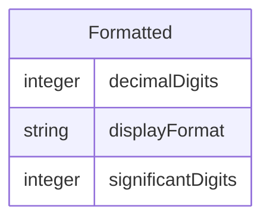

# Class: Formatted 


_A mixin that provides slots for reporting, exchange, or storage formatting_


URI: [odm:class/Formatted](https://cdisc.org/odm2/class/Formatted)





<!-- no inheritance hierarchy -->


## Slots

| Name | Cardinality and Range | Description | Inheritance |
| ---  | --- | --- | --- |
| [decimalDigits](../slots/decimalDigits.md) | 0..1 <br/> [Integer](../types/Integer.md) | For decimal values, the number of digits after the decimal point | direct |
| [displayFormat](../slots/displayFormat.md) | 0..1 <br/> [String](../types/String.md) | A display format for the item | direct |
| [significantDigits](../slots/significantDigits.md) | 0..1 <br/> [Integer](../types/Integer.md) | For numeric values, the number of significant digits | direct |


## Mixin Usage

| mixed into | description |
| --- | --- |
| [Item](../classes/Item.md) | A data element that represents a specific piece of information within a defined context, with data type, constraints, and derivation methods |


## Identifier and Mapping Information


### Schema Source


* from schema: https://cdisc.org/define-json


## Mappings

| Mapping Type | Mapped Value |
| ---  | ---  |
| self | odm:Formatted |
| native | odm:Formatted |
| related | sdmx:Facet, sdmx:Representation |


## LinkML Source

<!-- TODO: investigate https://stackoverflow.com/questions/37606292/how-to-create-tabbed-code-blocks-in-mkdocs-or-sphinx -->

### Direct

<details>
```yaml
name: Formatted
description: A mixin that provides slots for reporting, exchange, or storage formatting
from_schema: https://cdisc.org/define-json
related_mappings:
- sdmx:Facet
- sdmx:Representation
mixin: true
attributes:
  decimalDigits:
    name: decimalDigits
    description: For decimal values, the number of digits after the decimal point
    from_schema: https://cdisc.org/define-json
    rank: 1000
    domain_of:
    - Formatted
    range: integer
  displayFormat:
    name: displayFormat
    description: A display format for the item
    from_schema: https://cdisc.org/define-json
    rank: 1000
    domain_of:
    - Formatted
    range: string
  significantDigits:
    name: significantDigits
    description: For numeric values, the number of significant digits
    from_schema: https://cdisc.org/define-json
    rank: 1000
    domain_of:
    - Formatted
    range: integer

```
</details>

### Induced

<details>
```yaml
name: Formatted
description: A mixin that provides slots for reporting, exchange, or storage formatting
from_schema: https://cdisc.org/define-json
related_mappings:
- sdmx:Facet
- sdmx:Representation
mixin: true
attributes:
  decimalDigits:
    name: decimalDigits
    description: For decimal values, the number of digits after the decimal point
    from_schema: https://cdisc.org/define-json
    rank: 1000
    alias: decimalDigits
    owner: Formatted
    domain_of:
    - Formatted
    range: integer
  displayFormat:
    name: displayFormat
    description: A display format for the item
    from_schema: https://cdisc.org/define-json
    rank: 1000
    alias: displayFormat
    owner: Formatted
    domain_of:
    - Formatted
    range: string
  significantDigits:
    name: significantDigits
    description: For numeric values, the number of significant digits
    from_schema: https://cdisc.org/define-json
    rank: 1000
    alias: significantDigits
    owner: Formatted
    domain_of:
    - Formatted
    range: integer

```
</details>