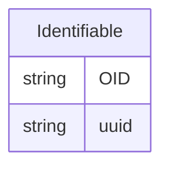

# Class: Identifiable 


_A mixin that provides slots for making an entity addressable within a study or context_


URI: [odm:class/Identifiable](https://cdisc.org/odm2/class/Identifiable)





<!-- no inheritance hierarchy -->


## Slots

| Name | Cardinality and Range | Description | Inheritance |
| ---  | --- | --- | --- |
| [OID](../slots/OID.md) | 1 <br/> [String](../types/String.md) | Local identifier within this study/context | direct |
| [uuid](../slots/uuid.md) | 0..1 <br/> [String](../types/String.md) | Universal unique identifier | direct |


## Mixin Usage

| mixed into | description |
| --- | --- |
| [IdentifiableElement](../classes/IdentifiableElement.md) |  |
| [GovernedElement](../classes/GovernedElement.md) |  |


## Identifier and Mapping Information


### Schema Source


* from schema: https://cdisc.org/define-json


## Mappings

| Mapping Type | Mapped Value |
| ---  | ---  |
| self | odm:Identifiable |
| native | odm:Identifiable |


## LinkML Source

<!-- TODO: investigate https://stackoverflow.com/questions/37606292/how-to-create-tabbed-code-blocks-in-mkdocs-or-sphinx -->

### Direct

<details>
```yaml
name: Identifiable
description: A mixin that provides slots for making an entity addressable within a
  study or context
from_schema: https://cdisc.org/define-json
mixin: true
attributes:
  OID:
    name: OID
    description: Local identifier within this study/context. Use CDISC OID format
      for regulatory submissions, or simple strings for internal use.
    from_schema: https://cdisc.org/define-json
    rank: 1000
    identifier: true
    domain_of:
    - Identifiable
    range: string
    required: true
    pattern: ^[A-Za-z][A-Za-z0-9._-]*$
  uuid:
    name: uuid
    description: Universal unique identifier
    from_schema: https://cdisc.org/define-json
    rank: 1000
    domain_of:
    - Identifiable
    range: string

```
</details>

### Induced

<details>
```yaml
name: Identifiable
description: A mixin that provides slots for making an entity addressable within a
  study or context
from_schema: https://cdisc.org/define-json
mixin: true
attributes:
  OID:
    name: OID
    description: Local identifier within this study/context. Use CDISC OID format
      for regulatory submissions, or simple strings for internal use.
    from_schema: https://cdisc.org/define-json
    rank: 1000
    identifier: true
    alias: OID
    owner: Identifiable
    domain_of:
    - Identifiable
    range: string
    required: true
    pattern: ^[A-Za-z][A-Za-z0-9._-]*$
  uuid:
    name: uuid
    description: Universal unique identifier
    from_schema: https://cdisc.org/define-json
    rank: 1000
    alias: uuid
    owner: Identifiable
    domain_of:
    - Identifiable
    range: string

```
</details>