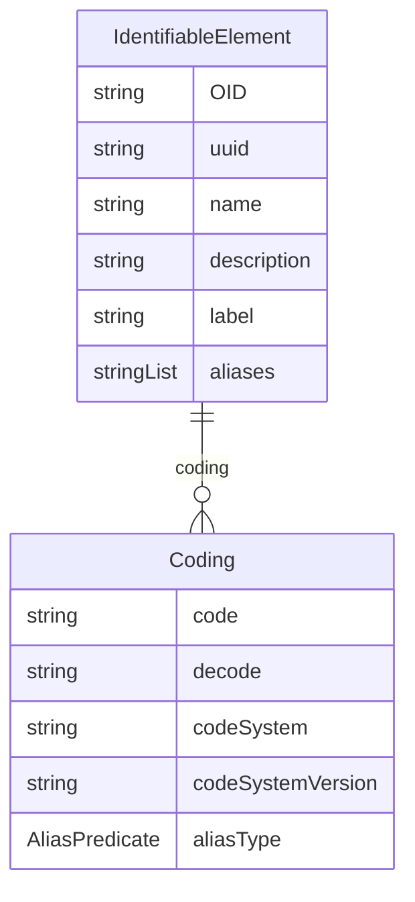

# Class: IdentifiableElement 


* __NOTE__: this is an abstract class and should not be instantiated directly


URI: [odm:class/IdentifiableElement](https://cdisc.org/odm2/class/IdentifiableElement)





## Inheritance
* **IdentifiableElement** [ [Identifiable](../classes/Identifiable.md) [Labelled](../classes/Labelled.md)]
    * [Relationship](../classes/Relationship.md)
    * [Dictionary](../classes/Dictionary.md) [ [Versioned](../classes/Versioned.md)]
    * [FormalExpression](../classes/FormalExpression.md)
    * [Parameter](../classes/Parameter.md)
    * [ReturnValue](../classes/ReturnValue.md)
    * [User](../classes/User.md)
    * [Organization](../classes/Organization.md)
    * [Standard](../classes/Standard.md)
    * [Resource](../classes/Resource.md) [ [Versioned](../classes/Versioned.md)]
    * [DocumentReference](../classes/DocumentReference.md) [ [Versioned](../classes/Versioned.md)]
    * [Timing](../classes/Timing.md)
    * [Dataset](../classes/Dataset.md) [ [Versioned](../classes/Versioned.md) [IsProfile](../classes/IsProfile.md) [IsSdmxDataset](../classes/IsSdmxDataset.md)]
    * [ComponentList](../classes/ComponentList.md)


## Slots

| Name | Cardinality and Range | Description | Inheritance |
| ---  | --- | --- | --- |
| [OID](../slots/OID.md) | 1 <br/> [String](../types/String.md) | Local identifier within this study/context. Use CDISC OID format for regulatory submissions, or simple strings for internal use. | [Identifiable](../classes/Identifiable.md) |
| [uuid](../slots/uuid.md) | 0..1 <br/> [String](../types/String.md) | Universal unique identifier | [Identifiable](../classes/Identifiable.md) |
| [name](../slots/name.md) | 0..1 <br/> [String](../types/String.md) | Short name or identifier, used for field names | [Labelled](../classes/Labelled.md) |
| [description](../slots/description.md) | 0..1 <br/> [String](../types/String.md)&nbsp;or&nbsp;<br />[String](../types/String.md)&nbsp;or&nbsp;<br />[TranslatedText](../classes/TranslatedText.md) | Detailed description, shown in tooltips | [Labelled](../classes/Labelled.md) |
| [coding](../slots/coding.md) | * <br/> [Coding](../classes/Coding.md) | Semantic tags for this element | [Labelled](../classes/Labelled.md) |
| [label](../slots/label.md) | 0..1 <br/> [String](../types/String.md)&nbsp;or&nbsp;<br />[String](../types/String.md)&nbsp;or&nbsp;<br />[TranslatedText](../classes/TranslatedText.md) | Human-readable label, shown in UIs | [Labelled](../classes/Labelled.md) |
| [aliases](../slots/aliases.md) | * <br/> [String](../types/String.md)&nbsp;or&nbsp;<br />[String](../types/String.md)&nbsp;or&nbsp;<br />[TranslatedText](../classes/TranslatedText.md) | Alternative name or identifier | [Labelled](../classes/Labelled.md) |


## Usages

| used by | used in | type | used |
| ---  | --- | --- | --- |
| [Relationship](../classes/Relationship.md) | [subject](../slots/subject.md) | range | [IdentifiableElement](../classes/IdentifiableElement.md) |
| [Relationship](../classes/Relationship.md) | [object](../slots/object.md) | range | [IdentifiableElement](../classes/IdentifiableElement.md) |


## Identifier and Mapping Information


### Schema Source


* from schema: https://cdisc.org/define-json


## Mappings

| Mapping Type | Mapped Value |
| ---  | ---  |
| self | odm:IdentifiableElement |
| native | odm:IdentifiableElement |


## LinkML Source

<!-- TODO: investigate https://stackoverflow.com/questions/37606292/how-to-create-tabbed-code-blocks-in-mkdocs-or-sphinx -->

### Direct

<details>
```yaml
name: IdentifiableElement
from_schema: https://cdisc.org/define-json
abstract: true
mixins:
- Identifiable
- Labelled

```
</details>

### Induced

<details>
```yaml
name: IdentifiableElement
from_schema: https://cdisc.org/define-json
abstract: true
mixins:
- Identifiable
- Labelled
attributes:
  OID:
    name: OID
    description: Local identifier within this study/context. Use CDISC OID format
      for regulatory submissions, or simple strings for internal use.
    from_schema: https://cdisc.org/define-json
    rank: 1000
    identifier: true
    alias: OID
    owner: IdentifiableElement
    domain_of:
    - Identifiable
    range: string
    required: true
  uuid:
    name: uuid
    description: Universal unique identifier
    from_schema: https://cdisc.org/define-json
    rank: 1000
    alias: uuid
    owner: IdentifiableElement
    domain_of:
    - Identifiable
    range: string
  name:
    name: name
    description: Short name or identifier, used for field names
    from_schema: https://cdisc.org/define-json
    rank: 1000
    alias: name
    owner: IdentifiableElement
    domain_of:
    - Labelled
    - Standard
    range: string
  description:
    name: description
    description: Detailed description, shown in tooltips
    from_schema: https://cdisc.org/define-json
    rank: 1000
    alias: description
    owner: IdentifiableElement
    domain_of:
    - Labelled
    - CodeListItem
    range: string
    any_of:
    - range: string
    - range: TranslatedText
  coding:
    name: coding
    description: Semantic tags for this element
    from_schema: https://cdisc.org/define-json
    rank: 1000
    alias: coding
    owner: IdentifiableElement
    domain_of:
    - Labelled
    - CodeListItem
    - SourceItem
    range: Coding
    multivalued: true
    inlined: true
    inlined_as_list: true
  label:
    name: label
    description: Human-readable label, shown in UIs
    from_schema: https://cdisc.org/define-json
    exact_mappings:
    - skos:prefLabel
    rank: 1000
    alias: label
    owner: IdentifiableElement
    domain_of:
    - Labelled
    range: string
    any_of:
    - range: string
    - range: TranslatedText
  aliases:
    name: aliases
    description: Alternative name or identifier
    from_schema: https://cdisc.org/define-json
    exact_mappings:
    - skos:altLabel
    rank: 1000
    alias: aliases
    owner: IdentifiableElement
    domain_of:
    - Labelled
    - CodeListItem
    range: string
    multivalued: true
    inlined: true
    inlined_as_list: true
    any_of:
    - range: string
    - range: TranslatedText

```
</details>