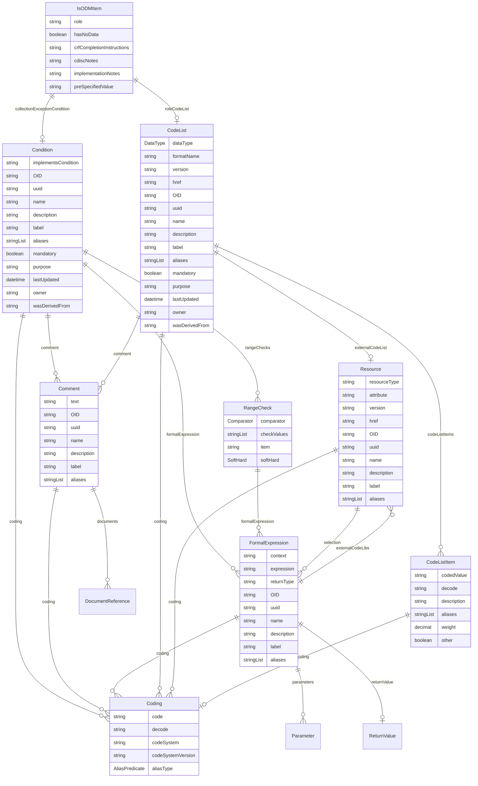

# Class: IsODMItem 


_A mixin that provides additional attributes for CDISC Operational Data Model items, including roles, completion instructions, and implementation notes_


URI: [odm:class/IsODMItem](https://cdisc.org/odm2/class/IsODMItem)





<!-- no inheritance hierarchy -->


## Slots

| Name | Cardinality and Range | Description | Inheritance |
| ---  | --- | --- | --- |
| [role](../slots/role.md) | 0..1 <br/> [String](../types/String.md)&nbsp;or&nbsp;<br />[String](../types/String.md)&nbsp;or&nbsp;<br />[TranslatedText](../classes/TranslatedText.md) | Identifies the role of the item within the containing context, taken from the... | direct |
| [roleCodeList](../slots/roleCodeList.md) | 0..1 <br/> [CodeList](../classes/CodeList.md) | Reference to the CodeList that defines the roles for this item | direct |
| [hasNoData](../slots/hasNoData.md) | 0..1 <br/> [Boolean](../types/Boolean.md) | Set to Yes if this is a manifest and there is no data for this item | direct |
| [crfCompletionInstructions](../slots/crfCompletionInstructions.md) | 0..1 <br/> [String](../types/String.md)&nbsp;or&nbsp;<br />[String](../types/String.md)&nbsp;or&nbsp;<br />[TranslatedText](../classes/TranslatedText.md) | CRFCompletionInstructions reference: Instructions for the clinical site on ho... | direct |
| [cdiscNotes](../slots/cdiscNotes.md) | 0..1 <br/> [String](../types/String.md)&nbsp;or&nbsp;<br />[String](../types/String.md)&nbsp;or&nbsp;<br />[TranslatedText](../classes/TranslatedText.md) | CDISCNotes reference: Explanatory text for the variable | direct |
| [implementationNotes](../slots/implementationNotes.md) | 0..1 <br/> [String](../types/String.md)&nbsp;or&nbsp;<br />[String](../types/String.md)&nbsp;or&nbsp;<br />[TranslatedText](../classes/TranslatedText.md) | ImplementationNotes reference: Further information, such as rationale and imp... | direct |
| [collectionExceptionCondition](../slots/collectionExceptionCondition.md) | 0..1 <br/> [Condition](../classes/Condition.md) | Condition that defines when collection may be exempted | direct |
| [preSpecifiedValue](../slots/preSpecifiedValue.md) | 0..1 <br/> [String](../types/String.md)&nbsp;or&nbsp;<br />[String](../types/String.md)&nbsp;or&nbsp;<br />[TranslatedText](../classes/TranslatedText.md) | Prefill value or a default value for a field that is automatically populated | direct |


## Mixin Usage

| mixed into | description |
| --- | --- |
| [Item](../classes/Item.md) | A data element that represents a specific piece of information within a defin... |


## Identifier and Mapping Information


### Schema Source


* from schema: https://cdisc.org/define-json


## Mappings

| Mapping Type | Mapped Value |
| ---  | ---  |
| self | odm:IsODMItem |
| native | odm:IsODMItem |


## LinkML Source

<!-- TODO: investigate https://stackoverflow.com/questions/37606292/how-to-create-tabbed-code-blocks-in-mkdocs-or-sphinx -->

### Direct

<details>
```yaml
name: IsODMItem
description: A mixin that provides additional attributes for CDISC Operational Data
  Model items, including roles, completion instructions, and implementation notes
from_schema: https://cdisc.org/define-json
mixin: true
attributes:
  role:
    name: role
    description: Identifies the role of the item within the containing context, taken
      from the roleCodeList
    from_schema: https://cdisc.org/define-json
    rank: 1000
    domain_of:
    - IsODMItem
    - Organization
    - CubeComponent
    any_of:
    - range: string
    - range: TranslatedText
  roleCodeList:
    name: roleCodeList
    description: Reference to the CodeList that defines the roles for this item
    from_schema: https://cdisc.org/define-json
    rank: 1000
    domain_of:
    - IsODMItem
    range: CodeList
  hasNoData:
    name: hasNoData
    description: Set to Yes if this is a manifest and there is no data for this item
    from_schema: https://cdisc.org/define-json
    rank: 1000
    domain_of:
    - IsODMItem
    range: boolean
  crfCompletionInstructions:
    name: crfCompletionInstructions
    description: 'CRFCompletionInstructions reference: Instructions for the clinical
      site on how to enter collected information on the CRF'
    from_schema: https://cdisc.org/define-json
    rank: 1000
    domain_of:
    - IsODMItem
    any_of:
    - range: string
    - range: TranslatedText
  cdiscNotes:
    name: cdiscNotes
    description: 'CDISCNotes reference: Explanatory text for the variable'
    from_schema: https://cdisc.org/define-json
    rank: 1000
    domain_of:
    - IsODMItem
    any_of:
    - range: string
    - range: TranslatedText
  implementationNotes:
    name: implementationNotes
    description: 'ImplementationNotes reference: Further information, such as rationale
      and implementation instructions, on how to implement the CRF data collection
      fields'
    from_schema: https://cdisc.org/define-json
    rank: 1000
    domain_of:
    - IsODMItem
    any_of:
    - range: string
    - range: TranslatedText
  collectionExceptionCondition:
    name: collectionExceptionCondition
    description: Condition that defines when collection may be exempted
    from_schema: https://cdisc.org/define-json
    rank: 1000
    domain_of:
    - IsODMItem
    range: Condition
  preSpecifiedValue:
    name: preSpecifiedValue
    description: Prefill value or a default value for a field that is automatically
      populated.
    from_schema: https://cdisc.org/define-json
    rank: 1000
    domain_of:
    - IsODMItem
    any_of:
    - range: string
    - range: TranslatedText

```
</details>

### Induced

<details>
```yaml
name: IsODMItem
description: A mixin that provides additional attributes for CDISC Operational Data
  Model items, including roles, completion instructions, and implementation notes
from_schema: https://cdisc.org/define-json
mixin: true
attributes:
  role:
    name: role
    description: Identifies the role of the item within the containing context, taken
      from the roleCodeList
    from_schema: https://cdisc.org/define-json
    rank: 1000
    alias: role
    owner: IsODMItem
    domain_of:
    - IsODMItem
    - Organization
    - CubeComponent
    any_of:
    - range: string
    - range: TranslatedText
  roleCodeList:
    name: roleCodeList
    description: Reference to the CodeList that defines the roles for this item
    from_schema: https://cdisc.org/define-json
    rank: 1000
    alias: roleCodeList
    owner: IsODMItem
    domain_of:
    - IsODMItem
    range: CodeList
  hasNoData:
    name: hasNoData
    description: Set to Yes if this is a manifest and there is no data for this item
    from_schema: https://cdisc.org/define-json
    rank: 1000
    alias: hasNoData
    owner: IsODMItem
    domain_of:
    - IsODMItem
    range: boolean
  crfCompletionInstructions:
    name: crfCompletionInstructions
    description: 'CRFCompletionInstructions reference: Instructions for the clinical
      site on how to enter collected information on the CRF'
    from_schema: https://cdisc.org/define-json
    rank: 1000
    alias: crfCompletionInstructions
    owner: IsODMItem
    domain_of:
    - IsODMItem
    any_of:
    - range: string
    - range: TranslatedText
  cdiscNotes:
    name: cdiscNotes
    description: 'CDISCNotes reference: Explanatory text for the variable'
    from_schema: https://cdisc.org/define-json
    rank: 1000
    alias: cdiscNotes
    owner: IsODMItem
    domain_of:
    - IsODMItem
    any_of:
    - range: string
    - range: TranslatedText
  implementationNotes:
    name: implementationNotes
    description: 'ImplementationNotes reference: Further information, such as rationale
      and implementation instructions, on how to implement the CRF data collection
      fields'
    from_schema: https://cdisc.org/define-json
    rank: 1000
    alias: implementationNotes
    owner: IsODMItem
    domain_of:
    - IsODMItem
    any_of:
    - range: string
    - range: TranslatedText
  collectionExceptionCondition:
    name: collectionExceptionCondition
    description: Condition that defines when collection may be exempted
    from_schema: https://cdisc.org/define-json
    rank: 1000
    alias: collectionExceptionCondition
    owner: IsODMItem
    domain_of:
    - IsODMItem
    range: Condition
  preSpecifiedValue:
    name: preSpecifiedValue
    description: Prefill value or a default value for a field that is automatically
      populated.
    from_schema: https://cdisc.org/define-json
    rank: 1000
    alias: preSpecifiedValue
    owner: IsODMItem
    domain_of:
    - IsODMItem
    any_of:
    - range: string
    - range: TranslatedText

```
</details>