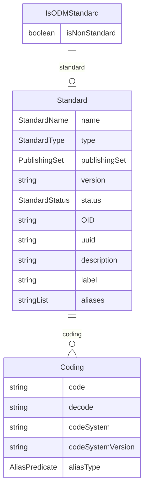

# Class: IsODMStandard 


_A mixin that provides properties to indicate standards compliance_


URI: [odm:class/IsODMStandard](https://cdisc.org/odm2/class/IsODMStandard)





<!-- no inheritance hierarchy -->


## Slots

| Name | Cardinality and Range | Description | Inheritance |
| ---  | --- | --- | --- |
| [standard](../slots/standard.md) | 0..1 <br/> [Standard](../classes/Standard.md) | Reference to the standard being implemented | direct |
| [isNonStandard](../slots/isNonStandard.md) | 0..1 <br/> [Boolean](../types/Boolean.md) | One or more members of this set are non-standard extensions | direct |


## Mixin Usage

| mixed into | description |
| --- | --- |
| [ItemGroup](../classes/ItemGroup.md) | A collection element that groups related items or subgroups within a specific context, used for tables, FHIR resource profiles, biomedical concept specializations, or form sections |
| [CodeList](../classes/CodeList.md) | A value set that defines a discrete collection of permissible values for an item, corresponding to the ODM CodeList construct |


## Identifier and Mapping Information


### Schema Source


* from schema: https://cdisc.org/define-json


## Mappings

| Mapping Type | Mapped Value |
| ---  | ---  |
| self | odm:IsODMStandard |
| native | odm:IsODMStandard |


## LinkML Source

<!-- TODO: investigate https://stackoverflow.com/questions/37606292/how-to-create-tabbed-code-blocks-in-mkdocs-or-sphinx -->

### Direct

<details>
```yaml
name: IsODMStandard
description: A mixin that provides properties to indicate standards compliance
from_schema: https://cdisc.org/define-json
mixin: true
attributes:
  standard:
    name: standard
    description: Reference to the standard being implemented
    from_schema: https://cdisc.org/define-json
    rank: 1000
    domain_of:
    - IsODMStandard
    range: Standard
  isNonStandard:
    name: isNonStandard
    description: One or more members of this set are non-standard extensions
    from_schema: https://cdisc.org/define-json
    rank: 1000
    domain_of:
    - IsODMStandard
    range: boolean

```
</details>

### Induced

<details>
```yaml
name: IsODMStandard
description: A mixin that provides properties to indicate standards compliance
from_schema: https://cdisc.org/define-json
mixin: true
attributes:
  standard:
    name: standard
    description: Reference to the standard being implemented
    from_schema: https://cdisc.org/define-json
    rank: 1000
    alias: standard
    owner: IsODMStandard
    domain_of:
    - IsODMStandard
    range: Standard
  isNonStandard:
    name: isNonStandard
    description: One or more members of this set are non-standard extensions
    from_schema: https://cdisc.org/define-json
    rank: 1000
    alias: isNonStandard
    owner: IsODMStandard
    domain_of:
    - IsODMStandard
    range: boolean

```
</details>