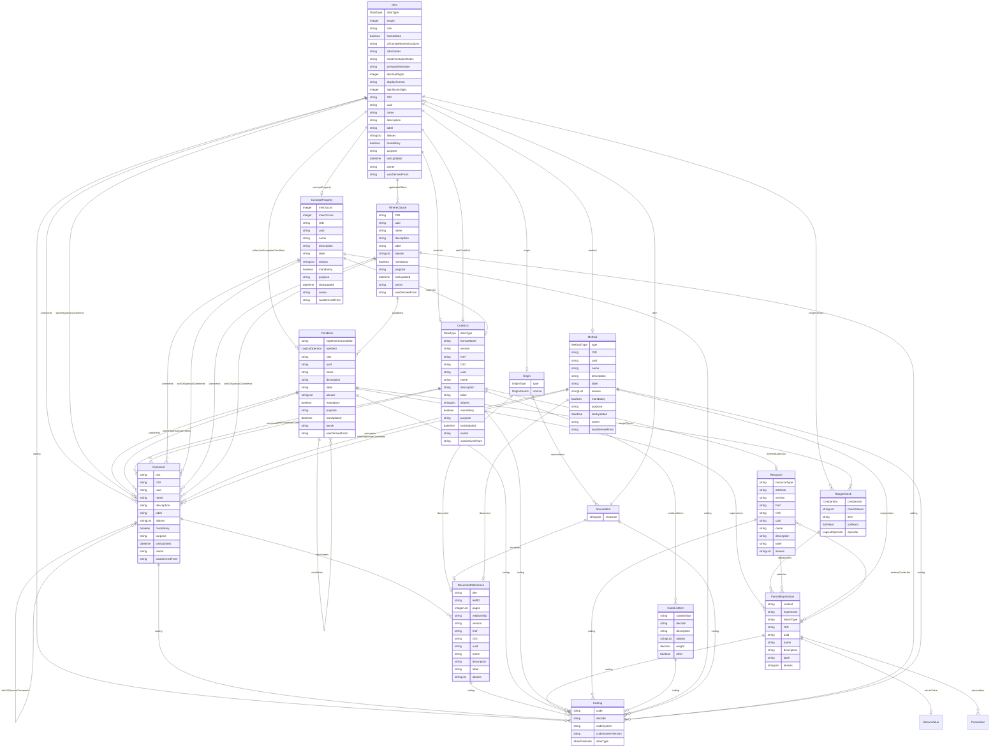

# Class: Item 


_A data element that represents a specific piece of information within a defined context, with data type, constraints, and derivation methods_


URI: [odm:class/Item](https://cdisc.org/odm2/class/Item)





## Inheritance
* [GovernedElement](../classes/GovernedElement.md) [ [Identifiable](../classes/Identifiable.md) [Labelled](../classes/Labelled.md) [Governed](../classes/Governed.md)]
    * **Item** [ [IsODMItem](../classes/IsODMItem.md) [Formatted](../classes/Formatted.md)]


## Slots

| Name | Cardinality and Range | Description | Inheritance |
| ---  | --- | --- | --- |
| [dataType](../slots/dataType.md) | 1 <br/> [DataType](../enums/DataType.md) | The data type of the item. | direct |
| [length](../slots/length.md) | 0..1 <br/> [Integer](../types/Integer.md) | The maximum length of the data item in characters. | direct |
| [codeList](../slots/codeList.md) | 0..1 <br/> [CodeList](../classes/CodeList.md) | Reference to the CodeList that constrains the item values. | direct |
| [method](../slots/method.md) | 0..1 <br/> [Method](../classes/Method.md) | Reference to the Method element that describes how to derive this item's value. | direct |
| [rangeChecks](../slots/rangeChecks.md) | * <br/> [RangeCheck](../classes/RangeCheck.md) | Range checks applied to this item (e.g. edit checks, CORE rules) | direct |
| [applicableWhen](../slots/applicableWhen.md) | * <br/> [WhereClause](../classes/WhereClause.md) | References to different situations that define when this item applies.<br>Multiple whereClauses are combined with OR logic: the item applies if ANY referenced WhereClause matches.<br>Within each WhereClause, conditions are combined with AND logic: all conditions must be true.<br><br>Example: whereClause: ["WC.SYSBP", "WC.DIABP"] means the item applies when<br>(all conditions in WC.SYSBP are true) OR (all conditions in WC.DIABP are true). | direct |
| [origin](../slots/origin.md) | 0..1 <br/> [Origin](../classes/Origin.md) | The origin of the data | direct |
| [conceptProperty](../slots/conceptProperty.md) | 0..1 <br/> [ConceptProperty](../classes/ConceptProperty.md) | Reference to a abstract concept property that this item is a specialization / instance of. | direct |
| [role](../slots/role.md) | 0..1 <br/> [String](../types/String.md)&nbsp;or&nbsp;<br />[String](../types/String.md)&nbsp;or&nbsp;<br />[TranslatedText](../classes/TranslatedText.md) | Identifies the role of the item within the containing context, taken from the roleCodeList | [IsODMItem](../classes/IsODMItem.md) |
| [roleCodeList](../slots/roleCodeList.md) | 0..1 <br/> [CodeList](../classes/CodeList.md) | Reference to the CodeList that defines the roles for this item | [IsODMItem](../classes/IsODMItem.md) |
| [hasNoData](../slots/hasNoData.md) | 0..1 <br/> [Boolean](../types/Boolean.md) | Set to Yes if this is a manifest and there is no data for this item | [IsODMItem](../classes/IsODMItem.md) |
| [crfCompletionInstructions](../slots/crfCompletionInstructions.md) | 0..1 <br/> [String](../types/String.md)&nbsp;or&nbsp;<br />[String](../types/String.md)&nbsp;or&nbsp;<br />[TranslatedText](../classes/TranslatedText.md) | CRFCompletionInstructions reference: Instructions for the clinical site on how to enter collected information on the CRF | [IsODMItem](../classes/IsODMItem.md) |
| [cdiscNotes](../slots/cdiscNotes.md) | 0..1 <br/> [String](../types/String.md)&nbsp;or&nbsp;<br />[String](../types/String.md)&nbsp;or&nbsp;<br />[TranslatedText](../classes/TranslatedText.md) | CDISCNotes reference: Explanatory text for the variable | [IsODMItem](../classes/IsODMItem.md) |
| [implementationNotes](../slots/implementationNotes.md) | 0..1 <br/> [String](../types/String.md)&nbsp;or&nbsp;<br />[String](../types/String.md)&nbsp;or&nbsp;<br />[TranslatedText](../classes/TranslatedText.md) | ImplementationNotes reference: Further information, such as rationale and implementation instructions, on how to implement the CRF data collection fields | [IsODMItem](../classes/IsODMItem.md) |
| [collectionExceptionCondition](../slots/collectionExceptionCondition.md) | 0..1 <br/> [Condition](../classes/Condition.md) | Condition that defines when collection may be exempted | [IsODMItem](../classes/IsODMItem.md) |
| [preSpecifiedValue](../slots/preSpecifiedValue.md) | 0..1 <br/> [String](../types/String.md)&nbsp;or&nbsp;<br />[String](../types/String.md)&nbsp;or&nbsp;<br />[TranslatedText](../classes/TranslatedText.md) | Prefill value or a default value for a field that is automatically populated. | [IsODMItem](../classes/IsODMItem.md) |
| [decimalDigits](../slots/decimalDigits.md) | 0..1 <br/> [Integer](../types/Integer.md) | For decimal values, the number of digits after the decimal point | [Formatted](../classes/Formatted.md) |
| [displayFormat](../slots/displayFormat.md) | 0..1 <br/> [String](../types/String.md) | A display format for the item | [Formatted](../classes/Formatted.md) |
| [significantDigits](../slots/significantDigits.md) | 0..1 <br/> [Integer](../types/Integer.md) | For numeric values, the number of significant digits | [Formatted](../classes/Formatted.md) |
| [OID](../slots/OID.md) | 1 <br/> [String](../types/String.md) | Local identifier within this study/context. Use CDISC OID format for regulatory submissions, or simple strings for internal use. | [Identifiable](../classes/Identifiable.md) |
| [uuid](../slots/uuid.md) | 0..1 <br/> [String](../types/String.md) | Universal unique identifier | [Identifiable](../classes/Identifiable.md) |
| [name](../slots/name.md) | 0..1 <br/> [String](../types/String.md) | Short name or identifier, used for field names | [Labelled](../classes/Labelled.md) |
| [description](../slots/description.md) | 0..1 <br/> [String](../types/String.md)&nbsp;or&nbsp;<br />[String](../types/String.md)&nbsp;or&nbsp;<br />[TranslatedText](../classes/TranslatedText.md) | Detailed description, shown in tooltips | [Labelled](../classes/Labelled.md) |
| [coding](../slots/coding.md) | * <br/> [Coding](../classes/Coding.md) | Semantic tags for this element | [Labelled](../classes/Labelled.md) |
| [label](../slots/label.md) | 0..1 <br/> [String](../types/String.md)&nbsp;or&nbsp;<br />[String](../types/String.md)&nbsp;or&nbsp;<br />[TranslatedText](../classes/TranslatedText.md) | Human-readable label, shown in UIs | [Labelled](../classes/Labelled.md) |
| [aliases](../slots/aliases.md) | * <br/> [String](../types/String.md)&nbsp;or&nbsp;<br />[String](../types/String.md)&nbsp;or&nbsp;<br />[TranslatedText](../classes/TranslatedText.md) | Alternative name or identifier | [Labelled](../classes/Labelled.md) |
| [mandatory](../slots/mandatory.md) | 0..1 <br/> [Boolean](../types/Boolean.md) | Is this element required? | [Governed](../classes/Governed.md) |
| [comments](../slots/comments.md) | * <br/> [Comment](../classes/Comment.md) | Comment on the element, such as a rationale for its inclusion or exclusion | [Governed](../classes/Governed.md) |
| [siteOrSponsorComments](../slots/siteOrSponsorComments.md) | * <br/> [Comment](../classes/Comment.md) | Comment on the element, such as a rationale for its inclusion or exclusion | [Governed](../classes/Governed.md) |
| [purpose](../slots/purpose.md) | 0..1 <br/> [String](../types/String.md)&nbsp;or&nbsp;<br />[String](../types/String.md)&nbsp;or&nbsp;<br />[TranslatedText](../classes/TranslatedText.md) | Purpose or rationale for this data element | [Governed](../classes/Governed.md) |
| [lastUpdated](../slots/lastUpdated.md) | 1 <br/> [Datetime](../types/Datetime.md) | When the resource was last updated | [Governed](../classes/Governed.md) |
| [owner](../slots/owner.md) | 0..1 <br/> [String](../types/String.md)&nbsp;or&nbsp;<br />[User](../classes/User.md)&nbsp;or&nbsp;<br />[Organization](../classes/Organization.md)&nbsp;or&nbsp;<br />[String](../types/String.md) | Party responsible for this element | [Governed](../classes/Governed.md) |
| [wasDerivedFrom](../slots/wasDerivedFrom.md) | 0..1 <br/> [String](../types/String.md)&nbsp;or&nbsp;<br />[Item](../classes/Item.md)&nbsp;or&nbsp;<br />[ItemGroup](../classes/ItemGroup.md)&nbsp;or&nbsp;<br />[MetaDataVersion](../classes/MetaDataVersion.md)&nbsp;or&nbsp;<br />[CodeList](../classes/CodeList.md)&nbsp;or&nbsp;<br />[ReifiedConcept](../classes/ReifiedConcept.md)&nbsp;or&nbsp;<br />[ConceptProperty](../classes/ConceptProperty.md)&nbsp;or&nbsp;<br />[Condition](../classes/Condition.md)&nbsp;or&nbsp;<br />[Method](../classes/Method.md)&nbsp;or&nbsp;<br />[NominalOccurrence](../classes/NominalOccurrence.md)&nbsp;or&nbsp;<br />[Dataflow](../classes/Dataflow.md)&nbsp;or&nbsp;<br />[CubeComponent](../classes/CubeComponent.md)&nbsp;or&nbsp;<br />[DataProduct](../classes/DataProduct.md)&nbsp;or&nbsp;<br />[ProvisionAgreement](../classes/ProvisionAgreement.md) | Reference to another item that this item implements or extends, e.g. a template Item definition. | [Governed](../classes/Governed.md) |


## Usages

| used by | used in | type | used |
| ---  | --- | --- | --- |
| [GovernedElement](../classes/GovernedElement.md) | [wasDerivedFrom](../slots/wasDerivedFrom.md) | any_of[range] | [Item](../classes/Item.md) |
| [Governed](../classes/Governed.md) | [wasDerivedFrom](../slots/wasDerivedFrom.md) | any_of[range] | [Item](../classes/Item.md) |
| [MetaDataVersion](../classes/MetaDataVersion.md) | [items](../slots/items.md) | range | [Item](../classes/Item.md) |
| [MetaDataVersion](../classes/MetaDataVersion.md) | [wasDerivedFrom](../slots/wasDerivedFrom.md) | any_of[range] | [Item](../classes/Item.md) |
| [Item](../classes/Item.md) | [wasDerivedFrom](../slots/wasDerivedFrom.md) | any_of[range] | [Item](../classes/Item.md) |
| [ItemGroup](../classes/ItemGroup.md) | [items](../slots/items.md) | range | [Item](../classes/Item.md) |
| [ItemGroup](../classes/ItemGroup.md) | [wasDerivedFrom](../slots/wasDerivedFrom.md) | any_of[range] | [Item](../classes/Item.md) |
| [CodeList](../classes/CodeList.md) | [wasDerivedFrom](../slots/wasDerivedFrom.md) | any_of[range] | [Item](../classes/Item.md) |
| [Comment](../classes/Comment.md) | [wasDerivedFrom](../slots/wasDerivedFrom.md) | any_of[range] | [Item](../classes/Item.md) |
| [ReifiedConcept](../classes/ReifiedConcept.md) | [wasDerivedFrom](../slots/wasDerivedFrom.md) | any_of[range] | [Item](../classes/Item.md) |
| [ConceptProperty](../classes/ConceptProperty.md) | [wasDerivedFrom](../slots/wasDerivedFrom.md) | any_of[range] | [Item](../classes/Item.md) |
| [WhereClause](../classes/WhereClause.md) | [wasDerivedFrom](../slots/wasDerivedFrom.md) | any_of[range] | [Item](../classes/Item.md) |
| [Condition](../classes/Condition.md) | [wasDerivedFrom](../slots/wasDerivedFrom.md) | any_of[range] | [Item](../classes/Item.md) |
| [RangeCheck](../classes/RangeCheck.md) | [item](../slots/item.md) | any_of[range] | [Item](../classes/Item.md) |
| [Method](../classes/Method.md) | [wasDerivedFrom](../slots/wasDerivedFrom.md) | any_of[range] | [Item](../classes/Item.md) |
| [SourceItem](../classes/SourceItem.md) | [item](../slots/item.md) | range | [Item](../classes/Item.md) |
| [Parameter](../classes/Parameter.md) | [items](../slots/items.md) | any_of[range] | [Item](../classes/Item.md) |
| [SiteOrSponsorComment](../classes/SiteOrSponsorComment.md) | [wasDerivedFrom](../slots/wasDerivedFrom.md) | any_of[range] | [Item](../classes/Item.md) |
| [NominalOccurrence](../classes/NominalOccurrence.md) | [wasDerivedFrom](../slots/wasDerivedFrom.md) | any_of[range] | [Item](../classes/Item.md) |
| [DataStructureDefinition](../classes/DataStructureDefinition.md) | [items](../slots/items.md) | range | [Item](../classes/Item.md) |
| [DataStructureDefinition](../classes/DataStructureDefinition.md) | [wasDerivedFrom](../slots/wasDerivedFrom.md) | any_of[range] | [Item](../classes/Item.md) |
| [Dataflow](../classes/Dataflow.md) | [wasDerivedFrom](../slots/wasDerivedFrom.md) | any_of[range] | [Item](../classes/Item.md) |
| [CubeComponent](../classes/CubeComponent.md) | [item](../slots/item.md) | range | [Item](../classes/Item.md) |
| [CubeComponent](../classes/CubeComponent.md) | [wasDerivedFrom](../slots/wasDerivedFrom.md) | any_of[range] | [Item](../classes/Item.md) |
| [Measure](../classes/Measure.md) | [item](../slots/item.md) | range | [Item](../classes/Item.md) |
| [Measure](../classes/Measure.md) | [wasDerivedFrom](../slots/wasDerivedFrom.md) | any_of[range] | [Item](../classes/Item.md) |
| [Dimension](../classes/Dimension.md) | [item](../slots/item.md) | range | [Item](../classes/Item.md) |
| [Dimension](../classes/Dimension.md) | [wasDerivedFrom](../slots/wasDerivedFrom.md) | any_of[range] | [Item](../classes/Item.md) |
| [DataAttribute](../classes/DataAttribute.md) | [item](../slots/item.md) | range | [Item](../classes/Item.md) |
| [DataAttribute](../classes/DataAttribute.md) | [wasDerivedFrom](../slots/wasDerivedFrom.md) | any_of[range] | [Item](../classes/Item.md) |
| [ObservationRelationship](../classes/ObservationRelationship.md) | [item](../slots/item.md) | range | [Item](../classes/Item.md) |
| [DataProduct](../classes/DataProduct.md) | [wasDerivedFrom](../slots/wasDerivedFrom.md) | any_of[range] | [Item](../classes/Item.md) |
| [ProvisionAgreement](../classes/ProvisionAgreement.md) | [wasDerivedFrom](../slots/wasDerivedFrom.md) | any_of[range] | [Item](../classes/Item.md) |


## Identifier and Mapping Information


### Schema Source


* from schema: https://cdisc.org/define-json


## Mappings

| Mapping Type | Mapped Value |
| ---  | ---  |
| self | odm:Item |
| native | odm:Item |
| narrow | fhir:StructureDefinition/variable, fhir:Questionnaire/item, qb:ComponentProperty, omop:Field, omop:DerivedColumn |
| related | usdm:BiomedicalConceptProperty, usdm:DerivationConceptProperty, usdm:AnalysisConceptProperty, fhir:ElementDefinition, qb:Measure, qb:Attribute, sdmx:Concept, sdmx:Component, sdmx:Representation, osb:sdtm_variable, osb:specimen, osb:unit_dimension, osb:std_unit |
| close | odm:ItemRef, odm:ItemDef, qb:ComponentSpecification, sdmx:DataAttribute, sdmx:MetadataAttribute |


## LinkML Source

<!-- TODO: investigate https://stackoverflow.com/questions/37606292/how-to-create-tabbed-code-blocks-in-mkdocs-or-sphinx -->

### Direct

<details>
```yaml
name: Item
description: A data element that represents a specific piece of information within
  a defined context, with data type, constraints, and derivation methods
from_schema: https://cdisc.org/define-json
close_mappings:
- odm:ItemRef
- odm:ItemDef
- qb:ComponentSpecification
- sdmx:DataAttribute
- sdmx:MetadataAttribute
related_mappings:
- usdm:BiomedicalConceptProperty
- usdm:DerivationConceptProperty
- usdm:AnalysisConceptProperty
- fhir:ElementDefinition
- qb:Measure
- qb:Attribute
- sdmx:Concept
- sdmx:Component
- sdmx:Representation
- osb:sdtm_variable
- osb:specimen
- osb:unit_dimension
- osb:std_unit
narrow_mappings:
- fhir:StructureDefinition/variable
- fhir:Questionnaire/item
- qb:ComponentProperty
- omop:Field
- omop:DerivedColumn
is_a: GovernedElement
mixins:
- IsODMItem
- Formatted
attributes:
  dataType:
    name: dataType
    description: The data type of the item.
    from_schema: https://cdisc.org/define-json
    rank: 1000
    domain_of:
    - Item
    - CodeList
    - Parameter
    - ReturnValue
    range: DataType
    required: true
  length:
    name: length
    description: The maximum length of the data item in characters.
    from_schema: https://cdisc.org/define-json
    rank: 1000
    domain_of:
    - Item
    range: integer
  codeList:
    name: codeList
    description: Reference to the CodeList that constrains the item values.
    from_schema: https://cdisc.org/define-json
    rank: 1000
    domain_of:
    - Item
    - ConceptProperty
    - Parameter
    range: CodeList
  method:
    name: method
    description: Reference to the Method element that describes how to derive this
      item's value.
    from_schema: https://cdisc.org/define-json
    rank: 1000
    domain_of:
    - Item
    range: Method
  rangeChecks:
    name: rangeChecks
    description: Range checks applied to this item (e.g. edit checks, CORE rules)
    from_schema: https://cdisc.org/define-json
    rank: 1000
    domain_of:
    - Item
    - Condition
    range: RangeCheck
    multivalued: true
    inlined: true
    inlined_as_list: true
  applicableWhen:
    name: applicableWhen
    description: 'References to different situations that define when this item applies.

      Multiple whereClauses are combined with OR logic: the item applies if ANY referenced
      WhereClause matches.

      Within each WhereClause, conditions are combined with AND logic: all conditions
      must be true.


      Example: whereClause: ["WC.SYSBP", "WC.DIABP"] means the item applies when

      (all conditions in WC.SYSBP are true) OR (all conditions in WC.DIABP are true).

      '
    from_schema: https://cdisc.org/define-json
    close_mappings:
    - fhir:StructureDefinition/context
    rank: 1000
    domain_of:
    - Item
    - ItemGroup
    - Parameter
    range: WhereClause
    multivalued: true
    inlined: false
  origin:
    name: origin
    description: The origin of the data
    from_schema: https://cdisc.org/define-json
    rank: 1000
    domain_of:
    - Item
    range: Origin
    inlined: true
  conceptProperty:
    name: conceptProperty
    description: Reference to a abstract concept property that this item is a specialization
      / instance of.
    from_schema: https://cdisc.org/define-json
    rank: 1000
    domain_of:
    - Item
    - Parameter
    range: ConceptProperty

```
</details>

### Induced

<details>
```yaml
name: Item
description: A data element that represents a specific piece of information within
  a defined context, with data type, constraints, and derivation methods
from_schema: https://cdisc.org/define-json
close_mappings:
- odm:ItemRef
- odm:ItemDef
- qb:ComponentSpecification
- sdmx:DataAttribute
- sdmx:MetadataAttribute
related_mappings:
- usdm:BiomedicalConceptProperty
- usdm:DerivationConceptProperty
- usdm:AnalysisConceptProperty
- fhir:ElementDefinition
- qb:Measure
- qb:Attribute
- sdmx:Concept
- sdmx:Component
- sdmx:Representation
- osb:sdtm_variable
- osb:specimen
- osb:unit_dimension
- osb:std_unit
narrow_mappings:
- fhir:StructureDefinition/variable
- fhir:Questionnaire/item
- qb:ComponentProperty
- omop:Field
- omop:DerivedColumn
is_a: GovernedElement
mixins:
- IsODMItem
- Formatted
attributes:
  dataType:
    name: dataType
    description: The data type of the item.
    from_schema: https://cdisc.org/define-json
    rank: 1000
    alias: dataType
    owner: Item
    domain_of:
    - Item
    - CodeList
    - Parameter
    - ReturnValue
    range: DataType
    required: true
  length:
    name: length
    description: The maximum length of the data item in characters.
    from_schema: https://cdisc.org/define-json
    rank: 1000
    alias: length
    owner: Item
    domain_of:
    - Item
    range: integer
  codeList:
    name: codeList
    description: Reference to the CodeList that constrains the item values.
    from_schema: https://cdisc.org/define-json
    rank: 1000
    alias: codeList
    owner: Item
    domain_of:
    - Item
    - ConceptProperty
    - Parameter
    range: CodeList
  method:
    name: method
    description: Reference to the Method element that describes how to derive this
      item's value.
    from_schema: https://cdisc.org/define-json
    rank: 1000
    alias: method
    owner: Item
    domain_of:
    - Item
    range: Method
  rangeChecks:
    name: rangeChecks
    description: Range checks applied to this item (e.g. edit checks, CORE rules)
    from_schema: https://cdisc.org/define-json
    rank: 1000
    alias: rangeChecks
    owner: Item
    domain_of:
    - Item
    - Condition
    range: RangeCheck
    multivalued: true
    inlined: true
    inlined_as_list: true
  applicableWhen:
    name: applicableWhen
    description: 'References to different situations that define when this item applies.

      Multiple whereClauses are combined with OR logic: the item applies if ANY referenced
      WhereClause matches.

      Within each WhereClause, conditions are combined with AND logic: all conditions
      must be true.


      Example: whereClause: ["WC.SYSBP", "WC.DIABP"] means the item applies when

      (all conditions in WC.SYSBP are true) OR (all conditions in WC.DIABP are true).

      '
    from_schema: https://cdisc.org/define-json
    close_mappings:
    - fhir:StructureDefinition/context
    rank: 1000
    alias: applicableWhen
    owner: Item
    domain_of:
    - Item
    - ItemGroup
    - Parameter
    range: WhereClause
    multivalued: true
    inlined: false
  origin:
    name: origin
    description: The origin of the data
    from_schema: https://cdisc.org/define-json
    rank: 1000
    alias: origin
    owner: Item
    domain_of:
    - Item
    range: Origin
    inlined: true
  conceptProperty:
    name: conceptProperty
    description: Reference to a abstract concept property that this item is a specialization
      / instance of.
    from_schema: https://cdisc.org/define-json
    rank: 1000
    alias: conceptProperty
    owner: Item
    domain_of:
    - Item
    - Parameter
    range: ConceptProperty
  role:
    name: role
    description: Identifies the role of the item within the containing context, taken
      from the roleCodeList
    from_schema: https://cdisc.org/define-json
    rank: 1000
    alias: role
    owner: Item
    domain_of:
    - IsODMItem
    - Organization
    - CubeComponent
    range: string
    any_of:
    - range: string
    - range: TranslatedText
  roleCodeList:
    name: roleCodeList
    description: Reference to the CodeList that defines the roles for this item
    from_schema: https://cdisc.org/define-json
    rank: 1000
    alias: roleCodeList
    owner: Item
    domain_of:
    - IsODMItem
    range: CodeList
  hasNoData:
    name: hasNoData
    description: Set to Yes if this is a manifest and there is no data for this item
    from_schema: https://cdisc.org/define-json
    rank: 1000
    alias: hasNoData
    owner: Item
    domain_of:
    - IsODMItem
    range: boolean
  crfCompletionInstructions:
    name: crfCompletionInstructions
    description: 'CRFCompletionInstructions reference: Instructions for the clinical
      site on how to enter collected information on the CRF'
    from_schema: https://cdisc.org/define-json
    rank: 1000
    alias: crfCompletionInstructions
    owner: Item
    domain_of:
    - IsODMItem
    range: string
    any_of:
    - range: string
    - range: TranslatedText
  cdiscNotes:
    name: cdiscNotes
    description: 'CDISCNotes reference: Explanatory text for the variable'
    from_schema: https://cdisc.org/define-json
    rank: 1000
    alias: cdiscNotes
    owner: Item
    domain_of:
    - IsODMItem
    range: string
    any_of:
    - range: string
    - range: TranslatedText
  implementationNotes:
    name: implementationNotes
    description: 'ImplementationNotes reference: Further information, such as rationale
      and implementation instructions, on how to implement the CRF data collection
      fields'
    from_schema: https://cdisc.org/define-json
    rank: 1000
    alias: implementationNotes
    owner: Item
    domain_of:
    - IsODMItem
    range: string
    any_of:
    - range: string
    - range: TranslatedText
  collectionExceptionCondition:
    name: collectionExceptionCondition
    description: Condition that defines when collection may be exempted
    from_schema: https://cdisc.org/define-json
    rank: 1000
    alias: collectionExceptionCondition
    owner: Item
    domain_of:
    - IsODMItem
    range: Condition
  preSpecifiedValue:
    name: preSpecifiedValue
    description: Prefill value or a default value for a field that is automatically
      populated.
    from_schema: https://cdisc.org/define-json
    rank: 1000
    alias: preSpecifiedValue
    owner: Item
    domain_of:
    - IsODMItem
    range: string
    any_of:
    - range: string
    - range: TranslatedText
  decimalDigits:
    name: decimalDigits
    description: For decimal values, the number of digits after the decimal point
    from_schema: https://cdisc.org/define-json
    rank: 1000
    alias: decimalDigits
    owner: Item
    domain_of:
    - Formatted
    range: integer
  displayFormat:
    name: displayFormat
    description: A display format for the item
    from_schema: https://cdisc.org/define-json
    rank: 1000
    alias: displayFormat
    owner: Item
    domain_of:
    - Formatted
    range: string
  significantDigits:
    name: significantDigits
    description: For numeric values, the number of significant digits
    from_schema: https://cdisc.org/define-json
    rank: 1000
    alias: significantDigits
    owner: Item
    domain_of:
    - Formatted
    range: integer
  OID:
    name: OID
    description: Local identifier within this study/context. Use CDISC OID format
      for regulatory submissions, or simple strings for internal use.
    from_schema: https://cdisc.org/define-json
    rank: 1000
    identifier: true
    alias: OID
    owner: Item
    domain_of:
    - Identifiable
    range: string
    required: true
    pattern: ^[A-Za-z][A-Za-z0-9._-]*$
  uuid:
    name: uuid
    description: Universal unique identifier
    from_schema: https://cdisc.org/define-json
    rank: 1000
    alias: uuid
    owner: Item
    domain_of:
    - Identifiable
    range: string
  name:
    name: name
    description: Short name or identifier, used for field names
    from_schema: https://cdisc.org/define-json
    rank: 1000
    alias: name
    owner: Item
    domain_of:
    - Labelled
    - Standard
    range: string
  description:
    name: description
    description: Detailed description, shown in tooltips
    from_schema: https://cdisc.org/define-json
    rank: 1000
    alias: description
    owner: Item
    domain_of:
    - Labelled
    - CodeListItem
    range: string
    any_of:
    - range: string
    - range: TranslatedText
  coding:
    name: coding
    description: Semantic tags for this element
    from_schema: https://cdisc.org/define-json
    rank: 1000
    alias: coding
    owner: Item
    domain_of:
    - Labelled
    - CodeListItem
    - SourceItem
    range: Coding
    multivalued: true
    inlined: true
    inlined_as_list: true
  label:
    name: label
    description: Human-readable label, shown in UIs
    from_schema: https://cdisc.org/define-json
    exact_mappings:
    - skos:prefLabel
    rank: 1000
    alias: label
    owner: Item
    domain_of:
    - Labelled
    range: string
    any_of:
    - range: string
    - range: TranslatedText
  aliases:
    name: aliases
    description: Alternative name or identifier
    from_schema: https://cdisc.org/define-json
    exact_mappings:
    - skos:altLabel
    rank: 1000
    alias: aliases
    owner: Item
    domain_of:
    - Labelled
    - CodeListItem
    range: string
    multivalued: true
    inlined: true
    inlined_as_list: true
    any_of:
    - range: string
    - range: TranslatedText
  mandatory:
    name: mandatory
    description: Is this element required?
    from_schema: https://cdisc.org/define-json
    rank: 1000
    alias: mandatory
    owner: Item
    domain_of:
    - Governed
    range: boolean
  comments:
    name: comments
    description: Comment on the element, such as a rationale for its inclusion or
      exclusion
    from_schema: https://cdisc.org/define-json
    rank: 1000
    alias: comments
    owner: Item
    domain_of:
    - Governed
    range: Comment
    multivalued: true
    inlined: false
  siteOrSponsorComments:
    name: siteOrSponsorComments
    description: Comment on the element, such as a rationale for its inclusion or
      exclusion
    from_schema: https://cdisc.org/define-json
    rank: 1000
    alias: siteOrSponsorComments
    owner: Item
    domain_of:
    - Governed
    range: Comment
    multivalued: true
    inlined: false
  purpose:
    name: purpose
    description: Purpose or rationale for this data element
    from_schema: https://cdisc.org/define-json
    rank: 1000
    alias: purpose
    owner: Item
    domain_of:
    - Governed
    range: string
    any_of:
    - range: string
    - range: TranslatedText
  lastUpdated:
    name: lastUpdated
    description: When the resource was last updated
    from_schema: https://cdisc.org/define-json
    rank: 1000
    alias: lastUpdated
    owner: Item
    domain_of:
    - Governed
    range: datetime
    required: true
  owner:
    name: owner
    description: Party responsible for this element
    from_schema: https://cdisc.org/define-json
    narrow_mappings:
    - prov:wasAttributedTo
    - prov:wasAssociatedBy
    rank: 1000
    alias: owner
    owner: Item
    domain_of:
    - Governed
    range: string
    any_of:
    - range: User
    - range: Organization
    - range: string
  wasDerivedFrom:
    name: wasDerivedFrom
    description: Reference to another item that this item implements or extends, e.g.
      a template Item definition.
    from_schema: https://cdisc.org/define-json
    exact_mappings:
    - prov:wasDerivedFrom
    rank: 1000
    alias: wasDerivedFrom
    owner: Item
    domain_of:
    - Governed
    range: string
    any_of:
    - range: Item
    - range: ItemGroup
    - range: MetaDataVersion
    - range: CodeList
    - range: ReifiedConcept
    - range: ConceptProperty
    - range: Condition
    - range: Method
    - range: NominalOccurrence
    - range: Dataflow
    - range: CubeComponent
    - range: DataProduct
    - range: ProvisionAgreement

```
</details>