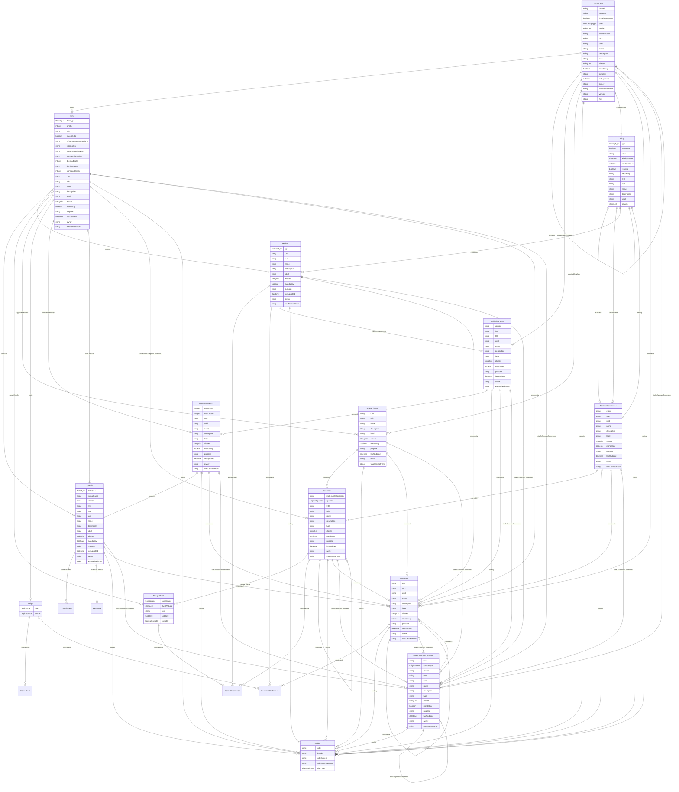

# Class: ItemGroup 


_A collection element that groups related items or subgroups within a specific context, used for tables, FHIR resource profiles, biomedical concept specializations, or form sections_


URI: [odm:class/ItemGroup](https://cdisc.org/odm2/class/ItemGroup)





## Inheritance
* [GovernedElement](../classes/GovernedElement.md) [ [Identifiable](../classes/Identifiable.md) [Labelled](../classes/Labelled.md) [Governed](../classes/Governed.md)]
    * **ItemGroup** [ [IsProfile](../classes/IsProfile.md)]
        * [DataStructureDefinition](../classes/DataStructureDefinition.md)


## Slots

| Name | Cardinality and Range | Description | Inheritance |
| ---  | --- | --- | --- |
| [domain](../slots/domain.md) | 0..1 <br/> [String](../types/String.md) | Domain abbreviation for the dataset. | direct |
| [structure](../slots/structure.md) | 0..1 <br/> [String](../types/String.md)&nbsp;or&nbsp;<br />[String](../types/String.md)&nbsp;or&nbsp;<br />[TranslatedText](../classes/TranslatedText.md) | Data structure of the item group, indicating how the records are organized. If this is a FHIR Resource, is it nested or flattened? If this is a structured concept, is it a Biomedical/Derivation/Analysis concept? | direct |
| [isReferenceData](../slots/isReferenceData.md) | 0..1 <br/> [Boolean](../types/Boolean.md) | Set to Yes if this is a reference item group. | direct |
| [type](../slots/type.md) | 0..1 <br/> [ItemGroupType](../enums/ItemGroupType.md) | Type of item group | direct |
| [items](../slots/items.md) | * <br/> [Item](../classes/Item.md) | Items in this group | direct |
| [children](../slots/children.md) | * <br/> [ItemGroup](../classes/ItemGroup.md)&nbsp;or&nbsp;<br />[ItemGroup](../classes/ItemGroup.md)&nbsp;or&nbsp;<br />[String](../types/String.md) | Child ItemGroups nested within this item group (e.g., ValueLists under parent domains). Can be either: - Full ItemGroup objects (preferred for hierarchical nesting) - OID string references (for cross-references to avoid duplication) | direct |
| [implementsConcept](../slots/implementsConcept.md) | 0..1 <br/> [ReifiedConcept](../classes/ReifiedConcept.md) | Reference to a abstract concept topic that this item group is a specialization of | direct |
| [applicableWhen](../slots/applicableWhen.md) | * <br/> [WhereClause](../classes/WhereClause.md) | References to different situations that define when this item applies.<br>Multiple whereClauses are combined with OR logic: the item applies if ANY referenced WhereClause matches.<br>Within each WhereClause, conditions are combined with AND logic: all conditions must be true.<br><br>Example: whereClause: ["WC.SYSBP", "WC.DIABP"] means the item applies when<br>(all conditions in WC.SYSBP are true) OR (all conditions in WC.DIABP are true). | direct |
| [profile](../slots/profile.md) | * <br/> [String](../types/String.md) | Profiles this resource claims to conform to | [IsProfile](../classes/IsProfile.md) |
| [security](../slots/security.md) | * <br/> [Coding](../classes/Coding.md) | Security tags applied to this resource | [IsProfile](../classes/IsProfile.md) |
| [authenticator](../slots/authenticator.md) | 0..1 <br/> [String](../types/String.md)&nbsp;or&nbsp;<br />[User](../classes/User.md)&nbsp;or&nbsp;<br />[Organization](../classes/Organization.md)&nbsp;or&nbsp;<br />[String](../types/String.md) | Who/what authenticated the resource | [IsProfile](../classes/IsProfile.md) |
| [validityPeriod](../slots/validityPeriod.md) | 0..1 <br/> [Timing](../classes/Timing.md) | Time period during which the resouce is valid | [IsProfile](../classes/IsProfile.md) |
| [OID](../slots/OID.md) | 1 <br/> [String](../types/String.md) | Local identifier within this study/context. Use CDISC OID format for regulatory submissions, or simple strings for internal use. | [Identifiable](../classes/Identifiable.md) |
| [uuid](../slots/uuid.md) | 0..1 <br/> [String](../types/String.md) | Universal unique identifier | [Identifiable](../classes/Identifiable.md) |
| [name](../slots/name.md) | 0..1 <br/> [String](../types/String.md) | Short name or identifier, used for field names | [Labelled](../classes/Labelled.md) |
| [description](../slots/description.md) | 0..1 <br/> [String](../types/String.md)&nbsp;or&nbsp;<br />[String](../types/String.md)&nbsp;or&nbsp;<br />[TranslatedText](../classes/TranslatedText.md) | Detailed description, shown in tooltips | [Labelled](../classes/Labelled.md) |
| [coding](../slots/coding.md) | * <br/> [Coding](../classes/Coding.md) | Semantic tags for this element | [Labelled](../classes/Labelled.md) |
| [label](../slots/label.md) | 0..1 <br/> [String](../types/String.md)&nbsp;or&nbsp;<br />[String](../types/String.md)&nbsp;or&nbsp;<br />[TranslatedText](../classes/TranslatedText.md) | Human-readable label, shown in UIs | [Labelled](../classes/Labelled.md) |
| [aliases](../slots/aliases.md) | * <br/> [String](../types/String.md)&nbsp;or&nbsp;<br />[String](../types/String.md)&nbsp;or&nbsp;<br />[TranslatedText](../classes/TranslatedText.md) | Alternative name or identifier | [Labelled](../classes/Labelled.md) |
| [mandatory](../slots/mandatory.md) | 0..1 <br/> [Boolean](../types/Boolean.md) | Is this element required? | [Governed](../classes/Governed.md) |
| [comments](../slots/comments.md) | * <br/> [Comment](../classes/Comment.md) | Comment on the element, such as a rationale for its inclusion or exclusion | [Governed](../classes/Governed.md) |
| [siteOrSponsorComments](../slots/siteOrSponsorComments.md) | * <br/> [SiteOrSponsorComment](../classes/SiteOrSponsorComment.md) | Comment on the element, such as a rationale for its inclusion or exclusion | [Governed](../classes/Governed.md) |
| [purpose](../slots/purpose.md) | 0..1 <br/> [String](../types/String.md)&nbsp;or&nbsp;<br />[String](../types/String.md)&nbsp;or&nbsp;<br />[TranslatedText](../classes/TranslatedText.md) | Purpose or rationale for this data element | [Governed](../classes/Governed.md) |
| [lastUpdated](../slots/lastUpdated.md) | 0..1 <br/> [Datetime](../types/Datetime.md) | When the resource was last updated | [Governed](../classes/Governed.md) |
| [owner](../slots/owner.md) | 0..1 <br/> [String](../types/String.md)&nbsp;or&nbsp;<br />[User](../classes/User.md)&nbsp;or&nbsp;<br />[Organization](../classes/Organization.md)&nbsp;or&nbsp;<br />[String](../types/String.md) | Party responsible for this element | [Governed](../classes/Governed.md) |
| [wasDerivedFrom](../slots/wasDerivedFrom.md) | 0..1 <br/> [String](../types/String.md)&nbsp;or&nbsp;<br />[Item](../classes/Item.md)&nbsp;or&nbsp;<br />[ItemGroup](../classes/ItemGroup.md)&nbsp;or&nbsp;<br />[MetaDataVersion](../classes/MetaDataVersion.md)&nbsp;or&nbsp;<br />[CodeList](../classes/CodeList.md)&nbsp;or&nbsp;<br />[ReifiedConcept](../classes/ReifiedConcept.md)&nbsp;or&nbsp;<br />[ConceptProperty](../classes/ConceptProperty.md)&nbsp;or&nbsp;<br />[Condition](../classes/Condition.md)&nbsp;or&nbsp;<br />[Method](../classes/Method.md)&nbsp;or&nbsp;<br />[NominalOccurrence](../classes/NominalOccurrence.md)&nbsp;or&nbsp;<br />[Dataflow](../classes/Dataflow.md)&nbsp;or&nbsp;<br />[CubeComponent](../classes/CubeComponent.md)&nbsp;or&nbsp;<br />[DataProduct](../classes/DataProduct.md)&nbsp;or&nbsp;<br />[ProvisionAgreement](../classes/ProvisionAgreement.md) | Reference to another item that this item implements or extends, e.g. a template Item definition. | [Governed](../classes/Governed.md) |
| [version](../slots/version.md) | 0..1 <br/> [String](../types/String.md) | The version of the external resources | [Versioned](../classes/Versioned.md) |
| [href](../slots/href.md) | 0..1 <br/> [String](../types/String.md) | Machine-readable instructions to obtain the resource e.g. FHIR path, URL | [Versioned](../classes/Versioned.md) |


## Usages

| used by | used in | type | used |
| ---  | --- | --- | --- |
| [GovernedElement](../classes/GovernedElement.md) | [wasDerivedFrom](../slots/wasDerivedFrom.md) | any_of[range] | [ItemGroup](../classes/ItemGroup.md) |
| [Governed](../classes/Governed.md) | [wasDerivedFrom](../slots/wasDerivedFrom.md) | any_of[range] | [ItemGroup](../classes/ItemGroup.md) |
| [MetaDataVersion](../classes/MetaDataVersion.md) | [itemGroups](../slots/itemGroups.md) | range | [ItemGroup](../classes/ItemGroup.md) |
| [MetaDataVersion](../classes/MetaDataVersion.md) | [wasDerivedFrom](../slots/wasDerivedFrom.md) | any_of[range] | [ItemGroup](../classes/ItemGroup.md) |
| [Item](../classes/Item.md) | [wasDerivedFrom](../slots/wasDerivedFrom.md) | any_of[range] | [ItemGroup](../classes/ItemGroup.md) |
| [ItemGroup](../classes/ItemGroup.md) | [children](../slots/children.md) | range | [ItemGroup](../classes/ItemGroup.md) |
| [ItemGroup](../classes/ItemGroup.md) | [children](../slots/children.md) | any_of[range] | [ItemGroup](../classes/ItemGroup.md) |
| [ItemGroup](../classes/ItemGroup.md) | [wasDerivedFrom](../slots/wasDerivedFrom.md) | any_of[range] | [ItemGroup](../classes/ItemGroup.md) |
| [CodeList](../classes/CodeList.md) | [wasDerivedFrom](../slots/wasDerivedFrom.md) | any_of[range] | [ItemGroup](../classes/ItemGroup.md) |
| [Comment](../classes/Comment.md) | [wasDerivedFrom](../slots/wasDerivedFrom.md) | any_of[range] | [ItemGroup](../classes/ItemGroup.md) |
| [ReifiedConcept](../classes/ReifiedConcept.md) | [wasDerivedFrom](../slots/wasDerivedFrom.md) | any_of[range] | [ItemGroup](../classes/ItemGroup.md) |
| [ConceptProperty](../classes/ConceptProperty.md) | [wasDerivedFrom](../slots/wasDerivedFrom.md) | any_of[range] | [ItemGroup](../classes/ItemGroup.md) |
| [WhereClause](../classes/WhereClause.md) | [wasDerivedFrom](../slots/wasDerivedFrom.md) | any_of[range] | [ItemGroup](../classes/ItemGroup.md) |
| [Condition](../classes/Condition.md) | [wasDerivedFrom](../slots/wasDerivedFrom.md) | any_of[range] | [ItemGroup](../classes/ItemGroup.md) |
| [Method](../classes/Method.md) | [wasDerivedFrom](../slots/wasDerivedFrom.md) | any_of[range] | [ItemGroup](../classes/ItemGroup.md) |
| [SiteOrSponsorComment](../classes/SiteOrSponsorComment.md) | [wasDerivedFrom](../slots/wasDerivedFrom.md) | any_of[range] | [ItemGroup](../classes/ItemGroup.md) |
| [NominalOccurrence](../classes/NominalOccurrence.md) | [wasDerivedFrom](../slots/wasDerivedFrom.md) | any_of[range] | [ItemGroup](../classes/ItemGroup.md) |
| [DataStructureDefinition](../classes/DataStructureDefinition.md) | [children](../slots/children.md) | range | [ItemGroup](../classes/ItemGroup.md) |
| [DataStructureDefinition](../classes/DataStructureDefinition.md) | [children](../slots/children.md) | any_of[range] | [ItemGroup](../classes/ItemGroup.md) |
| [DataStructureDefinition](../classes/DataStructureDefinition.md) | [wasDerivedFrom](../slots/wasDerivedFrom.md) | any_of[range] | [ItemGroup](../classes/ItemGroup.md) |
| [Dataflow](../classes/Dataflow.md) | [wasDerivedFrom](../slots/wasDerivedFrom.md) | any_of[range] | [ItemGroup](../classes/ItemGroup.md) |
| [CubeComponent](../classes/CubeComponent.md) | [wasDerivedFrom](../slots/wasDerivedFrom.md) | any_of[range] | [ItemGroup](../classes/ItemGroup.md) |
| [Measure](../classes/Measure.md) | [wasDerivedFrom](../slots/wasDerivedFrom.md) | any_of[range] | [ItemGroup](../classes/ItemGroup.md) |
| [Dimension](../classes/Dimension.md) | [wasDerivedFrom](../slots/wasDerivedFrom.md) | any_of[range] | [ItemGroup](../classes/ItemGroup.md) |
| [DataAttribute](../classes/DataAttribute.md) | [wasDerivedFrom](../slots/wasDerivedFrom.md) | any_of[range] | [ItemGroup](../classes/ItemGroup.md) |
| [DataProduct](../classes/DataProduct.md) | [wasDerivedFrom](../slots/wasDerivedFrom.md) | any_of[range] | [ItemGroup](../classes/ItemGroup.md) |
| [ProvisionAgreement](../classes/ProvisionAgreement.md) | [wasDerivedFrom](../slots/wasDerivedFrom.md) | any_of[range] | [ItemGroup](../classes/ItemGroup.md) |
| [Analysis](../classes/Analysis.md) | [inputData](../slots/inputData.md) | any_of[range] | [ItemGroup](../classes/ItemGroup.md) |
| [Analysis](../classes/Analysis.md) | [wasDerivedFrom](../slots/wasDerivedFrom.md) | any_of[range] | [ItemGroup](../classes/ItemGroup.md) |
| [Display](../classes/Display.md) | [wasDerivedFrom](../slots/wasDerivedFrom.md) | any_of[range] | [ItemGroup](../classes/ItemGroup.md) |


## Identifier and Mapping Information


### Schema Source


* from schema: https://cdisc.org/define-json


## Mappings

| Mapping Type | Mapped Value |
| ---  | ---  |
| self | odm:ItemGroup |
| native | odm:ItemGroup |
| narrow | fhir:StructureDefinition, fhir:ViewDefinition, fhir:Questionnaire/item, omop:Table, qb:DataStructureDefinition, sdmx:DataStructureDefinition, sdmx:MetaDataStructureDefinition |
| related | qb:Dataset, qb:Observation, qb:ObservationGroup, qb:Slice, osb:Activity |
| close | odm:ItemGroupDef, odm:ItemGroupRef, osb:ActivityInstance |


## LinkML Source

<!-- TODO: investigate https://stackoverflow.com/questions/37606292/how-to-create-tabbed-code-blocks-in-mkdocs-or-sphinx -->

### Direct

<details>
```yaml
name: ItemGroup
description: A collection element that groups related items or subgroups within a
  specific context, used for tables, FHIR resource profiles, biomedical concept specializations,
  or form sections
from_schema: https://cdisc.org/define-json
close_mappings:
- odm:ItemGroupDef
- odm:ItemGroupRef
- osb:ActivityInstance
related_mappings:
- qb:Dataset
- qb:Observation
- qb:ObservationGroup
- qb:Slice
- osb:Activity
narrow_mappings:
- fhir:StructureDefinition
- fhir:ViewDefinition
- fhir:Questionnaire/item
- omop:Table
- qb:DataStructureDefinition
- sdmx:DataStructureDefinition
- sdmx:MetaDataStructureDefinition
is_a: GovernedElement
mixins:
- IsProfile
attributes:
  domain:
    name: domain
    description: Domain abbreviation for the dataset.
    from_schema: https://cdisc.org/define-json
    rank: 1000
    domain_of:
    - ItemGroup
    - DataProduct
    range: string
  structure:
    name: structure
    description: Data structure of the item group, indicating how the records are
      organized. If this is a FHIR Resource, is it nested or flattened? If this is
      a structured concept, is it a Biomedical/Derivation/Analysis concept?
    from_schema: https://cdisc.org/define-json
    rank: 1000
    domain_of:
    - ItemGroup
    - Dataflow
    any_of:
    - range: string
    - range: TranslatedText
  isReferenceData:
    name: isReferenceData
    description: Set to Yes if this is a reference item group.
    from_schema: https://cdisc.org/define-json
    rank: 1000
    domain_of:
    - ItemGroup
    range: boolean
  type:
    name: type
    description: Type of item group
    from_schema: https://cdisc.org/define-json
    rank: 1000
    domain_of:
    - ItemGroup
    - Method
    - Origin
    - Organization
    - Standard
    - Timing
    range: ItemGroupType
  items:
    name: items
    description: Items in this group
    from_schema: https://cdisc.org/define-json
    close_mappings:
    - fhir:StructureDefinition/snapshot
    - fhir:StructureDefinition/differential
    domain_of:
    - MetaDataVersion
    - ItemGroup
    - Parameter
    range: Item
    multivalued: true
    inlined: true
    inlined_as_list: true
  children:
    name: children
    description: 'Child ItemGroups nested within this item group (e.g., ValueLists
      under parent domains). Can be either: - Full ItemGroup objects (preferred for
      hierarchical nesting) - OID string references (for cross-references to avoid
      duplication)'
    from_schema: https://cdisc.org/define-json
    rank: 1000
    domain_of:
    - ItemGroup
    range: ItemGroup
    multivalued: true
    inlined: true
    inlined_as_list: true
    any_of:
    - range: ItemGroup
    - range: string
  implementsConcept:
    name: implementsConcept
    description: Reference to a abstract concept topic that this item group is a specialization
      of
    from_schema: https://cdisc.org/define-json
    rank: 1000
    domain_of:
    - ItemGroup
    - Method
    range: ReifiedConcept
  applicableWhen:
    name: applicableWhen
    description: 'References to different situations that define when this item applies.

      Multiple whereClauses are combined with OR logic: the item applies if ANY referenced
      WhereClause matches.

      Within each WhereClause, conditions are combined with AND logic: all conditions
      must be true.


      Example: whereClause: ["WC.SYSBP", "WC.DIABP"] means the item applies when

      (all conditions in WC.SYSBP are true) OR (all conditions in WC.DIABP are true).

      '
    from_schema: https://cdisc.org/define-json
    close_mappings:
    - fhir:StructureDefinition/context
    domain_of:
    - Item
    - ItemGroup
    - Parameter
    - Analysis
    range: WhereClause
    multivalued: true
    inlined: false

```
</details>

### Induced

<details>
```yaml
name: ItemGroup
description: A collection element that groups related items or subgroups within a
  specific context, used for tables, FHIR resource profiles, biomedical concept specializations,
  or form sections
from_schema: https://cdisc.org/define-json
close_mappings:
- odm:ItemGroupDef
- odm:ItemGroupRef
- osb:ActivityInstance
related_mappings:
- qb:Dataset
- qb:Observation
- qb:ObservationGroup
- qb:Slice
- osb:Activity
narrow_mappings:
- fhir:StructureDefinition
- fhir:ViewDefinition
- fhir:Questionnaire/item
- omop:Table
- qb:DataStructureDefinition
- sdmx:DataStructureDefinition
- sdmx:MetaDataStructureDefinition
is_a: GovernedElement
mixins:
- IsProfile
attributes:
  domain:
    name: domain
    description: Domain abbreviation for the dataset.
    from_schema: https://cdisc.org/define-json
    rank: 1000
    alias: domain
    owner: ItemGroup
    domain_of:
    - ItemGroup
    - DataProduct
    range: string
  structure:
    name: structure
    description: Data structure of the item group, indicating how the records are
      organized. If this is a FHIR Resource, is it nested or flattened? If this is
      a structured concept, is it a Biomedical/Derivation/Analysis concept?
    from_schema: https://cdisc.org/define-json
    rank: 1000
    alias: structure
    owner: ItemGroup
    domain_of:
    - ItemGroup
    - Dataflow
    any_of:
    - range: string
    - range: TranslatedText
  isReferenceData:
    name: isReferenceData
    description: Set to Yes if this is a reference item group.
    from_schema: https://cdisc.org/define-json
    rank: 1000
    alias: isReferenceData
    owner: ItemGroup
    domain_of:
    - ItemGroup
    range: boolean
  type:
    name: type
    description: Type of item group
    from_schema: https://cdisc.org/define-json
    rank: 1000
    alias: type
    owner: ItemGroup
    domain_of:
    - ItemGroup
    - Method
    - Origin
    - Organization
    - Standard
    - Timing
    range: ItemGroupType
  items:
    name: items
    description: Items in this group
    from_schema: https://cdisc.org/define-json
    close_mappings:
    - fhir:StructureDefinition/snapshot
    - fhir:StructureDefinition/differential
    alias: items
    owner: ItemGroup
    domain_of:
    - MetaDataVersion
    - ItemGroup
    - Parameter
    range: Item
    multivalued: true
    inlined: true
    inlined_as_list: true
  children:
    name: children
    description: 'Child ItemGroups nested within this item group (e.g., ValueLists
      under parent domains). Can be either: - Full ItemGroup objects (preferred for
      hierarchical nesting) - OID string references (for cross-references to avoid
      duplication)'
    from_schema: https://cdisc.org/define-json
    rank: 1000
    alias: children
    owner: ItemGroup
    domain_of:
    - ItemGroup
    range: ItemGroup
    multivalued: true
    inlined: true
    inlined_as_list: true
    any_of:
    - range: ItemGroup
    - range: string
  implementsConcept:
    name: implementsConcept
    description: Reference to a abstract concept topic that this item group is a specialization
      of
    from_schema: https://cdisc.org/define-json
    rank: 1000
    alias: implementsConcept
    owner: ItemGroup
    domain_of:
    - ItemGroup
    - Method
    range: ReifiedConcept
  applicableWhen:
    name: applicableWhen
    description: 'References to different situations that define when this item applies.

      Multiple whereClauses are combined with OR logic: the item applies if ANY referenced
      WhereClause matches.

      Within each WhereClause, conditions are combined with AND logic: all conditions
      must be true.


      Example: whereClause: ["WC.SYSBP", "WC.DIABP"] means the item applies when

      (all conditions in WC.SYSBP are true) OR (all conditions in WC.DIABP are true).

      '
    from_schema: https://cdisc.org/define-json
    close_mappings:
    - fhir:StructureDefinition/context
    alias: applicableWhen
    owner: ItemGroup
    domain_of:
    - Item
    - ItemGroup
    - Parameter
    - Analysis
    range: WhereClause
    multivalued: true
    inlined: false
  profile:
    name: profile
    description: Profiles this resource claims to conform to
    from_schema: https://cdisc.org/define-json
    rank: 1000
    alias: profile
    owner: ItemGroup
    domain_of:
    - IsProfile
    range: string
    multivalued: true
  security:
    name: security
    description: Security tags applied to this resource
    from_schema: https://cdisc.org/define-json
    rank: 1000
    alias: security
    owner: ItemGroup
    domain_of:
    - IsProfile
    range: Coding
    multivalued: true
    inlined: true
    inlined_as_list: true
  authenticator:
    name: authenticator
    description: Who/what authenticated the resource
    from_schema: https://cdisc.org/define-json
    rank: 1000
    alias: authenticator
    owner: ItemGroup
    domain_of:
    - IsProfile
    range: string
    required: false
    any_of:
    - range: User
    - range: Organization
    - range: string
  validityPeriod:
    name: validityPeriod
    description: Time period during which the resouce is valid
    from_schema: https://cdisc.org/define-json
    rank: 1000
    alias: validityPeriod
    owner: ItemGroup
    domain_of:
    - IsProfile
    range: Timing
    required: false
  OID:
    name: OID
    description: Local identifier within this study/context. Use CDISC OID format
      for regulatory submissions, or simple strings for internal use.
    from_schema: https://cdisc.org/define-json
    rank: 1000
    identifier: true
    alias: OID
    owner: ItemGroup
    domain_of:
    - Identifiable
    range: string
    required: true
    pattern: ^[A-Za-z][A-Za-z0-9._-]*$
  uuid:
    name: uuid
    description: Universal unique identifier
    from_schema: https://cdisc.org/define-json
    rank: 1000
    alias: uuid
    owner: ItemGroup
    domain_of:
    - Identifiable
    range: string
  name:
    name: name
    description: Short name or identifier, used for field names
    from_schema: https://cdisc.org/define-json
    rank: 1000
    alias: name
    owner: ItemGroup
    domain_of:
    - Labelled
    - Standard
    range: string
  description:
    name: description
    description: Detailed description, shown in tooltips
    from_schema: https://cdisc.org/define-json
    rank: 1000
    alias: description
    owner: ItemGroup
    domain_of:
    - Labelled
    - CodeListItem
    range: string
    any_of:
    - range: string
    - range: TranslatedText
  coding:
    name: coding
    description: Semantic tags for this element
    from_schema: https://cdisc.org/define-json
    rank: 1000
    alias: coding
    owner: ItemGroup
    domain_of:
    - Labelled
    - CodeListItem
    - SourceItem
    range: Coding
    multivalued: true
    inlined: true
    inlined_as_list: true
  label:
    name: label
    description: Human-readable label, shown in UIs
    from_schema: https://cdisc.org/define-json
    exact_mappings:
    - skos:prefLabel
    rank: 1000
    alias: label
    owner: ItemGroup
    domain_of:
    - Labelled
    range: string
    any_of:
    - range: string
    - range: TranslatedText
  aliases:
    name: aliases
    description: Alternative name or identifier
    from_schema: https://cdisc.org/define-json
    exact_mappings:
    - skos:altLabel
    rank: 1000
    alias: aliases
    owner: ItemGroup
    domain_of:
    - Labelled
    - CodeListItem
    range: string
    multivalued: true
    inlined: true
    inlined_as_list: true
    any_of:
    - range: string
    - range: TranslatedText
  mandatory:
    name: mandatory
    description: Is this element required?
    from_schema: https://cdisc.org/define-json
    rank: 1000
    alias: mandatory
    owner: ItemGroup
    domain_of:
    - Governed
    range: boolean
  comments:
    name: comments
    description: Comment on the element, such as a rationale for its inclusion or
      exclusion
    from_schema: https://cdisc.org/define-json
    rank: 1000
    alias: comments
    owner: ItemGroup
    domain_of:
    - Governed
    range: Comment
    multivalued: true
    inlined: false
  siteOrSponsorComments:
    name: siteOrSponsorComments
    description: Comment on the element, such as a rationale for its inclusion or
      exclusion
    from_schema: https://cdisc.org/define-json
    rank: 1000
    alias: siteOrSponsorComments
    owner: ItemGroup
    domain_of:
    - Governed
    range: SiteOrSponsorComment
    multivalued: true
    inlined: false
  purpose:
    name: purpose
    description: Purpose or rationale for this data element
    from_schema: https://cdisc.org/define-json
    rank: 1000
    alias: purpose
    owner: ItemGroup
    domain_of:
    - Governed
    range: string
    any_of:
    - range: string
    - range: TranslatedText
  lastUpdated:
    name: lastUpdated
    description: When the resource was last updated
    from_schema: https://cdisc.org/define-json
    rank: 1000
    alias: lastUpdated
    owner: ItemGroup
    domain_of:
    - Governed
    range: datetime
  owner:
    name: owner
    description: Party responsible for this element
    from_schema: https://cdisc.org/define-json
    narrow_mappings:
    - prov:wasAttributedTo
    - prov:wasAssociatedBy
    rank: 1000
    alias: owner
    owner: ItemGroup
    domain_of:
    - Governed
    range: string
    any_of:
    - range: User
    - range: Organization
    - range: string
  wasDerivedFrom:
    name: wasDerivedFrom
    description: Reference to another item that this item implements or extends, e.g.
      a template Item definition.
    from_schema: https://cdisc.org/define-json
    exact_mappings:
    - prov:wasDerivedFrom
    rank: 1000
    alias: wasDerivedFrom
    owner: ItemGroup
    domain_of:
    - Governed
    range: string
    any_of:
    - range: Item
    - range: ItemGroup
    - range: MetaDataVersion
    - range: CodeList
    - range: ReifiedConcept
    - range: ConceptProperty
    - range: Condition
    - range: Method
    - range: NominalOccurrence
    - range: Dataflow
    - range: CubeComponent
    - range: DataProduct
    - range: ProvisionAgreement
  version:
    name: version
    description: The version of the external resources
    from_schema: https://cdisc.org/define-json
    rank: 1000
    alias: version
    owner: ItemGroup
    domain_of:
    - Versioned
    - Standard
    range: string
  href:
    name: href
    description: Machine-readable instructions to obtain the resource e.g. FHIR path,
      URL
    from_schema: https://cdisc.org/define-json
    rank: 1000
    alias: href
    owner: ItemGroup
    domain_of:
    - Versioned
    range: string
    required: false

```
</details>