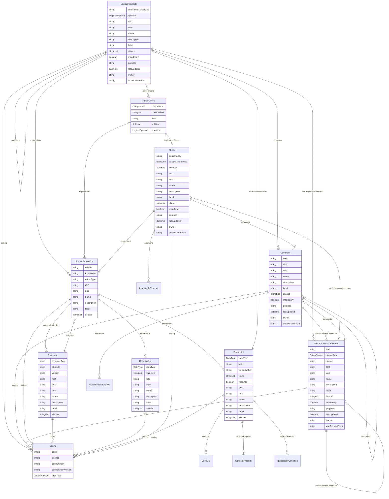

# Class: LogicalPredicate 


_A reusable, composable, and nestable logical expression resolving to a boolean. Used for applicability conditions, validation rules, eligibility criteria, and skip logic. This is a data-model predicate — not a clinical condition (diagnosis). Implements usdm:Condition (the study-design predicate, distinct from the clinical FHIR Condition resource)._


URI: [dds:class/LogicalPredicate](https://w3id.org/dds/class/LogicalPredicate)





## Inheritance
* [GovernedElement](../classes/GovernedElement.md) [ [Identifiable](../classes/Identifiable.md) [Labelled](../classes/Labelled.md) [Governed](../classes/Governed.md)]
    * **LogicalPredicate**


## Slots

| Name | Cardinality and Range | Description | Inheritance |
| ---  | --- | --- | --- |
| [rangeChecks](../slots/rangeChecks.md) | * <br/> [RangeCheck](../classes/RangeCheck.md) | Range checks that compose this predicate | direct |
| [implementsPredicate](../slots/implementsPredicate.md) | 0..1 <br/> [String](../types/String.md) | Reference to an external (e.g. USDM) predicate/condition definition that this implements | direct |
| [expressions](../slots/expressions.md) | * <br/> [FormalExpression](../classes/FormalExpression.md) | Logical expression, resolving to a boolean, that implements this predicate in a specific context | direct |
| [operator](../slots/operator.md) | 0..1 <br/> [LogicalOperator](../enums/LogicalOperator.md) | Logical operator for combining child conditions or range checks. Defaults to ALL if not specified. | direct |
| [predicates](../slots/predicates.md) | * <br/> [LogicalPredicate](../classes/LogicalPredicate.md) | Child predicates to combine using the operator (AND/OR/NOT/EXPRESSION). Rearrange and nest to compose XOR or mixed AND/OR. Use OID references to reuse predicates defined elsewhere. | direct |
| [OID](../slots/OID.md) | 1 <br/> [String](../types/String.md) | Local identifier within this study/context. Use CDISC OID format for regulatory submissions, or simple strings for internal use. | [Identifiable](../classes/Identifiable.md) |
| [uuid](../slots/uuid.md) | 0..1 <br/> [String](../types/String.md) | Universal unique identifier | [Identifiable](../classes/Identifiable.md) |
| [name](../slots/name.md) | 0..1 <br/> [String](../types/String.md) | Short name or identifier, used for field names | [Labelled](../classes/Labelled.md) |
| [description](../slots/description.md) | 0..1 <br/> [String](../types/String.md)&nbsp;or&nbsp;<br />[String](../types/String.md)&nbsp;or&nbsp;<br />[TranslatedText](../classes/TranslatedText.md) | Detailed description, shown in tooltips | [Labelled](../classes/Labelled.md) |
| [coding](../slots/coding.md) | * <br/> [Coding](../classes/Coding.md) | Semantic tags for this element | [Labelled](../classes/Labelled.md) |
| [label](../slots/label.md) | 0..1 <br/> [String](../types/String.md)&nbsp;or&nbsp;<br />[String](../types/String.md)&nbsp;or&nbsp;<br />[TranslatedText](../classes/TranslatedText.md) | Human-readable label, shown in UIs | [Labelled](../classes/Labelled.md) |
| [aliases](../slots/aliases.md) | * <br/> [String](../types/String.md)&nbsp;or&nbsp;<br />[String](../types/String.md)&nbsp;or&nbsp;<br />[TranslatedText](../classes/TranslatedText.md) | Alternative name or identifier | [Labelled](../classes/Labelled.md) |
| [mandatory](../slots/mandatory.md) | 0..1 <br/> [Boolean](../types/Boolean.md) | Is this element required? | [Governed](../classes/Governed.md) |
| [comments](../slots/comments.md) | * <br/> [Comment](../classes/Comment.md) | Comment on the element, such as a rationale for its inclusion or exclusion | [Governed](../classes/Governed.md) |
| [siteOrSponsorComments](../slots/siteOrSponsorComments.md) | * <br/> [SiteOrSponsorComment](../classes/SiteOrSponsorComment.md) | Comment on the element, such as a rationale for its inclusion or exclusion | [Governed](../classes/Governed.md) |
| [purpose](../slots/purpose.md) | 0..1 <br/> [String](../types/String.md)&nbsp;or&nbsp;<br />[String](../types/String.md)&nbsp;or&nbsp;<br />[TranslatedText](../classes/TranslatedText.md) | Purpose or rationale for this data element | [Governed](../classes/Governed.md) |
| [lastUpdated](../slots/lastUpdated.md) | 0..1 <br/> [Datetime](../types/Datetime.md) | When the resource was last updated | [Governed](../classes/Governed.md) |
| [owner](../slots/owner.md) | 0..1 <br/> [String](../types/String.md)&nbsp;or&nbsp;<br />[User](../classes/User.md)&nbsp;or&nbsp;<br />[Organization](../classes/Organization.md)&nbsp;or&nbsp;<br />[String](../types/String.md) | Party responsible for this element | [Governed](../classes/Governed.md) |
| [wasDerivedFrom](../slots/wasDerivedFrom.md) | 0..1 <br/> [String](../types/String.md)&nbsp;or&nbsp;<br />[Item](../classes/Item.md)&nbsp;or&nbsp;<br />[ItemGroup](../classes/ItemGroup.md)&nbsp;or&nbsp;<br />[Specification](../classes/Specification.md)&nbsp;or&nbsp;<br />[CodeList](../classes/CodeList.md)&nbsp;or&nbsp;<br />[Concept](../classes/Concept.md)&nbsp;or&nbsp;<br />[ConceptProperty](../classes/ConceptProperty.md)&nbsp;or&nbsp;<br />[LogicalPredicate](../classes/LogicalPredicate.md)&nbsp;or&nbsp;<br />[Method](../classes/Method.md)&nbsp;or&nbsp;<br />[Dataflow](../classes/Dataflow.md)&nbsp;or&nbsp;<br />[CubeComponent](../classes/CubeComponent.md)&nbsp;or&nbsp;<br />[DataProduct](../classes/DataProduct.md)&nbsp;or&nbsp;<br />[ProvisionAgreement](../classes/ProvisionAgreement.md) | Reference to another item that this item implements or extends, e.g. a template Item definition. | [Governed](../classes/Governed.md) |


## Usages

| used by | used in | type | used |
| ---  | --- | --- | --- |
| [GovernedElement](../classes/GovernedElement.md) | [wasDerivedFrom](../slots/wasDerivedFrom.md) | any_of[range] | [LogicalPredicate](../classes/LogicalPredicate.md) |
| [Governed](../classes/Governed.md) | [wasDerivedFrom](../slots/wasDerivedFrom.md) | any_of[range] | [LogicalPredicate](../classes/LogicalPredicate.md) |
| [ODMItemSerialization](../classes/ODMItemSerialization.md) | [collectionExceptionPredicate](../slots/collectionExceptionPredicate.md) | range | [LogicalPredicate](../classes/LogicalPredicate.md) |
| [Specification](../classes/Specification.md) | [predicates](../slots/predicates.md) | range | [LogicalPredicate](../classes/LogicalPredicate.md) |
| [Specification](../classes/Specification.md) | [wasDerivedFrom](../slots/wasDerivedFrom.md) | any_of[range] | [LogicalPredicate](../classes/LogicalPredicate.md) |
| [Item](../classes/Item.md) | [wasDerivedFrom](../slots/wasDerivedFrom.md) | any_of[range] | [LogicalPredicate](../classes/LogicalPredicate.md) |
| [ItemGroup](../classes/ItemGroup.md) | [wasDerivedFrom](../slots/wasDerivedFrom.md) | any_of[range] | [LogicalPredicate](../classes/LogicalPredicate.md) |
| [Query](../classes/Query.md) | [wasDerivedFrom](../slots/wasDerivedFrom.md) | any_of[range] | [LogicalPredicate](../classes/LogicalPredicate.md) |
| [CodeList](../classes/CodeList.md) | [wasDerivedFrom](../slots/wasDerivedFrom.md) | any_of[range] | [LogicalPredicate](../classes/LogicalPredicate.md) |
| [Comment](../classes/Comment.md) | [wasDerivedFrom](../slots/wasDerivedFrom.md) | any_of[range] | [LogicalPredicate](../classes/LogicalPredicate.md) |
| [Concept](../classes/Concept.md) | [wasDerivedFrom](../slots/wasDerivedFrom.md) | any_of[range] | [LogicalPredicate](../classes/LogicalPredicate.md) |
| [ConceptProperty](../classes/ConceptProperty.md) | [wasDerivedFrom](../slots/wasDerivedFrom.md) | any_of[range] | [LogicalPredicate](../classes/LogicalPredicate.md) |
| [ApplicabilityCondition](../classes/ApplicabilityCondition.md) | [predicates](../slots/predicates.md) | range | [LogicalPredicate](../classes/LogicalPredicate.md) |
| [ApplicabilityCondition](../classes/ApplicabilityCondition.md) | [wasDerivedFrom](../slots/wasDerivedFrom.md) | any_of[range] | [LogicalPredicate](../classes/LogicalPredicate.md) |
| [LogicalPredicate](../classes/LogicalPredicate.md) | [predicates](../slots/predicates.md) | range | [LogicalPredicate](../classes/LogicalPredicate.md) |
| [LogicalPredicate](../classes/LogicalPredicate.md) | [wasDerivedFrom](../slots/wasDerivedFrom.md) | any_of[range] | [LogicalPredicate](../classes/LogicalPredicate.md) |
| [Check](../classes/Check.md) | [wasDerivedFrom](../slots/wasDerivedFrom.md) | any_of[range] | [LogicalPredicate](../classes/LogicalPredicate.md) |
| [Method](../classes/Method.md) | [wasDerivedFrom](../slots/wasDerivedFrom.md) | any_of[range] | [LogicalPredicate](../classes/LogicalPredicate.md) |
| [Parameter](../classes/Parameter.md) | [validationPredicates](../slots/validationPredicates.md) | range | [LogicalPredicate](../classes/LogicalPredicate.md) |
| [SiteOrSponsorComment](../classes/SiteOrSponsorComment.md) | [wasDerivedFrom](../slots/wasDerivedFrom.md) | any_of[range] | [LogicalPredicate](../classes/LogicalPredicate.md) |
| [DataStructureDefinition](../classes/DataStructureDefinition.md) | [wasDerivedFrom](../slots/wasDerivedFrom.md) | any_of[range] | [LogicalPredicate](../classes/LogicalPredicate.md) |
| [Dataflow](../classes/Dataflow.md) | [wasDerivedFrom](../slots/wasDerivedFrom.md) | any_of[range] | [LogicalPredicate](../classes/LogicalPredicate.md) |
| [CubeComponent](../classes/CubeComponent.md) | [wasDerivedFrom](../slots/wasDerivedFrom.md) | any_of[range] | [LogicalPredicate](../classes/LogicalPredicate.md) |
| [Measure](../classes/Measure.md) | [wasDerivedFrom](../slots/wasDerivedFrom.md) | any_of[range] | [LogicalPredicate](../classes/LogicalPredicate.md) |
| [Dimension](../classes/Dimension.md) | [wasDerivedFrom](../slots/wasDerivedFrom.md) | any_of[range] | [LogicalPredicate](../classes/LogicalPredicate.md) |
| [DataAttribute](../classes/DataAttribute.md) | [wasDerivedFrom](../slots/wasDerivedFrom.md) | any_of[range] | [LogicalPredicate](../classes/LogicalPredicate.md) |
| [DataProduct](../classes/DataProduct.md) | [wasDerivedFrom](../slots/wasDerivedFrom.md) | any_of[range] | [LogicalPredicate](../classes/LogicalPredicate.md) |
| [ProvisionAgreement](../classes/ProvisionAgreement.md) | [wasDerivedFrom](../slots/wasDerivedFrom.md) | any_of[range] | [LogicalPredicate](../classes/LogicalPredicate.md) |
| [Policy](../classes/Policy.md) | [wasDerivedFrom](../slots/wasDerivedFrom.md) | any_of[range] | [LogicalPredicate](../classes/LogicalPredicate.md) |
| [Analysis](../classes/Analysis.md) | [wasDerivedFrom](../slots/wasDerivedFrom.md) | any_of[range] | [LogicalPredicate](../classes/LogicalPredicate.md) |
| [Display](../classes/Display.md) | [wasDerivedFrom](../slots/wasDerivedFrom.md) | any_of[range] | [LogicalPredicate](../classes/LogicalPredicate.md) |


## Identifier and Mapping Information


### Schema Source


* from schema: https://w3id.org/dds


## Mappings

| Mapping Type | Mapped Value |
| ---  | ---  |
| self | dds:LogicalPredicate |
| native | dds:LogicalPredicate |
| related | fhir:Expression, qb:SliceKey, sdmx:DataConstraint, sdmx:MetaDataConstraint, sdmx:DataKeySet |
| close | odm:ConditionDef, usdm:Condition |


## LinkML Source

<!-- TODO: investigate https://stackoverflow.com/questions/37606292/how-to-create-tabbed-code-blocks-in-mkdocs-or-sphinx -->

### Direct

<details>
```yaml
name: LogicalPredicate
description: A reusable, composable, and nestable logical expression resolving to
  a boolean. Used for applicability conditions, validation rules, eligibility criteria,
  and skip logic. This is a data-model predicate — not a clinical condition (diagnosis).
  Implements usdm:Condition (the study-design predicate, distinct from the clinical
  FHIR Condition resource).
from_schema: https://w3id.org/dds
close_mappings:
- odm:ConditionDef
- usdm:Condition
related_mappings:
- fhir:Expression
- qb:SliceKey
- sdmx:DataConstraint
- sdmx:MetaDataConstraint
- sdmx:DataKeySet
is_a: GovernedElement
attributes:
  rangeChecks:
    name: rangeChecks
    description: Range checks that compose this predicate
    from_schema: https://w3id.org/dds
    domain_of:
    - Item
    - LogicalPredicate
    range: RangeCheck
    multivalued: true
    inlined: true
    inlined_as_list: true
  implementsPredicate:
    name: implementsPredicate
    description: Reference to an external (e.g. USDM) predicate/condition definition
      that this implements
    from_schema: https://w3id.org/dds
    rank: 1000
    domain_of:
    - LogicalPredicate
  expressions:
    name: expressions
    description: Logical expression, resolving to a boolean, that implements this
      predicate in a specific context
    from_schema: https://w3id.org/dds
    rank: 1000
    domain_of:
    - LogicalPredicate
    - RangeCheck
    - Check
    - Method
    range: FormalExpression
    multivalued: true
    inlined: true
    inlined_as_list: true
  operator:
    name: operator
    description: Logical operator for combining child conditions or range checks.
      Defaults to ALL if not specified.
    from_schema: https://w3id.org/dds
    rank: 1000
    ifabsent: LogicalOperator(AND)
    domain_of:
    - LogicalPredicate
    - RangeCheck
    - Constraint
    range: LogicalOperator
    required: false
  predicates:
    name: predicates
    description: Child predicates to combine using the operator (AND/OR/NOT/EXPRESSION).
      Rearrange and nest to compose XOR or mixed AND/OR. Use OID references to reuse
      predicates defined elsewhere.
    from_schema: https://w3id.org/dds
    domain_of:
    - Specification
    - ApplicabilityCondition
    - LogicalPredicate
    range: LogicalPredicate
    multivalued: true
    inlined: false

```
</details>

### Induced

<details>
```yaml
name: LogicalPredicate
description: A reusable, composable, and nestable logical expression resolving to
  a boolean. Used for applicability conditions, validation rules, eligibility criteria,
  and skip logic. This is a data-model predicate — not a clinical condition (diagnosis).
  Implements usdm:Condition (the study-design predicate, distinct from the clinical
  FHIR Condition resource).
from_schema: https://w3id.org/dds
close_mappings:
- odm:ConditionDef
- usdm:Condition
related_mappings:
- fhir:Expression
- qb:SliceKey
- sdmx:DataConstraint
- sdmx:MetaDataConstraint
- sdmx:DataKeySet
is_a: GovernedElement
attributes:
  rangeChecks:
    name: rangeChecks
    description: Range checks that compose this predicate
    from_schema: https://w3id.org/dds
    alias: rangeChecks
    owner: LogicalPredicate
    domain_of:
    - Item
    - LogicalPredicate
    range: RangeCheck
    multivalued: true
    inlined: true
    inlined_as_list: true
  implementsPredicate:
    name: implementsPredicate
    description: Reference to an external (e.g. USDM) predicate/condition definition
      that this implements
    from_schema: https://w3id.org/dds
    rank: 1000
    alias: implementsPredicate
    owner: LogicalPredicate
    domain_of:
    - LogicalPredicate
    range: string
  expressions:
    name: expressions
    description: Logical expression, resolving to a boolean, that implements this
      predicate in a specific context
    from_schema: https://w3id.org/dds
    rank: 1000
    alias: expressions
    owner: LogicalPredicate
    domain_of:
    - LogicalPredicate
    - RangeCheck
    - Check
    - Method
    range: FormalExpression
    multivalued: true
    inlined: true
    inlined_as_list: true
  operator:
    name: operator
    description: Logical operator for combining child conditions or range checks.
      Defaults to ALL if not specified.
    from_schema: https://w3id.org/dds
    rank: 1000
    ifabsent: LogicalOperator(AND)
    alias: operator
    owner: LogicalPredicate
    domain_of:
    - LogicalPredicate
    - RangeCheck
    - Constraint
    range: LogicalOperator
    required: false
  predicates:
    name: predicates
    description: Child predicates to combine using the operator (AND/OR/NOT/EXPRESSION).
      Rearrange and nest to compose XOR or mixed AND/OR. Use OID references to reuse
      predicates defined elsewhere.
    from_schema: https://w3id.org/dds
    alias: predicates
    owner: LogicalPredicate
    domain_of:
    - Specification
    - ApplicabilityCondition
    - LogicalPredicate
    range: LogicalPredicate
    multivalued: true
    inlined: false
  OID:
    name: OID
    description: Local identifier within this study/context. Use CDISC OID format
      for regulatory submissions, or simple strings for internal use.
    from_schema: https://w3id.org/dds
    rank: 1000
    identifier: true
    alias: OID
    owner: LogicalPredicate
    domain_of:
    - Identifiable
    range: string
    required: true
  uuid:
    name: uuid
    description: Universal unique identifier
    from_schema: https://w3id.org/dds
    rank: 1000
    alias: uuid
    owner: LogicalPredicate
    domain_of:
    - Identifiable
    range: string
  name:
    name: name
    description: Short name or identifier, used for field names
    from_schema: https://w3id.org/dds
    rank: 1000
    alias: name
    owner: LogicalPredicate
    domain_of:
    - Labelled
    - DefClass
    - SubClass
    - Standard
    range: string
  description:
    name: description
    description: Detailed description, shown in tooltips
    from_schema: https://w3id.org/dds
    rank: 1000
    alias: description
    owner: LogicalPredicate
    domain_of:
    - Labelled
    - CodeListItem
    range: string
    any_of:
    - range: string
    - range: TranslatedText
  coding:
    name: coding
    description: Semantic tags for this element
    from_schema: https://w3id.org/dds
    rank: 1000
    alias: coding
    owner: LogicalPredicate
    domain_of:
    - Labelled
    - CodeListItem
    - SourceItem
    range: Coding
    multivalued: true
    inlined: true
    inlined_as_list: true
  label:
    name: label
    description: Human-readable label, shown in UIs
    from_schema: https://w3id.org/dds
    exact_mappings:
    - skos:prefLabel
    rank: 1000
    alias: label
    owner: LogicalPredicate
    domain_of:
    - Labelled
    range: string
    any_of:
    - range: string
    - range: TranslatedText
  aliases:
    name: aliases
    description: Alternative name or identifier
    from_schema: https://w3id.org/dds
    exact_mappings:
    - skos:altLabel
    rank: 1000
    alias: aliases
    owner: LogicalPredicate
    domain_of:
    - Labelled
    - CodeListItem
    range: string
    multivalued: true
    inlined: true
    inlined_as_list: true
    any_of:
    - range: string
    - range: TranslatedText
  mandatory:
    name: mandatory
    description: Is this element required?
    from_schema: https://w3id.org/dds
    rank: 1000
    alias: mandatory
    owner: LogicalPredicate
    domain_of:
    - Governed
    range: boolean
  comments:
    name: comments
    description: Comment on the element, such as a rationale for its inclusion or
      exclusion
    from_schema: https://w3id.org/dds
    rank: 1000
    alias: comments
    owner: LogicalPredicate
    domain_of:
    - Governed
    range: Comment
    multivalued: true
    inlined: false
  siteOrSponsorComments:
    name: siteOrSponsorComments
    description: Comment on the element, such as a rationale for its inclusion or
      exclusion
    from_schema: https://w3id.org/dds
    rank: 1000
    alias: siteOrSponsorComments
    owner: LogicalPredicate
    domain_of:
    - Governed
    range: SiteOrSponsorComment
    multivalued: true
    inlined: false
  purpose:
    name: purpose
    description: Purpose or rationale for this data element
    from_schema: https://w3id.org/dds
    rank: 1000
    alias: purpose
    owner: LogicalPredicate
    domain_of:
    - Governed
    range: string
    any_of:
    - range: string
    - range: TranslatedText
  lastUpdated:
    name: lastUpdated
    description: When the resource was last updated
    from_schema: https://w3id.org/dds
    rank: 1000
    alias: lastUpdated
    owner: LogicalPredicate
    domain_of:
    - Governed
    range: datetime
  owner:
    name: owner
    description: Party responsible for this element
    from_schema: https://w3id.org/dds
    narrow_mappings:
    - prov:wasAttributedTo
    - prov:wasAssociatedBy
    rank: 1000
    alias: owner
    owner: LogicalPredicate
    domain_of:
    - Governed
    range: string
    any_of:
    - range: User
    - range: Organization
    - range: string
  wasDerivedFrom:
    name: wasDerivedFrom
    description: Reference to another item that this item implements or extends, e.g.
      a template Item definition.
    from_schema: https://w3id.org/dds
    exact_mappings:
    - prov:wasDerivedFrom
    rank: 1000
    alias: wasDerivedFrom
    owner: LogicalPredicate
    domain_of:
    - Governed
    range: string
    any_of:
    - range: Item
    - range: ItemGroup
    - range: Specification
    - range: CodeList
    - range: Concept
    - range: ConceptProperty
    - range: LogicalPredicate
    - range: Method
    - range: Dataflow
    - range: CubeComponent
    - range: DataProduct
    - range: ProvisionAgreement

```
</details>