# Class: MetaDataVersion 


_A container element that represents a given version of a specification, linking to a particular usage context such as a study, dataset, or data collection instrument._


URI: [odm:class/MetaDataVersion](https://cdisc.org/odm2/class/MetaDataVersion)

```mermaid
erDiagram
MetaDataVersion {
    stringList resources  
    string fileOID  
    datetime asOfDateTime  
    datetime creationDateTime  
    string odmVersion  
    string fileType  
    string originator  
    string sourceSystem  
    string sourceSystemVersion  
    string context  
    string defineVersion  
    string studyOID  
    string studyName  
    string studyDescription  
    string protocolName  
    string OID  
    string uuid  
    string name  
    string description  
    string label  
    stringList aliases  
    boolean mandatory  
    string purpose  
    datetime lastUpdated  
    string owner  
    string wasDerivedFrom  
}
Comment {
    string text  
    string OID  
    string uuid  
    string name  
    string description  
    string label  
    stringList aliases  
    boolean mandatory  
    string purpose  
    datetime lastUpdated  
    string owner  
    string wasDerivedFrom  
}
Coding {
    string code  
    string decode  
    string codeSystem  
    string codeSystemVersion  
    AliasPredicate aliasType  
}
DocumentReference {
    string title  
    string leafID  
    integerList pages  
    string relationship  
    string version  
    string href  
    string OID  
    string uuid  
    string name  
    string description  
    string label  
    stringList aliases  
}
DataProduct {
    string dataProductOwner  
    string domain  
    DataProductLifecycleStatus lifecycleStatus  
    stringList hasPolicy  
    string version  
    string href  
    string OID  
    string uuid  
    string name  
    string description  
    string label  
    stringList aliases  
    boolean mandatory  
    string purpose  
    datetime lastUpdated  
    string owner  
    string wasDerivedFrom  
}
Dataset {
    string publishedBy  
    stringList keys  
    string datasetType  
    string conformsTo  
    stringList hasPolicy  
    string informationSensitivityClassification  
    string version  
    string href  
    stringList profile  
    string authenticator  
    string action  
    string reportingBegin  
    string reportingEnd  
    string dataExtractionDate  
    string validFrom  
    string validTo  
    string publicationYear  
    string publicationPeriod  
    string OID  
    string uuid  
    string name  
    string description  
    string label  
    stringList aliases  
}
DataService {
    string protocol  
    string securitySchemaType  
    string resourceType  
    string attribute  
    string version  
    string href  
    string OID  
    string uuid  
    string name  
    string description  
    string label  
    stringList aliases  
}
Standard {
    StandardName name  
    StandardType type  
    PublishingSet publishingSet  
    string version  
    StandardStatus status  
    string OID  
    string uuid  
    string description  
    string label  
    stringList aliases  
}
Dictionary {
    string publishedBy  
    string OID  
    string uuid  
    string name  
    string description  
    string label  
    stringList aliases  
}
Relationship {
    PredicateTermEnum predicateTerm  
    LinkingPhraseEnum linkingPhrase  
    string OID  
    string uuid  
    string name  
    string description  
    string label  
    stringList aliases  
}
IdentifiableElement {
    string OID  
    string uuid  
    string name  
    string description  
    string label  
    stringList aliases  
}
ReifiedConcept {
    string version  
    string href  
    string OID  
    string uuid  
    string name  
    string description  
    string label  
    stringList aliases  
    boolean mandatory  
    string purpose  
    datetime lastUpdated  
    string owner  
    string wasDerivedFrom  
}
ConceptProperty {
    integer minOccurs  
    integer maxOccurs  
    string OID  
    string uuid  
    string name  
    string description  
    string label  
    stringList aliases  
    boolean mandatory  
    string purpose  
    datetime lastUpdated  
    string owner  
    string wasDerivedFrom  
}
CodeList {
    DataType dataType  
    string formatName  
    string version  
    string href  
    string OID  
    string uuid  
    string name  
    string description  
    string label  
    stringList aliases  
    boolean mandatory  
    string purpose  
    datetime lastUpdated  
    string owner  
    string wasDerivedFrom  
}
Resource {
    string resourceType  
    string attribute  
    string version  
    string href  
    string OID  
    string uuid  
    string name  
    string description  
    string label  
    stringList aliases  
}
CodeListItem {
    string codedValue  
    string decode  
    string description  
    stringList aliases  
    decimal weight  
    boolean other  
}
Method {
    MethodType type  
    string OID  
    string uuid  
    string name  
    string description  
    string label  
    stringList aliases  
    boolean mandatory  
    string purpose  
    datetime lastUpdated  
    string owner  
    string wasDerivedFrom  
}
FormalExpression {
    string context  
    string expression  
    string returnType  
    string OID  
    string uuid  
    string name  
    string description  
    string label  
    stringList aliases  
}
WhereClause {
    string OID  
    string uuid  
    string name  
    string description  
    string label  
    stringList aliases  
    boolean mandatory  
    string purpose  
    datetime lastUpdated  
    string owner  
    string wasDerivedFrom  
}
Condition {
    string implementsCondition  
    LogicalOperator operator  
    string OID  
    string uuid  
    string name  
    string description  
    string label  
    stringList aliases  
    boolean mandatory  
    string purpose  
    datetime lastUpdated  
    string owner  
    string wasDerivedFrom  
}
Item {
    DataType dataType  
    integer length  
    string role  
    boolean hasNoData  
    string crfCompletionInstructions  
    string cdiscNotes  
    string implementationNotes  
    string preSpecifiedValue  
    integer decimalDigits  
    string displayFormat  
    integer significantDigits  
    string OID  
    string uuid  
    string name  
    string description  
    string label  
    stringList aliases  
    boolean mandatory  
    string purpose  
    datetime lastUpdated  
    string owner  
    string wasDerivedFrom  
}
Origin {
    OriginType type  
    OriginSource source  
}
RangeCheck {
    Comparator comparator  
    stringList checkValues  
    string item  
    SoftHard softHard  
    LogicalOperator operator  
}
ItemGroup {
    string domain  
    string structure  
    boolean isReferenceData  
    ItemGroupType type  
    stringList children  
    stringList profile  
    string authenticator  
    string OID  
    string uuid  
    string name  
    string description  
    string label  
    stringList aliases  
    boolean mandatory  
    string purpose  
    datetime lastUpdated  
    string owner  
    string wasDerivedFrom  
    string version  
    string href  
}
Timing {
    TimingType type  
    boolean isNominal  
    string value  
    datetime windowLower  
    datetime windowUpper  
    boolean recalled  
    string frequency  
    string OID  
    string uuid  
    string name  
    string description  
    string label  
    stringList aliases  
}

MetaDataVersion ||--}o ItemGroup : "itemGroups"
MetaDataVersion ||--}o Item : "items"
MetaDataVersion ||--}o Condition : "conditions"
MetaDataVersion ||--}o WhereClause : "whereClauses"
MetaDataVersion ||--}o Method : "methods"
MetaDataVersion ||--}o CodeList : "codeLists"
MetaDataVersion ||--}o Coding : "codings"
MetaDataVersion ||--}o ReifiedConcept : "concepts"
MetaDataVersion ||--}o Relationship : "relationships"
MetaDataVersion ||--}o Dictionary : "dictionaries"
MetaDataVersion ||--}o Standard : "standards"
MetaDataVersion ||--}o DocumentReference : "annotatedCRFs"
MetaDataVersion ||--}o DataProduct : "dataProducts"
MetaDataVersion ||--}o Coding : "coding"
MetaDataVersion ||--}o Comment : "comments"
MetaDataVersion ||--}o Comment : "siteOrSponsorComments"
Comment ||--}o DocumentReference : "documents"
Comment ||--}o Coding : "coding"
Comment ||--}o Comment : "comments"
Comment ||--}o Comment : "siteOrSponsorComments"
DocumentReference ||--}o Coding : "coding"
DataProduct ||--}o DataService : "inputPort"
DataProduct ||--}o DataService : "outputPort"
DataProduct ||--}o Dataset : "inputDataset"
DataProduct ||--}o Dataset : "outputDataset"
DataProduct ||--}o Coding : "coding"
DataProduct ||--}o Comment : "comments"
DataProduct ||--}o Comment : "siteOrSponsorComments"
Dataset ||--|o Dataflow : "describedBy"
Dataset ||--|o DataStructureDefinition : "structuredBy"
Dataset ||--}o Distribution : "distribution"
Dataset ||--}o Coding : "security"
Dataset ||--|o Timing : "validityPeriod"
Dataset ||--}o Coding : "coding"
DataService ||--|o Distribution : "isAccessServiceOf"
DataService ||--}o FormalExpression : "selection"
DataService ||--}o Coding : "coding"
Standard ||--}o Coding : "coding"
Dictionary ||--}o Coding : "terms"
Dictionary ||--}o Coding : "coding"
Relationship ||--|| IdentifiableElement : "subject"
Relationship ||--|| IdentifiableElement : "object"
Relationship ||--}o Coding : "coding"
IdentifiableElement ||--}o Coding : "coding"
ReifiedConcept ||--}o ConceptProperty : "properties"
ReifiedConcept ||--}o Coding : "coding"
ReifiedConcept ||--}o Comment : "comments"
ReifiedConcept ||--}o Comment : "siteOrSponsorComments"
ConceptProperty ||--|o CodeList : "codeList"
ConceptProperty ||--}o Coding : "coding"
ConceptProperty ||--}o Comment : "comments"
ConceptProperty ||--}o Comment : "siteOrSponsorComments"
CodeList ||--}o CodeListItem : "codeListItems"
CodeList ||--|o Resource : "externalCodeList"
CodeList ||--}o Coding : "coding"
CodeList ||--}o Comment : "comments"
CodeList ||--}o Comment : "siteOrSponsorComments"
Resource ||--}o FormalExpression : "selection"
Resource ||--}o Coding : "coding"
CodeListItem ||--|o Coding : "coding"
Method ||--}o FormalExpression : "expressions"
Method ||--|o DocumentReference : "document"
Method ||--}o Coding : "coding"
Method ||--}o Comment : "comments"
Method ||--}o Comment : "siteOrSponsorComments"
FormalExpression ||--}o Parameter : "parameters"
FormalExpression ||--|o ReturnValue : "returnValue"
FormalExpression ||--}o Resource : "externalCodeLibs"
FormalExpression ||--}o Coding : "coding"
WhereClause ||--}o Condition : "conditions"
WhereClause ||--}o Coding : "coding"
WhereClause ||--}o Comment : "comments"
WhereClause ||--}o Comment : "siteOrSponsorComments"
Condition ||--}o RangeCheck : "rangeChecks"
Condition ||--}o FormalExpression : "expressions"
Condition ||--}o Condition : "conditions"
Condition ||--}o Coding : "coding"
Condition ||--}o Comment : "comments"
Condition ||--}o Comment : "siteOrSponsorComments"
Item ||--|o CodeList : "codeList"
Item ||--|o Method : "method"
Item ||--}o RangeCheck : "rangeChecks"
Item ||--}o WhereClause : "applicableWhen"
Item ||--|o Origin : "origin"
Item ||--|o ConceptProperty : "conceptProperty"
Item ||--|o CodeList : "roleCodeList"
Item ||--|o Condition : "collectionExceptionCondition"
Item ||--}o Coding : "coding"
Item ||--}o Comment : "comments"
Item ||--}o Comment : "siteOrSponsorComments"
Origin ||--}o SourceItem : "sourceItems"
Origin ||--|o DocumentReference : "document"
RangeCheck ||--}o FormalExpression : "expressions"
ItemGroup ||--}o Item : "items"
ItemGroup ||--|o ReifiedConcept : "implementsConcept"
ItemGroup ||--}o WhereClause : "applicableWhen"
ItemGroup ||--}o Coding : "security"
ItemGroup ||--|o Timing : "validityPeriod"
ItemGroup ||--}o Coding : "coding"
ItemGroup ||--}o Comment : "comments"
ItemGroup ||--}o Comment : "siteOrSponsorComments"
Timing ||--|o NominalOccurrence : "relativeTo"
Timing ||--|o NominalOccurrence : "relativeFrom"
Timing ||--|o Method : "imputation"
Timing ||--}o Coding : "coding"

```





## Inheritance
* [GovernedElement](../classes/GovernedElement.md) [ [Identifiable](../classes/Identifiable.md) [Labelled](../classes/Labelled.md) [Governed](../classes/Governed.md)]
    * **MetaDataVersion** [ [ODMFileMetadata](../classes/ODMFileMetadata.md) [StudyMetadata](../classes/StudyMetadata.md)]


## Slots

| Name | Cardinality and Range | Description | Inheritance |
| ---  | --- | --- | --- |
| [itemGroups](../slots/itemGroups.md) | * <br/> [ItemGroup](../classes/ItemGroup.md) | Item groups, containing items, defined in this version of the metadata | direct |
| [items](../slots/items.md) | * <br/> [Item](../classes/Item.md) | Template or top-level items (not belonging to any item group) defined in this version of the metadata | direct |
| [resources](../slots/resources.md) | * <br/> [String](../types/String.md)&nbsp;or&nbsp;<br />[DocumentReference](../classes/DocumentReference.md)&nbsp;or&nbsp;<br />[Resource](../classes/Resource.md) | References to documents that describe this version of the metadata. | direct |
| [conditions](../slots/conditions.md) | * <br/> [Condition](../classes/Condition.md) | Logical conditions that apply to this version of the metadata. | direct |
| [whereClauses](../slots/whereClauses.md) | * <br/> [WhereClause](../classes/WhereClause.md) | Data contexts that apply to this version of the metadata. | direct |
| [methods](../slots/methods.md) | * <br/> [Method](../classes/Method.md) | Methods defined in this version of the metadata. | direct |
| [codeLists](../slots/codeLists.md) | * <br/> [CodeList](../classes/CodeList.md) | Code lists defined in this version of the metadata. | direct |
| [codings](../slots/codings.md) | * <br/> [Coding](../classes/Coding.md) | Codings defined in this version of the metadata | direct |
| [concepts](../slots/concepts.md) | * <br/> [ReifiedConcept](../classes/ReifiedConcept.md) | Structured Concepts defined in this version of the metadata | direct |
| [relationships](../slots/relationships.md) | * <br/> [Relationship](../classes/Relationship.md) | Relationships between items, item groups, and other elements in this version of the metadata. | direct |
| [dictionaries](../slots/dictionaries.md) | * <br/> [Dictionary](../classes/Dictionary.md) | Dictionaries defined in this version of the metadata | direct |
| [standards](../slots/standards.md) | * <br/> [Standard](../classes/Standard.md) | Standards defined in this version of the metadata | direct |
| [annotatedCRFs](../slots/annotatedCRFs.md) | * <br/> [DocumentReference](../classes/DocumentReference.md) | Reference to annotated case report forms | direct |
| [dataProducts](../slots/dataProducts.md) | * <br/> [DataProduct](../classes/DataProduct.md) | Indexed data flows with clear ownership | direct |
| [fileOID](../slots/fileOID.md) | 1 <br/> [String](../types/String.md) | Unique identifier for the ODM file | [ODMFileMetadata](../classes/ODMFileMetadata.md) |
| [asOfDateTime](../slots/asOfDateTime.md) | 0..1 <br/> [Datetime](../types/Datetime.md) | Date and time when the data snapshot was taken | [ODMFileMetadata](../classes/ODMFileMetadata.md) |
| [creationDateTime](../slots/creationDateTime.md) | 1 <br/> [Datetime](../types/Datetime.md) | Date and time when the ODM file was created | [ODMFileMetadata](../classes/ODMFileMetadata.md) |
| [odmVersion](../slots/odmVersion.md) | 1 <br/> [String](../types/String.md) | Version of the ODM standard used | [ODMFileMetadata](../classes/ODMFileMetadata.md) |
| [fileType](../slots/fileType.md) | 1 <br/> [String](../types/String.md) | Type of ODM file (e.g., Snapshot, Transactional) | [ODMFileMetadata](../classes/ODMFileMetadata.md) |
| [originator](../slots/originator.md) | 0..1 <br/> [String](../types/String.md) | Organization or system that created the ODM file | [ODMFileMetadata](../classes/ODMFileMetadata.md) |
| [sourceSystem](../slots/sourceSystem.md) | 0..1 <br/> [String](../types/String.md) | Source system that generated the data | [ODMFileMetadata](../classes/ODMFileMetadata.md) |
| [sourceSystemVersion](../slots/sourceSystemVersion.md) | 0..1 <br/> [String](../types/String.md) | Version of the source system | [ODMFileMetadata](../classes/ODMFileMetadata.md) |
| [context](../slots/context.md) | 0..1 <br/> [String](../types/String.md) | Define-XML context (usually "Other" for Define-XML) | [ODMFileMetadata](../classes/ODMFileMetadata.md) |
| [defineVersion](../slots/defineVersion.md) | 0..1 <br/> [String](../types/String.md) | Version of Define-XML specification used | [ODMFileMetadata](../classes/ODMFileMetadata.md) |
| [studyOID](../slots/studyOID.md) | 1 <br/> [String](../types/String.md) | Unique identifier for the study | [StudyMetadata](../classes/StudyMetadata.md) |
| [studyName](../slots/studyName.md) | 0..1 <br/> [String](../types/String.md) | Name of the study | [StudyMetadata](../classes/StudyMetadata.md) |
| [studyDescription](../slots/studyDescription.md) | 0..1 <br/> [String](../types/String.md) | Description of the study | [StudyMetadata](../classes/StudyMetadata.md) |
| [protocolName](../slots/protocolName.md) | 0..1 <br/> [String](../types/String.md) | Protocol name for the study | [StudyMetadata](../classes/StudyMetadata.md) |
| [OID](../slots/OID.md) | 1 <br/> [String](../types/String.md) | Local identifier within this study/context. Use CDISC OID format for regulatory submissions, or simple strings for internal use. | [Identifiable](../classes/Identifiable.md) |
| [uuid](../slots/uuid.md) | 0..1 <br/> [String](../types/String.md) | Universal unique identifier | [Identifiable](../classes/Identifiable.md) |
| [name](../slots/name.md) | 0..1 <br/> [String](../types/String.md) | Short name or identifier, used for field names | [Labelled](../classes/Labelled.md) |
| [description](../slots/description.md) | 0..1 <br/> [String](../types/String.md)&nbsp;or&nbsp;<br />[String](../types/String.md)&nbsp;or&nbsp;<br />[TranslatedText](../classes/TranslatedText.md) | Detailed description, shown in tooltips | [Labelled](../classes/Labelled.md) |
| [coding](../slots/coding.md) | * <br/> [Coding](../classes/Coding.md) | Semantic tags for this element | [Labelled](../classes/Labelled.md) |
| [label](../slots/label.md) | 0..1 <br/> [String](../types/String.md)&nbsp;or&nbsp;<br />[String](../types/String.md)&nbsp;or&nbsp;<br />[TranslatedText](../classes/TranslatedText.md) | Human-readable label, shown in UIs | [Labelled](../classes/Labelled.md) |
| [aliases](../slots/aliases.md) | * <br/> [String](../types/String.md)&nbsp;or&nbsp;<br />[String](../types/String.md)&nbsp;or&nbsp;<br />[TranslatedText](../classes/TranslatedText.md) | Alternative name or identifier | [Labelled](../classes/Labelled.md) |
| [mandatory](../slots/mandatory.md) | 0..1 <br/> [Boolean](../types/Boolean.md) | Is this element required? | [Governed](../classes/Governed.md) |
| [comments](../slots/comments.md) | * <br/> [Comment](../classes/Comment.md) | Comment on the element, such as a rationale for its inclusion or exclusion | [Governed](../classes/Governed.md) |
| [siteOrSponsorComments](../slots/siteOrSponsorComments.md) | * <br/> [Comment](../classes/Comment.md) | Comment on the element, such as a rationale for its inclusion or exclusion | [Governed](../classes/Governed.md) |
| [purpose](../slots/purpose.md) | 0..1 <br/> [String](../types/String.md)&nbsp;or&nbsp;<br />[String](../types/String.md)&nbsp;or&nbsp;<br />[TranslatedText](../classes/TranslatedText.md) | Purpose or rationale for this data element | [Governed](../classes/Governed.md) |
| [lastUpdated](../slots/lastUpdated.md) | 1 <br/> [Datetime](../types/Datetime.md) | When the resource was last updated | [Governed](../classes/Governed.md) |
| [owner](../slots/owner.md) | 0..1 <br/> [String](../types/String.md)&nbsp;or&nbsp;<br />[User](../classes/User.md)&nbsp;or&nbsp;<br />[Organization](../classes/Organization.md)&nbsp;or&nbsp;<br />[String](../types/String.md) | Party responsible for this element | [Governed](../classes/Governed.md) |
| [wasDerivedFrom](../slots/wasDerivedFrom.md) | 0..1 <br/> [String](../types/String.md)&nbsp;or&nbsp;<br />[Item](../classes/Item.md)&nbsp;or&nbsp;<br />[ItemGroup](../classes/ItemGroup.md)&nbsp;or&nbsp;<br />[MetaDataVersion](../classes/MetaDataVersion.md)&nbsp;or&nbsp;<br />[CodeList](../classes/CodeList.md)&nbsp;or&nbsp;<br />[ReifiedConcept](../classes/ReifiedConcept.md)&nbsp;or&nbsp;<br />[ConceptProperty](../classes/ConceptProperty.md)&nbsp;or&nbsp;<br />[Condition](../classes/Condition.md)&nbsp;or&nbsp;<br />[Method](../classes/Method.md)&nbsp;or&nbsp;<br />[NominalOccurrence](../classes/NominalOccurrence.md)&nbsp;or&nbsp;<br />[Dataflow](../classes/Dataflow.md)&nbsp;or&nbsp;<br />[CubeComponent](../classes/CubeComponent.md)&nbsp;or&nbsp;<br />[DataProduct](../classes/DataProduct.md)&nbsp;or&nbsp;<br />[ProvisionAgreement](../classes/ProvisionAgreement.md) | Reference to another item that this item implements or extends, e.g. a template Item definition. | [Governed](../classes/Governed.md) |


## Usages

| used by | used in | type | used |
| ---  | --- | --- | --- |
| [GovernedElement](../classes/GovernedElement.md) | [wasDerivedFrom](../slots/wasDerivedFrom.md) | any_of[range] | [MetaDataVersion](../classes/MetaDataVersion.md) |
| [Governed](../classes/Governed.md) | [wasDerivedFrom](../slots/wasDerivedFrom.md) | any_of[range] | [MetaDataVersion](../classes/MetaDataVersion.md) |
| [MetaDataVersion](../classes/MetaDataVersion.md) | [wasDerivedFrom](../slots/wasDerivedFrom.md) | any_of[range] | [MetaDataVersion](../classes/MetaDataVersion.md) |
| [Item](../classes/Item.md) | [wasDerivedFrom](../slots/wasDerivedFrom.md) | any_of[range] | [MetaDataVersion](../classes/MetaDataVersion.md) |
| [ItemGroup](../classes/ItemGroup.md) | [wasDerivedFrom](../slots/wasDerivedFrom.md) | any_of[range] | [MetaDataVersion](../classes/MetaDataVersion.md) |
| [CodeList](../classes/CodeList.md) | [wasDerivedFrom](../slots/wasDerivedFrom.md) | any_of[range] | [MetaDataVersion](../classes/MetaDataVersion.md) |
| [Comment](../classes/Comment.md) | [wasDerivedFrom](../slots/wasDerivedFrom.md) | any_of[range] | [MetaDataVersion](../classes/MetaDataVersion.md) |
| [ReifiedConcept](../classes/ReifiedConcept.md) | [wasDerivedFrom](../slots/wasDerivedFrom.md) | any_of[range] | [MetaDataVersion](../classes/MetaDataVersion.md) |
| [ConceptProperty](../classes/ConceptProperty.md) | [wasDerivedFrom](../slots/wasDerivedFrom.md) | any_of[range] | [MetaDataVersion](../classes/MetaDataVersion.md) |
| [WhereClause](../classes/WhereClause.md) | [wasDerivedFrom](../slots/wasDerivedFrom.md) | any_of[range] | [MetaDataVersion](../classes/MetaDataVersion.md) |
| [Condition](../classes/Condition.md) | [wasDerivedFrom](../slots/wasDerivedFrom.md) | any_of[range] | [MetaDataVersion](../classes/MetaDataVersion.md) |
| [Method](../classes/Method.md) | [wasDerivedFrom](../slots/wasDerivedFrom.md) | any_of[range] | [MetaDataVersion](../classes/MetaDataVersion.md) |
| [SiteOrSponsorComment](../classes/SiteOrSponsorComment.md) | [wasDerivedFrom](../slots/wasDerivedFrom.md) | any_of[range] | [MetaDataVersion](../classes/MetaDataVersion.md) |
| [NominalOccurrence](../classes/NominalOccurrence.md) | [wasDerivedFrom](../slots/wasDerivedFrom.md) | any_of[range] | [MetaDataVersion](../classes/MetaDataVersion.md) |
| [DataStructureDefinition](../classes/DataStructureDefinition.md) | [wasDerivedFrom](../slots/wasDerivedFrom.md) | any_of[range] | [MetaDataVersion](../classes/MetaDataVersion.md) |
| [Dataflow](../classes/Dataflow.md) | [wasDerivedFrom](../slots/wasDerivedFrom.md) | any_of[range] | [MetaDataVersion](../classes/MetaDataVersion.md) |
| [CubeComponent](../classes/CubeComponent.md) | [wasDerivedFrom](../slots/wasDerivedFrom.md) | any_of[range] | [MetaDataVersion](../classes/MetaDataVersion.md) |
| [Measure](../classes/Measure.md) | [wasDerivedFrom](../slots/wasDerivedFrom.md) | any_of[range] | [MetaDataVersion](../classes/MetaDataVersion.md) |
| [Dimension](../classes/Dimension.md) | [wasDerivedFrom](../slots/wasDerivedFrom.md) | any_of[range] | [MetaDataVersion](../classes/MetaDataVersion.md) |
| [DataAttribute](../classes/DataAttribute.md) | [wasDerivedFrom](../slots/wasDerivedFrom.md) | any_of[range] | [MetaDataVersion](../classes/MetaDataVersion.md) |
| [DataProduct](../classes/DataProduct.md) | [wasDerivedFrom](../slots/wasDerivedFrom.md) | any_of[range] | [MetaDataVersion](../classes/MetaDataVersion.md) |
| [ProvisionAgreement](../classes/ProvisionAgreement.md) | [wasDerivedFrom](../slots/wasDerivedFrom.md) | any_of[range] | [MetaDataVersion](../classes/MetaDataVersion.md) |


## Identifier and Mapping Information


### Schema Source


* from schema: https://cdisc.org/define-json


## Mappings

| Mapping Type | Mapped Value |
| ---  | ---  |
| self | odm:MetaDataVersion |
| native | odm:MetaDataVersion |
| close | usdm:StudyDesign |


## LinkML Source

<!-- TODO: investigate https://stackoverflow.com/questions/37606292/how-to-create-tabbed-code-blocks-in-mkdocs-or-sphinx -->

### Direct

<details>
```yaml
name: MetaDataVersion
description: A container element that represents a given version of a specification,
  linking to a particular usage context such as a study, dataset, or data collection
  instrument.
from_schema: https://cdisc.org/define-json
close_mappings:
- usdm:StudyDesign
is_a: GovernedElement
mixins:
- ODMFileMetadata
- StudyMetadata
attributes:
  itemGroups:
    name: itemGroups
    description: Item groups, containing items, defined in this version of the metadata
    from_schema: https://cdisc.org/define-json
    rank: 1000
    domain_of:
    - MetaDataVersion
    range: ItemGroup
    multivalued: true
    inlined: true
    inlined_as_list: true
  items:
    name: items
    description: Template or top-level items (not belonging to any item group) defined
      in this version of the metadata
    from_schema: https://cdisc.org/define-json
    rank: 1000
    domain_of:
    - MetaDataVersion
    - ItemGroup
    - Parameter
    range: Item
    multivalued: true
    inlined: true
    inlined_as_list: true
  resources:
    name: resources
    description: References to documents that describe this version of the metadata.
    from_schema: https://cdisc.org/define-json
    rank: 1000
    domain_of:
    - MetaDataVersion
    multivalued: true
    inlined: true
    inlined_as_list: true
    any_of:
    - range: DocumentReference
    - range: Resource
  conditions:
    name: conditions
    description: Logical conditions that apply to this version of the metadata.
    from_schema: https://cdisc.org/define-json
    rank: 1000
    domain_of:
    - MetaDataVersion
    - WhereClause
    - Condition
    - Parameter
    range: Condition
    multivalued: true
    inlined: true
    inlined_as_list: true
  whereClauses:
    name: whereClauses
    description: Data contexts that apply to this version of the metadata.
    from_schema: https://cdisc.org/define-json
    rank: 1000
    domain_of:
    - MetaDataVersion
    range: WhereClause
    multivalued: true
    inlined: true
    inlined_as_list: true
  methods:
    name: methods
    description: Methods defined in this version of the metadata.
    from_schema: https://cdisc.org/define-json
    rank: 1000
    domain_of:
    - MetaDataVersion
    range: Method
    multivalued: true
    inlined: true
    inlined_as_list: true
  codeLists:
    name: codeLists
    description: Code lists defined in this version of the metadata.
    from_schema: https://cdisc.org/define-json
    rank: 1000
    domain_of:
    - MetaDataVersion
    range: CodeList
    multivalued: true
    inlined: true
    inlined_as_list: true
  codings:
    name: codings
    description: Codings defined in this version of the metadata
    from_schema: https://cdisc.org/define-json
    rank: 1000
    domain_of:
    - MetaDataVersion
    range: Coding
    multivalued: true
    inlined: true
    inlined_as_list: true
  concepts:
    name: concepts
    description: Structured Concepts defined in this version of the metadata
    from_schema: https://cdisc.org/define-json
    rank: 1000
    domain_of:
    - MetaDataVersion
    range: ReifiedConcept
    multivalued: true
  relationships:
    name: relationships
    description: Relationships between items, item groups, and other elements in this
      version of the metadata.
    from_schema: https://cdisc.org/define-json
    rank: 1000
    domain_of:
    - MetaDataVersion
    range: Relationship
    multivalued: true
    inlined: true
    inlined_as_list: true
  dictionaries:
    name: dictionaries
    description: Dictionaries defined in this version of the metadata
    from_schema: https://cdisc.org/define-json
    rank: 1000
    domain_of:
    - MetaDataVersion
    range: Dictionary
    multivalued: true
    inlined: true
    inlined_as_list: true
  standards:
    name: standards
    description: Standards defined in this version of the metadata
    from_schema: https://cdisc.org/define-json
    rank: 1000
    domain_of:
    - MetaDataVersion
    range: Standard
    multivalued: true
    inlined: true
    inlined_as_list: true
  annotatedCRFs:
    name: annotatedCRFs
    description: Reference to annotated case report forms
    from_schema: https://cdisc.org/define-json
    rank: 1000
    domain_of:
    - MetaDataVersion
    range: DocumentReference
    multivalued: true
    inlined: true
    inlined_as_list: true
  dataProducts:
    name: dataProducts
    description: Indexed data flows with clear ownership
    from_schema: https://cdisc.org/define-json
    rank: 1000
    domain_of:
    - MetaDataVersion
    range: DataProduct
    multivalued: true
    inlined: true
    inlined_as_list: true
tree_root: true

```
</details>

### Induced

<details>
```yaml
name: MetaDataVersion
description: A container element that represents a given version of a specification,
  linking to a particular usage context such as a study, dataset, or data collection
  instrument.
from_schema: https://cdisc.org/define-json
close_mappings:
- usdm:StudyDesign
is_a: GovernedElement
mixins:
- ODMFileMetadata
- StudyMetadata
attributes:
  itemGroups:
    name: itemGroups
    description: Item groups, containing items, defined in this version of the metadata
    from_schema: https://cdisc.org/define-json
    rank: 1000
    alias: itemGroups
    owner: MetaDataVersion
    domain_of:
    - MetaDataVersion
    range: ItemGroup
    multivalued: true
    inlined: true
    inlined_as_list: true
  items:
    name: items
    description: Template or top-level items (not belonging to any item group) defined
      in this version of the metadata
    from_schema: https://cdisc.org/define-json
    rank: 1000
    alias: items
    owner: MetaDataVersion
    domain_of:
    - MetaDataVersion
    - ItemGroup
    - Parameter
    range: Item
    multivalued: true
    inlined: true
    inlined_as_list: true
  resources:
    name: resources
    description: References to documents that describe this version of the metadata.
    from_schema: https://cdisc.org/define-json
    rank: 1000
    alias: resources
    owner: MetaDataVersion
    domain_of:
    - MetaDataVersion
    multivalued: true
    inlined: true
    inlined_as_list: true
    any_of:
    - range: DocumentReference
    - range: Resource
  conditions:
    name: conditions
    description: Logical conditions that apply to this version of the metadata.
    from_schema: https://cdisc.org/define-json
    rank: 1000
    alias: conditions
    owner: MetaDataVersion
    domain_of:
    - MetaDataVersion
    - WhereClause
    - Condition
    - Parameter
    range: Condition
    multivalued: true
    inlined: true
    inlined_as_list: true
  whereClauses:
    name: whereClauses
    description: Data contexts that apply to this version of the metadata.
    from_schema: https://cdisc.org/define-json
    rank: 1000
    alias: whereClauses
    owner: MetaDataVersion
    domain_of:
    - MetaDataVersion
    range: WhereClause
    multivalued: true
    inlined: true
    inlined_as_list: true
  methods:
    name: methods
    description: Methods defined in this version of the metadata.
    from_schema: https://cdisc.org/define-json
    rank: 1000
    alias: methods
    owner: MetaDataVersion
    domain_of:
    - MetaDataVersion
    range: Method
    multivalued: true
    inlined: true
    inlined_as_list: true
  codeLists:
    name: codeLists
    description: Code lists defined in this version of the metadata.
    from_schema: https://cdisc.org/define-json
    rank: 1000
    alias: codeLists
    owner: MetaDataVersion
    domain_of:
    - MetaDataVersion
    range: CodeList
    multivalued: true
    inlined: true
    inlined_as_list: true
  codings:
    name: codings
    description: Codings defined in this version of the metadata
    from_schema: https://cdisc.org/define-json
    rank: 1000
    alias: codings
    owner: MetaDataVersion
    domain_of:
    - MetaDataVersion
    range: Coding
    multivalued: true
    inlined: true
    inlined_as_list: true
  concepts:
    name: concepts
    description: Structured Concepts defined in this version of the metadata
    from_schema: https://cdisc.org/define-json
    rank: 1000
    alias: concepts
    owner: MetaDataVersion
    domain_of:
    - MetaDataVersion
    range: ReifiedConcept
    multivalued: true
  relationships:
    name: relationships
    description: Relationships between items, item groups, and other elements in this
      version of the metadata.
    from_schema: https://cdisc.org/define-json
    rank: 1000
    alias: relationships
    owner: MetaDataVersion
    domain_of:
    - MetaDataVersion
    range: Relationship
    multivalued: true
    inlined: true
    inlined_as_list: true
  dictionaries:
    name: dictionaries
    description: Dictionaries defined in this version of the metadata
    from_schema: https://cdisc.org/define-json
    rank: 1000
    alias: dictionaries
    owner: MetaDataVersion
    domain_of:
    - MetaDataVersion
    range: Dictionary
    multivalued: true
    inlined: true
    inlined_as_list: true
  standards:
    name: standards
    description: Standards defined in this version of the metadata
    from_schema: https://cdisc.org/define-json
    rank: 1000
    alias: standards
    owner: MetaDataVersion
    domain_of:
    - MetaDataVersion
    range: Standard
    multivalued: true
    inlined: true
    inlined_as_list: true
  annotatedCRFs:
    name: annotatedCRFs
    description: Reference to annotated case report forms
    from_schema: https://cdisc.org/define-json
    rank: 1000
    alias: annotatedCRFs
    owner: MetaDataVersion
    domain_of:
    - MetaDataVersion
    range: DocumentReference
    multivalued: true
    inlined: true
    inlined_as_list: true
  dataProducts:
    name: dataProducts
    description: Indexed data flows with clear ownership
    from_schema: https://cdisc.org/define-json
    rank: 1000
    alias: dataProducts
    owner: MetaDataVersion
    domain_of:
    - MetaDataVersion
    range: DataProduct
    multivalued: true
    inlined: true
    inlined_as_list: true
  fileOID:
    name: fileOID
    description: Unique identifier for the ODM file
    from_schema: https://cdisc.org/define-json
    rank: 1000
    alias: fileOID
    owner: MetaDataVersion
    domain_of:
    - ODMFileMetadata
    range: string
    required: true
  asOfDateTime:
    name: asOfDateTime
    description: Date and time when the data snapshot was taken
    from_schema: https://cdisc.org/define-json
    rank: 1000
    alias: asOfDateTime
    owner: MetaDataVersion
    domain_of:
    - ODMFileMetadata
    range: datetime
  creationDateTime:
    name: creationDateTime
    description: Date and time when the ODM file was created
    from_schema: https://cdisc.org/define-json
    rank: 1000
    alias: creationDateTime
    owner: MetaDataVersion
    domain_of:
    - ODMFileMetadata
    range: datetime
    required: true
  odmVersion:
    name: odmVersion
    description: Version of the ODM standard used
    from_schema: https://cdisc.org/define-json
    rank: 1000
    alias: odmVersion
    owner: MetaDataVersion
    domain_of:
    - ODMFileMetadata
    range: string
    required: true
  fileType:
    name: fileType
    description: Type of ODM file (e.g., Snapshot, Transactional)
    from_schema: https://cdisc.org/define-json
    rank: 1000
    alias: fileType
    owner: MetaDataVersion
    domain_of:
    - ODMFileMetadata
    range: string
    required: true
  originator:
    name: originator
    description: Organization or system that created the ODM file
    from_schema: https://cdisc.org/define-json
    rank: 1000
    alias: originator
    owner: MetaDataVersion
    domain_of:
    - ODMFileMetadata
    range: string
  sourceSystem:
    name: sourceSystem
    description: Source system that generated the data
    from_schema: https://cdisc.org/define-json
    rank: 1000
    alias: sourceSystem
    owner: MetaDataVersion
    domain_of:
    - ODMFileMetadata
    range: string
  sourceSystemVersion:
    name: sourceSystemVersion
    description: Version of the source system
    from_schema: https://cdisc.org/define-json
    rank: 1000
    alias: sourceSystemVersion
    owner: MetaDataVersion
    domain_of:
    - ODMFileMetadata
    range: string
  context:
    name: context
    description: Define-XML context (usually "Other" for Define-XML)
    from_schema: https://cdisc.org/define-json
    rank: 1000
    alias: context
    owner: MetaDataVersion
    domain_of:
    - ODMFileMetadata
    - FormalExpression
    range: string
  defineVersion:
    name: defineVersion
    description: Version of Define-XML specification used
    from_schema: https://cdisc.org/define-json
    rank: 1000
    alias: defineVersion
    owner: MetaDataVersion
    domain_of:
    - ODMFileMetadata
    range: string
  studyOID:
    name: studyOID
    description: Unique identifier for the study
    from_schema: https://cdisc.org/define-json
    rank: 1000
    alias: studyOID
    owner: MetaDataVersion
    domain_of:
    - StudyMetadata
    range: string
    required: true
  studyName:
    name: studyName
    description: Name of the study
    from_schema: https://cdisc.org/define-json
    rank: 1000
    alias: studyName
    owner: MetaDataVersion
    domain_of:
    - StudyMetadata
    range: string
  studyDescription:
    name: studyDescription
    description: Description of the study
    from_schema: https://cdisc.org/define-json
    rank: 1000
    alias: studyDescription
    owner: MetaDataVersion
    domain_of:
    - StudyMetadata
    range: string
  protocolName:
    name: protocolName
    description: Protocol name for the study
    from_schema: https://cdisc.org/define-json
    rank: 1000
    alias: protocolName
    owner: MetaDataVersion
    domain_of:
    - StudyMetadata
    range: string
  OID:
    name: OID
    description: Local identifier within this study/context. Use CDISC OID format
      for regulatory submissions, or simple strings for internal use.
    from_schema: https://cdisc.org/define-json
    rank: 1000
    identifier: true
    alias: OID
    owner: MetaDataVersion
    domain_of:
    - Identifiable
    range: string
    required: true
    pattern: ^[A-Za-z][A-Za-z0-9._-]*$
  uuid:
    name: uuid
    description: Universal unique identifier
    from_schema: https://cdisc.org/define-json
    rank: 1000
    alias: uuid
    owner: MetaDataVersion
    domain_of:
    - Identifiable
    range: string
  name:
    name: name
    description: Short name or identifier, used for field names
    from_schema: https://cdisc.org/define-json
    rank: 1000
    alias: name
    owner: MetaDataVersion
    domain_of:
    - Labelled
    - Standard
    range: string
  description:
    name: description
    description: Detailed description, shown in tooltips
    from_schema: https://cdisc.org/define-json
    rank: 1000
    alias: description
    owner: MetaDataVersion
    domain_of:
    - Labelled
    - CodeListItem
    range: string
    any_of:
    - range: string
    - range: TranslatedText
  coding:
    name: coding
    description: Semantic tags for this element
    from_schema: https://cdisc.org/define-json
    rank: 1000
    alias: coding
    owner: MetaDataVersion
    domain_of:
    - Labelled
    - CodeListItem
    - SourceItem
    range: Coding
    multivalued: true
    inlined: true
    inlined_as_list: true
  label:
    name: label
    description: Human-readable label, shown in UIs
    from_schema: https://cdisc.org/define-json
    exact_mappings:
    - skos:prefLabel
    rank: 1000
    alias: label
    owner: MetaDataVersion
    domain_of:
    - Labelled
    range: string
    any_of:
    - range: string
    - range: TranslatedText
  aliases:
    name: aliases
    description: Alternative name or identifier
    from_schema: https://cdisc.org/define-json
    exact_mappings:
    - skos:altLabel
    rank: 1000
    alias: aliases
    owner: MetaDataVersion
    domain_of:
    - Labelled
    - CodeListItem
    range: string
    multivalued: true
    inlined: true
    inlined_as_list: true
    any_of:
    - range: string
    - range: TranslatedText
  mandatory:
    name: mandatory
    description: Is this element required?
    from_schema: https://cdisc.org/define-json
    rank: 1000
    alias: mandatory
    owner: MetaDataVersion
    domain_of:
    - Governed
    range: boolean
  comments:
    name: comments
    description: Comment on the element, such as a rationale for its inclusion or
      exclusion
    from_schema: https://cdisc.org/define-json
    rank: 1000
    alias: comments
    owner: MetaDataVersion
    domain_of:
    - Governed
    range: Comment
    multivalued: true
    inlined: false
  siteOrSponsorComments:
    name: siteOrSponsorComments
    description: Comment on the element, such as a rationale for its inclusion or
      exclusion
    from_schema: https://cdisc.org/define-json
    rank: 1000
    alias: siteOrSponsorComments
    owner: MetaDataVersion
    domain_of:
    - Governed
    range: Comment
    multivalued: true
    inlined: false
  purpose:
    name: purpose
    description: Purpose or rationale for this data element
    from_schema: https://cdisc.org/define-json
    rank: 1000
    alias: purpose
    owner: MetaDataVersion
    domain_of:
    - Governed
    range: string
    any_of:
    - range: string
    - range: TranslatedText
  lastUpdated:
    name: lastUpdated
    description: When the resource was last updated
    from_schema: https://cdisc.org/define-json
    rank: 1000
    alias: lastUpdated
    owner: MetaDataVersion
    domain_of:
    - Governed
    range: datetime
    required: true
  owner:
    name: owner
    description: Party responsible for this element
    from_schema: https://cdisc.org/define-json
    narrow_mappings:
    - prov:wasAttributedTo
    - prov:wasAssociatedBy
    rank: 1000
    alias: owner
    owner: MetaDataVersion
    domain_of:
    - Governed
    range: string
    any_of:
    - range: User
    - range: Organization
    - range: string
  wasDerivedFrom:
    name: wasDerivedFrom
    description: Reference to another item that this item implements or extends, e.g.
      a template Item definition.
    from_schema: https://cdisc.org/define-json
    exact_mappings:
    - prov:wasDerivedFrom
    rank: 1000
    alias: wasDerivedFrom
    owner: MetaDataVersion
    domain_of:
    - Governed
    range: string
    any_of:
    - range: Item
    - range: ItemGroup
    - range: MetaDataVersion
    - range: CodeList
    - range: ReifiedConcept
    - range: ConceptProperty
    - range: Condition
    - range: Method
    - range: NominalOccurrence
    - range: Dataflow
    - range: CubeComponent
    - range: DataProduct
    - range: ProvisionAgreement
tree_root: true

```
</details>