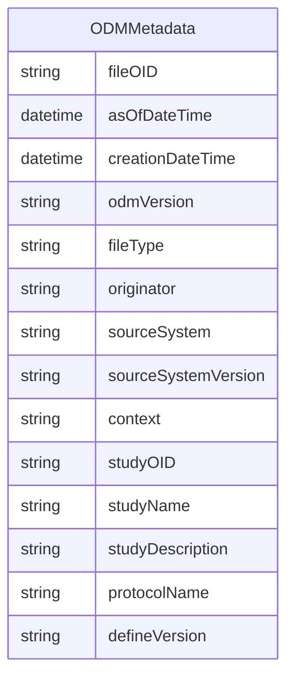

# Class: ODMMetadata 


_Root-level ODM file metadata including file attributes, study information, and namespace declarations_


URI: [odm:class/ODMMetadata](https://cdisc.org/odm2/class/ODMMetadata)





<!-- no inheritance hierarchy -->


## Slots

| Name | Cardinality and Range | Description | Inheritance |
| ---  | --- | --- | --- |
| [fileOID](../slots/fileOID.md) | 1 <br/> [String](../types/String.md) | Unique identifier for the ODM file | direct |
| [asOfDateTime](../slots/asOfDateTime.md) | 0..1 <br/> [Datetime](../types/Datetime.md) | Date and time when the data snapshot was taken | direct |
| [creationDateTime](../slots/creationDateTime.md) | 1 <br/> [Datetime](../types/Datetime.md) | Date and time when the ODM file was created | direct |
| [odmVersion](../slots/odmVersion.md) | 1 <br/> [String](../types/String.md) | Version of the ODM standard used | direct |
| [fileType](../slots/fileType.md) | 1 <br/> [String](../types/String.md) | Type of ODM file (e | direct |
| [originator](../slots/originator.md) | 0..1 <br/> [String](../types/String.md) | Organization or system that created the ODM file | direct |
| [sourceSystem](../slots/sourceSystem.md) | 0..1 <br/> [String](../types/String.md) | Source system that generated the data | direct |
| [sourceSystemVersion](../slots/sourceSystemVersion.md) | 0..1 <br/> [String](../types/String.md) | Version of the source system | direct |
| [context](../slots/context.md) | 0..1 <br/> [String](../types/String.md) | Define-XML context (usually "Other" for Define-XML) | direct |
| [studyOID](../slots/studyOID.md) | 1 <br/> [String](../types/String.md) | Unique identifier for the study | direct |
| [studyName](../slots/studyName.md) | 0..1 <br/> [String](../types/String.md) | Name of the study | direct |
| [studyDescription](../slots/studyDescription.md) | 0..1 <br/> [String](../types/String.md) | Description of the study | direct |
| [protocolName](../slots/protocolName.md) | 0..1 <br/> [String](../types/String.md) | Protocol name for the study | direct |
| [defineVersion](../slots/defineVersion.md) | 0..1 <br/> [String](../types/String.md) | Version of Define-XML specification used | direct |


## Usages

| used by | used in | type | used |
| ---  | --- | --- | --- |
| [MetaDataVersion](../classes/MetaDataVersion.md) | [metadata](../slots/metadata.md) | range | [ODMMetadata](../classes/ODMMetadata.md) |


## Identifier and Mapping Information


### Schema Source


* from schema: https://cdisc.org/define-json


## Mappings

| Mapping Type | Mapped Value |
| ---  | ---  |
| self | odm:ODMMetadata |
| native | odm:ODMMetadata |


## LinkML Source

<!-- TODO: investigate https://stackoverflow.com/questions/37606292/how-to-create-tabbed-code-blocks-in-mkdocs-or-sphinx -->

### Direct

<details>
```yaml
name: ODMMetadata
description: Root-level ODM file metadata including file attributes, study information,
  and namespace declarations
from_schema: https://cdisc.org/define-json
attributes:
  fileOID:
    name: fileOID
    description: Unique identifier for the ODM file
    from_schema: https://cdisc.org/define-json
    rank: 1000
    domain_of:
    - ODMMetadata
    range: string
    required: true
  asOfDateTime:
    name: asOfDateTime
    description: Date and time when the data snapshot was taken
    from_schema: https://cdisc.org/define-json
    rank: 1000
    domain_of:
    - ODMMetadata
    range: datetime
  creationDateTime:
    name: creationDateTime
    description: Date and time when the ODM file was created
    from_schema: https://cdisc.org/define-json
    rank: 1000
    domain_of:
    - ODMMetadata
    range: datetime
    required: true
  odmVersion:
    name: odmVersion
    description: Version of the ODM standard used
    from_schema: https://cdisc.org/define-json
    rank: 1000
    domain_of:
    - ODMMetadata
    range: string
    required: true
  fileType:
    name: fileType
    description: Type of ODM file (e.g., Snapshot, Transactional)
    from_schema: https://cdisc.org/define-json
    rank: 1000
    domain_of:
    - ODMMetadata
    range: string
    required: true
  originator:
    name: originator
    description: Organization or system that created the ODM file
    from_schema: https://cdisc.org/define-json
    rank: 1000
    domain_of:
    - ODMMetadata
    range: string
  sourceSystem:
    name: sourceSystem
    description: Source system that generated the data
    from_schema: https://cdisc.org/define-json
    rank: 1000
    domain_of:
    - ODMMetadata
    range: string
  sourceSystemVersion:
    name: sourceSystemVersion
    description: Version of the source system
    from_schema: https://cdisc.org/define-json
    rank: 1000
    domain_of:
    - ODMMetadata
    range: string
  context:
    name: context
    description: Define-XML context (usually "Other" for Define-XML)
    from_schema: https://cdisc.org/define-json
    rank: 1000
    domain_of:
    - ODMMetadata
    - FormalExpression
    range: string
  studyOID:
    name: studyOID
    description: Unique identifier for the study
    from_schema: https://cdisc.org/define-json
    rank: 1000
    domain_of:
    - ODMMetadata
    range: string
    required: true
  studyName:
    name: studyName
    description: Name of the study
    from_schema: https://cdisc.org/define-json
    rank: 1000
    domain_of:
    - ODMMetadata
    range: string
  studyDescription:
    name: studyDescription
    description: Description of the study
    from_schema: https://cdisc.org/define-json
    rank: 1000
    domain_of:
    - ODMMetadata
    range: string
  protocolName:
    name: protocolName
    description: Protocol name for the study
    from_schema: https://cdisc.org/define-json
    rank: 1000
    domain_of:
    - ODMMetadata
    range: string
  defineVersion:
    name: defineVersion
    description: Version of Define-XML specification used
    from_schema: https://cdisc.org/define-json
    rank: 1000
    domain_of:
    - ODMMetadata
    range: string

```
</details>

### Induced

<details>
```yaml
name: ODMMetadata
description: Root-level ODM file metadata including file attributes, study information,
  and namespace declarations
from_schema: https://cdisc.org/define-json
attributes:
  fileOID:
    name: fileOID
    description: Unique identifier for the ODM file
    from_schema: https://cdisc.org/define-json
    rank: 1000
    alias: fileOID
    owner: ODMMetadata
    domain_of:
    - ODMMetadata
    range: string
    required: true
  asOfDateTime:
    name: asOfDateTime
    description: Date and time when the data snapshot was taken
    from_schema: https://cdisc.org/define-json
    rank: 1000
    alias: asOfDateTime
    owner: ODMMetadata
    domain_of:
    - ODMMetadata
    range: datetime
  creationDateTime:
    name: creationDateTime
    description: Date and time when the ODM file was created
    from_schema: https://cdisc.org/define-json
    rank: 1000
    alias: creationDateTime
    owner: ODMMetadata
    domain_of:
    - ODMMetadata
    range: datetime
    required: true
  odmVersion:
    name: odmVersion
    description: Version of the ODM standard used
    from_schema: https://cdisc.org/define-json
    rank: 1000
    alias: odmVersion
    owner: ODMMetadata
    domain_of:
    - ODMMetadata
    range: string
    required: true
  fileType:
    name: fileType
    description: Type of ODM file (e.g., Snapshot, Transactional)
    from_schema: https://cdisc.org/define-json
    rank: 1000
    alias: fileType
    owner: ODMMetadata
    domain_of:
    - ODMMetadata
    range: string
    required: true
  originator:
    name: originator
    description: Organization or system that created the ODM file
    from_schema: https://cdisc.org/define-json
    rank: 1000
    alias: originator
    owner: ODMMetadata
    domain_of:
    - ODMMetadata
    range: string
  sourceSystem:
    name: sourceSystem
    description: Source system that generated the data
    from_schema: https://cdisc.org/define-json
    rank: 1000
    alias: sourceSystem
    owner: ODMMetadata
    domain_of:
    - ODMMetadata
    range: string
  sourceSystemVersion:
    name: sourceSystemVersion
    description: Version of the source system
    from_schema: https://cdisc.org/define-json
    rank: 1000
    alias: sourceSystemVersion
    owner: ODMMetadata
    domain_of:
    - ODMMetadata
    range: string
  context:
    name: context
    description: Define-XML context (usually "Other" for Define-XML)
    from_schema: https://cdisc.org/define-json
    rank: 1000
    alias: context
    owner: ODMMetadata
    domain_of:
    - ODMMetadata
    - FormalExpression
    range: string
  studyOID:
    name: studyOID
    description: Unique identifier for the study
    from_schema: https://cdisc.org/define-json
    rank: 1000
    alias: studyOID
    owner: ODMMetadata
    domain_of:
    - ODMMetadata
    range: string
    required: true
  studyName:
    name: studyName
    description: Name of the study
    from_schema: https://cdisc.org/define-json
    rank: 1000
    alias: studyName
    owner: ODMMetadata
    domain_of:
    - ODMMetadata
    range: string
  studyDescription:
    name: studyDescription
    description: Description of the study
    from_schema: https://cdisc.org/define-json
    rank: 1000
    alias: studyDescription
    owner: ODMMetadata
    domain_of:
    - ODMMetadata
    range: string
  protocolName:
    name: protocolName
    description: Protocol name for the study
    from_schema: https://cdisc.org/define-json
    rank: 1000
    alias: protocolName
    owner: ODMMetadata
    domain_of:
    - ODMMetadata
    range: string
  defineVersion:
    name: defineVersion
    description: Version of Define-XML specification used
    from_schema: https://cdisc.org/define-json
    rank: 1000
    alias: defineVersion
    owner: ODMMetadata
    domain_of:
    - ODMMetadata
    range: string

```
</details>