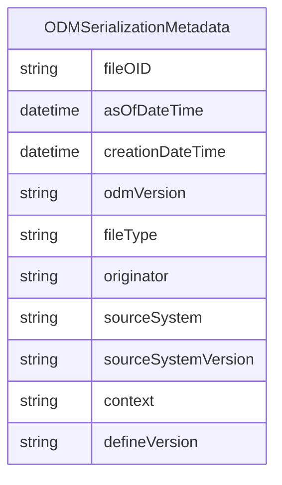

# Class: ODMSerializationMetadata 


_A mixin providing ODM/Define-XML file-level attributes required only when serializing to ODM or Define-XML format. Applied by the ODM output generator, not by the canonical model itself. These attributes (fileOID, odmVersion, defineVersion, etc.) have no meaning in FHIR, OMOP, or SDMX projections._


URI: [dds:class/ODMSerializationMetadata](https://w3id.org/dds/class/ODMSerializationMetadata)





<!-- no inheritance hierarchy -->


## Slots

| Name | Cardinality and Range | Description | Inheritance |
| ---  | --- | --- | --- |
| [fileOID](../slots/fileOID.md) | 1 <br/> [String](../types/String.md) | Unique identifier for the ODM file | direct |
| [asOfDateTime](../slots/asOfDateTime.md) | 0..1 <br/> [Datetime](../types/Datetime.md) | Date and time when the data snapshot was taken | direct |
| [creationDateTime](../slots/creationDateTime.md) | 1 <br/> [Datetime](../types/Datetime.md) | Date and time when the ODM file was created | direct |
| [odmVersion](../slots/odmVersion.md) | 1 <br/> [String](../types/String.md) | Version of the ODM standard used | direct |
| [fileType](../slots/fileType.md) | 1 <br/> [String](../types/String.md) | Type of ODM file (e.g., Snapshot, Transactional) | direct |
| [originator](../slots/originator.md) | 0..1 <br/> [String](../types/String.md) | Organization or system that created the ODM file | direct |
| [sourceSystem](../slots/sourceSystem.md) | 0..1 <br/> [String](../types/String.md) | Source system that generated the data | direct |
| [sourceSystemVersion](../slots/sourceSystemVersion.md) | 0..1 <br/> [String](../types/String.md) | Version of the source system | direct |
| [context](../slots/context.md) | 0..1 <br/> [String](../types/String.md) | Define-XML context (usually "Other" for Define-XML) | direct |
| [defineVersion](../slots/defineVersion.md) | 0..1 <br/> [String](../types/String.md) | Version of Define-XML specification used | direct |


## Mixin Usage

| mixed into | description |
| --- | --- |


## Identifier and Mapping Information


### Schema Source


* from schema: https://w3id.org/dds


## Mappings

| Mapping Type | Mapped Value |
| ---  | ---  |
| self | dds:ODMSerializationMetadata |
| native | dds:ODMSerializationMetadata |


## LinkML Source

<!-- TODO: investigate https://stackoverflow.com/questions/37606292/how-to-create-tabbed-code-blocks-in-mkdocs-or-sphinx -->

### Direct

<details>
```yaml
name: ODMSerializationMetadata
description: A mixin providing ODM/Define-XML file-level attributes required only
  when serializing to ODM or Define-XML format. Applied by the ODM output generator,
  not by the canonical model itself. These attributes (fileOID, odmVersion, defineVersion,
  etc.) have no meaning in FHIR, OMOP, or SDMX projections.
from_schema: https://w3id.org/dds
mixin: true
attributes:
  fileOID:
    name: fileOID
    description: Unique identifier for the ODM file
    from_schema: https://w3id.org/dds
    rank: 1000
    domain_of:
    - ODMSerializationMetadata
    required: true
  asOfDateTime:
    name: asOfDateTime
    description: Date and time when the data snapshot was taken
    from_schema: https://w3id.org/dds
    rank: 1000
    domain_of:
    - ODMSerializationMetadata
    range: datetime
  creationDateTime:
    name: creationDateTime
    description: Date and time when the ODM file was created
    from_schema: https://w3id.org/dds
    rank: 1000
    domain_of:
    - ODMSerializationMetadata
    range: datetime
    required: true
  odmVersion:
    name: odmVersion
    description: Version of the ODM standard used
    from_schema: https://w3id.org/dds
    rank: 1000
    domain_of:
    - ODMSerializationMetadata
    required: true
  fileType:
    name: fileType
    description: Type of ODM file (e.g., Snapshot, Transactional)
    from_schema: https://w3id.org/dds
    rank: 1000
    domain_of:
    - ODMSerializationMetadata
    required: true
  originator:
    name: originator
    description: Organization or system that created the ODM file
    from_schema: https://w3id.org/dds
    rank: 1000
    domain_of:
    - ODMSerializationMetadata
  sourceSystem:
    name: sourceSystem
    description: Source system that generated the data
    from_schema: https://w3id.org/dds
    rank: 1000
    domain_of:
    - ODMSerializationMetadata
  sourceSystemVersion:
    name: sourceSystemVersion
    description: Version of the source system
    from_schema: https://w3id.org/dds
    rank: 1000
    domain_of:
    - ODMSerializationMetadata
  context:
    name: context
    description: Define-XML context (usually "Other" for Define-XML)
    from_schema: https://w3id.org/dds
    rank: 1000
    domain_of:
    - ODMSerializationMetadata
    - FormalExpression
  defineVersion:
    name: defineVersion
    description: Version of Define-XML specification used
    from_schema: https://w3id.org/dds
    rank: 1000
    domain_of:
    - ODMSerializationMetadata

```
</details>

### Induced

<details>
```yaml
name: ODMSerializationMetadata
description: A mixin providing ODM/Define-XML file-level attributes required only
  when serializing to ODM or Define-XML format. Applied by the ODM output generator,
  not by the canonical model itself. These attributes (fileOID, odmVersion, defineVersion,
  etc.) have no meaning in FHIR, OMOP, or SDMX projections.
from_schema: https://w3id.org/dds
mixin: true
attributes:
  fileOID:
    name: fileOID
    description: Unique identifier for the ODM file
    from_schema: https://w3id.org/dds
    rank: 1000
    alias: fileOID
    owner: ODMSerializationMetadata
    domain_of:
    - ODMSerializationMetadata
    range: string
    required: true
  asOfDateTime:
    name: asOfDateTime
    description: Date and time when the data snapshot was taken
    from_schema: https://w3id.org/dds
    rank: 1000
    alias: asOfDateTime
    owner: ODMSerializationMetadata
    domain_of:
    - ODMSerializationMetadata
    range: datetime
  creationDateTime:
    name: creationDateTime
    description: Date and time when the ODM file was created
    from_schema: https://w3id.org/dds
    rank: 1000
    alias: creationDateTime
    owner: ODMSerializationMetadata
    domain_of:
    - ODMSerializationMetadata
    range: datetime
    required: true
  odmVersion:
    name: odmVersion
    description: Version of the ODM standard used
    from_schema: https://w3id.org/dds
    rank: 1000
    alias: odmVersion
    owner: ODMSerializationMetadata
    domain_of:
    - ODMSerializationMetadata
    range: string
    required: true
  fileType:
    name: fileType
    description: Type of ODM file (e.g., Snapshot, Transactional)
    from_schema: https://w3id.org/dds
    rank: 1000
    alias: fileType
    owner: ODMSerializationMetadata
    domain_of:
    - ODMSerializationMetadata
    range: string
    required: true
  originator:
    name: originator
    description: Organization or system that created the ODM file
    from_schema: https://w3id.org/dds
    rank: 1000
    alias: originator
    owner: ODMSerializationMetadata
    domain_of:
    - ODMSerializationMetadata
    range: string
  sourceSystem:
    name: sourceSystem
    description: Source system that generated the data
    from_schema: https://w3id.org/dds
    rank: 1000
    alias: sourceSystem
    owner: ODMSerializationMetadata
    domain_of:
    - ODMSerializationMetadata
    range: string
  sourceSystemVersion:
    name: sourceSystemVersion
    description: Version of the source system
    from_schema: https://w3id.org/dds
    rank: 1000
    alias: sourceSystemVersion
    owner: ODMSerializationMetadata
    domain_of:
    - ODMSerializationMetadata
    range: string
  context:
    name: context
    description: Define-XML context (usually "Other" for Define-XML)
    from_schema: https://w3id.org/dds
    rank: 1000
    alias: context
    owner: ODMSerializationMetadata
    domain_of:
    - ODMSerializationMetadata
    - FormalExpression
    range: string
  defineVersion:
    name: defineVersion
    description: Version of Define-XML specification used
    from_schema: https://w3id.org/dds
    rank: 1000
    alias: defineVersion
    owner: ODMSerializationMetadata
    domain_of:
    - ODMSerializationMetadata
    range: string

```
</details>