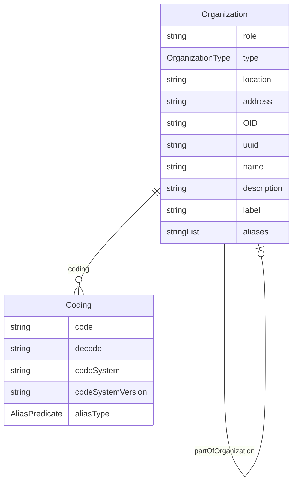

# Class: Organization 


_An entity that represents organizational information, such as a site or sponsor_


URI: [odm:class/Organization](https://cdisc.org/odm2/class/Organization)





## Inheritance
* [IdentifiableElement](../classes/IdentifiableElement.md) [ [Identifiable](../classes/Identifiable.md) [Labelled](../classes/Labelled.md)]
    * **Organization**
        * [DataProvider](../classes/DataProvider.md)


## Slots

| Name | Cardinality and Range | Description | Inheritance |
| ---  | --- | --- | --- |
| [role](../slots/role.md) | 0..1 <br/> [String](../types/String.md) | The role of the organization in the study. | direct |
| [type](../slots/type.md) | 0..1 <br/> [OrganizationType](../enums/OrganizationType.md) | The type of organization (e.g., site, sponsor, vendor). | direct |
| [location](../slots/location.md) | 0..1 <br/> [String](../types/String.md) | The physical location of the organization. | direct |
| [address](../slots/address.md) | 0..1 <br/> [String](../types/String.md) | The address of the organization. | direct |
| [partOfOrganization](../slots/partOfOrganization.md) | 0..1 <br/> [Organization](../classes/Organization.md) | Reference to a parent organization if this organization is part of a larger entity. | direct |
| [OID](../slots/OID.md) | 1 <br/> [String](../types/String.md) | Local identifier within this study/context. Use CDISC OID format for regulatory submissions, or simple strings for internal use. | [Identifiable](../classes/Identifiable.md) |
| [uuid](../slots/uuid.md) | 0..1 <br/> [String](../types/String.md) | Universal unique identifier | [Identifiable](../classes/Identifiable.md) |
| [name](../slots/name.md) | 0..1 <br/> [String](../types/String.md) | Short name or identifier, used for field names | [Labelled](../classes/Labelled.md) |
| [description](../slots/description.md) | 0..1 <br/> [String](../types/String.md)&nbsp;or&nbsp;<br />[String](../types/String.md)&nbsp;or&nbsp;<br />[TranslatedText](../classes/TranslatedText.md) | Detailed description, shown in tooltips | [Labelled](../classes/Labelled.md) |
| [coding](../slots/coding.md) | * <br/> [Coding](../classes/Coding.md) | Semantic tags for this element | [Labelled](../classes/Labelled.md) |
| [label](../slots/label.md) | 0..1 <br/> [String](../types/String.md)&nbsp;or&nbsp;<br />[String](../types/String.md)&nbsp;or&nbsp;<br />[TranslatedText](../classes/TranslatedText.md) | Human-readable label, shown in UIs | [Labelled](../classes/Labelled.md) |
| [aliases](../slots/aliases.md) | * <br/> [String](../types/String.md)&nbsp;or&nbsp;<br />[String](../types/String.md)&nbsp;or&nbsp;<br />[TranslatedText](../classes/TranslatedText.md) | Alternative name or identifier | [Labelled](../classes/Labelled.md) |


## Usages

| used by | used in | type | used |
| ---  | --- | --- | --- |
| [GovernedElement](../classes/GovernedElement.md) | [owner](../slots/owner.md) | any_of[range] | [Organization](../classes/Organization.md) |
| [Governed](../classes/Governed.md) | [owner](../slots/owner.md) | any_of[range] | [Organization](../classes/Organization.md) |
| [IsProfile](../classes/IsProfile.md) | [authenticator](../slots/authenticator.md) | any_of[range] | [Organization](../classes/Organization.md) |
| [MetaDataVersion](../classes/MetaDataVersion.md) | [owner](../slots/owner.md) | any_of[range] | [Organization](../classes/Organization.md) |
| [Item](../classes/Item.md) | [owner](../slots/owner.md) | any_of[range] | [Organization](../classes/Organization.md) |
| [ItemGroup](../classes/ItemGroup.md) | [authenticator](../slots/authenticator.md) | any_of[range] | [Organization](../classes/Organization.md) |
| [ItemGroup](../classes/ItemGroup.md) | [owner](../slots/owner.md) | any_of[range] | [Organization](../classes/Organization.md) |
| [CodeList](../classes/CodeList.md) | [owner](../slots/owner.md) | any_of[range] | [Organization](../classes/Organization.md) |
| [Comment](../classes/Comment.md) | [owner](../slots/owner.md) | any_of[range] | [Organization](../classes/Organization.md) |
| [Dictionary](../classes/Dictionary.md) | [publishedBy](../slots/publishedBy.md) | any_of[range] | [Organization](../classes/Organization.md) |
| [ReifiedConcept](../classes/ReifiedConcept.md) | [owner](../slots/owner.md) | any_of[range] | [Organization](../classes/Organization.md) |
| [ConceptProperty](../classes/ConceptProperty.md) | [owner](../slots/owner.md) | any_of[range] | [Organization](../classes/Organization.md) |
| [WhereClause](../classes/WhereClause.md) | [owner](../slots/owner.md) | any_of[range] | [Organization](../classes/Organization.md) |
| [Condition](../classes/Condition.md) | [owner](../slots/owner.md) | any_of[range] | [Organization](../classes/Organization.md) |
| [Method](../classes/Method.md) | [owner](../slots/owner.md) | any_of[range] | [Organization](../classes/Organization.md) |
| [SiteOrSponsorComment](../classes/SiteOrSponsorComment.md) | [source](../slots/source.md) | any_of[range] | [Organization](../classes/Organization.md) |
| [SiteOrSponsorComment](../classes/SiteOrSponsorComment.md) | [owner](../slots/owner.md) | any_of[range] | [Organization](../classes/Organization.md) |
| [User](../classes/User.md) | [organization](../slots/organization.md) | range | [Organization](../classes/Organization.md) |
| [Organization](../classes/Organization.md) | [partOfOrganization](../slots/partOfOrganization.md) | range | [Organization](../classes/Organization.md) |
| [NominalOccurrence](../classes/NominalOccurrence.md) | [owner](../slots/owner.md) | any_of[range] | [Organization](../classes/Organization.md) |
| [DataStructureDefinition](../classes/DataStructureDefinition.md) | [authenticator](../slots/authenticator.md) | any_of[range] | [Organization](../classes/Organization.md) |
| [DataStructureDefinition](../classes/DataStructureDefinition.md) | [owner](../slots/owner.md) | any_of[range] | [Organization](../classes/Organization.md) |
| [Dataflow](../classes/Dataflow.md) | [owner](../slots/owner.md) | any_of[range] | [Organization](../classes/Organization.md) |
| [Dataset](../classes/Dataset.md) | [publishedBy](../slots/publishedBy.md) | any_of[range] | [Organization](../classes/Organization.md) |
| [Dataset](../classes/Dataset.md) | [authenticator](../slots/authenticator.md) | any_of[range] | [Organization](../classes/Organization.md) |
| [CubeComponent](../classes/CubeComponent.md) | [owner](../slots/owner.md) | any_of[range] | [Organization](../classes/Organization.md) |
| [Measure](../classes/Measure.md) | [owner](../slots/owner.md) | any_of[range] | [Organization](../classes/Organization.md) |
| [Dimension](../classes/Dimension.md) | [owner](../slots/owner.md) | any_of[range] | [Organization](../classes/Organization.md) |
| [DataAttribute](../classes/DataAttribute.md) | [owner](../slots/owner.md) | any_of[range] | [Organization](../classes/Organization.md) |
| [DataProduct](../classes/DataProduct.md) | [dataProductOwner](../slots/dataProductOwner.md) | any_of[range] | [Organization](../classes/Organization.md) |
| [DataProduct](../classes/DataProduct.md) | [owner](../slots/owner.md) | any_of[range] | [Organization](../classes/Organization.md) |
| [DataProvider](../classes/DataProvider.md) | [partOfOrganization](../slots/partOfOrganization.md) | range | [Organization](../classes/Organization.md) |
| [ProvisionAgreement](../classes/ProvisionAgreement.md) | [owner](../slots/owner.md) | any_of[range] | [Organization](../classes/Organization.md) |
| [Analysis](../classes/Analysis.md) | [owner](../slots/owner.md) | any_of[range] | [Organization](../classes/Organization.md) |
| [Display](../classes/Display.md) | [owner](../slots/owner.md) | any_of[range] | [Organization](../classes/Organization.md) |


## Identifier and Mapping Information


### Schema Source


* from schema: https://cdisc.org/define-json


## Mappings

| Mapping Type | Mapped Value |
| ---  | ---  |
| self | odm:Organization |
| native | odm:Organization |
| exact | odm:Organization, usdm:Organization, sdmx:Organisation |
| broad | prov:Agent |


## LinkML Source

<!-- TODO: investigate https://stackoverflow.com/questions/37606292/how-to-create-tabbed-code-blocks-in-mkdocs-or-sphinx -->

### Direct

<details>
```yaml
name: Organization
description: An entity that represents organizational information, such as a site
  or sponsor
from_schema: https://cdisc.org/define-json
exact_mappings:
- odm:Organization
- usdm:Organization
- sdmx:Organisation
broad_mappings:
- prov:Agent
is_a: IdentifiableElement
attributes:
  role:
    name: role
    description: The role of the organization in the study.
    from_schema: https://cdisc.org/define-json
    domain_of:
    - IsODMItem
    - Organization
    - CubeComponent
    range: string
  type:
    name: type
    description: The type of organization (e.g., site, sponsor, vendor).
    from_schema: https://cdisc.org/define-json
    domain_of:
    - ItemGroup
    - Method
    - Origin
    - Organization
    - Standard
    - Timing
    range: OrganizationType
  location:
    name: location
    description: The physical location of the organization.
    from_schema: https://cdisc.org/define-json
    rank: 1000
    domain_of:
    - Organization
    - Display
    range: string
  address:
    name: address
    description: The address of the organization.
    from_schema: https://cdisc.org/define-json
    rank: 1000
    domain_of:
    - Organization
    range: string
  partOfOrganization:
    name: partOfOrganization
    description: Reference to a parent organization if this organization is part of
      a larger entity.
    from_schema: https://cdisc.org/define-json
    rank: 1000
    domain_of:
    - Organization
    range: Organization

```
</details>

### Induced

<details>
```yaml
name: Organization
description: An entity that represents organizational information, such as a site
  or sponsor
from_schema: https://cdisc.org/define-json
exact_mappings:
- odm:Organization
- usdm:Organization
- sdmx:Organisation
broad_mappings:
- prov:Agent
is_a: IdentifiableElement
attributes:
  role:
    name: role
    description: The role of the organization in the study.
    from_schema: https://cdisc.org/define-json
    alias: role
    owner: Organization
    domain_of:
    - IsODMItem
    - Organization
    - CubeComponent
    range: string
  type:
    name: type
    description: The type of organization (e.g., site, sponsor, vendor).
    from_schema: https://cdisc.org/define-json
    alias: type
    owner: Organization
    domain_of:
    - ItemGroup
    - Method
    - Origin
    - Organization
    - Standard
    - Timing
    range: OrganizationType
  location:
    name: location
    description: The physical location of the organization.
    from_schema: https://cdisc.org/define-json
    rank: 1000
    alias: location
    owner: Organization
    domain_of:
    - Organization
    - Display
    range: string
  address:
    name: address
    description: The address of the organization.
    from_schema: https://cdisc.org/define-json
    rank: 1000
    alias: address
    owner: Organization
    domain_of:
    - Organization
    range: string
  partOfOrganization:
    name: partOfOrganization
    description: Reference to a parent organization if this organization is part of
      a larger entity.
    from_schema: https://cdisc.org/define-json
    rank: 1000
    alias: partOfOrganization
    owner: Organization
    domain_of:
    - Organization
    range: Organization
  OID:
    name: OID
    description: Local identifier within this study/context. Use CDISC OID format
      for regulatory submissions, or simple strings for internal use.
    from_schema: https://cdisc.org/define-json
    rank: 1000
    identifier: true
    alias: OID
    owner: Organization
    domain_of:
    - Identifiable
    range: string
    required: true
    pattern: ^[A-Za-z][A-Za-z0-9._-]*$
  uuid:
    name: uuid
    description: Universal unique identifier
    from_schema: https://cdisc.org/define-json
    rank: 1000
    alias: uuid
    owner: Organization
    domain_of:
    - Identifiable
    range: string
  name:
    name: name
    description: Short name or identifier, used for field names
    from_schema: https://cdisc.org/define-json
    rank: 1000
    alias: name
    owner: Organization
    domain_of:
    - Labelled
    - Standard
    range: string
  description:
    name: description
    description: Detailed description, shown in tooltips
    from_schema: https://cdisc.org/define-json
    rank: 1000
    alias: description
    owner: Organization
    domain_of:
    - Labelled
    - CodeListItem
    range: string
    any_of:
    - range: string
    - range: TranslatedText
  coding:
    name: coding
    description: Semantic tags for this element
    from_schema: https://cdisc.org/define-json
    rank: 1000
    alias: coding
    owner: Organization
    domain_of:
    - Labelled
    - CodeListItem
    - SourceItem
    range: Coding
    multivalued: true
    inlined: true
    inlined_as_list: true
  label:
    name: label
    description: Human-readable label, shown in UIs
    from_schema: https://cdisc.org/define-json
    exact_mappings:
    - skos:prefLabel
    rank: 1000
    alias: label
    owner: Organization
    domain_of:
    - Labelled
    range: string
    any_of:
    - range: string
    - range: TranslatedText
  aliases:
    name: aliases
    description: Alternative name or identifier
    from_schema: https://cdisc.org/define-json
    exact_mappings:
    - skos:altLabel
    rank: 1000
    alias: aliases
    owner: Organization
    domain_of:
    - Labelled
    - CodeListItem
    range: string
    multivalued: true
    inlined: true
    inlined_as_list: true
    any_of:
    - range: string
    - range: TranslatedText

```
</details>