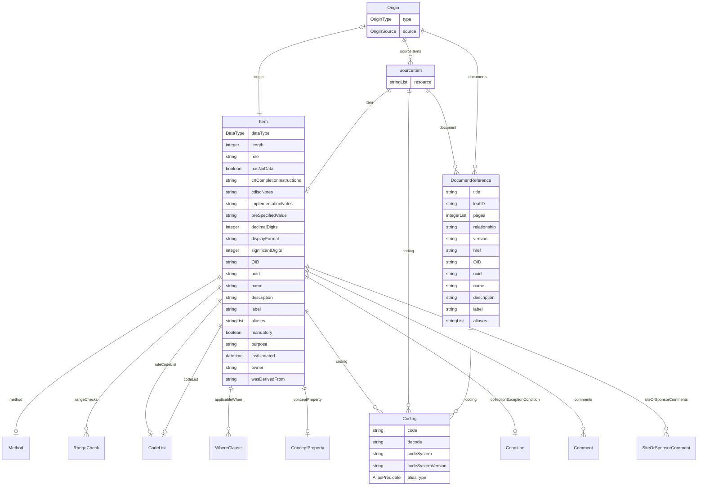

# Class: Origin 


_A provenance element that describes the source of data for an item_


URI: [odm:class/Origin](https://cdisc.org/odm2/class/Origin)





<!-- no inheritance hierarchy -->


## Slots

| Name | Cardinality and Range | Description | Inheritance |
| ---  | --- | --- | --- |
| [type](../slots/type.md) | 0..1 <br/> [OriginType](../enums/OriginType.md) | The type of origin: CRF, Derived, Protocol, eDT, Predecessor. | direct |
| [source](../slots/source.md) | 0..1 <br/> [OriginSource](../enums/OriginSource.md) | The source of the data, such as Investigator, Sponsor, Subject, or Vendor. | direct |
| [sourceItems](../slots/sourceItems.md) | * <br/> [SourceItem](../classes/SourceItem.md) | Source items for this origin | direct |
| [documents](../slots/documents.md) | * <br/> [DocumentReference](../classes/DocumentReference.md) | Reference to a document that describes this origin in detail. | direct |


## Usages

| used by | used in | type | used |
| ---  | --- | --- | --- |
| [Item](../classes/Item.md) | [origin](../slots/origin.md) | range | [Origin](../classes/Origin.md) |


## Identifier and Mapping Information


### Schema Source


* from schema: https://cdisc.org/define-json


## Mappings

| Mapping Type | Mapped Value |
| ---  | ---  |
| self | odm:Origin |
| native | odm:Origin |


## LinkML Source

<!-- TODO: investigate https://stackoverflow.com/questions/37606292/how-to-create-tabbed-code-blocks-in-mkdocs-or-sphinx -->

### Direct

<details>
```yaml
name: Origin
description: A provenance element that describes the source of data for an item
from_schema: https://cdisc.org/define-json
attributes:
  type:
    name: type
    description: 'The type of origin: CRF, Derived, Protocol, eDT, Predecessor.'
    from_schema: https://cdisc.org/define-json
    domain_of:
    - ItemGroup
    - Method
    - Origin
    - Organization
    - Standard
    - Timing
    range: OriginType
  source:
    name: source
    description: The source of the data, such as Investigator, Sponsor, Subject, or
      Vendor.
    from_schema: https://cdisc.org/define-json
    rank: 1000
    domain_of:
    - Origin
    - SiteOrSponsorComment
    - DataProvider
    - ProvisionAgreement
    range: OriginSource
  sourceItems:
    name: sourceItems
    description: Source items for this origin
    from_schema: https://cdisc.org/define-json
    rank: 1000
    domain_of:
    - Origin
    range: SourceItem
    multivalued: true
    inlined: true
    inlined_as_list: true
  documents:
    name: documents
    description: Reference to a document that describes this origin in detail.
    from_schema: https://cdisc.org/define-json
    domain_of:
    - Comment
    - Method
    - Origin
    range: DocumentReference
    multivalued: true
    inlined: true
    inlined_as_list: true

```
</details>

### Induced

<details>
```yaml
name: Origin
description: A provenance element that describes the source of data for an item
from_schema: https://cdisc.org/define-json
attributes:
  type:
    name: type
    description: 'The type of origin: CRF, Derived, Protocol, eDT, Predecessor.'
    from_schema: https://cdisc.org/define-json
    alias: type
    owner: Origin
    domain_of:
    - ItemGroup
    - Method
    - Origin
    - Organization
    - Standard
    - Timing
    range: OriginType
  source:
    name: source
    description: The source of the data, such as Investigator, Sponsor, Subject, or
      Vendor.
    from_schema: https://cdisc.org/define-json
    rank: 1000
    alias: source
    owner: Origin
    domain_of:
    - Origin
    - SiteOrSponsorComment
    - DataProvider
    - ProvisionAgreement
    range: OriginSource
  sourceItems:
    name: sourceItems
    description: Source items for this origin
    from_schema: https://cdisc.org/define-json
    rank: 1000
    alias: sourceItems
    owner: Origin
    domain_of:
    - Origin
    range: SourceItem
    multivalued: true
    inlined: true
    inlined_as_list: true
  documents:
    name: documents
    description: Reference to a document that describes this origin in detail.
    from_schema: https://cdisc.org/define-json
    alias: documents
    owner: Origin
    domain_of:
    - Comment
    - Method
    - Origin
    range: DocumentReference
    multivalued: true
    inlined: true
    inlined_as_list: true

```
</details>