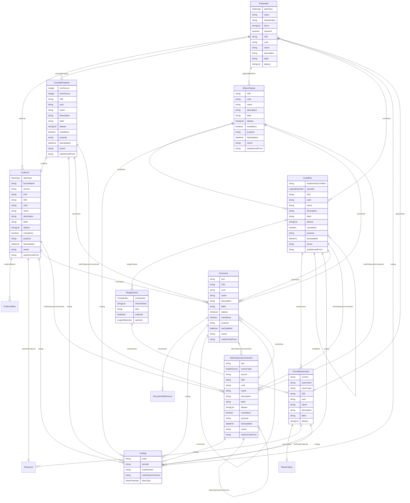

# Class: Parameter 


_A variable element that describes an input used in a formal expression_


URI: [odm:class/Parameter](https://cdisc.org/odm2/class/Parameter)





## Inheritance
* [IdentifiableElement](../classes/IdentifiableElement.md) [ [Identifiable](../classes/Identifiable.md) [Labelled](../classes/Labelled.md)]
    * **Parameter**


## Slots

| Name | Cardinality and Range | Description | Inheritance |
| ---  | --- | --- | --- |
| [dataType](../slots/dataType.md) | 0..1 <br/> [DataType](../enums/DataType.md) | The data type of the parameter. | direct |
| [codeList](../slots/codeList.md) | * <br/> [CodeList](../classes/CodeList.md) | A list of allowed values for the parameter. | direct |
| [value](../slots/value.md) | 0..1 <br/> [String](../types/String.md) | A specific bound value for the parameter. | direct |
| [defaultValue](../slots/defaultValue.md) | 0..1 <br/> [String](../types/String.md) | A default value for the parameter. | direct |
| [items](../slots/items.md) | * <br/> [String](../types/String.md)&nbsp;or&nbsp;<br />[Item](../classes/Item.md)&nbsp;or&nbsp;<br />[Dimension](../classes/Dimension.md)&nbsp;or&nbsp;<br />[Measure](../classes/Measure.md)&nbsp;or&nbsp;<br />[DataAttribute](../classes/DataAttribute.md) | A list of item dependencies for the parameter. | direct |
| [conceptProperty](../slots/conceptProperty.md) | * <br/> [ConceptProperty](../classes/ConceptProperty.md) | Reference to a specific concept property that this parameter represents or modifies. | direct |
| [applicableWhen](../slots/applicableWhen.md) | * <br/> [WhereClause](../classes/WhereClause.md) | References to different situations that define when this parameter  is applicable or required in the containing expression. Multiple whereClauses are combined with OR logic: the parameter applies  if ANY referenced WhereClause matches.<br>Within each WhereClause, conditions are combined with AND logic. Example: applicableWhen: ["WC.ADULT", "WC.PEDIATRIC"] means the parameter  is needed when (all conditions in WC.ADULT are true) OR  (all conditions in WC.PEDIATRIC are true). | direct |
| [conditions](../slots/conditions.md) | * <br/> [Condition](../classes/Condition.md) | Validation conditions that constrain this parameter's value beyond controlled terminology. Multiple conditions are combined with AND logic: all must be satisfied. Use these for parameter validation rules, distinct from applicableWhen  which determines if the parameter is needed at all.<br>Example: A parameter AGE might have conditions ensuring it's >= 0 and <= 120. or conditions might make up part of a componsed expression. | direct |
| [required](../slots/required.md) | 0..1 <br/> [Boolean](../types/Boolean.md) | Indicates whether this parameter must be provided when the  containing expression is evaluated (technical constraint). | direct |
| [OID](../slots/OID.md) | 1 <br/> [String](../types/String.md) | Local identifier within this study/context. Use CDISC OID format for regulatory submissions, or simple strings for internal use. | [Identifiable](../classes/Identifiable.md) |
| [uuid](../slots/uuid.md) | 0..1 <br/> [String](../types/String.md) | Universal unique identifier | [Identifiable](../classes/Identifiable.md) |
| [name](../slots/name.md) | 0..1 <br/> [String](../types/String.md) | Short name or identifier, used for field names | [Labelled](../classes/Labelled.md) |
| [description](../slots/description.md) | 0..1 <br/> [String](../types/String.md)&nbsp;or&nbsp;<br />[String](../types/String.md)&nbsp;or&nbsp;<br />[TranslatedText](../classes/TranslatedText.md) | Detailed description, shown in tooltips | [Labelled](../classes/Labelled.md) |
| [coding](../slots/coding.md) | * <br/> [Coding](../classes/Coding.md) | Semantic tags for this element | [Labelled](../classes/Labelled.md) |
| [label](../slots/label.md) | 0..1 <br/> [String](../types/String.md)&nbsp;or&nbsp;<br />[String](../types/String.md)&nbsp;or&nbsp;<br />[TranslatedText](../classes/TranslatedText.md) | Human-readable label, shown in UIs | [Labelled](../classes/Labelled.md) |
| [aliases](../slots/aliases.md) | * <br/> [String](../types/String.md)&nbsp;or&nbsp;<br />[String](../types/String.md)&nbsp;or&nbsp;<br />[TranslatedText](../classes/TranslatedText.md) | Alternative name or identifier | [Labelled](../classes/Labelled.md) |


## Usages

| used by | used in | type | used |
| ---  | --- | --- | --- |
| [FormalExpression](../classes/FormalExpression.md) | [parameters](../slots/parameters.md) | range | [Parameter](../classes/Parameter.md) |


## Identifier and Mapping Information


### Schema Source


* from schema: https://cdisc.org/define-json


## Mappings

| Mapping Type | Mapped Value |
| ---  | ---  |
| self | odm:Parameter |
| native | odm:Parameter |


## LinkML Source

<!-- TODO: investigate https://stackoverflow.com/questions/37606292/how-to-create-tabbed-code-blocks-in-mkdocs-or-sphinx -->

### Direct

<details>
```yaml
name: Parameter
description: A variable element that describes an input used in a formal expression
from_schema: https://cdisc.org/define-json
is_a: IdentifiableElement
attributes:
  dataType:
    name: dataType
    description: The data type of the parameter.
    from_schema: https://cdisc.org/define-json
    domain_of:
    - Item
    - CodeList
    - Parameter
    - ReturnValue
    range: DataType
  codeList:
    name: codeList
    description: A list of allowed values for the parameter.
    from_schema: https://cdisc.org/define-json
    domain_of:
    - Item
    - ConceptProperty
    - Parameter
    range: CodeList
    multivalued: true
  value:
    name: value
    description: A specific bound value for the parameter.
    from_schema: https://cdisc.org/define-json
    domain_of:
    - Translation
    - Parameter
    - Timing
    range: string
  defaultValue:
    name: defaultValue
    description: A default value for the parameter.
    from_schema: https://cdisc.org/define-json
    rank: 1000
    domain_of:
    - Parameter
    range: string
  items:
    name: items
    description: A list of item dependencies for the parameter.
    from_schema: https://cdisc.org/define-json
    domain_of:
    - MetaDataVersion
    - ItemGroup
    - Parameter
    multivalued: true
    inlined: false
    any_of:
    - range: Item
    - range: Dimension
    - range: Measure
    - range: DataAttribute
  conceptProperty:
    name: conceptProperty
    description: Reference to a specific concept property that this parameter represents
      or modifies.
    from_schema: https://cdisc.org/define-json
    domain_of:
    - Item
    - Parameter
    range: ConceptProperty
    multivalued: true
    inlined: false
  applicableWhen:
    name: applicableWhen
    description: 'References to different situations that define when this parameter  is
      applicable or required in the containing expression. Multiple whereClauses are
      combined with OR logic: the parameter applies  if ANY referenced WhereClause
      matches.

      Within each WhereClause, conditions are combined with AND logic. Example: applicableWhen:
      ["WC.ADULT", "WC.PEDIATRIC"] means the parameter  is needed when (all conditions
      in WC.ADULT are true) OR  (all conditions in WC.PEDIATRIC are true).'
    from_schema: https://cdisc.org/define-json
    domain_of:
    - Item
    - ItemGroup
    - Parameter
    - Analysis
    range: WhereClause
    multivalued: true
    inlined: false
  conditions:
    name: conditions
    description: 'Validation conditions that constrain this parameter''s value beyond
      controlled terminology. Multiple conditions are combined with AND logic: all
      must be satisfied. Use these for parameter validation rules, distinct from applicableWhen  which
      determines if the parameter is needed at all.

      Example: A parameter AGE might have conditions ensuring it''s >= 0 and <= 120.
      or conditions might make up part of a componsed expression.'
    from_schema: https://cdisc.org/define-json
    domain_of:
    - MetaDataVersion
    - WhereClause
    - Condition
    - Parameter
    range: Condition
    multivalued: true
    inlined: false
  required:
    name: required
    description: Indicates whether this parameter must be provided when the  containing
      expression is evaluated (technical constraint).
    from_schema: https://cdisc.org/define-json
    rank: 1000
    ifabsent: 'False'
    domain_of:
    - Parameter
    range: boolean

```
</details>

### Induced

<details>
```yaml
name: Parameter
description: A variable element that describes an input used in a formal expression
from_schema: https://cdisc.org/define-json
is_a: IdentifiableElement
attributes:
  dataType:
    name: dataType
    description: The data type of the parameter.
    from_schema: https://cdisc.org/define-json
    alias: dataType
    owner: Parameter
    domain_of:
    - Item
    - CodeList
    - Parameter
    - ReturnValue
    range: DataType
  codeList:
    name: codeList
    description: A list of allowed values for the parameter.
    from_schema: https://cdisc.org/define-json
    alias: codeList
    owner: Parameter
    domain_of:
    - Item
    - ConceptProperty
    - Parameter
    range: CodeList
    multivalued: true
  value:
    name: value
    description: A specific bound value for the parameter.
    from_schema: https://cdisc.org/define-json
    alias: value
    owner: Parameter
    domain_of:
    - Translation
    - Parameter
    - Timing
    range: string
  defaultValue:
    name: defaultValue
    description: A default value for the parameter.
    from_schema: https://cdisc.org/define-json
    rank: 1000
    alias: defaultValue
    owner: Parameter
    domain_of:
    - Parameter
    range: string
  items:
    name: items
    description: A list of item dependencies for the parameter.
    from_schema: https://cdisc.org/define-json
    alias: items
    owner: Parameter
    domain_of:
    - MetaDataVersion
    - ItemGroup
    - Parameter
    multivalued: true
    inlined: false
    any_of:
    - range: Item
    - range: Dimension
    - range: Measure
    - range: DataAttribute
  conceptProperty:
    name: conceptProperty
    description: Reference to a specific concept property that this parameter represents
      or modifies.
    from_schema: https://cdisc.org/define-json
    alias: conceptProperty
    owner: Parameter
    domain_of:
    - Item
    - Parameter
    range: ConceptProperty
    multivalued: true
    inlined: false
  applicableWhen:
    name: applicableWhen
    description: 'References to different situations that define when this parameter  is
      applicable or required in the containing expression. Multiple whereClauses are
      combined with OR logic: the parameter applies  if ANY referenced WhereClause
      matches.

      Within each WhereClause, conditions are combined with AND logic. Example: applicableWhen:
      ["WC.ADULT", "WC.PEDIATRIC"] means the parameter  is needed when (all conditions
      in WC.ADULT are true) OR  (all conditions in WC.PEDIATRIC are true).'
    from_schema: https://cdisc.org/define-json
    alias: applicableWhen
    owner: Parameter
    domain_of:
    - Item
    - ItemGroup
    - Parameter
    - Analysis
    range: WhereClause
    multivalued: true
    inlined: false
  conditions:
    name: conditions
    description: 'Validation conditions that constrain this parameter''s value beyond
      controlled terminology. Multiple conditions are combined with AND logic: all
      must be satisfied. Use these for parameter validation rules, distinct from applicableWhen  which
      determines if the parameter is needed at all.

      Example: A parameter AGE might have conditions ensuring it''s >= 0 and <= 120.
      or conditions might make up part of a componsed expression.'
    from_schema: https://cdisc.org/define-json
    alias: conditions
    owner: Parameter
    domain_of:
    - MetaDataVersion
    - WhereClause
    - Condition
    - Parameter
    range: Condition
    multivalued: true
    inlined: false
  required:
    name: required
    description: Indicates whether this parameter must be provided when the  containing
      expression is evaluated (technical constraint).
    from_schema: https://cdisc.org/define-json
    rank: 1000
    ifabsent: 'False'
    alias: required
    owner: Parameter
    domain_of:
    - Parameter
    range: boolean
  OID:
    name: OID
    description: Local identifier within this study/context. Use CDISC OID format
      for regulatory submissions, or simple strings for internal use.
    from_schema: https://cdisc.org/define-json
    rank: 1000
    identifier: true
    alias: OID
    owner: Parameter
    domain_of:
    - Identifiable
    range: string
    required: true
    pattern: ^[A-Za-z][A-Za-z0-9._-]*$
  uuid:
    name: uuid
    description: Universal unique identifier
    from_schema: https://cdisc.org/define-json
    rank: 1000
    alias: uuid
    owner: Parameter
    domain_of:
    - Identifiable
    range: string
  name:
    name: name
    description: Short name or identifier, used for field names
    from_schema: https://cdisc.org/define-json
    rank: 1000
    alias: name
    owner: Parameter
    domain_of:
    - Labelled
    - Standard
    range: string
  description:
    name: description
    description: Detailed description, shown in tooltips
    from_schema: https://cdisc.org/define-json
    rank: 1000
    alias: description
    owner: Parameter
    domain_of:
    - Labelled
    - CodeListItem
    range: string
    any_of:
    - range: string
    - range: TranslatedText
  coding:
    name: coding
    description: Semantic tags for this element
    from_schema: https://cdisc.org/define-json
    rank: 1000
    alias: coding
    owner: Parameter
    domain_of:
    - Labelled
    - CodeListItem
    - SourceItem
    range: Coding
    multivalued: true
    inlined: true
    inlined_as_list: true
  label:
    name: label
    description: Human-readable label, shown in UIs
    from_schema: https://cdisc.org/define-json
    exact_mappings:
    - skos:prefLabel
    rank: 1000
    alias: label
    owner: Parameter
    domain_of:
    - Labelled
    range: string
    any_of:
    - range: string
    - range: TranslatedText
  aliases:
    name: aliases
    description: Alternative name or identifier
    from_schema: https://cdisc.org/define-json
    exact_mappings:
    - skos:altLabel
    rank: 1000
    alias: aliases
    owner: Parameter
    domain_of:
    - Labelled
    - CodeListItem
    range: string
    multivalued: true
    inlined: true
    inlined_as_list: true
    any_of:
    - range: string
    - range: TranslatedText

```
</details>