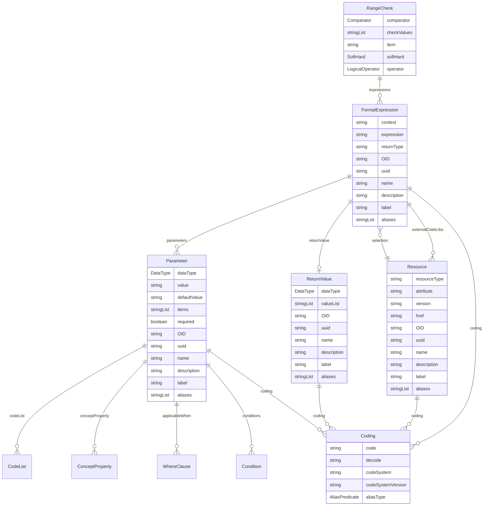

# Class: RangeCheck 


_A validation element that performs a simple comparison check between a referenced item's value and specified values, resolving to a boolean result_


URI: [odm:class/RangeCheck](https://cdisc.org/odm2/class/RangeCheck)





<!-- no inheritance hierarchy -->


## Slots

| Name | Cardinality and Range | Description | Inheritance |
| ---  | --- | --- | --- |
| [comparator](../slots/comparator.md) | 0..1 <br/> [Comparator](../enums/Comparator.md) | The type of comparison to be performed | direct |
| [checkValues](../slots/checkValues.md) | * <br/> [String](../types/String.md) | Values to compare against | direct |
| [item](../slots/item.md) | 0..1 <br/> [String](../types/String.md)&nbsp;or&nbsp;<br />[Item](../classes/Item.md)&nbsp;or&nbsp;<br />[Dimension](../classes/Dimension.md)&nbsp;or&nbsp;<br />[Measure](../classes/Measure.md)&nbsp;or&nbsp;<br />[DataAttribute](../classes/DataAttribute.md) | Reference to the Item element whose value is being checked. If not specified, check applies to the enclosing context | direct |
| [softHard](../slots/softHard.md) | 0..1 <br/> [SoftHard](../enums/SoftHard.md) | Indicates whether a validation check is an error ("Hard") or a warning ("Soft") | direct |
| [expressions](../slots/expressions.md) | * <br/> [FormalExpression](../classes/FormalExpression.md) | A formal expression for complex checks | direct |
| [operator](../slots/operator.md) | 0..1 <br/> [LogicalOperator](../enums/LogicalOperator.md) | Logical operator for combining child conditions or range checks. Defaults to ALL if not specified. | direct |


## Usages

| used by | used in | type | used |
| ---  | --- | --- | --- |
| [Item](../classes/Item.md) | [rangeChecks](../slots/rangeChecks.md) | range | [RangeCheck](../classes/RangeCheck.md) |
| [Condition](../classes/Condition.md) | [rangeChecks](../slots/rangeChecks.md) | range | [RangeCheck](../classes/RangeCheck.md) |


## Identifier and Mapping Information


### Schema Source


* from schema: https://cdisc.org/define-json


## Mappings

| Mapping Type | Mapped Value |
| ---  | ---  |
| self | odm:RangeCheck |
| native | odm:RangeCheck |
| related | qb:SliceKey, sdmx:DataKey |


## LinkML Source

<!-- TODO: investigate https://stackoverflow.com/questions/37606292/how-to-create-tabbed-code-blocks-in-mkdocs-or-sphinx -->

### Direct

<details>
```yaml
name: RangeCheck
description: A validation element that performs a simple comparison check between
  a referenced item's value and specified values, resolving to a boolean result
from_schema: https://cdisc.org/define-json
related_mappings:
- qb:SliceKey
- sdmx:DataKey
attributes:
  comparator:
    name: comparator
    description: The type of comparison to be performed
    from_schema: https://cdisc.org/define-json
    rank: 1000
    domain_of:
    - RangeCheck
    range: Comparator
  checkValues:
    name: checkValues
    description: Values to compare against
    from_schema: https://cdisc.org/define-json
    rank: 1000
    domain_of:
    - RangeCheck
    range: string
    multivalued: true
    inlined: true
    inlined_as_list: true
  item:
    name: item
    description: Reference to the Item element whose value is being checked. If not
      specified, check applies to the enclosing context
    from_schema: https://cdisc.org/define-json
    rank: 1000
    domain_of:
    - RangeCheck
    - SourceItem
    - CubeComponent
    - ObservationRelationship
    any_of:
    - range: Item
    - range: Dimension
    - range: Measure
    - range: DataAttribute
  softHard:
    name: softHard
    description: Indicates whether a validation check is an error ("Hard") or a warning
      ("Soft")
    from_schema: https://cdisc.org/define-json
    rank: 1000
    domain_of:
    - RangeCheck
    range: SoftHard
  expressions:
    name: expressions
    description: A formal expression for complex checks
    from_schema: https://cdisc.org/define-json
    domain_of:
    - Condition
    - RangeCheck
    - Method
    range: FormalExpression
    multivalued: true
    inlined: true
    inlined_as_list: true
  operator:
    name: operator
    description: Logical operator for combining child conditions or range checks.
      Defaults to ALL if not specified.
    from_schema: https://cdisc.org/define-json
    domain_of:
    - Condition
    - RangeCheck
    range: LogicalOperator
    required: false

```
</details>

### Induced

<details>
```yaml
name: RangeCheck
description: A validation element that performs a simple comparison check between
  a referenced item's value and specified values, resolving to a boolean result
from_schema: https://cdisc.org/define-json
related_mappings:
- qb:SliceKey
- sdmx:DataKey
attributes:
  comparator:
    name: comparator
    description: The type of comparison to be performed
    from_schema: https://cdisc.org/define-json
    rank: 1000
    alias: comparator
    owner: RangeCheck
    domain_of:
    - RangeCheck
    range: Comparator
  checkValues:
    name: checkValues
    description: Values to compare against
    from_schema: https://cdisc.org/define-json
    rank: 1000
    alias: checkValues
    owner: RangeCheck
    domain_of:
    - RangeCheck
    range: string
    multivalued: true
    inlined: true
    inlined_as_list: true
  item:
    name: item
    description: Reference to the Item element whose value is being checked. If not
      specified, check applies to the enclosing context
    from_schema: https://cdisc.org/define-json
    rank: 1000
    alias: item
    owner: RangeCheck
    domain_of:
    - RangeCheck
    - SourceItem
    - CubeComponent
    - ObservationRelationship
    any_of:
    - range: Item
    - range: Dimension
    - range: Measure
    - range: DataAttribute
  softHard:
    name: softHard
    description: Indicates whether a validation check is an error ("Hard") or a warning
      ("Soft")
    from_schema: https://cdisc.org/define-json
    rank: 1000
    alias: softHard
    owner: RangeCheck
    domain_of:
    - RangeCheck
    range: SoftHard
  expressions:
    name: expressions
    description: A formal expression for complex checks
    from_schema: https://cdisc.org/define-json
    alias: expressions
    owner: RangeCheck
    domain_of:
    - Condition
    - RangeCheck
    - Method
    range: FormalExpression
    multivalued: true
    inlined: true
    inlined_as_list: true
  operator:
    name: operator
    description: Logical operator for combining child conditions or range checks.
      Defaults to ALL if not specified.
    from_schema: https://cdisc.org/define-json
    alias: operator
    owner: RangeCheck
    domain_of:
    - Condition
    - RangeCheck
    range: LogicalOperator
    required: false

```
</details>