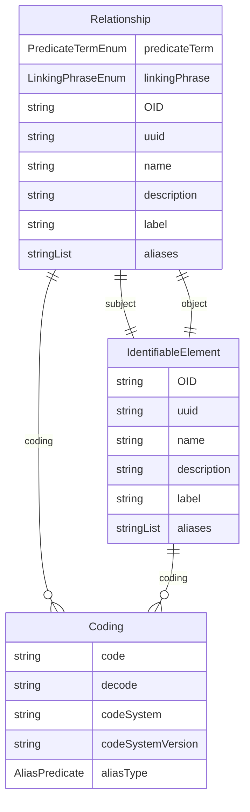

# Class: Relationship 


_A semantic link that defines connections between elements such as Items or ItemGroups, capturing relationships like "is the unit for" or "assesses seriousness of"_


URI: [odm:class/Relationship](https://cdisc.org/odm2/class/Relationship)





## Inheritance
* [IdentifiableElement](../classes/IdentifiableElement.md) [ [Identifiable](../classes/Identifiable.md) [Labelled](../classes/Labelled.md)]
    * **Relationship**


## Slots

| Name | Cardinality and Range | Description | Inheritance |
| ---  | --- | --- | --- |
| [subject](../slots/subject.md) | 1 <br/> [IdentifiableElement](../classes/IdentifiableElement.md) | The starting element of the relationship (e.g., an Item or ItemGroup). | direct |
| [object](../slots/object.md) | 1 <br/> [IdentifiableElement](../classes/IdentifiableElement.md) | The ending element of the relationship. | direct |
| [predicateTerm](../slots/predicateTerm.md) | 1 <br/> [PredicateTermEnum](../enums/PredicateTermEnum.md) | Short variable relationship linking phrase for programming purposes. | direct |
| [linkingPhrase](../slots/linkingPhrase.md) | 1 <br/> [LinkingPhraseEnum](../enums/LinkingPhraseEnum.md) | Variable relationship descriptive linking phrase. | direct |
| [OID](../slots/OID.md) | 1 <br/> [String](../types/String.md) | Local identifier within this study/context. Use CDISC OID format for regulatory submissions, or simple strings for internal use. | [Identifiable](../classes/Identifiable.md) |
| [uuid](../slots/uuid.md) | 0..1 <br/> [String](../types/String.md) | Universal unique identifier | [Identifiable](../classes/Identifiable.md) |
| [name](../slots/name.md) | 0..1 <br/> [String](../types/String.md) | Short name or identifier, used for field names | [Labelled](../classes/Labelled.md) |
| [description](../slots/description.md) | 0..1 <br/> [String](../types/String.md)&nbsp;or&nbsp;<br />[String](../types/String.md)&nbsp;or&nbsp;<br />[TranslatedText](../classes/TranslatedText.md) | Detailed description, shown in tooltips | [Labelled](../classes/Labelled.md) |
| [coding](../slots/coding.md) | * <br/> [Coding](../classes/Coding.md) | Semantic tags for this element | [Labelled](../classes/Labelled.md) |
| [label](../slots/label.md) | 0..1 <br/> [String](../types/String.md)&nbsp;or&nbsp;<br />[String](../types/String.md)&nbsp;or&nbsp;<br />[TranslatedText](../classes/TranslatedText.md) | Human-readable label, shown in UIs | [Labelled](../classes/Labelled.md) |
| [aliases](../slots/aliases.md) | * <br/> [String](../types/String.md)&nbsp;or&nbsp;<br />[String](../types/String.md)&nbsp;or&nbsp;<br />[TranslatedText](../classes/TranslatedText.md) | Alternative name or identifier | [Labelled](../classes/Labelled.md) |


## Usages

| used by | used in | type | used |
| ---  | --- | --- | --- |
| [MetaDataVersion](../classes/MetaDataVersion.md) | [relationships](../slots/relationships.md) | range | [Relationship](../classes/Relationship.md) |


## Identifier and Mapping Information


### Schema Source


* from schema: https://cdisc.org/define-json


## Mappings

| Mapping Type | Mapped Value |
| ---  | ---  |
| self | odm:Relationship |
| native | odm:Relationship |
| related | sdmx:ConceptSchemeMap |


## LinkML Source

<!-- TODO: investigate https://stackoverflow.com/questions/37606292/how-to-create-tabbed-code-blocks-in-mkdocs-or-sphinx -->

### Direct

<details>
```yaml
name: Relationship
description: A semantic link that defines connections between elements such as Items
  or ItemGroups, capturing relationships like "is the unit for" or "assesses seriousness
  of"
from_schema: https://cdisc.org/define-json
related_mappings:
- sdmx:ConceptSchemeMap
is_a: IdentifiableElement
attributes:
  subject:
    name: subject
    description: The starting element of the relationship (e.g., an Item or ItemGroup).
    from_schema: https://cdisc.org/define-json
    rank: 1000
    domain_of:
    - Relationship
    range: IdentifiableElement
    required: true
  object:
    name: object
    description: The ending element of the relationship.
    from_schema: https://cdisc.org/define-json
    rank: 1000
    domain_of:
    - Relationship
    range: IdentifiableElement
    required: true
  predicateTerm:
    name: predicateTerm
    description: Short variable relationship linking phrase for programming purposes.
    from_schema: https://cdisc.org/define-json
    rank: 1000
    domain_of:
    - Relationship
    range: PredicateTermEnum
    required: true
  linkingPhrase:
    name: linkingPhrase
    description: Variable relationship descriptive linking phrase.
    from_schema: https://cdisc.org/define-json
    rank: 1000
    domain_of:
    - Relationship
    range: LinkingPhraseEnum
    required: true

```
</details>

### Induced

<details>
```yaml
name: Relationship
description: A semantic link that defines connections between elements such as Items
  or ItemGroups, capturing relationships like "is the unit for" or "assesses seriousness
  of"
from_schema: https://cdisc.org/define-json
related_mappings:
- sdmx:ConceptSchemeMap
is_a: IdentifiableElement
attributes:
  subject:
    name: subject
    description: The starting element of the relationship (e.g., an Item or ItemGroup).
    from_schema: https://cdisc.org/define-json
    rank: 1000
    alias: subject
    owner: Relationship
    domain_of:
    - Relationship
    range: IdentifiableElement
    required: true
  object:
    name: object
    description: The ending element of the relationship.
    from_schema: https://cdisc.org/define-json
    rank: 1000
    alias: object
    owner: Relationship
    domain_of:
    - Relationship
    range: IdentifiableElement
    required: true
  predicateTerm:
    name: predicateTerm
    description: Short variable relationship linking phrase for programming purposes.
    from_schema: https://cdisc.org/define-json
    rank: 1000
    alias: predicateTerm
    owner: Relationship
    domain_of:
    - Relationship
    range: PredicateTermEnum
    required: true
  linkingPhrase:
    name: linkingPhrase
    description: Variable relationship descriptive linking phrase.
    from_schema: https://cdisc.org/define-json
    rank: 1000
    alias: linkingPhrase
    owner: Relationship
    domain_of:
    - Relationship
    range: LinkingPhraseEnum
    required: true
  OID:
    name: OID
    description: Local identifier within this study/context. Use CDISC OID format
      for regulatory submissions, or simple strings for internal use.
    from_schema: https://cdisc.org/define-json
    rank: 1000
    identifier: true
    alias: OID
    owner: Relationship
    domain_of:
    - Identifiable
    range: string
    required: true
    pattern: ^[A-Za-z][A-Za-z0-9._-]*$
  uuid:
    name: uuid
    description: Universal unique identifier
    from_schema: https://cdisc.org/define-json
    rank: 1000
    alias: uuid
    owner: Relationship
    domain_of:
    - Identifiable
    range: string
  name:
    name: name
    description: Short name or identifier, used for field names
    from_schema: https://cdisc.org/define-json
    rank: 1000
    alias: name
    owner: Relationship
    domain_of:
    - Labelled
    - Standard
    range: string
  description:
    name: description
    description: Detailed description, shown in tooltips
    from_schema: https://cdisc.org/define-json
    rank: 1000
    alias: description
    owner: Relationship
    domain_of:
    - Labelled
    - CodeListItem
    range: string
    any_of:
    - range: string
    - range: TranslatedText
  coding:
    name: coding
    description: Semantic tags for this element
    from_schema: https://cdisc.org/define-json
    rank: 1000
    alias: coding
    owner: Relationship
    domain_of:
    - Labelled
    - CodeListItem
    - SourceItem
    range: Coding
    multivalued: true
    inlined: true
    inlined_as_list: true
  label:
    name: label
    description: Human-readable label, shown in UIs
    from_schema: https://cdisc.org/define-json
    exact_mappings:
    - skos:prefLabel
    rank: 1000
    alias: label
    owner: Relationship
    domain_of:
    - Labelled
    range: string
    any_of:
    - range: string
    - range: TranslatedText
  aliases:
    name: aliases
    description: Alternative name or identifier
    from_schema: https://cdisc.org/define-json
    exact_mappings:
    - skos:altLabel
    rank: 1000
    alias: aliases
    owner: Relationship
    domain_of:
    - Labelled
    - CodeListItem
    range: string
    multivalued: true
    inlined: true
    inlined_as_list: true
    any_of:
    - range: string
    - range: TranslatedText

```
</details>