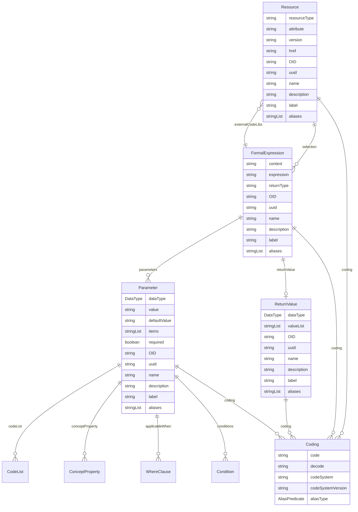

# Class: Resource 


_An external reference that serves as the source for a Dataset, ItemGroup, or Item_


URI: [odm:class/Resource](https://cdisc.org/odm2/class/Resource)





## Inheritance
* [IdentifiableElement](../classes/IdentifiableElement.md) [ [Identifiable](../classes/Identifiable.md) [Labelled](../classes/Labelled.md)]
    * **Resource** [ [Versioned](../classes/Versioned.md)]
        * [DataService](../classes/DataService.md)


## Slots

| Name | Cardinality and Range | Description | Inheritance |
| ---  | --- | --- | --- |
| [resourceType](../slots/resourceType.md) | 0..1 <br/> [String](../types/String.md) | Type of resource (e.g.,  "ODM", "HL7-FHIR", "HL7-CDA", "HL7-v2", "OpenEHR-extract") | direct |
| [attribute](../slots/attribute.md) | 0..1 <br/> [String](../types/String.md) | Field provided by the Name attribute where the data or information can be obtained. Examples are "valueQuantity.value" or "valueQuantity.unit". | direct |
| [selection](../slots/selection.md) | * <br/> [FormalExpression](../classes/FormalExpression.md) | Machine-executable instructions for selecting data from the resource. | direct |
| [version](../slots/version.md) | 0..1 <br/> [String](../types/String.md) | The version of the external resources | [Versioned](../classes/Versioned.md) |
| [href](../slots/href.md) | 0..1 <br/> [String](../types/String.md) | Machine-readable instructions to obtain the resource e.g. FHIR path, URL | [Versioned](../classes/Versioned.md) |
| [OID](../slots/OID.md) | 1 <br/> [String](../types/String.md) | Local identifier within this study/context. Use CDISC OID format for regulatory submissions, or simple strings for internal use. | [Identifiable](../classes/Identifiable.md) |
| [uuid](../slots/uuid.md) | 0..1 <br/> [String](../types/String.md) | Universal unique identifier | [Identifiable](../classes/Identifiable.md) |
| [name](../slots/name.md) | 0..1 <br/> [String](../types/String.md) | Short name or identifier, used for field names | [Labelled](../classes/Labelled.md) |
| [description](../slots/description.md) | 0..1 <br/> [String](../types/String.md)&nbsp;or&nbsp;<br />[String](../types/String.md)&nbsp;or&nbsp;<br />[TranslatedText](../classes/TranslatedText.md) | Detailed description, shown in tooltips | [Labelled](../classes/Labelled.md) |
| [coding](../slots/coding.md) | * <br/> [Coding](../classes/Coding.md) | Semantic tags for this element | [Labelled](../classes/Labelled.md) |
| [label](../slots/label.md) | 0..1 <br/> [String](../types/String.md)&nbsp;or&nbsp;<br />[String](../types/String.md)&nbsp;or&nbsp;<br />[TranslatedText](../classes/TranslatedText.md) | Human-readable label, shown in UIs | [Labelled](../classes/Labelled.md) |
| [aliases](../slots/aliases.md) | * <br/> [String](../types/String.md)&nbsp;or&nbsp;<br />[String](../types/String.md)&nbsp;or&nbsp;<br />[TranslatedText](../classes/TranslatedText.md) | Alternative name or identifier | [Labelled](../classes/Labelled.md) |


## Usages

| used by | used in | type | used |
| ---  | --- | --- | --- |
| [MetaDataVersion](../classes/MetaDataVersion.md) | [resources](../slots/resources.md) | any_of[range] | [Resource](../classes/Resource.md) |
| [CodeList](../classes/CodeList.md) | [externalCodeList](../slots/externalCodeList.md) | range | [Resource](../classes/Resource.md) |
| [FormalExpression](../classes/FormalExpression.md) | [externalCodeLibs](../slots/externalCodeLibs.md) | range | [Resource](../classes/Resource.md) |
| [SourceItem](../classes/SourceItem.md) | [resource](../slots/resource.md) | any_of[range] | [Resource](../classes/Resource.md) |
| [DataProvider](../classes/DataProvider.md) | [source](../slots/source.md) | range | [Resource](../classes/Resource.md) |
| [ProvisionAgreement](../classes/ProvisionAgreement.md) | [source](../slots/source.md) | range | [Resource](../classes/Resource.md) |


## Identifier and Mapping Information


### Schema Source


* from schema: https://cdisc.org/define-json


## Mappings

| Mapping Type | Mapped Value |
| ---  | ---  |
| self | odm:Resource |
| native | odm:Resource |
| close | odm:Resource |


## LinkML Source

<!-- TODO: investigate https://stackoverflow.com/questions/37606292/how-to-create-tabbed-code-blocks-in-mkdocs-or-sphinx -->

### Direct

<details>
```yaml
name: Resource
description: An external reference that serves as the source for a Dataset, ItemGroup,
  or Item
from_schema: https://cdisc.org/define-json
close_mappings:
- odm:Resource
is_a: IdentifiableElement
mixins:
- Versioned
attributes:
  resourceType:
    name: resourceType
    description: Type of resource (e.g.,  "ODM", "HL7-FHIR", "HL7-CDA", "HL7-v2",
      "OpenEHR-extract")
    from_schema: https://cdisc.org/define-json
    rank: 1000
    domain_of:
    - Resource
    range: string
    required: false
  attribute:
    name: attribute
    description: Field provided by the Name attribute where the data or information
      can be obtained. Examples are "valueQuantity.value" or "valueQuantity.unit".
    from_schema: https://cdisc.org/define-json
    rank: 1000
    domain_of:
    - Resource
    - MeasureRelationship
    - DataflowRelationship
    - GroupRelationship
    - DimensionRelationship
    - ObservationRelationship
    range: string
  selection:
    name: selection
    description: Machine-executable instructions for selecting data from the resource.
    from_schema: https://cdisc.org/define-json
    rank: 1000
    domain_of:
    - Resource
    range: FormalExpression
    multivalued: true
    inlined: true
    inlined_as_list: true

```
</details>

### Induced

<details>
```yaml
name: Resource
description: An external reference that serves as the source for a Dataset, ItemGroup,
  or Item
from_schema: https://cdisc.org/define-json
close_mappings:
- odm:Resource
is_a: IdentifiableElement
mixins:
- Versioned
attributes:
  resourceType:
    name: resourceType
    description: Type of resource (e.g.,  "ODM", "HL7-FHIR", "HL7-CDA", "HL7-v2",
      "OpenEHR-extract")
    from_schema: https://cdisc.org/define-json
    rank: 1000
    alias: resourceType
    owner: Resource
    domain_of:
    - Resource
    range: string
    required: false
  attribute:
    name: attribute
    description: Field provided by the Name attribute where the data or information
      can be obtained. Examples are "valueQuantity.value" or "valueQuantity.unit".
    from_schema: https://cdisc.org/define-json
    rank: 1000
    alias: attribute
    owner: Resource
    domain_of:
    - Resource
    - MeasureRelationship
    - DataflowRelationship
    - GroupRelationship
    - DimensionRelationship
    - ObservationRelationship
    range: string
  selection:
    name: selection
    description: Machine-executable instructions for selecting data from the resource.
    from_schema: https://cdisc.org/define-json
    rank: 1000
    alias: selection
    owner: Resource
    domain_of:
    - Resource
    range: FormalExpression
    multivalued: true
    inlined: true
    inlined_as_list: true
  version:
    name: version
    description: The version of the external resources
    from_schema: https://cdisc.org/define-json
    rank: 1000
    alias: version
    owner: Resource
    domain_of:
    - Versioned
    - Standard
    range: string
  href:
    name: href
    description: Machine-readable instructions to obtain the resource e.g. FHIR path,
      URL
    from_schema: https://cdisc.org/define-json
    rank: 1000
    alias: href
    owner: Resource
    domain_of:
    - Versioned
    range: string
    required: false
  OID:
    name: OID
    description: Local identifier within this study/context. Use CDISC OID format
      for regulatory submissions, or simple strings for internal use.
    from_schema: https://cdisc.org/define-json
    rank: 1000
    identifier: true
    alias: OID
    owner: Resource
    domain_of:
    - Identifiable
    range: string
    required: true
  uuid:
    name: uuid
    description: Universal unique identifier
    from_schema: https://cdisc.org/define-json
    rank: 1000
    alias: uuid
    owner: Resource
    domain_of:
    - Identifiable
    range: string
  name:
    name: name
    description: Short name or identifier, used for field names
    from_schema: https://cdisc.org/define-json
    rank: 1000
    alias: name
    owner: Resource
    domain_of:
    - Labelled
    - Standard
    range: string
  description:
    name: description
    description: Detailed description, shown in tooltips
    from_schema: https://cdisc.org/define-json
    rank: 1000
    alias: description
    owner: Resource
    domain_of:
    - Labelled
    - CodeListItem
    range: string
    any_of:
    - range: string
    - range: TranslatedText
  coding:
    name: coding
    description: Semantic tags for this element
    from_schema: https://cdisc.org/define-json
    rank: 1000
    alias: coding
    owner: Resource
    domain_of:
    - Labelled
    - CodeListItem
    - SourceItem
    range: Coding
    multivalued: true
    inlined: true
    inlined_as_list: true
  label:
    name: label
    description: Human-readable label, shown in UIs
    from_schema: https://cdisc.org/define-json
    exact_mappings:
    - skos:prefLabel
    rank: 1000
    alias: label
    owner: Resource
    domain_of:
    - Labelled
    range: string
    any_of:
    - range: string
    - range: TranslatedText
  aliases:
    name: aliases
    description: Alternative name or identifier
    from_schema: https://cdisc.org/define-json
    exact_mappings:
    - skos:altLabel
    rank: 1000
    alias: aliases
    owner: Resource
    domain_of:
    - Labelled
    - CodeListItem
    range: string
    multivalued: true
    inlined: true
    inlined_as_list: true
    any_of:
    - range: string
    - range: TranslatedText

```
</details>