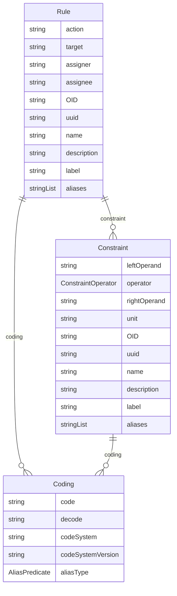

# Class: Rule 


_An ODRL rule asserting that an action is permitted, prohibited, or required on a target asset, optionally restricted by constraints._


URI: [odm:class/Rule](https://cdisc.org/odm2/class/Rule)





## Inheritance
* [IdentifiableElement](../classes/IdentifiableElement.md) [ [Identifiable](../classes/Identifiable.md) [Labelled](../classes/Labelled.md)]
    * **Rule**


## Slots

| Name | Cardinality and Range | Description | Inheritance |
| ---  | --- | --- | --- |
| [action](../slots/action.md) | 1 <br/> [String](../types/String.md) | The operation the rule governs (odrl:action), e.g. "use", "distribute", "anonymize", "delete". Semantics may be tagged via coding. | direct |
| [target](../slots/target.md) | 0..1 <br/> [String](../types/String.md) | The asset the rule applies to (odrl:target), e.g. the Dataflow or Dataset OID/IRI under agreement. | direct |
| [assigner](../slots/assigner.md) | 0..1 <br/> [String](../types/String.md)&nbsp;or&nbsp;<br />[Organization](../classes/Organization.md)&nbsp;or&nbsp;<br />[String](../types/String.md) | Party issuing the rule, if overriding the policy-level assigner | direct |
| [assignee](../slots/assignee.md) | 0..1 <br/> [String](../types/String.md)&nbsp;or&nbsp;<br />[Organization](../classes/Organization.md)&nbsp;or&nbsp;<br />[String](../types/String.md) | Party the rule is granted to, if overriding the policy-level assignee | direct |
| [constraint](../slots/constraint.md) | * <br/> [Constraint](../classes/Constraint.md) | Conditions that narrow when/how the rule applies (odrl:constraint) | direct |
| [OID](../slots/OID.md) | 1 <br/> [String](../types/String.md) | Local identifier within this study/context. Use CDISC OID format for regulatory submissions, or simple strings for internal use. | [Identifiable](../classes/Identifiable.md) |
| [uuid](../slots/uuid.md) | 0..1 <br/> [String](../types/String.md) | Universal unique identifier | [Identifiable](../classes/Identifiable.md) |
| [name](../slots/name.md) | 0..1 <br/> [String](../types/String.md) | Short name or identifier, used for field names | [Labelled](../classes/Labelled.md) |
| [description](../slots/description.md) | 0..1 <br/> [String](../types/String.md)&nbsp;or&nbsp;<br />[String](../types/String.md)&nbsp;or&nbsp;<br />[TranslatedText](../classes/TranslatedText.md) | Detailed description, shown in tooltips | [Labelled](../classes/Labelled.md) |
| [coding](../slots/coding.md) | * <br/> [Coding](../classes/Coding.md) | Semantic tags for this element | [Labelled](../classes/Labelled.md) |
| [label](../slots/label.md) | 0..1 <br/> [String](../types/String.md)&nbsp;or&nbsp;<br />[String](../types/String.md)&nbsp;or&nbsp;<br />[TranslatedText](../classes/TranslatedText.md) | Human-readable label, shown in UIs | [Labelled](../classes/Labelled.md) |
| [aliases](../slots/aliases.md) | * <br/> [String](../types/String.md)&nbsp;or&nbsp;<br />[String](../types/String.md)&nbsp;or&nbsp;<br />[TranslatedText](../classes/TranslatedText.md) | Alternative name or identifier | [Labelled](../classes/Labelled.md) |


## Usages

| used by | used in | type | used |
| ---  | --- | --- | --- |
| [Policy](../classes/Policy.md) | [permission](../slots/permission.md) | range | [Rule](../classes/Rule.md) |
| [Policy](../classes/Policy.md) | [prohibition](../slots/prohibition.md) | range | [Rule](../classes/Rule.md) |
| [Policy](../classes/Policy.md) | [obligation](../slots/obligation.md) | range | [Rule](../classes/Rule.md) |


## Identifier and Mapping Information


### Schema Source


* from schema: https://cdisc.org/data-definition-spec


## Mappings

| Mapping Type | Mapped Value |
| ---  | ---  |
| self | odm:Rule |
| native | odm:Rule |
| exact | odrl:Rule |


## LinkML Source

<!-- TODO: investigate https://stackoverflow.com/questions/37606292/how-to-create-tabbed-code-blocks-in-mkdocs-or-sphinx -->

### Direct

<details>
```yaml
name: Rule
description: An ODRL rule asserting that an action is permitted, prohibited, or required
  on a target asset, optionally restricted by constraints.
from_schema: https://cdisc.org/data-definition-spec
exact_mappings:
- odrl:Rule
is_a: IdentifiableElement
attributes:
  action:
    name: action
    description: The operation the rule governs (odrl:action), e.g. "use", "distribute",
      "anonymize", "delete". Semantics may be tagged via coding.
    from_schema: https://cdisc.org/data-definition-spec
    exact_mappings:
    - odrl:action
    domain_of:
    - IsSdmxDataset
    - Rule
    required: true
  target:
    name: target
    description: The asset the rule applies to (odrl:target), e.g. the Dataflow or
      Dataset OID/IRI under agreement.
    from_schema: https://cdisc.org/data-definition-spec
    exact_mappings:
    - odrl:target
    rank: 1000
    domain_of:
    - Rule
  assigner:
    name: assigner
    description: Party issuing the rule, if overriding the policy-level assigner
    from_schema: https://cdisc.org/data-definition-spec
    domain_of:
    - Policy
    - Rule
    any_of:
    - range: Organization
    - range: string
  assignee:
    name: assignee
    description: Party the rule is granted to, if overriding the policy-level assignee
    from_schema: https://cdisc.org/data-definition-spec
    domain_of:
    - Policy
    - Rule
    any_of:
    - range: Organization
    - range: string
  constraint:
    name: constraint
    description: Conditions that narrow when/how the rule applies (odrl:constraint)
    from_schema: https://cdisc.org/data-definition-spec
    exact_mappings:
    - odrl:constraint
    rank: 1000
    domain_of:
    - Rule
    range: Constraint
    multivalued: true
    inlined: true
    inlined_as_list: true

```
</details>

### Induced

<details>
```yaml
name: Rule
description: An ODRL rule asserting that an action is permitted, prohibited, or required
  on a target asset, optionally restricted by constraints.
from_schema: https://cdisc.org/data-definition-spec
exact_mappings:
- odrl:Rule
is_a: IdentifiableElement
attributes:
  action:
    name: action
    description: The operation the rule governs (odrl:action), e.g. "use", "distribute",
      "anonymize", "delete". Semantics may be tagged via coding.
    from_schema: https://cdisc.org/data-definition-spec
    exact_mappings:
    - odrl:action
    alias: action
    owner: Rule
    domain_of:
    - IsSdmxDataset
    - Rule
    range: string
    required: true
  target:
    name: target
    description: The asset the rule applies to (odrl:target), e.g. the Dataflow or
      Dataset OID/IRI under agreement.
    from_schema: https://cdisc.org/data-definition-spec
    exact_mappings:
    - odrl:target
    rank: 1000
    alias: target
    owner: Rule
    domain_of:
    - Rule
    range: string
  assigner:
    name: assigner
    description: Party issuing the rule, if overriding the policy-level assigner
    from_schema: https://cdisc.org/data-definition-spec
    alias: assigner
    owner: Rule
    domain_of:
    - Policy
    - Rule
    range: string
    any_of:
    - range: Organization
    - range: string
  assignee:
    name: assignee
    description: Party the rule is granted to, if overriding the policy-level assignee
    from_schema: https://cdisc.org/data-definition-spec
    alias: assignee
    owner: Rule
    domain_of:
    - Policy
    - Rule
    range: string
    any_of:
    - range: Organization
    - range: string
  constraint:
    name: constraint
    description: Conditions that narrow when/how the rule applies (odrl:constraint)
    from_schema: https://cdisc.org/data-definition-spec
    exact_mappings:
    - odrl:constraint
    rank: 1000
    alias: constraint
    owner: Rule
    domain_of:
    - Rule
    range: Constraint
    multivalued: true
    inlined: true
    inlined_as_list: true
  OID:
    name: OID
    description: Local identifier within this study/context. Use CDISC OID format
      for regulatory submissions, or simple strings for internal use.
    from_schema: https://cdisc.org/data-definition-spec
    rank: 1000
    identifier: true
    alias: OID
    owner: Rule
    domain_of:
    - Identifiable
    range: string
    required: true
  uuid:
    name: uuid
    description: Universal unique identifier
    from_schema: https://cdisc.org/data-definition-spec
    rank: 1000
    alias: uuid
    owner: Rule
    domain_of:
    - Identifiable
    range: string
  name:
    name: name
    description: Short name or identifier, used for field names
    from_schema: https://cdisc.org/data-definition-spec
    rank: 1000
    alias: name
    owner: Rule
    domain_of:
    - Labelled
    - DefClass
    - SubClass
    - Standard
    range: string
  description:
    name: description
    description: Detailed description, shown in tooltips
    from_schema: https://cdisc.org/data-definition-spec
    rank: 1000
    alias: description
    owner: Rule
    domain_of:
    - Labelled
    - CodeListItem
    range: string
    any_of:
    - range: string
    - range: TranslatedText
  coding:
    name: coding
    description: Semantic tags for this element
    from_schema: https://cdisc.org/data-definition-spec
    rank: 1000
    alias: coding
    owner: Rule
    domain_of:
    - Labelled
    - CodeListItem
    - SourceItem
    range: Coding
    multivalued: true
    inlined: true
    inlined_as_list: true
  label:
    name: label
    description: Human-readable label, shown in UIs
    from_schema: https://cdisc.org/data-definition-spec
    exact_mappings:
    - skos:prefLabel
    rank: 1000
    alias: label
    owner: Rule
    domain_of:
    - Labelled
    range: string
    any_of:
    - range: string
    - range: TranslatedText
  aliases:
    name: aliases
    description: Alternative name or identifier
    from_schema: https://cdisc.org/data-definition-spec
    exact_mappings:
    - skos:altLabel
    rank: 1000
    alias: aliases
    owner: Rule
    domain_of:
    - Labelled
    - CodeListItem
    range: string
    multivalued: true
    inlined: true
    inlined_as_list: true
    any_of:
    - range: string
    - range: TranslatedText

```
</details>