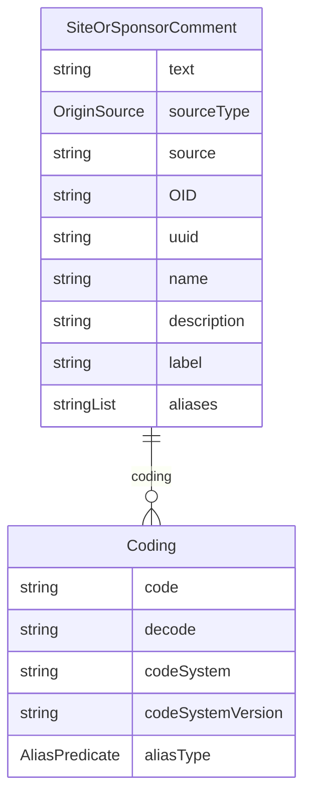

# Class: SiteOrSponsorComment 


_A feedback element that contains comments from a site or sponsor, distinct from the general Comment class_


URI: [odm:class/SiteOrSponsorComment](https://cdisc.org/odm2/class/SiteOrSponsorComment)





## Inheritance
* [IdentifiableElement](../classes/IdentifiableElement.md) [ [Identifiable](../classes/Identifiable.md) [Labelled](../classes/Labelled.md)]
    * **SiteOrSponsorComment**


## Slots

| Name | Cardinality and Range | Description | Inheritance |
| ---  | --- | --- | --- |
| [text](../slots/text.md) | 1 <br/> [String](../types/String.md)&nbsp;or&nbsp;<br />[String](../types/String.md)&nbsp;or&nbsp;<br />[TranslatedText](../classes/TranslatedText.md) | The comment text | direct |
| [sourceType](../slots/sourceType.md) | 0..1 <br/> [OriginSource](../enums/OriginSource.md) | who made the comment, such as Investigator, Sponsor | direct |
| [source](../slots/source.md) | 0..1 <br/> [String](../types/String.md)&nbsp;or&nbsp;<br />[User](../classes/User.md)&nbsp;or&nbsp;<br />[Organization](../classes/Organization.md)&nbsp;or&nbsp;<br />[String](../types/String.md) | ID of the comment provider | direct |
| [OID](../slots/OID.md) | 1 <br/> [String](../types/String.md) | Local identifier within this study/context | [Identifiable](../classes/Identifiable.md) |
| [uuid](../slots/uuid.md) | 0..1 <br/> [String](../types/String.md) | Universal unique identifier | [Identifiable](../classes/Identifiable.md) |
| [name](../slots/name.md) | 0..1 <br/> [String](../types/String.md) | Short name or identifier, used for field names | [Labelled](../classes/Labelled.md) |
| [description](../slots/description.md) | 0..1 <br/> [String](../types/String.md)&nbsp;or&nbsp;<br />[String](../types/String.md)&nbsp;or&nbsp;<br />[TranslatedText](../classes/TranslatedText.md) | Detailed description, shown in tooltips | [Labelled](../classes/Labelled.md) |
| [coding](../slots/coding.md) | * <br/> [Coding](../classes/Coding.md) | Semantic tags for this element | [Labelled](../classes/Labelled.md) |
| [label](../slots/label.md) | 0..1 <br/> [String](../types/String.md)&nbsp;or&nbsp;<br />[String](../types/String.md)&nbsp;or&nbsp;<br />[TranslatedText](../classes/TranslatedText.md) | Human-readable label, shown in UIs | [Labelled](../classes/Labelled.md) |
| [aliases](../slots/aliases.md) | * <br/> [String](../types/String.md)&nbsp;or&nbsp;<br />[String](../types/String.md)&nbsp;or&nbsp;<br />[TranslatedText](../classes/TranslatedText.md) | Alternative name or identifier | [Labelled](../classes/Labelled.md) |


## Identifier and Mapping Information


### Schema Source


* from schema: https://cdisc.org/define-json


## Mappings

| Mapping Type | Mapped Value |
| ---  | ---  |
| self | odm:SiteOrSponsorComment |
| native | odm:SiteOrSponsorComment |


## LinkML Source

<!-- TODO: investigate https://stackoverflow.com/questions/37606292/how-to-create-tabbed-code-blocks-in-mkdocs-or-sphinx -->

### Direct

<details>
```yaml
name: SiteOrSponsorComment
description: A feedback element that contains comments from a site or sponsor, distinct
  from the general Comment class
from_schema: https://cdisc.org/define-json
is_a: IdentifiableElement
attributes:
  text:
    name: text
    description: The comment text.
    from_schema: https://cdisc.org/define-json
    domain_of:
    - Comment
    - SiteOrSponsorComment
    required: true
    any_of:
    - range: string
    - range: TranslatedText
  sourceType:
    name: sourceType
    description: who made the comment, such as Investigator, Sponsor.
    from_schema: https://cdisc.org/define-json
    rank: 1000
    domain_of:
    - SiteOrSponsorComment
    range: OriginSource
  source:
    name: source
    description: ID of the comment provider
    from_schema: https://cdisc.org/define-json
    domain_of:
    - Origin
    - SiteOrSponsorComment
    - DataProvider
    - ProvisionAgreement
    any_of:
    - range: User
    - range: Organization
    - range: string

```
</details>

### Induced

<details>
```yaml
name: SiteOrSponsorComment
description: A feedback element that contains comments from a site or sponsor, distinct
  from the general Comment class
from_schema: https://cdisc.org/define-json
is_a: IdentifiableElement
attributes:
  text:
    name: text
    description: The comment text.
    from_schema: https://cdisc.org/define-json
    alias: text
    owner: SiteOrSponsorComment
    domain_of:
    - Comment
    - SiteOrSponsorComment
    required: true
    any_of:
    - range: string
    - range: TranslatedText
  sourceType:
    name: sourceType
    description: who made the comment, such as Investigator, Sponsor.
    from_schema: https://cdisc.org/define-json
    rank: 1000
    alias: sourceType
    owner: SiteOrSponsorComment
    domain_of:
    - SiteOrSponsorComment
    range: OriginSource
  source:
    name: source
    description: ID of the comment provider
    from_schema: https://cdisc.org/define-json
    alias: source
    owner: SiteOrSponsorComment
    domain_of:
    - Origin
    - SiteOrSponsorComment
    - DataProvider
    - ProvisionAgreement
    any_of:
    - range: User
    - range: Organization
    - range: string
  OID:
    name: OID
    description: Local identifier within this study/context. Use CDISC OID format
      for regulatory submissions, or simple strings for internal use.
    from_schema: https://cdisc.org/define-json
    rank: 1000
    identifier: true
    alias: OID
    owner: SiteOrSponsorComment
    domain_of:
    - Identifiable
    range: string
    required: true
    pattern: ^[A-Za-z][A-Za-z0-9._-]*$
  uuid:
    name: uuid
    description: Universal unique identifier
    from_schema: https://cdisc.org/define-json
    rank: 1000
    alias: uuid
    owner: SiteOrSponsorComment
    domain_of:
    - Identifiable
    range: string
  name:
    name: name
    description: Short name or identifier, used for field names
    from_schema: https://cdisc.org/define-json
    rank: 1000
    alias: name
    owner: SiteOrSponsorComment
    domain_of:
    - Labelled
    - Standard
    range: string
  description:
    name: description
    description: Detailed description, shown in tooltips
    from_schema: https://cdisc.org/define-json
    rank: 1000
    alias: description
    owner: SiteOrSponsorComment
    domain_of:
    - Labelled
    - CodeListItem
    range: string
    any_of:
    - range: string
    - range: TranslatedText
  coding:
    name: coding
    description: Semantic tags for this element
    from_schema: https://cdisc.org/define-json
    rank: 1000
    alias: coding
    owner: SiteOrSponsorComment
    domain_of:
    - Labelled
    - CodeListItem
    - SourceItem
    range: Coding
    multivalued: true
    inlined: true
    inlined_as_list: true
  label:
    name: label
    description: Human-readable label, shown in UIs
    from_schema: https://cdisc.org/define-json
    exact_mappings:
    - skos:prefLabel
    rank: 1000
    alias: label
    owner: SiteOrSponsorComment
    domain_of:
    - Labelled
    range: string
    any_of:
    - range: string
    - range: TranslatedText
  aliases:
    name: aliases
    description: Alternative name or identifier
    from_schema: https://cdisc.org/define-json
    exact_mappings:
    - skos:altLabel
    rank: 1000
    alias: aliases
    owner: SiteOrSponsorComment
    domain_of:
    - Labelled
    - CodeListItem
    range: string
    multivalued: true
    inlined: true
    inlined_as_list: true
    any_of:
    - range: string
    - range: TranslatedText

```
</details>