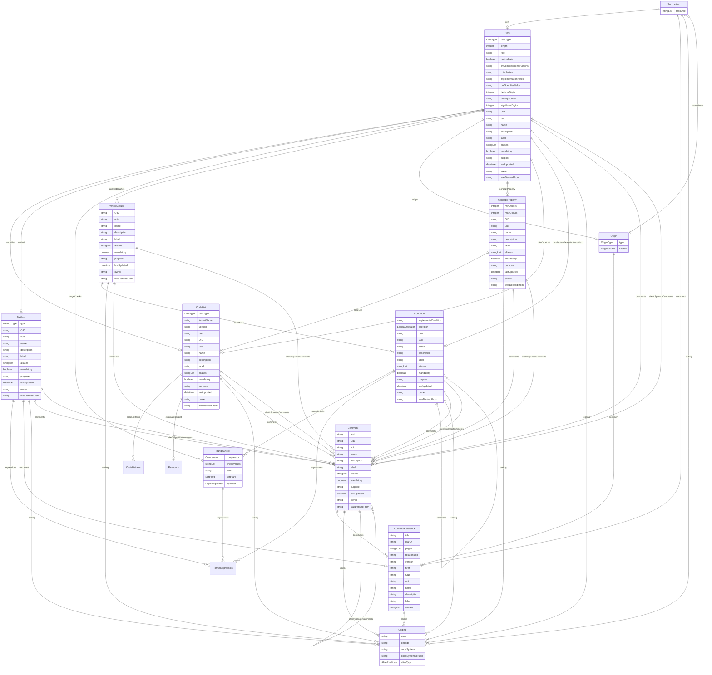

# Class: SourceItem 


_A data source that provides the origin of information for an item_


URI: [odm:class/SourceItem](https://cdisc.org/odm2/class/SourceItem)





<!-- no inheritance hierarchy -->


## Slots

| Name | Cardinality and Range | Description | Inheritance |
| ---  | --- | --- | --- |
| [item](../slots/item.md) | 0..1 <br/> [Item](../classes/Item.md) | Reference to an item | direct |
| [document](../slots/document.md) | 0..1 <br/> [DocumentReference](../classes/DocumentReference.md) | Reference to an external document | direct |
| [resource](../slots/resource.md) | * <br/> [String](../types/String.md)&nbsp;or&nbsp;<br />[Resource](../classes/Resource.md)&nbsp;or&nbsp;<br />[String](../types/String.md) | Path to a resource (e.g. File, FHIR datasource) that is the source of this item | direct |
| [coding](../slots/coding.md) | * <br/> [Coding](../classes/Coding.md) | A coding that describes the source of the item | direct |


## Usages

| used by | used in | type | used |
| ---  | --- | --- | --- |
| [Origin](../classes/Origin.md) | [sourceItems](../slots/sourceItems.md) | range | [SourceItem](../classes/SourceItem.md) |


## Identifier and Mapping Information


### Schema Source


* from schema: https://cdisc.org/define-json


## Mappings

| Mapping Type | Mapped Value |
| ---  | ---  |
| self | odm:SourceItem |
| native | odm:SourceItem |


## LinkML Source

<!-- TODO: investigate https://stackoverflow.com/questions/37606292/how-to-create-tabbed-code-blocks-in-mkdocs-or-sphinx -->

### Direct

<details>
```yaml
name: SourceItem
description: A data source that provides the origin of information for an item
from_schema: https://cdisc.org/define-json
attributes:
  item:
    name: item
    description: Reference to an item
    from_schema: https://cdisc.org/define-json
    domain_of:
    - RangeCheck
    - SourceItem
    - CubeComponent
    - ObservationRelationship
    range: Item
    inlined: false
  document:
    name: document
    description: Reference to an external document
    from_schema: https://cdisc.org/define-json
    domain_of:
    - Method
    - SourceItem
    - Origin
    range: DocumentReference
  resource:
    name: resource
    description: Path to a resource (e.g. File, FHIR datasource) that is the source
      of this item
    from_schema: https://cdisc.org/define-json
    rank: 1000
    domain_of:
    - SourceItem
    multivalued: true
    inlined: false
    any_of:
    - range: Resource
    - range: string
  coding:
    name: coding
    description: A coding that describes the source of the item
    from_schema: https://cdisc.org/define-json
    domain_of:
    - Labelled
    - CodeListItem
    - SourceItem
    range: Coding
    multivalued: true
    inlined: true
    inlined_as_list: true

```
</details>

### Induced

<details>
```yaml
name: SourceItem
description: A data source that provides the origin of information for an item
from_schema: https://cdisc.org/define-json
attributes:
  item:
    name: item
    description: Reference to an item
    from_schema: https://cdisc.org/define-json
    alias: item
    owner: SourceItem
    domain_of:
    - RangeCheck
    - SourceItem
    - CubeComponent
    - ObservationRelationship
    range: Item
    inlined: false
  document:
    name: document
    description: Reference to an external document
    from_schema: https://cdisc.org/define-json
    alias: document
    owner: SourceItem
    domain_of:
    - Method
    - SourceItem
    - Origin
    range: DocumentReference
  resource:
    name: resource
    description: Path to a resource (e.g. File, FHIR datasource) that is the source
      of this item
    from_schema: https://cdisc.org/define-json
    rank: 1000
    alias: resource
    owner: SourceItem
    domain_of:
    - SourceItem
    multivalued: true
    inlined: false
    any_of:
    - range: Resource
    - range: string
  coding:
    name: coding
    description: A coding that describes the source of the item
    from_schema: https://cdisc.org/define-json
    alias: coding
    owner: SourceItem
    domain_of:
    - Labelled
    - CodeListItem
    - SourceItem
    range: Coding
    multivalued: true
    inlined: true
    inlined_as_list: true

```
</details>