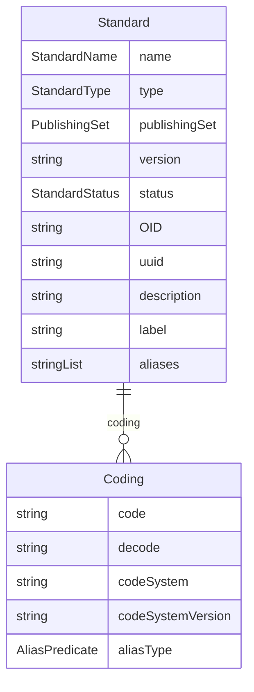

# Class: Standard 


_A collection element that groups related standards within a specific context, used for defining CDISC implementation guides and controlled terminologies_


URI: [odm:class/Standard](https://cdisc.org/odm2/class/Standard)





## Inheritance
* [IdentifiableElement](../classes/IdentifiableElement.md) [ [Identifiable](../classes/Identifiable.md) [Labelled](../classes/Labelled.md)]
    * **Standard**


## Slots

| Name | Cardinality and Range | Description | Inheritance |
| ---  | --- | --- | --- |
| [name](../slots/name.md) | 0..1 <br/> [StandardName](../enums/StandardName.md) | Name of a standard | direct |
| [type](../slots/type.md) | 0..1 <br/> [StandardType](../enums/StandardType.md) | Type of a standard | direct |
| [publishingSet](../slots/publishingSet.md) | 0..1 <br/> [PublishingSet](../enums/PublishingSet.md) | Publishing Set of a Controlled Terminology | direct |
| [version](../slots/version.md) | 0..1 <br/> [String](../types/String.md) | Version of an Implementation Guide or of a Controlled Terminology | direct |
| [status](../slots/status.md) | 0..1 <br/> [StandardStatus](../enums/StandardStatus.md) | Status of an Implementation Guide or of a Controlled Terminology | direct |
| [OID](../slots/OID.md) | 1 <br/> [String](../types/String.md) | Local identifier within this study/context. Use CDISC OID format for regulatory submissions, or simple strings for internal use. | [Identifiable](../classes/Identifiable.md) |
| [uuid](../slots/uuid.md) | 0..1 <br/> [String](../types/String.md) | Universal unique identifier | [Identifiable](../classes/Identifiable.md) |
| [description](../slots/description.md) | 0..1 <br/> [String](../types/String.md)&nbsp;or&nbsp;<br />[String](../types/String.md)&nbsp;or&nbsp;<br />[TranslatedText](../classes/TranslatedText.md) | Detailed description, shown in tooltips | [Labelled](../classes/Labelled.md) |
| [coding](../slots/coding.md) | * <br/> [Coding](../classes/Coding.md) | Semantic tags for this element | [Labelled](../classes/Labelled.md) |
| [label](../slots/label.md) | 0..1 <br/> [String](../types/String.md)&nbsp;or&nbsp;<br />[String](../types/String.md)&nbsp;or&nbsp;<br />[TranslatedText](../classes/TranslatedText.md) | Human-readable label, shown in UIs | [Labelled](../classes/Labelled.md) |
| [aliases](../slots/aliases.md) | * <br/> [String](../types/String.md)&nbsp;or&nbsp;<br />[String](../types/String.md)&nbsp;or&nbsp;<br />[TranslatedText](../classes/TranslatedText.md) | Alternative name or identifier | [Labelled](../classes/Labelled.md) |


## Usages

| used by | used in | type | used |
| ---  | --- | --- | --- |
| [MetaDataVersion](../classes/MetaDataVersion.md) | [standards](../slots/standards.md) | range | [Standard](../classes/Standard.md) |


## Identifier and Mapping Information


### Schema Source


* from schema: https://cdisc.org/define-json


## Mappings

| Mapping Type | Mapped Value |
| ---  | ---  |
| self | odm:Standard |
| native | odm:Standard |


## LinkML Source

<!-- TODO: investigate https://stackoverflow.com/questions/37606292/how-to-create-tabbed-code-blocks-in-mkdocs-or-sphinx -->

### Direct

<details>
```yaml
name: Standard
description: A collection element that groups related standards within a specific
  context, used for defining CDISC implementation guides and controlled terminologies
from_schema: https://cdisc.org/define-json
is_a: IdentifiableElement
attributes:
  name:
    name: name
    description: Name of a standard
    from_schema: https://cdisc.org/define-json
    domain_of:
    - Labelled
    - Standard
    range: StandardName
  type:
    name: type
    description: Type of a standard
    from_schema: https://cdisc.org/define-json
    domain_of:
    - ItemGroup
    - Method
    - Origin
    - Organization
    - Standard
    - Timing
    range: StandardType
  publishingSet:
    name: publishingSet
    description: Publishing Set of a Controlled Terminology
    from_schema: https://cdisc.org/define-json
    rank: 1000
    domain_of:
    - Standard
    range: PublishingSet
  version:
    name: version
    description: Version of an Implementation Guide or of a Controlled Terminology
    from_schema: https://cdisc.org/define-json
    domain_of:
    - Versioned
    - Standard
    range: string
  status:
    name: status
    description: Status of an Implementation Guide or of a Controlled Terminology
    from_schema: https://cdisc.org/define-json
    rank: 1000
    domain_of:
    - Standard
    range: StandardStatus

```
</details>

### Induced

<details>
```yaml
name: Standard
description: A collection element that groups related standards within a specific
  context, used for defining CDISC implementation guides and controlled terminologies
from_schema: https://cdisc.org/define-json
is_a: IdentifiableElement
attributes:
  name:
    name: name
    description: Name of a standard
    from_schema: https://cdisc.org/define-json
    alias: name
    owner: Standard
    domain_of:
    - Labelled
    - Standard
    range: StandardName
  type:
    name: type
    description: Type of a standard
    from_schema: https://cdisc.org/define-json
    alias: type
    owner: Standard
    domain_of:
    - ItemGroup
    - Method
    - Origin
    - Organization
    - Standard
    - Timing
    range: StandardType
  publishingSet:
    name: publishingSet
    description: Publishing Set of a Controlled Terminology
    from_schema: https://cdisc.org/define-json
    rank: 1000
    alias: publishingSet
    owner: Standard
    domain_of:
    - Standard
    range: PublishingSet
  version:
    name: version
    description: Version of an Implementation Guide or of a Controlled Terminology
    from_schema: https://cdisc.org/define-json
    alias: version
    owner: Standard
    domain_of:
    - Versioned
    - Standard
    range: string
  status:
    name: status
    description: Status of an Implementation Guide or of a Controlled Terminology
    from_schema: https://cdisc.org/define-json
    rank: 1000
    alias: status
    owner: Standard
    domain_of:
    - Standard
    range: StandardStatus
  OID:
    name: OID
    description: Local identifier within this study/context. Use CDISC OID format
      for regulatory submissions, or simple strings for internal use.
    from_schema: https://cdisc.org/define-json
    rank: 1000
    identifier: true
    alias: OID
    owner: Standard
    domain_of:
    - Identifiable
    range: string
    required: true
  uuid:
    name: uuid
    description: Universal unique identifier
    from_schema: https://cdisc.org/define-json
    rank: 1000
    alias: uuid
    owner: Standard
    domain_of:
    - Identifiable
    range: string
  description:
    name: description
    description: Detailed description, shown in tooltips
    from_schema: https://cdisc.org/define-json
    rank: 1000
    alias: description
    owner: Standard
    domain_of:
    - Labelled
    - CodeListItem
    range: string
    any_of:
    - range: string
    - range: TranslatedText
  coding:
    name: coding
    description: Semantic tags for this element
    from_schema: https://cdisc.org/define-json
    rank: 1000
    alias: coding
    owner: Standard
    domain_of:
    - Labelled
    - CodeListItem
    - SourceItem
    range: Coding
    multivalued: true
    inlined: true
    inlined_as_list: true
  label:
    name: label
    description: Human-readable label, shown in UIs
    from_schema: https://cdisc.org/define-json
    exact_mappings:
    - skos:prefLabel
    rank: 1000
    alias: label
    owner: Standard
    domain_of:
    - Labelled
    range: string
    any_of:
    - range: string
    - range: TranslatedText
  aliases:
    name: aliases
    description: Alternative name or identifier
    from_schema: https://cdisc.org/define-json
    exact_mappings:
    - skos:altLabel
    rank: 1000
    alias: aliases
    owner: Standard
    domain_of:
    - Labelled
    - CodeListItem
    range: string
    multivalued: true
    inlined: true
    inlined_as_list: true
    any_of:
    - range: string
    - range: TranslatedText

```
</details>